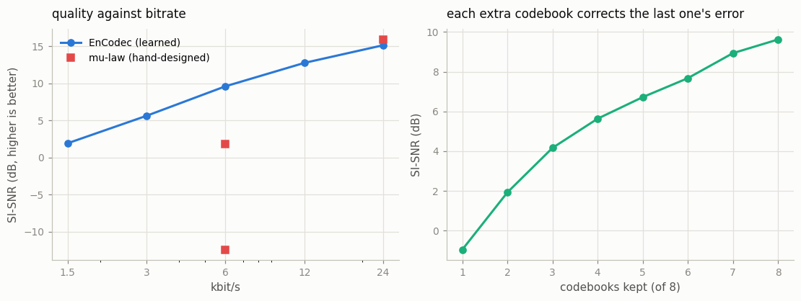
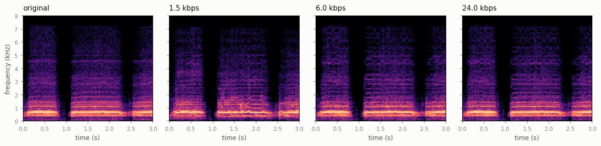
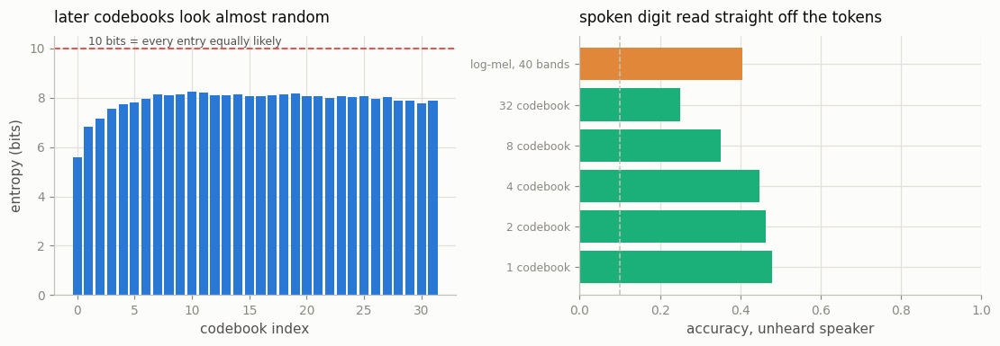

# EnCodec Tour

## Key Insight

[EnCodec](/shared/glossary/#neural-codec) is Meta's neural codec for audio: it squeezes a waveform into a short stream of discrete [audio tokens](/shared/glossary/#token-visualaudio) and decodes them back into sound. Running the same clip through it at several [bitrates](/shared/glossary/#bitrate) and listening to the reconstructions makes the core trade-off audible — more tokens per second rebuild richer, cleaner audio, while fewer tokens save space but blur detail and add [artifacts](/shared/glossary/#artifact). This matters beyond compression: once a second of sound is just a handful of tokens, a [transformer](/shared/glossary/#transformer) can generate or continue audio with the very same next-token machinery it uses for text.

## What runs here

The real `facebook/encodec_24khz` (14.9M [parameters](/shared/glossary/#parameters)), on a real 6.3-second steam-train recording at its native 24 kHz [sample rate](/shared/glossary/#sample-rate). Nothing is trained; every number is a measurement.

| stage | question |
|---|---|
| `ladder` | how does quality change from 1.5 to 24 kbit/s? |
| `residual` | what does each successive [codebook](/shared/glossary/#codebook) actually add? |
| `usage` | how much of the 1,024-entry alphabet is really used, and how long do the sequences get? |
| `baseline` | how good is a *hand-designed* codec at the same bitrate? |
| `content` | do the tokens carry meaning, or only bytes? |

> **"Why feed it 24 kHz audio when the rest of Phase 6 uses 8 or 16 kHz speech?"** Because a codec must be tested at the rate it was trained for. Hand a 24 kHz model up-sampled 8 kHz speech and everything above 4 kHz is empty, so the codec looks better than it is and you are really measuring your resampler. The digit recordings still appear here — but in the `content` stage, where the question is about meaning rather than fidelity.

## The picture: one model, five bitrates



| bitrate | codebooks | tokens/second | [SI-SNR](/shared/glossary/#si-snr) | log-spectral distance | smaller than raw audio by | listen |
|---|---|---|---|---|---|---|
| 1.5 kbps | 2 | 150 | 1.93 dB | 9.27 dB | **256×** | `outputs/encodec_1p5kbps.wav` |
| 3 kbps | 4 | 300 | 5.64 dB | 8.54 dB | 128× | `outputs/encodec_3p0kbps.wav` |
| 6 kbps | 8 | 600 | 9.62 dB | 8.23 dB | 64× | `outputs/encodec_6p0kbps.wav` |
| 12 kbps | 16 | 1,200 | 12.78 dB | 8.04 dB | 32× | `outputs/encodec_12p0kbps.wav` |
| 24 kbps | 32 | 2,400 | 15.16 dB | 7.78 dB | 16× | `outputs/encodec_24p0kbps.wav` |
| original | — | — | ∞ | 0 dB | 1× (384 kbps) | `outputs/orig_24k.wav` |



The spectrograms show *where* the bits go. At 1.5 kbps the low-frequency body of the whistle survives and the high hiss is replaced by a smoother, invented texture; by 24 kbps the fine structure is back. This is the difference between a codec and a compressor: EnCodec is not preserving the waveform, it is **regenerating something that sounds right**, and its decoder is free to invent detail that is plausible for audio it has seen.

### One model, not five

Here is the part that is easy to miss. There are **not** five trained models. There is one, and the ladder is made by *truncating its output*:

| codebooks kept (of 8) | 1 | 2 | 3 | 4 | 5 | 6 | 7 | 8 |
|---|---|---|---|---|---|---|---|---|
| SI-SNR (dB) | −0.95 | 1.93 | 4.17 | 5.64 | 6.72 | 7.67 | 8.93 | 9.62 |
| log-spectral distance (dB) | 10.62 | 9.27 | 8.90 | 8.54 | 8.43 | 8.37 | 8.25 | 8.23 |

Compare the "2 codebooks" column with the 1.5 kbps row of the first table, and "4 codebooks" with 3 kbps: **identical numbers**. Encoding at a lower bitrate and throwing away the tail of a higher-bitrate encoding are the same operation. That is [residual vector quantization](/shared/glossary/#residual-vector-quantization-rvq) — the "R" in RVQ — and it is worth unpacking, because the name states the mechanism:

> The first codebook replaces each vector with the closest entry it holds. That is wrong by some amount — the **residual**. A second codebook then quantizes *that error*, a third quantizes what the second still missed, and so on. Each level is a correction to the sum of the previous ones. Like paying an amount with coins largest-first: the first coin gets you most of the way, and each later one settles a smaller remainder.
>
> **Why this matters practically:** you can stream the first two codebooks over a bad connection and add more when bandwidth allows, without re-encoding. And an audio language model can be trained to predict the coarse codebooks first and the fine ones after — which is exactly how VALL-E and MusicGen structure their generation.

> **"Isn't [quantization](/shared/glossary/#quantization) here the same thing as the int8 quantization used to shrink model weights?"** Same word, different job. Weight quantization rounds numbers you already have to fewer bits, to save memory. Vector quantization *replaces* a vector with the index of the nearest entry in a learned dictionary — the output is not a smaller number, it is an **integer name**. That is what makes it a tokenizer: the model's output becomes a sequence of symbols from a fixed alphabet, which is exactly the input format a language model expects.

### Listening to the coarsest layer

`outputs/residual_1cb.wav` is the whole 6 seconds carried by a single codebook — 75 integers per second, 0.75 kbit/s, a **512× compression**. Its SI-SNR is *negative* (−0.95 dB), which formally means the error carries more energy than the signal. Play it anyway: you can still hear that it is a train. That is the difference between "matches the waveform" and "carries the content", and it is the entire reason a codec's tokens are useful to a language model, which cares about content and not about waveform alignment.

## The baseline: what does 6 kbit/s buy without learning?

A bitrate number means nothing until you know what a non-learned method does with the same budget. [Mu-law companding](/shared/glossary/#mu-law-companding) is the classic hand-designed choice — squash the waveform through a logarithm so quiet parts get fine rounding steps and loud parts coarse ones, then round to a few bits. To hit 6 kbit/s you must also cut the sample rate hard: 6,000 bits ÷ 4 bits per sample = 1,500 samples per second.

| method | bitrate | SI-SNR | log-spectral distance | listen |
|---|---|---|---|---|
| **EnCodec** | 6 kbps | **9.62 dB** | **8.23 dB** | `outputs/encodec_6p0kbps.wav` |
| mu-law 4-bit @ 1,500 Hz | 6 kbps | 1.80 dB | 19.70 dB | `outputs/mulaw_6kbps_4bit.wav` |
| mu-law 8-bit @ 750 Hz | 6 kbps | −12.42 dB | 40.05 dB | `outputs/mulaw_6kbps_8bit.wav` |
| **EnCodec** | 24 kbps | 15.16 dB | **7.78 dB** | `outputs/encodec_24p0kbps.wav` |
| mu-law 8-bit @ 3,000 Hz | 24 kbps | **15.94 dB** | 15.70 dB | `outputs/mulaw_24kbps_8bit.wav` |

At 6 kbps the learned codec wins by 7.8 dB and by 11 dB of spectral distance — no argument. The two mu-law rows at that bitrate are also worth comparing with each other: **the same 6,000 bits per second, split differently, differ by 14 dB.** Spending them on 8-bit depth forces the rate down to 750 samples per second, which by the [Nyquist](/shared/glossary/#nyquist-frequency) limit leaves only frequencies below 375 Hz — a rumble. Bit allocation is a design decision, not an accounting detail, and a learned codec makes it for you.

**At 24 kbps the two metrics disagree, and that disagreement is the most useful thing in this project.** Mu-law scores *better* on SI-SNR (15.94 vs 15.16) while scoring twice as badly on spectral distance (15.70 vs 7.78). Both numbers are correct. Here is why they conflict:

- Mu-law at 24 kbps is forced down to a 3,000 Hz sample rate, so by the [Nyquist](/shared/glossary/#nyquist-frequency) limit it contains **nothing above 1.5 kHz**. Everything above that is deleted.
- Most of this clip's *energy* sits below 1.5 kHz. SI-SNR compares waveforms, so it is dominated by where the energy is — and mu-law tracks that part faithfully.
- The 1.5–12 kHz band it deleted carries little energy but almost all the *audible* character: the hiss, the brightness, the consonants. Log-spectral distance, which compares every frequency cell on a log scale, sees exactly that and reports the damage.

Play both files: the mu-law version sounds like a phone call from 1970, and the "better" score belongs to it. **A single number cannot rank codecs.** This is the same failure mode that Video Generation's Phase 10 found with per-frame image metrics, and the reason audio papers report several metrics plus a listening test.

## Are the tokens a *representation*, or just bytes?

*(This stage runs on 1,500 spoken digits from [FSDD](/shared/glossary/#fsdd-free-spoken-digit-dataset): 1,241 for training and the 259 recordings of one held-out speaker for testing. The classifier never sees a waveform — only the integers.)*

| features the classifier reads | accuracy, unheard speaker |
|---|---|
| **EnCodec codes, 1 codebook** (75 integers/second) | **0.479** |
| EnCodec codes, 2 codebooks | 0.463 |
| EnCodec codes, 4 codebooks | 0.448 |
| EnCodec codes, 8 codebooks | 0.351 |
| EnCodec codes, 32 codebooks | 0.251 |
| log-mel spectrogram, 40 bands (the usual features) | 0.405 |
| [chance](/shared/glossary/#chance-level) | 0.100 |

**Yes, they are a representation.** A classifier that never sees a waveform — only integers, looked up in embedding tables it trains itself — reads the spoken digit at 0.479 on a speaker it has never heard, against 0.100 chance. It even beats the same classifier fed a conventional [log-mel spectrogram](/shared/glossary/#mel-spectrogram) (0.405). Codec tokens are not merely a compressed file format; they are features with structure a model can use, which is the precondition for treating audio as "just another language".

**And the surprise: more codebooks make it *worse*, monotonically.** One codebook 0.479, thirty-two 0.251. That is the opposite of what "more information" suggests, and there are two reasons, both of which the entropy measurement below predicts:

- **The later codebooks are close to noise.** They encode the residual error left by the earlier ones, which by construction has little structure. Adding them dilutes the signal in the averaged embedding.
- **They cost parameters.** Each codebook adds its own 1,024-entry embedding table, so the 32-codebook model carries 32× the embedding weights and trains on the same 1,241 clips. More capacity plus noisier inputs, at a fixed data budget, is a recipe for overfitting.

Do not over-generalise this to "one codebook is always enough" — a *reconstruction* task obviously needs the others (that is the whole ladder above). The honest statement is: **for a content task at a small data budget, the coarse codebook carries the content and the fine ones carry cost.** That is also the design principle behind VALL-E: a large autoregressive model for codebook 1, a small one for the rest.


## How long do the sequences get? The real problem with audio tokens



| bitrate | tokens per second | tokens for 1 minute | tokens for 1 hour |
|---|---|---|---|
| 1.5 kbps | 150 | 9,000 | 540,000 |
| 6 kbps | 600 | 36,000 | 2,160,000 |
| 24 kbps | 2,400 | 144,000 | 8,640,000 |

Compare with text: ordinary speech is about **3 text tokens per second**. So even the coarsest EnCodec setting produces **50× more tokens than a transcript of the same audio**, and the 24 kbps setting produces 800×. Attention cost grows with the square of sequence length, which makes this the central engineering problem of audio language models. It is why the field moved to codecs with fewer, lower-rate codebooks (Mimi in Moshi runs at 12.5 frames per second, six times slower than EnCodec's 75), and why speech LLMs — see project [29](../29-speech-llm/README.md) — pool aggressively before the LLM ever sees the audio.

**The codebooks are not equally predictable.** Measuring the entropy of each codebook's index distribution over the clip (450 frames, so a level using every entry equally would top out at log₂450 ≈ 8.8 bits rather than the nominal 10):

| codebook | distinct entries used | entropy | perplexity |
|---|---|---|---|
| 0 (coarsest) | 83 | **5.57 bits** | 47.6 |
| 31 (finest) | 266 | **7.87 bits** | 234.6 |

The first codebook is the *structured* one — it repeats itself, because audio repeats itself, and 83 entries cover a whole recording. The last one is nearly uniform: it is coding leftover error, which by construction looks like noise. For anyone building an audio LM this is the crucial asymmetry: **the coarse codebooks are learnable and the fine ones are close to random**, so a model that spends equal capacity on all of them is spending most of it on noise. This is exactly why VALL-E predicts the first codebook with a big autoregressive model and the rest with a smaller non-autoregressive one.

## What's in this directory

| file | what it is |
|---|---|
| `run.py` | all six stages; imports project [26](../26-mel-spectrogram-from-scratch/README.md)'s `spectro.py` for the spectrogram maths and project [06](../06-mel-spectrogram-pipeline/README.md)'s `audio_lib.py` for the digit recordings |
| `outputs/ladder.json` | quality, bitrate, token rate and compression for all five settings |
| `outputs/residual.json` | the 1-to-8-codebook ladder |
| `outputs/usage.json` | per-codebook entropy and the token-rate table |
| `outputs/baseline.json` | the mu-law comparison |
| `outputs/content.json` | the digit-classification results |
| `outputs/*.wav` | 3-second excerpts of every reconstruction — the point of the project |
| `outputs/quality.png`, `outputs/spectra.png`, `outputs/tokens.png` | the figures |

The EnCodec weights download once from Hugging Face; the cached digit codes live in the gitignored `data/`.

## How to run

```bash
python3 run.py --stage all        # everything, about four minutes
python3 run.py --stage ladder     # just the bitrate ladder (~10 s)
python3 run.py --stage content    # the classifier (~2 min, encodes 1,500 clips once)
```

## Takeaways

1. **A neural codec is a [tokenizer](/shared/glossary/#tokenizer), not just a compressor.** Its output is integers from a fixed alphabet, which is exactly the input format a language model predicts. That, not the compression ratio, is why the field cares.
2. **One model covers the whole bitrate ladder.** [RVQ](/shared/glossary/#residual-vector-quantization-rvq) stacks codebooks that each correct the previous one's error, so truncating the stream at any depth gives a valid, blurrier decode — we verified that truncating to 2 codebooks reproduces the 1.5 kbps numbers exactly.
3. **Never rank codecs on one metric.** At 24 kbps, mu-law beat EnCodec on [SI-SNR](/shared/glossary/#si-snr) (15.94 vs 15.16) while being twice as bad on log-spectral distance (15.70 vs 7.78) — because it deleted every frequency above 1.5 kHz, which holds little energy and most of the audible character. Play `outputs/mulaw_24kbps_8bit.wav` and the "winner" is obvious.
4. **At equal bitrate the learned codec wins by a mile.** 9.62 dB vs 1.80 dB at 6 kbps, and the 0.75 kbps single-codebook decode is still recognisably a train despite a *negative* SI-SNR.
5. **The codebooks are wildly unequal.** The first has 5.57 bits of entropy, the last 7.87 out of a possible ~8.8 on this clip: the coarse level is structured and predictable, the fine ones are near-random. A model that spends equal capacity on all of them spends most of it on noise.
6. **The tokens carry meaning, and the coarse one carries most of it.** A classifier reading only the integers hit 0.479 on unheard-speaker digits — above a log-mel baseline — and got *worse* with every codebook added.
7. **Sequence length is the real bill.** 150 tokens/second at the coarsest setting against ~3 text tokens/second for the same speech. Everything in audio language modelling — pooling, low-frame-rate codecs like Mimi, hierarchical prediction — is a response to that number.
