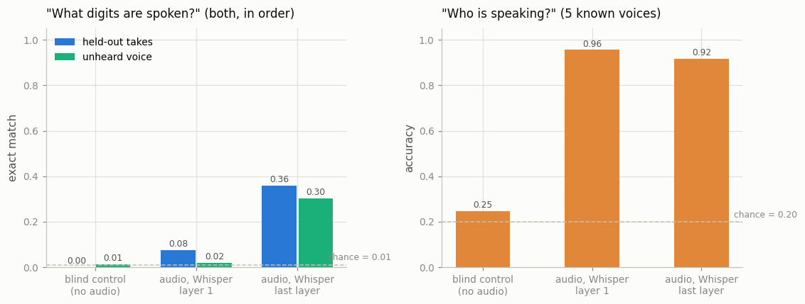
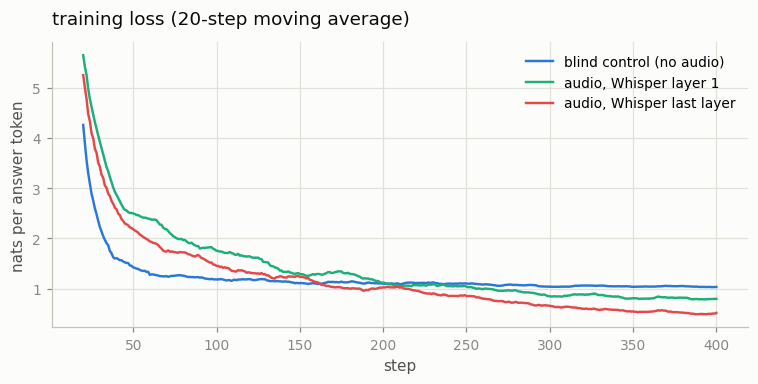

# Speech LLM

## Key Insight

A Speech LLM reuses the exact recipe behind [LLaVA](/shared/glossary/#llava) — freeze a pretrained encoder, freeze a pretrained [LLM](/shared/glossary/#llm), and train only a small [projector](/shared/glossary/#projector) between them — but swaps the vision encoder for an audio encoder, so the language model can "hear." The projector's whole job is to map audio features into the LLM's word-vector space; once aligned, the LLM can caption sounds or answer questions about them using its existing language ability. Training on [AudioSet](/shared/glossary/#audioset) captions is what teaches that bridge, and because only the projector updates, the hard, five-star part of this project is curating good (audio, caption) data rather than the modeling itself.

## What we built, and the one substitution we made

The model is project [20](../20-llava-from-scratch/README.md)'s `vlm_lib.py`, unchanged, with **one thing different**: where project 20 puts a [frozen](/shared/glossary/#frozen) CLIP, this puts a frozen [Whisper](/shared/glossary/#whisper) encoder. That is not a shortcut — it is the actual claim this part of the field makes, and reusing the file is how we test it.

```
audio ──► frozen Whisper-tiny encoder ──► 104 frames of 384 numbers
                                                 │
                                       average every 4 frames
                                                 ▼
                                          26 audio vectors
                                                 │
                                       projector  (TRAINED: 0.55M weights)
                                                 │
                                                 ▼   26 vectors of 576 numbers
 "<|im_start|>user\n <image>x26 \nWhat digits are spoken?<|im_end|>..."
                                                 │
                    the 26 slots are overwritten by the projected vectors
                                                 ▼
                              frozen SmolLM2-135M  ──►  "four seven"
```

| piece | Qwen2-Audio / SALMONN | here | why |
|---|---|---|---|
| audio encoder | Whisper-large-v3 encoder (635M) | **Whisper-tiny encoder (8M)** | CPU budget; same architecture, same training recipe |
| language model | Qwen2-7B | **SmolLM2-135M-Instruct** | a real pretrained instruct model, small |
| training data | millions of (audio, text) pairs | **1,340 utterances, 3,200 examples seen** | a ten-minute CPU budget |
| what trains | the projector (later also [LoRA](/shared/glossary/#lora) on the LLM) | **the projector only** (0.55M weights) | it is the piece this project is about |

> **"Whisper is already a speech-to-text model. Why bolt a language model onto it instead of just using Whisper?"** Because Whisper's decoder can do exactly one thing: write down the words. It cannot answer a question about the audio, follow an instruction, summarise, compare two clips, or report that the second digit was unclear. A speech LLM keeps Whisper's *ears* — the encoder, which is the expensive, hard-to-train part — and discards its *mouth*, borrowing instead the mouth of a general-purpose language model that already knows how to follow instructions. Project [27](../27-whisper-fine-tune/README.md) goes the other way (keep all of Whisper and adapt it); this project keeps half of it and joins it to something more flexible.

> **"The LLM already has an embedding table that turns things into 576-dimensional vectors. Why train a projector?"** That table only converts *token ids*; it has no row for "this sound". The widths also disagree (384 vs 576) — and even at equal width they would not fit, because Whisper and SmolLM2 were trained separately, so "dimension 7" means unrelated things in each. The projector is the only piece that learns that change of coordinates, which is exactly why it is the only piece we train.

## The data, and why it is not AudioSet

[AudioSet](/shared/glossary/#audioset) captions are the textbook choice and a two-million-clip YouTube download. We use [FSDD](/shared/glossary/#fsdd-free-spoken-digit-dataset) spoken digits instead, glued into **two-digit utterances**: two recordings from the same speaker, back to back, 2 seconds long.

That substitution buys three things a caption set would not:

1. **The answer is a sequence, not a class.** "four seven" has 100 possible values, so a model that has learned only the answer *format* scores 0.01. Project 20's hardest lesson was that a blind control can imitate the format of captions well enough to beat the real model on loss; a two-slot answer makes format imitation worthless.
2. **We can ask two questions of the same clip** — one the encoder was built to keep, one it was built to discard — and compare them (below).
3. **A held-out speaker is a real generalisation test.** Five voices train; a sixth is never seen by any arm.

Both digits come from the same speaker, because a voice changing mid-clip would be a boundary cue that no real recording provides.

## Two decisions that make this fit in ten minutes

**Truncate Whisper's output.** Whisper pads every input to 30 seconds, producing 1,500 encoder frames. Our clip is 2 seconds, so **104 frames are real audio and 1,396 describe silence**. We keep the 104. Project [07](../07-whisper-encoder-reuse/README.md) measured what happens if you forget: mean-pooling all 1,500 frames cost it 17 accuracy points.

**Pool 4 frames into 1 token.** Whisper's encoder emits 50 frames per second, so 104 frames become 26 [audio tokens](/shared/glossary/#token-visualaudio). Attention cost grows with the *square* of sequence length, which makes this the cheapest knob a speech LLM has — and 26 tokens for 2 seconds of speech is still four times the rate of the text describing it. Real systems pool harder: Moshi's codec runs at 12.5 frames per second.

> **"Doesn't averaging four frames destroy the detail we need?"** It destroys detail *within* 80 ms, roughly one phoneme's steady state. Crucially this is [temporal pooling](/shared/glossary/#temporal-pooling) *inside* each token, not across tokens: the 26 tokens stay distinct and stay ordered. Pooling everything into one vector would be fatal — the model could then not tell "four seven" from "seven four". The per-slot measurement below is what confirms order survived.

## The control, and why it is the same one project 20 used

`prefix` is 26 **learned vectors that are identical for every clip**. Same 26 slots, same prompt length, same 400 steps, same optimizer — everything except any information about the audio. Whatever it achieves is what the task gives away for free.

That matters more than a "no audio at all" baseline, which would differ from the real model in two ways at once (no audio *and* nothing trained). The prefix control differs in exactly one.

## Results



All three arms: 400 steps, batch 8, learning rate 3e-3, cosine decay, ~0.85 s/step. Everything frozen except the projector.

| arm | what it reads | digits exact, unheard voice | per digit slot | speaker (5-way) |
|---|---|---|---|---|
| `prefix` | nothing (blind control) | 0.012 | 0.098 | 0.248 |
| `early` | Whisper's **first** encoder layer | 0.020 | 0.168 | **0.956** |
| `mlp` | Whisper's **last** encoder layer | **0.304** | **0.554** | 0.916 |
| *[chance](/shared/glossary/#chance-level)* | — | *0.010* | *0.100* | *0.200* |

### 1. The grounding is real

0.304 exact against a blind control at 0.012, and 0.554 per digit slot against 0.098. Both digits, in the right order, 30 times out of 100 — from 3,200 training examples and 0.55M trainable weights, with the encoder and the language model both frozen.

It is also *not* an ASR system. Project 27's fine-tuned Whisper reads these same digits at 0.992. The gap between 0.99 and 0.30 is what this architecture costs at this data scale: a frozen encoder, a 26-token bottleneck, a frozen LLM, and one thin trainable bridge trained for six minutes. The *capability* transfers on a laptop; the *accuracy* needs the data.

**The blind control's answers are the clearest picture of what "no grounding" looks like:** it says `"four zero"` for every clip in the test set. Same output regardless of input — exactly like project 20's blind captioner emitting one sentence for every image.

### 2. The first digit is much easier than the second

| | first digit | second digit |
|---|---|---|
| unheard voice | **0.688** | 0.420 |
| held-out takes | **0.764** | 0.492 |

A 27-point drop from slot 1 to slot 2, and two things cause it:

- **[Autoregressive](/shared/glossary/#autoregressive-model) error compounding.** The second digit is generated *after* the first and conditioned on it, so a wrong first token leaves the model in a state it never trained on.
- **The evidence is further away.** The second digit lives in audio tokens 14–26, deeper into the sequence, and one shared projector matrix has to serve both halves.

Report per-slot numbers whenever the answer is a sequence: a single exact-match figure hides *which end* of the utterance is failing.

### 3. The layer dissociation: what a frozen encoder keeps, and where

This is the result worth carrying away. Everything is identical except which Whisper layer the projector reads:

| | Whisper layer 1 | Whisper last layer |
|---|---|---|
| **what was said** (digits, per slot) | 0.168 (chance 0.100) | **0.554** |
| **who said it** (speaker, 5-way) | **0.956** | 0.916 (chance 0.200) |

The early layer knows *who* almost perfectly and *what* barely above chance. The last layer knows *what* more than three times as well and gives up only 4 points of *who*. That is what "depth builds task-relevant abstraction" means, measured: the encoder is trained to transcribe, so going up its stack, raw acoustic detail is progressively reorganised into phonetic content. Tap it low and you get a voice-print; tap it high and you get words.

> **A correction to a claim you will meet — including elsewhere in this repository.** Project [07](../07-whisper-encoder-reuse/README.md) found speaker accuracy *falling* sharply with depth (0.82 → 0.44) and concluded Whisper "discards speaker identity because it is a nuisance variable for transcription". Our last layer still supports **0.916**. Both measurements are correct; they used different readers. Project 07 used a linear probe on mean-pooled features — a deliberately weak reader, which asks *"is the identity available along a straight line through the average?"* Here a trained projector plus a frozen LLM reads 26 ordered tokens, and finds the identity still present, just no longer arranged that simply.
>
> The general lesson: **"the encoder discards X" is never a property of the encoder alone — it is a property of the encoder plus the read-out you tested with.** State which one you used, and the direction of an effect (speaker information does decrease with depth here too, 0.956 → 0.916) is more trustworthy than its size.



The blind control's loss flattens early: once it has memorised how often each digit occurs, there is nothing left for it to learn. The two audio arms keep descending, and the last-layer arm descends fastest.

## What's in this directory

| file | what it is |
|---|---|
| `speech_lib.py` | the data: the two-digit utterance builder, the frozen-Whisper feature cache (two taps), and `AudioLLMData` (pooling plus the two question templates) |
| `run.py` | the stages `data` / `train` / `eval` / `plot`; the model comes from project [20](../20-llava-from-scratch/README.md)'s `vlm_lib.py` via `sys.path` |
| `outputs/data.json` | dataset and token-count summary |
| `outputs/train_*.json` | loss curve, wall-clock and parameter count per arm |
| `outputs/eval.json` | every metric plus sample answers per arm |
| `outputs/results.png`, `outputs/curves.png` | the figures above |

The cached Whisper features (2,000 clips × 104 frames × 384 numbers × 2 taps ≈ 320 MB) live in the gitignored `data/`; trained projectors in `checkpoints/`.

## How to run

```bash
python3 run.py --stage data                  # utterances + frozen Whisper cache (~5 min, once)
python3 run.py --stage train --arm mlp       # ~6 min
python3 run.py --stage eval  --arm mlp       # ~1 min
python3 run.py --stage train --arm prefix    # the blind control
python3 run.py --stage eval  --arm prefix
python3 run.py --stage train --arm early     # Whisper's first layer instead of its last
python3 run.py --stage eval  --arm early
python3 run.py --stage plot
```

## Takeaways

1. **A speech LLM is a VLM with the encoder swapped.** We reused project [20](../20-llava-from-scratch/README.md)'s model file untouched. The recipe does not care which modality is on the left.
2. **Make the answer a sequence.** "four seven" has 100 possibilities, so format imitation is worth nothing and the blind control sits at 0.012. Single-label answers let a control that learned only the prior look deceptively good.
3. **Always train the blind control.** Ours answers `"four zero"` for every clip — the most vivid available picture of what an ungrounded model does.
4. **Report per-slot accuracy on sequences.** First digit 0.688, second 0.420; one exact-match number would have hidden a 27-point positional collapse.
5. **The encoder layer you tap changes *what* the model can know, not just how well.** Layer 1: speaker 0.956, content 0.168. Last layer: speaker 0.916, content 0.554 — a double dissociation from one architecture change.
6. **"The encoder throws away X" depends on your read-out.** A linear probe on pooled features said Whisper discards speaker identity; a trained projector plus an LLM finds it alive at 0.916. Quote the probe alongside the claim.
7. **Truncate the padding.** Whisper hands you 1,500 frames for 2 seconds of audio and 1,396 of them are silence. Keeping them would cost accuracy *and* make the sequence 57× longer.
