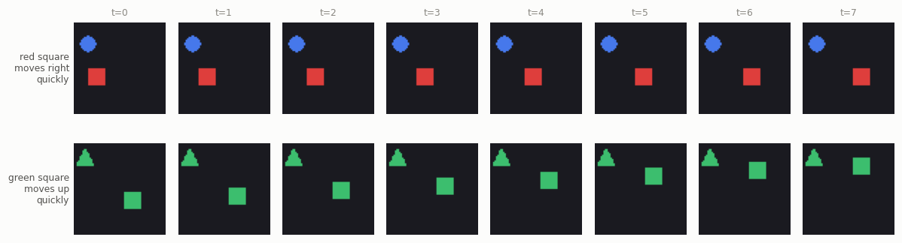
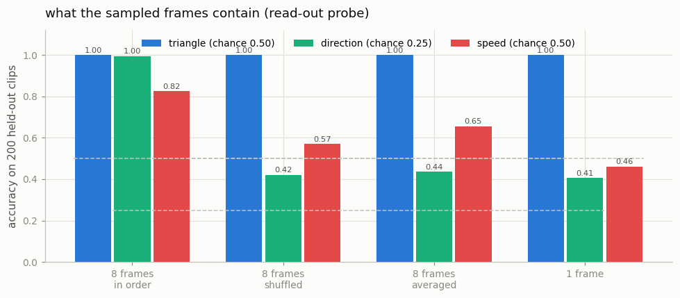
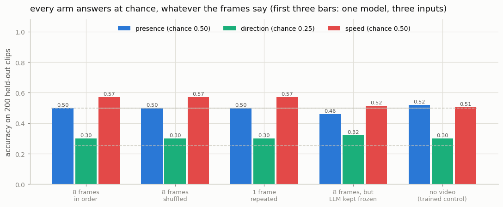

# Video Frame VLM

## Key Insight

The cheapest way to make a [VLM](/shared/glossary/#vlm) "watch" a video is to not treat it as video at all: sample a handful of frames (say 8 evenly spaced ones), hand them to the model as 8 still images, and ask a [video QA](/shared/glossary/#vqa-visual-question-answering) question over the lot. This works surprisingly well for questions about *what* is present ("is there a dog?") because a few snapshots usually contain the answer, and it reuses an existing image VLM with zero new training. Its blind spot is *motion and order* — anything that depends on what happened between the sampled frames (did the cup fall before or after it was touched?) is lost the moment you throw the in-between frames away.

## What this project measures, and in what order

Two separate questions hide inside "can a frame-sampling VLM answer this?", and this project answers them one at a time:

1. **Do the sampled frames still contain the answer?** That is a property of [frame sampling](/shared/glossary/#frame-sampling) itself — of the pictures and the encoder — and has nothing to do with any language model. Measured here with a small read-out probe.
2. **Can a projector plus a small LLM get at it, on a laptop training budget?** A different question, with a different answer.

Splitting them matters, because a VLM that fails could be failing for either reason and the two fixes have nothing in common. Most of this README is question 1; the last section reports question 2, which is the more sobering result.

## The clips

Real video benchmarks mix everything together — a cooking-video question needs objects, motion, order and world knowledge at once — so when a model fails you cannot say which part failed. We use a deliberately narrow synthetic world instead (built in `video_lib.py` and shared with project [31](../31-native-video-model/README.md)): 8 frames of 64×64 pixels, one shape that **moves** and one that **stays still**.



Every clip carries three questions, chosen so each needs a different amount of the video:

| question | example | how much video it needs |
|---|---|---|
| **presence** | *"Is there a red ball in the video?"* | **one frame** |
| **speed** | *"Does the red ball move slowly or quickly?"* | **two or more frames, in any order** |
| **direction** | *"Which way does the red ball move?"* | **two or more frames, in the right order** |

Two things are controlled so a single frame gives nothing away for free. The mover's *middle* position is drawn from the same box regardless of direction — otherwise, in a bounded frame, anything moving right must start on the left, and a one-frame model could score above chance by reading position alone. Both speeds use the same box for the same reason. We checked: the best single-frame position threshold reaches 0.262 on direction (chance 0.250) and 0.490 on speed (chance 0.500).

## The pipeline, and the one number that dominates it

```
8 frames ──► frozen CLIP ViT-B/32 (each frame separately) ──► 8 × 49 patch tokens
                                                                     │
                                              average each 7x7 grid down to 2x2
                                                                     ▼
                                                    8 × 4 = 32 image tokens
                                                                     │
                                                 projector (TRAINED: 0.78M)
                                                                     ▼
                       "<|im_start|>user\n <image>x32 \nWhich way does...<|im_end|>..."
                                                                     ▼
                                              SmolLM2-135M  ──►  "left"
```

> **"Why throw away 45 of CLIP's 49 patches per frame? Isn't that the information we need?"** Because token count is the entire cost of this design, and it is multiplied by the number of frames. Eight frames at CLIP's native 49 tokens is **392 image tokens**, and attention cost grows with the *square* of sequence length — that alone turns a 7-minute run into an hour. This is not a toy-scale concession: Video-LLaVA and Qwen2-VL pool spatially for exactly this reason, and it is the single biggest design pressure in video-language modelling. The probe below measures what the pooling costs (on these questions, nothing).

> **"The clips are 64×64. Why resize them to 224×224 for CLIP?"** A [ViT](/shared/glossary/#vit) accepts exactly the grid it was trained on — 224×224 cut into 32-pixel patches. Feeding it another size would mean changing its [positional embeddings](/shared/glossary/#positional-embedding), which is a different experiment. Upscaling adds no information; it presents what we have in the format the frozen encoder expects.

## Part 1 — what the sampled frames actually contain

A small two-layer MLP reads the **same cached CLIP features the VLM reads** — no language model, no prompt — and predicts each label. Anything it can learn was available to the VLM too. Four views of the identical features:



| the features it is given | is a triangle present? *(one frame is enough)* | which way does it move? *(needs order)* | how fast? *(needs 2+ frames)* |
|---|---|---|---|
| **8 frames, in order** | **1.000** | **0.995** | **0.825** |
| 8 frames, **shuffled** | **1.000** | 0.420 | 0.570 |
| 8 frames, **averaged over time** | **1.000** | 0.435 | 0.655 |
| **1 frame** | **1.000** | 0.405 | 0.460 |
| *[chance](/shared/glossary/#chance-level)* | *0.500* | *0.250* | *0.500* |

That is the Key Insight, measured, in one table.

**Content survives everything.** "Is a triangle present" is 1.000 in every row, including the single frame. Eight frames, one frame, shuffled, averaged — no difference, because a snapshot contains the answer. This is why frame sampling works as well as it does on real benchmarks: a large share of "video" questions are image questions with extra steps.

**Direction dies without order.** 0.995 with the frames in order; **0.405 from a single frame and 0.420 when the eight frames are shuffled**. The information is not degraded, it is *gone* — a shuffled clip is worth about as much as one frame for this question.

**Speed sits in between, exactly as designed.** 0.825 from ordered frames against 0.460 from one frame: it needs several frames. But it does not care which came first, and the time-averaged view keeps 0.655 of it while direction there falls to the floor.

> **Why does shuffling hurt speed at all, if speed does not depend on order?** Because shuffling at test time breaks something else: the probe was *trained* with the third token block meaning "frame 3", so a shuffled clip arrives in a layout it has never seen. That is a distribution shift, not information loss. The `time_averaged` row is the clean version of the same idea — trained *and* tested on averaged features, so no layout mismatch — and it keeps speed at 0.655 while direction stays near the floor at 0.435. The comparison to trust for *what is present in the features* is **ordered vs one frame**; the shuffle row is about what a trained model *uses*.

> **Why is direction 0.42–0.44 rather than 0.25 once order is destroyed?** Because two of the four answers share an axis. A set of positions spread out horizontally says the motion was horizontal, and no ordering is needed to see that; only *which way* along the axis needs time. So an order-blind model can approach 0.5 by getting the axis right and guessing the sign. Project [31](../31-native-video-model/README.md) measures the axis directly and finds exactly that signature: 0.971 on the axis, 0.548 on the full direction.

## Part 2 — what the VLM could extract, which is much less

Three trained arms, 800 training clips, 200 held-out clips, all three question types mixed:

| arm | trainable weights | s/step | presence | direction | speed |
|---|---|---|---|---|---|
| `blind` (32 learned vectors, no video) | 20K | 0.99 | 0.520 | 0.300 | 0.505 |
| `video` (projector only, LLM [frozen](/shared/glossary/#frozen)) | 777K | 1.23 | 0.460 | 0.320 | 0.515 |
| `tuned` (projector **and** the whole LLM) | 135M | 2.60 | 0.500 | 0.300 | 0.570 |
| *chance* | | | *0.500* | *0.250* | *0.500* |



**None of them learned to look.** Every arm sits at chance on every question, and the `tuned` arm returns *identical* numbers whether its frames are ordered, shuffled, or replaced by one repeated frame — the surest sign that its answers do not depend on the input at all. What all three did learn, perfectly, is the **answer format**: 100% of their outputs are a legal answer word for the question asked ("yes"/"no" for presence, "left"/"right"/"up"/"down" for direction). They learned *how* to answer and not *what* to answer.

This is the same failure project [23](../23-grounding-head/README.md) found for bounding boxes (format validity 1.000, boxes at the prior) and project [21](../21-visual-instruction-tuning/README.md) found in its blind arm. Assume it until a control rules it out.

**The probe is what makes the diagnosis possible.** Because the same features support 0.995 on direction and 1.000 on triangles, we can say precisely what did *not* go wrong:

- not the frames — a probe reads them at 0.995;
- not the encoder — the probe reads *its* output;
- not the questions — they are answerable;
- not the pooling to 32 tokens — the probe reads the pooled features.

What is left is the path from those tokens to words: a per-token [projector](/shared/glossary/#projector), which maps each token independently and therefore cannot compare frames at all, followed by a 135M language model that must do every comparison itself, in an embedding space it has never seen, from 3,200 training examples. Unfreezing that language model (the `tuned` arm — 135M trainable weights, 2.6 s/step, 17 minutes) moved nothing.

> **"Is this a bug or a result?"** A result, and one with a sharp edge: **a VLM's capability is bounded by the read-out, not only by the encoder.** The operation this task needs — "which of my 32 tokens is bright, and in which order" — is *geometric*, not linguistic, and a small frozen LLM has no reason to be good at it. Real video-language models close that gap with three things we do not have: hundreds of thousands of video-instruction examples, a much larger LLM, and far more tokens per frame. Knowing which of those three is the binding constraint is worth more than turning all of them.
>
> The counterweight sits one directory away. Project [31](../31-native-video-model/README.md) trains a **0.85M-parameter model with no language head at all** on these same clips and reaches **0.988** on direction in two minutes. The information is there, the task is learnable, and what failed here was specifically the frozen-LLM read-out at this data scale.

## What's in this directory

| file | what it is |
|---|---|
| `video_lib.py` | the clip generator and the three question templates; imported by project [31](../31-native-video-model/README.md), so both projects are graded on identical data |
| `run.py` | the stages `data` / `probe` / `train` / `eval` / `plot`; the VLM itself comes from project [20](../20-llava-from-scratch/README.md)'s `vlm_lib.py` |
| `outputs/probe.json` | Part 1: the read-out probe over four views of the features |
| `outputs/eval.json` | Part 2: every arm under every input condition, with parse rates |
| `outputs/train_*.json` | loss curves, wall-clock and trainable-parameter counts |
| `outputs/clips.png`, `outputs/probe.png`, `outputs/results.png` | the figures above |

The rendered clips and their pooled CLIP features live in the gitignored `data/` (~60 MB); trained projectors in `checkpoints/`.

## How to run

```bash
python3 run.py --stage data                 # render 1,000 clips + CLIP cache (~5 min, once)
python3 run.py --stage probe                # Part 1: the read-out probe (~2 min)
python3 run.py --stage train --arm video    # projector only  (~8 min)
python3 run.py --stage eval  --arm video    # ordered / shuffled / one-frame
python3 run.py --stage train --arm blind    # the no-video control
python3 run.py --stage eval  --arm blind
python3 run.py --stage train --arm tuned    # projector + LLM (~17 min; evaluates itself)
python3 run.py --stage plot
```

## Takeaways

1. **Frame sampling keeps "what" and destroys "when".** Same features, same probe: content 1.000 from a single frame; direction 0.995 in order and 0.405 from one frame. That is the entire blind spot in two numbers.
2. **Speed is the interesting middle case.** It needs several frames but not their order, so it survives time-averaging (0.655) far better than direction does (0.435). "Needs video" is not one property — separate *needs several frames* from *needs them ordered*.
3. **Order-blind models still get roughly half of a 4-way direction question right**, because the axis of motion is visible in an unordered set of frames. Do not read 0.5 there as "half-learned"; score the axis separately, as project [31](../31-native-video-model/README.md) does.
4. **Pooling is what makes video affordable, and it is a real choice.** 49 tokens per frame × 8 frames = 392; pooling to 2×2 gives 32. Every video-language model makes this trade, and here the probe shows the pooled features still hold every answer.
5. **Probe the features before blaming the model.** Our VLM arms sat at chance on all three questions; the probe proved the answers were in the features the whole time. Without it, the obvious conclusion — "frame sampling cannot answer these" — would have been wrong.
6. **Format validity is not understanding.** Every arm emitted a legal answer word 100% of the time while its answers were independent of the input. Report the parse rate and the accuracy separately, always.
7. **The read-out can be the bottleneck.** A per-token projector cannot compare frames, so all comparison falls to the LLM — and at 135M parameters and 3,200 examples that path learned nothing even unfrozen, while a 0.85M-parameter model with no language head learned the same task to 0.988 next door.
