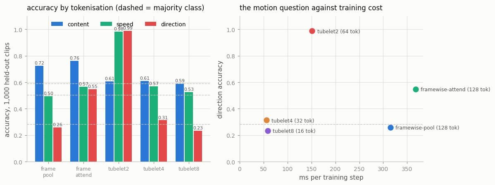
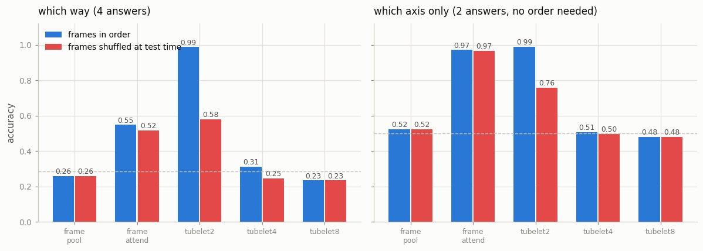

# Native Video Model

## Key Insight

Instead of bolting frames onto an image model, a native video model cuts the clip into [spatiotemporal patches](/shared/glossary/#spatiotemporal-patches) — small 3D boxes (TubeViT-style) that each span a little image region *and* a few frames — so motion is baked into the tokens from the start rather than inferred later. Feeding those tokens to a [transformer](/shared/glossary/#transformer) lets it relate "this corner, early" to "that corner, later" in a single step, which is exactly what frame-by-frame approaches throw away. The cost is that 3D patches multiply the token count fast, so even a small video classifier forces you to confront the compute-versus-detail trade-off that dominates all video modeling.

## The experiment

Five models that differ in **exactly one thing** — how the clip is cut into tokens. Same width (128), same depth (4 blocks), same heads, same [transformer block](/shared/glossary/#transformer) (imported from project [04](../04-implement-vit-from-scratch/README.md)'s `vit.py`), same 800 steps, same optimizer, same data as project [30](../30-video-frame-vlm/README.md) (imported from its `video_lib.py`).

| arm | how it cuts the clip | [tokens](/shared/glossary/#token-visualaudio) | token pairs attention must score |
|---|---|---|---|
| `framewise-pool` | 2D patches; the transformer runs on **one frame at a time**, and the 8 results are **averaged** | 128 (8 × 16) | 2,048 |
| `framewise-attend` | 2D patches; all 8 frames in one sequence with a learned per-frame position | 128 | 16,384 |
| `tubelet2` | 3D boxes spanning **2 frames** | 64 | 4,096 |
| `tubelet4` | 3D boxes spanning **4 frames** | 32 | 1,024 |
| `tubelet8` | one box spanning **all 8 frames** | 16 | 256 |

Each clip carries three labels chosen so that they need *different amounts of video*:

| label | question | how much video it needs |
|---|---|---|
| `content` | does the clip contain a triangle? | **one frame** |
| `speed` | does the moving shape go slowly or quickly? | **two or more frames, any order** |
| `direction` | left / right / up / down? | **two or more frames, in order** |

> **What is a "tubelet"?** A [patch](/shared/glossary/#patch) with a time dimension. A ViT patch is a square of pixels; a tubelet is that square *extruded through several consecutive frames* — a little tube through the video volume. The name is literal. Because the pixels of all those frames are flattened into one vector and multiplied by one matrix, **motion is mixed inside the very first linear layer**, before any attention runs. That is [early fusion](/shared/glossary/#fusion-earlymiddlelate); comparing separately encoded frames later is late fusion.

> **"Why include an arm that averages the frames? That obviously cannot see motion."** Precisely because it obviously cannot — and having a model that *provably* cannot do something is the most useful control there is. Averaging does not care what order things arrive in, so `framewise-pool` is mathematically guaranteed to give the same answer for a clip and any shuffle of it. When we shuffle the frames at test time and its numbers do not move by a single digit, that is not evidence about the world, it is a check that our shuffle test works. Then the same test applied to the other arms *is* evidence.

## The measurement that separates two failure modes

`direction` has four answers, and they come in two pairs: left/right share the **horizontal** axis, up/down the **vertical** one. This matters because:

- **Which axis** a shape moves along is visible from an unordered *set* of frames — the positions are spread out horizontally or vertically, and no ordering is needed to see that.
- **Which way along the axis** requires knowing which frame came first.

So we score direction twice: as a 4-way answer, and as the 2-way "did it at least name the right axis". A model that treats the frames as a bag can reach **1.00 on the axis and 0.50 on the direction**. That signature is worth recognising, because a bare 0.55 direction accuracy looks like "the model half-learned motion" when it actually means "the model fully learned the axis and knows nothing about time".

## Results



| arm | tokens | ms/step | content (majority 0.591) | speed (0.505) | direction (0.284) | direction axis (0.5) |
|---|---|---|---|---|---|---|
| `framewise-pool` | 128 | 315 | **0.725** | 0.496 | 0.260 | 0.523 |
| `framewise-attend` | 128 | 368 | **0.763** | 0.567 | 0.548 | **0.971** |
| **`tubelet2`** | **64** | **152** | 0.607 | **0.984** | **0.988** | **0.990** |
| `tubelet4` | 32 | 56 | 0.611 | 0.569 | 0.313 | 0.508 |
| `tubelet8` | 16 | 59 | 0.591 | 0.526 | 0.235 | 0.481 |

### 1. `tubelet2` reads motion; nothing else does

0.988 on direction and 0.984 on speed, against a majority-class baseline of 0.284 and 0.505 — while running at **152 ms/step, less than half the cost of `framewise-attend` at 368 ms**. Early fusion is not a trade here: on the motion questions it is both better and cheaper. The reason is structural. With a 2-frame tubelet, "the shape was here, then there" is a difference between two halves of *one token's* input vector, so a single row of the embedding matrix can compute it. In `framewise-attend` the same fact is spread across two tokens 16 positions apart, and attention has to discover that it should compare them.

### 2. `framewise-attend` learned the axis and never learned time

Direction 0.548, axis **0.971**. Almost exactly half of 0.971 — the signature of a model that knows the shape moved horizontally and then flips a coin between left and right.



The shuffle test proves it. Shuffling the frames at test time changes `framewise-attend` from 0.548 to 0.516 on direction and 0.971 to 0.966 on axis — **nothing moves**, because it was never using the order in the first place. Give the same treatment to `tubelet2` and it collapses from 0.988 to 0.579 on direction and 0.990 to 0.758 on axis: that is what a model that genuinely used time looks like when you take time away.

And `framewise-pool` returns *exactly* the same numbers before and after shuffling (0.260 and 0.260, 0.523 and 0.523), as the mathematics requires. Our control behaved exactly as designed, which is what licenses reading the other two columns.

> **Why does an "unordered bag" of frames still reach 0.97 on the axis?** Because the *set* of positions is enough. Eight snapshots of a shape moving left-to-right occupy a horizontal spread of positions, and that spread is the same set whatever order you look at them in. This is worth internalising: many "video understanding" scores can be obtained without any temporal reasoning at all, which is why benchmarks that shuffle frames as a control keep finding that models barely notice.

### 3. Bigger tubelets are not "coarser but fine" — they fall off a cliff

`tubelet4` scores 0.313 on direction and `tubelet8` 0.235: both at the majority-class baseline. Yet they are the *cheapest* arms (56 and 59 ms/step) and they still solve nothing but the content question. Why the collapse:

- **The object outruns its own tubelet.** After downsampling, a shape is about 6 pixels wide inside an 8-pixel patch and moves up to 1.75 pixels per frame. Across a 2-frame tubelet it stays inside the box, so the box sees "before and after". Across 4 or 8 frames it has left, so the token holds a smear that starts in one box and ends in another, and no single token contains the displacement.
- **There are fewer time slots to compare.** `tubelet8` has exactly one time slot, so there is no "later token" to attend to at all — every trace of motion has to survive inside one linear projection.

The practical rule: **match the tubelet's time span to how far things move in that span.** ViViT and TubeViT use 2 frames per tubelet for the same reason, not because 2 is a round number. The same rule governed patch size in project [08](../08-patch-size-study/README.md) — match the patch to the scale of the thing you need to see.

### 4. The tokenisation decides *which* task the model learns

Look down the `content` column: the frame-wise arms score 0.725 and 0.763, and every tubelet arm sits near 0.60. Now look at `direction`: the ranking is exactly reversed.

All five models are trained on the *sum* of the three losses with the same budget, so this is a statement about what each tokenisation makes easy. Frame-wise tokens present each frame cleanly, which suits "is a triangle present"; tubelets blend frames together, which blurs a static shape's appearance while handing motion over for free. Under a fixed step budget, capacity flows to whatever the architecture makes learnable, and the other task is left near its baseline.

The lesson generalises past this toy: **when you change tokenisation you are not turning a quality dial, you are choosing which questions your model will be able to answer.** A real system that needs both — Video-LLaVA, Qwen2.5-VL — feeds *both* views, which is exactly why they look redundant on paper.

## What's in this directory

| file | what it is |
|---|---|
| `tube.py` | `tubify` (the 3D unfold), `VideoViT` (all five tokenisations behind one flag), and the multi-task loss. Imports the transformer block from project [04](../04-implement-vit-from-scratch/README.md) |
| `run.py` | the stages `baseline` / `train` / `plot`; the data comes from project [30](../30-video-frame-vlm/README.md)'s `video_lib.py` |
| `outputs/arms.json` | every arm: accuracy (ordered and shuffled), tokens, attention pairs, parameters, ms/step, loss curve |
| `outputs/baseline.json` | majority-class accuracy per task — the honest "chance" line |
| `outputs/arms.png`, `outputs/shuffle.png` | the two figures above |

The 6,000 clips are regenerated procedurally in about five seconds, so nothing is cached to disk.

## How to run

```bash
python3 run.py --stage baseline               # majority-class accuracies
python3 run.py --stage train --arm all        # all five arms, ~12 min total
python3 run.py --stage train --arm tubelet2   # one arm, ~2 min
python3 run.py --stage plot
```

## Takeaways

1. **Early fusion won on both axes here.** `tubelet2` beat the late-fusion arm by 44 points on direction *and* ran 2.4× faster, because a 2-frame tubelet turns "compare two tokens" into "read one token".
2. **Score the sub-skill separately when a label mixes them.** Direction 0.548 with axis 0.971 is not "half-learned motion" — it is "learned the axis perfectly, learned time not at all". One number hid two completely different states.
3. **Shuffle the frames at test time.** It costs nothing and it is the only cheap way to tell a model that uses time from one that uses the *set* of frames. `framewise-attend` failed that test while looking respectable on the leaderboard.
4. **Include a control that provably cannot do the task.** `framewise-pool` returned identical numbers under shuffling, as its architecture requires. That is what makes the shuffle result for the other arms trustworthy.
5. **Match the tubelet's time span to how far things move.** 2 frames worked, 4 and 8 collapsed to baseline — the object leaves the box, and a token that does not contain the displacement cannot encode it.
6. **Tokenisation chooses which questions become answerable.** Frame-wise cutting was better at "what is present" (0.76 vs 0.61) and hopeless at "which way"; tubelets were the reverse. Real video-language models feed both views for exactly this reason.
