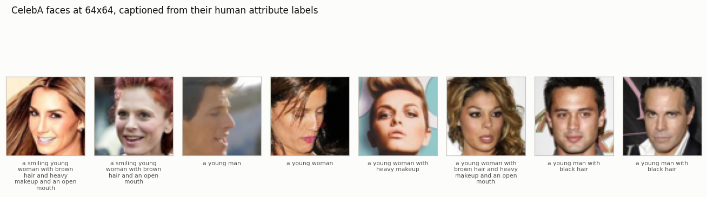
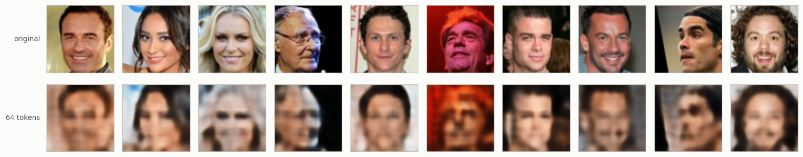
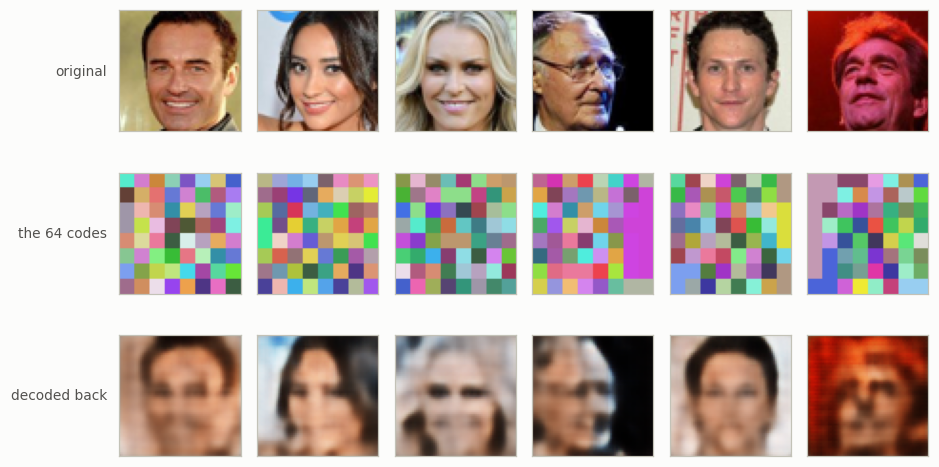
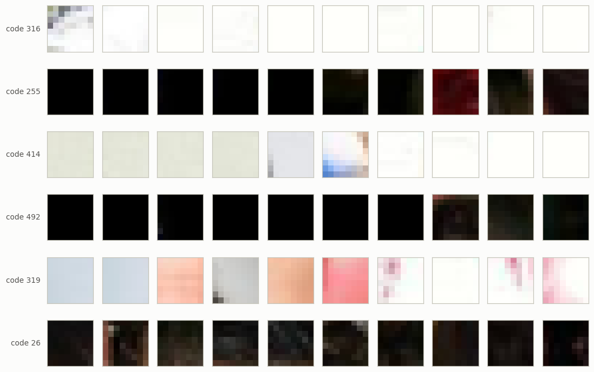
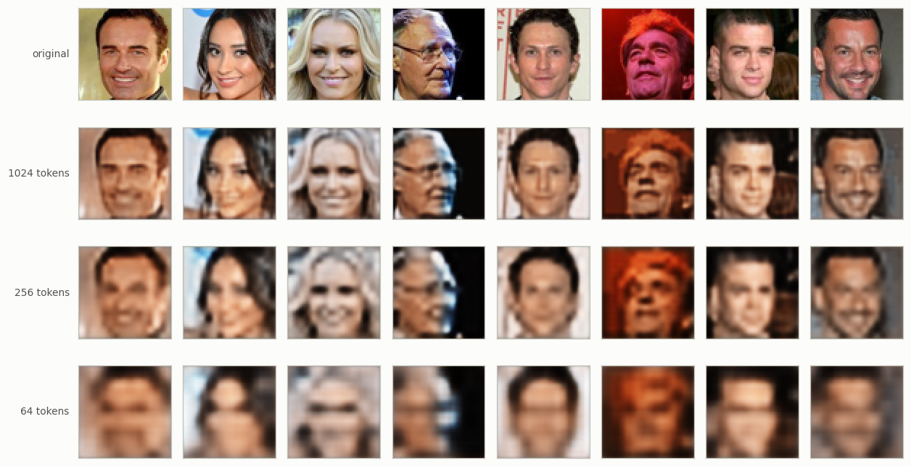
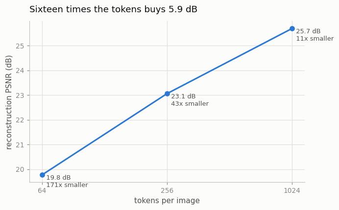
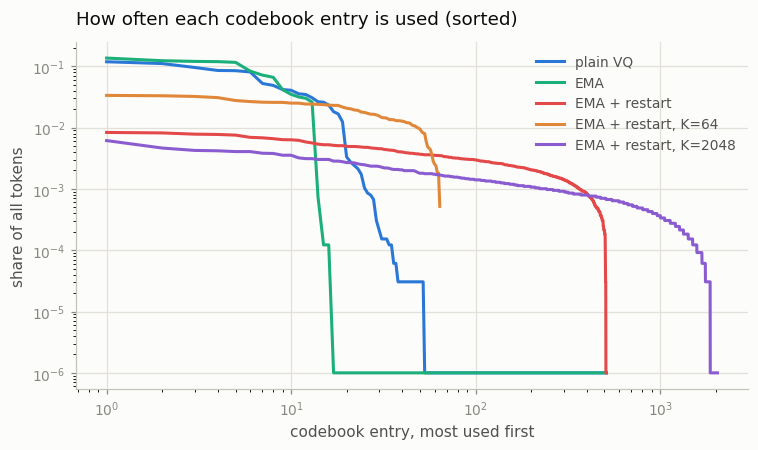
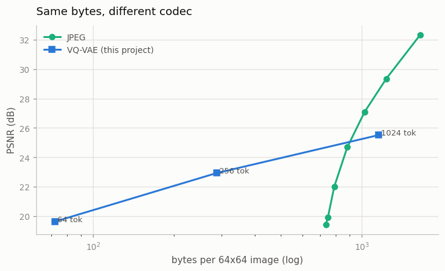
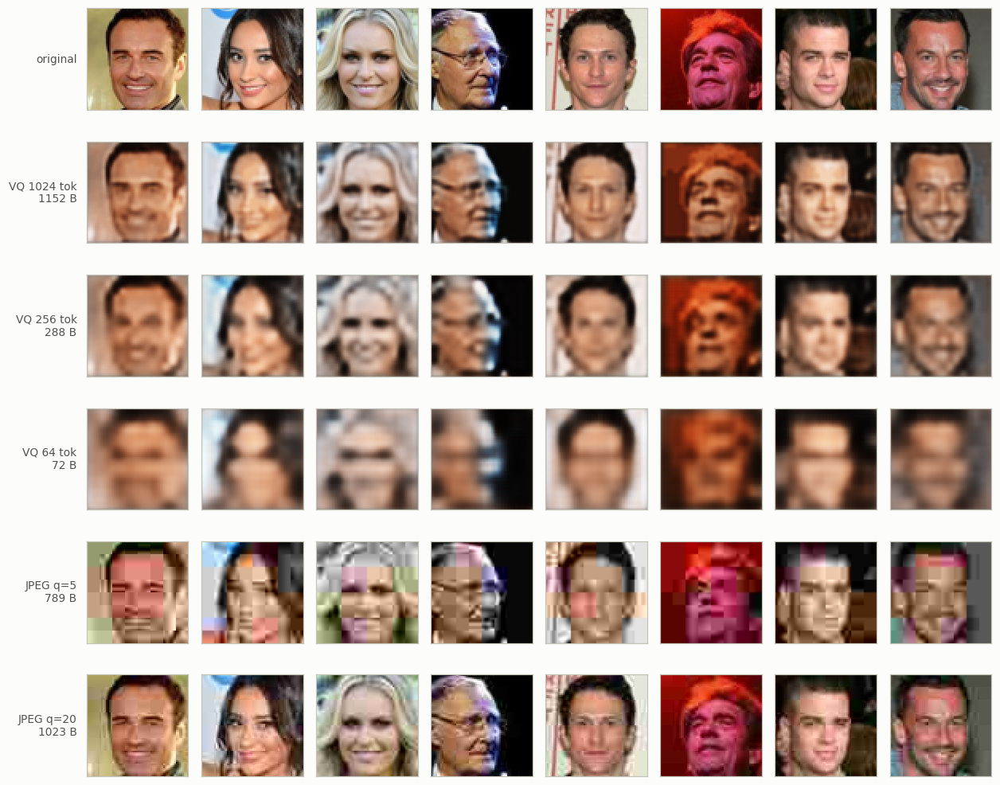

# Discrete Image Tokens

## Key Insight

A [VQ-VAE](/shared/glossary/#vq-vae) turns a picture into a small grid of whole-number codes — [discrete image tokens](/shared/glossary/#token-visualaudio) — by forcing every patch to pick the nearest entry from a fixed [codebook](/shared/glossary/#codebook), the way a paint-by-numbers kit makes you choose from a numbered palette instead of mixing any color you like. That single move is what lets a [transformer](/shared/glossary/#transformer) model images with the very same [next-token-prediction](/shared/glossary/#next-token-prediction) machinery it uses for text, which is the whole foundation of the [any-to-any](/shared/glossary/#any-to-any-model) models in this phase. The "1024 tokens/image" target comes from laying the codes out as a 32×32 grid (32 × 32 = 1024): more tokens buy a sharper reconstruction but a longer sequence for any downstream model to read, and along the way you must watch for [codebook collapse](/shared/glossary/#codebook-collapse), where the model leans on only a handful of codes and leaves most of the palette unused.

## What this project builds

This is the **first project of Phase 7**, and everything after it depends on this one file. Projects [33](../33-tiny-chameleon/README.md), [34](../34-modality-balancing/README.md), [35](../35-moe-for-multimodal/README.md) and [36](../36-reverse-direction/README.md) all import `vqvae.py` and use the tokenizer trained here. So the goal is not just "a VQ-VAE that works" — it is a tokenizer whose *price list* we understand, because every downstream project is paying it.

Five things get measured:

| stage | what it answers |
|---|---|
| `train` | can 64 whole numbers hold a face? |
| `grid` | what does 1024 tokens per image buy over 64? |
| `collapse` | how much of the codebook actually gets used — and does it matter? |
| `tokens` | what does one code *mean*? |
| `jpeg` | is this even a good compressor? |

The last stage exists because the honest comparison is uncomfortable, and skipping it would leave a false impression.

## The data: faces with real captions



8,000 [CelebA](/shared/glossary/#celeba) photographs, cropped to the face and resized to 64×64 (7,200 for training, 800 held out). Each one comes with 40 human-annotated yes/no attributes, and `attr_caption()` turns those into a short English sentence: *"a smiling young woman with brown hair and heavy makeup and an open mouth"*. No captioning model is involved — the words come from labels people wrote.

> **"Faces? Phase 3 already downloaded [COCO](/shared/glossary/#coco). Why a different dataset?"** Because of what happens *next*. Projects 33–36 ask a small [transformer](/shared/glossary/#transformer) to **predict** these tokens, not just consume them. Faces are aligned and low-variety — every image is two eyes, a nose and a mouth in roughly the same place — so 64 tokens really can carry a recognisable face and a tiny model really can learn their statistics in minutes. COCO at the same budget produces a colour smear, and a downstream project whose output is a smear cannot demonstrate anything. The tokenizer code is identical either way; only the pictures changed.

Two properties of these captions matter later. The vocabulary is **22 words**, and there are only **370 distinct captions** among 7,200 faces (the most common, *"a young man with black hair"*, appears 306 times). That is a deliberately easy text side — it keeps the text modality cheap, so the experiments in projects 33–36 are about the *joining*, not about language modelling.

## The tokenizer, one step at a time

```
face                     64 x 64 x 3        12,288 numbers, each 0-255
   │  three stride-2 convolutions
feature grid             8 x 8 x 32         each cell is a 32-number vector
   │  snap each cell to its NEAREST of 512 codebook entries   <- the quantizer
code grid                8 x 8              64 whole numbers, each 0-511
   │  look each code up in the codebook, run the decoder
face again               64 x 64 x 3
```

The only unusual step is the middle one. Everything else is an ordinary autoencoder.

> **Why "vector quantization", and why "VQ-*VAE*"?** *Quantization* means replacing a continuous value with the nearest of a fixed set — the same word used for rounding audio samples to 16-bit integers. *Vector* quantization rounds a whole vector at once, to the nearest entry in a list of vectors, instead of rounding each number separately. The "VAE" part is historical and slightly misleading: a real [VAE](/shared/glossary/#vae) makes its latent code random and pushes it towards a Gaussian, whereas a VQ-VAE's code is a deterministic index. What it kept from the VAE is the *shape* — encoder, small bottleneck, decoder — not the probabilistic part.

### The problem the straight-through trick solves

"Pick the nearest entry" is a lookup, and lookups have no gradient: nudge the encoder's output a little and either the nearest entry does not change at all (gradient 0) or it jumps to a different entry (gradient undefined). Either way the [gradient](/shared/glossary/#gradients) stops dead at the codebook and the encoder never learns.

The [straight-through estimator](/shared/glossary/#straight-through-estimator) is a one-line lie that fixes it:

```python
q = z + (q - z).detach()      # forward: q.  backward: pretend q == z.
```

The forward pass uses the quantized vector `q`, exactly as intended. The backward pass copies the decoder's gradient *straight through* the quantizer onto the encoder's output `z`, as if no rounding had happened — hence the name. It is not the true gradient (there isn't one), but it points the right way.

Two extra terms then keep `z` and `q` from drifting apart, since the lie only stays harmless while they are close:

- the [commitment loss](/shared/glossary/#commitment-loss) `β‖z − sg[e]‖²` pulls the *encoder* towards its chosen entry (`sg` = stop-gradient, "treat this as a fixed number"). It is called *commitment* because it asks the encoder to commit to a code instead of forever outputting vectors that sit between entries.
- the codebook side is handled by an [EMA update](/shared/glossary/#ema-codebook-update) rather than a loss: each entry slides towards the running average of the vectors that picked it.

## Part 1 — can 64 numbers hold a face?

The shared tokenizer is `f=8` (each side shrunk 8×, so an 8×8 grid = **64 tokens per image**), a 512-entry codebook, 0.38M parameters, trained for 2,500 steps in **199 s**.



**22.03 dB [PSNR](/shared/glossary/#psnr), all 512 codes in use.** Look at the bottom row before reading on. The faces are blurry — you would not recognise the person — but pose, hair colour, skin tone, glasses, an open mouth and the light/dark background all survive. That is the level of detail the downstream projects have to work with, and knowing it up front stops project 33's outputs from being a surprise.

Here is what the model is actually storing:



The middle row paints each of the 64 codes in a random colour, so *repeated codes are visibly repeated*. Two things show up: neighbouring cells often share a code (large flat regions of background collapse to one entry), and the same code recurs across different faces.

Ask what a single code means, and the answer is deflating:



**The most-used codes are backgrounds.** Codes 255 and 492 are "black"; codes 316 and 414 are "white/pale"; code 319 is "flat pastel". None of the six busiest entries is an eye or a mouth. This is not a bug — flat regions are the most common thing in the dataset, so of course they get the most-used codes. But it is the first hint that "512 codes, 9 bits each" overstates what is really being transmitted.

One number captures how *position-free* the codes are: for each code we measured the [entropy](/shared/glossary/#entropy-regularization) of *where in the 8×8 grid* it appears. The maximum is log₂ 64 = 6 bits (a code equally likely anywhere); a code welded to one cell would score 0. The average across 510 codes is **4.96 bits**. So codes are mildly position-aware — "hair-coloured, upper region" — but mostly they are a palette of textures usable anywhere, which is exactly why a *sequence* model has to supply the layout.

## Part 2 — the guide's 1024-token target, priced

Train the same architecture at three compression factors, each for the same 800 steps:



| grid | tokens/image | PSNR | bytes at 9 bits/token | vs. raw 12,288 B | parameters | cost per step |
|---|---|---|---|---|---|---|
| 32×32 | **1024** | **25.69 dB** | 1,152 | 10.7× smaller | 62,179 | **1.70×** |
| 16×16 | 256 | 23.06 dB | 288 | 42.7× | 253,027 | 1.26× |
| 8×8 | 64 | 19.77 dB | 72 | 170.7× | 384,227 | 1.00× |

*(Cost per step is relative to the 8×8 model. On an unloaded machine the three measure 170 / 144 / 100 ms per step at batch 32; `grid.json` records higher absolute values because that run shared the CPU with another job, but the ratios are unaffected.)*



**Sixteen times the tokens buys 5.92 dB.** In error terms that is about 4× less squared error for 16× the sequence length — and sequence length is the currency every downstream transformer spends, because [attention](/shared/glossary/#attention) cost grows with the *square* of it. A 1024-token image inside a language model is a 1024-token sentence; three images and you have used more context than a page of text.

Two entries in that table surprise people:

- **The 1024-token model has the *fewest* parameters (62k vs 384k) and is the *slowest* (1.7× the cost per step).** Parameters and compute are not the same quantity. The `f=2` model does only one stride-2 downsample, so all its layers run on large 32×32 feature maps; the `f=8` model shrinks the picture early and does its wide, expensive layers on an 8×8 grid. Small-and-slow is perfectly possible.
- **"More tokens = better detail" is true here, and it was false in Phase 2.** Project [08](../08-patch-size-study/README.md) found the *largest* patch winning on accuracy, because that task had no fine detail to find. The difference is the objective: reconstruction always rewards detail, classification only rewards detail the label depends on. Never carry a patch-size conclusion from one objective to the other.

Why the downstream projects use 64 tokens and not 1024: a face at 64 tokens fits in an 88-token training row alongside its caption, and that trains in minutes on a CPU. At 1024 tokens the same row is about 1,050 tokens — more than 100× the attention cost — and nothing in Phase 7 would finish. That is a budget decision, stated openly, not a claim that 64 is enough for real work.

## Part 3 — codebook collapse, and how little it costs

[Codebook collapse](/shared/glossary/#codebook-collapse) is the classic VQ-VAE failure: most entries are never selected, so a 512-entry codebook behaves like a 20-entry one. Five configurations, 500 steps each:



| quantizer | PSNR | entries used | [perplexity](/shared/glossary/#perplexity) | effective bits/token |
|---|---|---|---|---|
| plain VQ (gradient-updated codebook) | 17.66 dB | **55 / 512** | 17.2 | **4.10** |
| [EMA](/shared/glossary/#ema-codebook-update) codebook | 18.61 dB | **16 / 512** | 11.4 | **3.50** |
| EMA + [dead-code restart](/shared/glossary/#dead-code-restart) | 18.91 dB | **508 / 512** | 405.2 | **8.66** |
| EMA + restart, K = 64 | 18.73 dB | 64 / 64 | 54.5 | 5.77 |
| EMA + restart, K = 2048 | 18.93 dB | 1919 / 2048 | 1286.7 | 10.33 |

*(Perplexity here is `exp(entropy of the code-usage distribution)` — the effective number of codes in play. "Effective bits" is its log₂: what one token really carries, as opposed to the nominal log₂ 512 = 9 bits.)*

**Collapse is real and it is severe.** Without restarts, 512 entries behave like 11 to 17. Both the plain and the EMA quantizer converge to a small clique: whichever entries happen to sit near the data early on get pulled closer, which makes them win more often, which pulls them closer still. A dead entry receives *no gradient at all* — nothing selects it, so nothing moves it — which is why the cure cannot come from the optimizer and has to be an outside intervention: find entries idle for 200 steps and drop them on top of a randomly chosen encoder output.

**Now the uncomfortable part.** Fixing collapse raised effective bits per token from 3.50 to 8.66 — 2.5× the information — and bought **0.30 dB**. And the size sweep is flatter still:

- shrinking the codebook 8× (512 → 64) cost **0.18 dB**;
- growing it 4× (512 → 2048) gained **0.02 dB**, which is nothing.

So on this dataset, at this budget, codebook size is nearly irrelevant to reconstruction quality — the whole 64 → 2048 range spans 0.20 dB. The bottleneck is the 8×8 spatial grid, not the alphabet: 64 cells are 64 cells whether each one names 64 things or 2,048.

> **Why did EMA alone score *better* than plain VQ (18.61 vs 17.66) while using *fewer* codes (16 vs 55)?** Because the two numbers measure different things. PSNR asks how well the decoder can reconstruct given whatever the quantizer hands it, and a small set of well-placed entries that the decoder has thoroughly learned beats a larger set that the optimizer is still shoving around. EMA is more *stable*, so its 16 entries sit exactly at the centres of the 16 clusters the encoder actually produces. It is a genuinely better quantizer that is also more collapsed — which is precisely why you cannot diagnose collapse from the reconstruction loss.

> **Then why bother fixing collapse at all?** Because PSNR is not the only consumer of these tokens. The downstream transformer has to *predict* them, and prediction difficulty scales with how many codes are genuinely in play. A collapsed codebook makes the image-token loss look wonderfully low — there are only 13 real options — while carrying almost no information: the sort of number that looks like progress and is not. Fixing collapse makes the downstream loss *worse* and the downstream model *better*. Report effective bits alongside any code-usage claim, or the two effects hide each other.

## Part 4 — the comparison nobody publishes

Spend the same bytes on JPEG and see who wins.



| codec | bytes/image | PSNR |
|---|---|---|
| VQ-VAE, 64 tokens | **72** | 19.62 dB |
| VQ-VAE, 256 tokens | 288 | 22.92 dB |
| VQ-VAE, 1024 tokens | 1,152 | 25.51 dB |
| JPEG quality 1 | 734 | 19.42 dB |
| JPEG quality 5 | 789 | 22.00 dB |
| JPEG quality 20 | 1,023 | **27.08 dB** |
| JPEG quality 75 | 1,645 | 32.32 dB |



**Read the two halves of that curve separately, because the answer flips.**

*Above about 900 bytes, JPEG wins outright.* At 1,023 bytes JPEG reaches 27.08 dB; our VQ-VAE needs 1,152 bytes to reach 25.51. A 1992 standard, with no training and no dataset, beats a neural codec trained specifically on faces. This is not an artefact of our small model — it is the normal situation, and it is why nobody is replacing JPEG with a VQ-VAE for storing photographs.

*Below about 730 bytes, JPEG cannot compete, because it cannot go there at all.* JPEG's floor on a 64×64 image is roughly 734 bytes even at quality 1 — most of that is fixed header and quantization tables — and at that floor it scores 19.42 dB, which our 64-token model *beats* (19.62 dB) using **72 bytes, ten times less**. Ask JPEG for less and there is no setting to ask with.

> **So is the VQ-VAE a bad compressor?** As a compressor for humans, at ordinary quality: yes, worse than JPEG. But compression is not why it exists. JPEG's output is a bitstream — Huffman-coded, variable-length, meaningless if you read a fragment of it. The VQ-VAE's output is **64 integers from a fixed alphabet of 512**, which is exactly the shape a language model eats. You cannot ask a transformer to predict the next JPEG byte and get a picture; you can ask it to predict the next code. What those 5 lost dB bought is not smaller files, it is a *representation a transformer can do arithmetic on* — and the rest of Phase 7 exists to spend it. Judging a tokenizer by PSNR alone is like judging an alphabet by how much ink it saves.

## What's in this directory

| file | what it is |
|---|---|
| `vqvae.py` | the whole tokenizer: CelebA download + crop, attribute→caption, encoder/decoder, the quantizer (straight-through, EMA, dead-code restart), the training loop, and `load_tokenizer()`. **Projects 33–36 import this file.** |
| `run.py` | the stages `data` / `train` / `grid` / `collapse` / `tokens` / `jpeg` |
| `outputs/data.json` | dataset and caption statistics |
| `outputs/train_f8.json` | the shared tokenizer's training curve and final scores |
| `outputs/grid.json` | the 1024 / 256 / 64-token comparison |
| `outputs/collapse.json` | the five quantizer configurations |
| `outputs/tokens.json` | what the busiest codes are, and how position-bound they are |
| `outputs/jpeg.json` | the rate-distortion table above |
| `outputs/*.png` | every figure on this page |

`data/` (the CelebA download) and `checkpoints/` (the tokenizer, ~1.7 MB) are gitignored and rebuilt by the stages below.

## How to run

```bash
python3 run.py --stage data     # downloads 8,000 faces, ~7 min, once
python3 run.py --stage train    # the SHARED tokenizer -> checkpoints/vqvae_f8.pt, ~3.5 min
python3 run.py --stage grid     # ~7 min
python3 run.py --stage collapse # ~5 min
python3 run.py --stage tokens   # ~20 s
python3 run.py --stage jpeg     # ~30 s
```

`--stage all` runs everything (about 16 minutes after the one-time download). **Projects 33–36 need `--stage train` to have run**; they say so if it hasn't. If you re-run `--stage train`, delete `../33-tiny-chameleon/data/tokens.npz` and `../34-modality-balancing/data/corpus.npz` afterwards — those caches hold codes from the previous tokenizer, and a mismatch turns every generated picture into noise.

## Takeaways

1. **The quantizer is three lines and one lie.** Nearest-entry lookup, [straight-through](/shared/glossary/#straight-through-estimator) gradient, [commitment loss](/shared/glossary/#commitment-loss). Everything else is a plain autoencoder.
2. **64 tokens hold a blurry but unmistakable face (22.0 dB).** Pose, hair, skin tone, glasses and background survive; identity does not. Know this number before you judge anything a downstream model draws.
3. **16× the tokens bought 5.92 dB — and 16× the downstream attention cost.** The right token count is set by what *reads* the tokens, not by the reconstruction curve.
4. **Parameters and compute came apart completely:** the 1024-token model had 6× fewer parameters and cost 1.7× more per step, because it never shrinks its feature maps.
5. **[Codebook collapse](/shared/glossary/#codebook-collapse) turned 512 entries into an effective 11-17, and fixing it bought only 0.30 dB.** Always report effective bits per token (log₂ of the usage [perplexity](/shared/glossary/#perplexity)) next to codebook size — the nominal number is fiction, and a collapsed codebook flatters every downstream loss.
6. **Codebook *size* barely mattered here — 0.20 dB across the whole 64 → 2048 range.** The spatial grid was the bottleneck. Sweep the grid before you sweep the alphabet.
7. **JPEG beats this codec above ~900 bytes and cannot reach 72 bytes at all.** A tokenizer is not competing with JPEG on quality; it is buying a discrete alphabet a [transformer](/shared/glossary/#transformer) can predict. That is the whole product.
