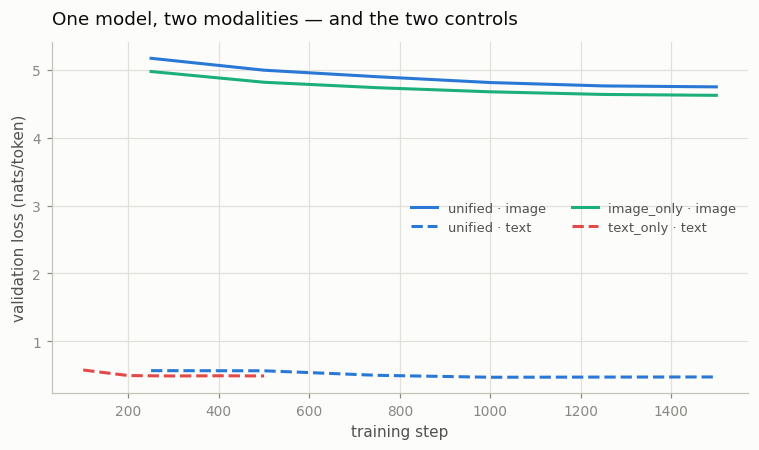
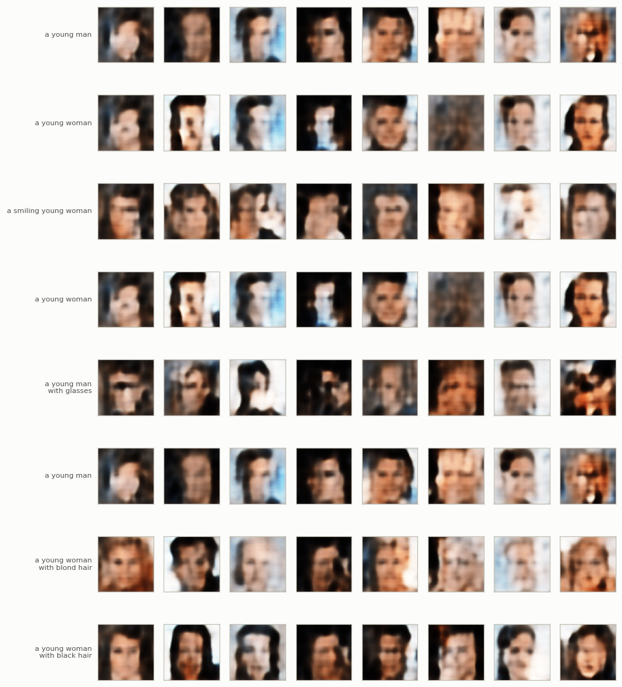
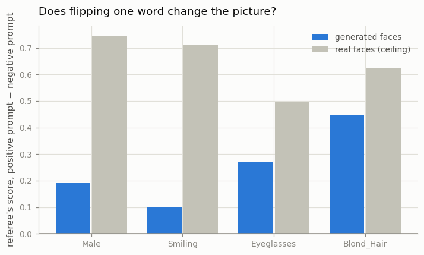
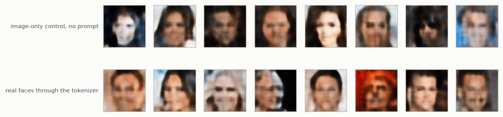

# Tiny Chameleon

## Key Insight

Once an image is just a row of [discrete tokens](/shared/glossary/#token-visualaudio), you can splice it into a sentence and train a single [transformer](/shared/glossary/#transformer) on the mixed stream with one ordinary [next-token-prediction](/shared/glossary/#next-token-prediction) loss — the [early-fusion](/shared/glossary/#fusion-earlymiddlelate) recipe behind [Chameleon](/shared/glossary/#chameleon) and other [native multimodal](/shared/glossary/#native-multimodal) models. Interleaving image tokens with caption text in one shared [vocabulary](/shared/glossary/#vocabulary) means the model never sees a seam between "looking" and "reading"; it just predicts the next code, whether that code is a word or a patch of pixels. The lesson is liberating: you do not need a separate vision tower or a special fusion module at all — tokenize everything and let one plain language-model objective do the work.

## What this project builds

One decoder-only [transformer](/shared/glossary/#transformer), 1.9M parameters, trained on rows that look like this:

```
t2i:  <bos> a smiling young woman with blond hair <boi> 391 12 508 ... 77 <eoi> <eos>
            \___________ 9 words ________________/      \___ 64 image codes ___/

i2t:  <bos> <boi> 391 12 508 ... 77 <eoi> a smiling young woman with blond hair <eos>
```

Each training example is randomly given one of the two orders. The loss is plain [cross-entropy](/shared/glossary/#cross-entropy) on the next token, over the whole row, with no distinction anywhere between "words" and "picture". Then we ask three questions.

1. **Does one model really do both jobs?** Two controls answer it: the same transformer trained on images only, and the same transformer trained on captions only.
2. **When you say "a young woman with blond hair", does the picture show blond hair?** An independent referee answers.
3. **When you show it a face, can it describe it — or is it just reciting the most common caption?** A blind control answers.

> **"Why bother with the controls? Surely a working joint model is the result."** No — a joint model that works is compatible with two very different worlds. In one, sharing a backbone is free or helpful. In the other, sharing costs each modality something and you would be better off with two models. You cannot tell which world you are in from the joint model's own numbers, because there is nothing to compare them to. The solo models are that comparison, and they turn out to disagree with each other (see below), which is exactly the kind of thing a single training run hides.

## The vocabulary: one alphabet, three blocks

```
id     0 .. 6      7 specials      <pad> <bos> <eos> <boi> <eoi> <boa> <eoa>
id     7 .. 28     22 words        a an and bangs black blond brown glasses gray
                                   hair hat heavy makeup man mouth no older open
                                   smiling with woman young
id    29 .. 540    512 image codes  <- from project 32's frozen VQ-VAE
                                   ----
                                   541 entries total
```

That is the whole trick, and it is worth staring at. The image codes are *entries in the same `nn.Embedding` table as the word "smiling"*. The transformer has no idea which block a given integer came from; there is no modality flag, no separate encoder, no [projector](/shared/glossary/#projector). Only *we* keep track of the block boundaries, and only so we can report a loss per modality.

> **"The `<boi>` and `<eoi>` markers look like a modality flag in disguise. Isn't that cheating?"** They are ordinary vocabulary entries the model has to *predict*, not metadata handed to it. Nothing in the architecture treats them specially: `<boi>` is a token like "with". What they do supply is *punctuation* — the model has to learn that after `<boi>` exactly 64 image codes follow — and that is a genuine part of the recipe, not a workaround. Real [Chameleon](/shared/glossary/#chameleon) does exactly this. The interesting consequence is that a badly trained model can emit an image code in the middle of a sentence; the format is a convention the model must learn, not a rule it is forced to obey.

The token budget in the training corpus is lopsided, and this is the fact the whole phase turns on:

| | tokens | share |
|---|---|---|
| image codes | 460,800 | **83.1%** |
| words | 65,045 | 11.7% |
| markers | 28,800 | 5.2% |

One face is 64 tokens; its caption averages 9 words. So **for every word the model reads, it reads seven image codes** — and gradient follows tokens. Project [34](../34-modality-balancing/README.md) is entirely about what that does.

## The referee

Before grading anything the model draws, we need a judge that is not the model. `AttrProbe` is a small CNN trained on **real** CelebA faces to read eight attributes off a picture; it never sees a generated face during training.

| attribute | probe accuracy on real held-out faces | always-guess-the-common-answer |
|---|---|---|
| Male | 0.908 | 0.578 |
| Smiling | 0.891 | 0.522 |
| Mouth open | 0.802 | 0.501 |
| Blond hair | 0.933 | 0.864 |
| Black hair | 0.845 | 0.758 |
| Young | 0.829 | 0.784 |
| Eyeglasses | 0.961 | 0.924 |
| Wearing hat | 0.962 | 0.958 |

> **"The generator was trained on these attributes. Why not just ask it whether it drew a smile?"** Because it would answer with what it *intended*, not with what it *drew* — the same reason you do not let a student mark their own exam. The probe is trained on real photographs and knows nothing about our generator, so when it says a generated face looks male, that is a statement about the pixels.

The right-hand column matters as much as the left. Hats appear in 4% of faces, so a judge that always says "no hat" is right 95.8% of the time. Any accuracy number on a rare attribute has to be read against that floor, and this is the reason the generation test below measures a **swing between two prompts** rather than an absolute score.

## Part 1 — does sharing help or hurt?

Three arms, same architecture (1.9M parameters, d=192, 4 layers), same optimizer:



| arm | trained on | text loss | image-code loss |
|---|---|---|---|
| **unified** | both, both orders | **0.477** | 4.747 |
| image-only control | image rows, captions deleted | — | **4.623** |
| text-only control | captions alone | 0.492 | — |
| *chance* | | *3.09 (= ln 22)* | *6.24 (= ln 512)* |

*(Losses are in [nats](/shared/glossary/#nat) per token; `exp(loss)` is the effective number of options the model is still torn between. So the unified model has narrowed 512 possible image codes down to an effective 115.)*

**Sharing helped text and hurt images, and the direction is not a coincidence.**

- Text: 0.477 joint vs 0.492 solo — **3% better** when images are in the mix.
- Images: 4.747 joint vs 4.623 solo — **2.7% worse** when captions are in the mix.

Read that against the token budget. Text is 11.7% of the corpus; images are 83.1%. The *minority* modality gained and the *majority* modality lost — which is what you would expect if a fixed-capacity model is being asked to serve two masters and gradient flows in proportion to token count. Text got extra context to condition on and had capacity to spare; images gave up a slice of a backbone they previously owned outright.

The practical lesson is not "don't share". It is that **"the unified model works" and "unification is free" are different claims**, and only the second one requires the controls. If your paper reports the first, someone will assume the second.

## Part 2 — text → image: does the picture obey the words?

The test is a **paired prompt**: the same sentence with exactly one word changed. Generate 64 faces from each, run the referee, and see whether its score for that attribute moves. Absolute scores are meaningless here (the referee is calibrated on real photographs, and these are 64-token blurs); the *difference between the pair* is not, because everything else about the two prompts is identical.





| attribute | positive prompt | negative prompt | referee swing | swing on **real** faces | obeyed |
|---|---|---|---|---|---|
| Blond hair | *a young woman with blond hair* | *…with black hair* | **+0.446** | +0.626 | **71%** |
| Eyeglasses | *a young man with glasses* | *a young man* | +0.272 | +0.494 | 55% |
| Male | *a young man* | *a young woman* | +0.192 | +0.746 | 26% |
| Smiling | *a smiling young woman* | *a young woman* | +0.100 | +0.712 | 14% |

The "swing on real faces" column is the ceiling: it is the same referee comparing real faces that *do* have the attribute against real faces that do not. Even a perfect generator could not beat it, because the referee itself is imperfect.

**The model listens, but very unevenly — and the pattern is not random.** Hair colour is obeyed 71% of the way; a smile, 14%. Look back at project [32](../32-discrete-image-tokens/README.md): its 64 tokens preserved colour and pose and destroyed fine detail, and the busiest codes were flat colour fields. A smile is a small, high-frequency arrangement of a few pixels around the mouth; at 8×8 tokens the mouth is *part of one token*. The generator is not ignoring the word "smiling" out of stubbornness — the alphabet it writes in barely distinguishes smiling from not.

That is the most useful thing in this project: **the tokenizer's blind spots become the generator's disobedience, one for one.** If your text-to-image model will not follow an instruction, check whether your tokenizer can represent the difference before you blame the transformer.

For comparison, here is the image-only control drawing with no prompt at all, next to real faces pushed through the same tokenizer:



The bottom row is the ceiling for *any* model in this project — that is what a real face looks like after 64-token quantization. Nothing generated can be sharper than that.

## Part 3 — image → text: the direction where the control bites

Now run the model the other way. To keep the comparison fair we use a [forced choice](/shared/glossary/#forced-choice): the model scores the true caption against the same caption with one attribute flipped, and we ask which it prefers. Chance is 50%.

The control is the **text-only model**, which answers the identical multiple-choice question having never seen the image.

| attribute | unified (sees the face) | text-only (blind) | what the image added |
|---|---|---|---|
| **Blond hair** | **0.902** | 0.771 | **+13.1** |
| Smiling | 0.817 | 0.777 | +4.0 |
| Male | 0.822 | 0.815 | +0.7 |
| Young | 0.842 | 0.840 | +0.2 |
| Eyeglasses | 0.935 | 0.938 | **−0.3** |
| Wearing hat | 0.952 | 0.955 | **−0.3** |
| **mean** | **0.879** | **0.849** | **+3.0** |

**0.879 looks like a good captioning model until you see 0.849 next to it.** Nearly all of that accuracy is the *prior* — the blind model simply learns which captions are common. Recall from project 32 that these 7,200 faces have only 370 distinct captions, and from the referee table that 96% of faces have no hat. A model that has memorised the caption distribution answers most of these questions correctly without looking.

Two attributes are genuinely read off the pixels: **blond hair (+13.1 points)** and, weakly, **smiling (+4.0)**. Two go *backwards* — glasses and hats, both rare, where the blind prior's "assume not" is a strong strategy and the image adds noise.

And note the agreement between the two directions. Hair colour was the best-obeyed attribute when generating (71%) and the only clearly-read attribute when captioning (+13.1). Glasses were second-best at generation (55%) but *unreadable* at captioning — because generating glasses only requires putting a dark band in roughly the right place, while reading them requires distinguishing a dark band from dark eyebrows in a 64-token blur. **The same bottleneck is not symmetric between the two directions**, which is a good thing to know before assuming an [any-to-any](/shared/glossary/#any-to-any-model) model is equally good both ways.

## What's in this directory

| file | what it is |
|---|---|
| `unified.py` | the shared Phase-7 backbone: the `Vocab` that fuses three blocks into one alphabet, the row builders, `UnifiedLM` (a causal transformer with pluggable feed-forward layers), `train_lm` with per-modality loss tracking, `sample`, the `AttrProbe` referee, and `load_pairs()` (the cached face-token corpus). **Projects 34, 35 and 36 import this file.** |
| `run.py` | the stages `data` / `probe` / `train` / `gen` / `plot` |
| `outputs/data.json` | vocabulary layout and the token-share table |
| `outputs/probe.json` | the referee's accuracy and the majority baselines |
| `outputs/train.json` | the three arms' curves and final losses |
| `outputs/gen.json` | both generation directions, with their ceilings and controls |
| `outputs/*.png` | every figure on this page |

`data/tokens.npz` (the faces re-encoded as codes) and `checkpoints/` are gitignored; both are rebuilt by the stages below.

## How to run

Project [32](../32-discrete-image-tokens/README.md) must have run `--stage train` first — this project loads its frozen tokenizer.

```bash
python3 run.py --stage data    # tokenize 8,000 faces, ~5 s
python3 run.py --stage probe   # train the referee, ~2 min
python3 run.py --stage train   # the unified model + 2 controls, ~8 min
python3 run.py --stage gen     # both directions, graded, ~4 min
python3 run.py --stage plot    # figures
```

## Takeaways

1. **One `nn.Embedding`, one loss, and images become text.** No vision tower, no [projector](/shared/glossary/#projector), no fusion module — just 512 more entries in the vocabulary and a `<boi>` marker the model has to learn like any other word.
2. **Sharing helped the minority modality and hurt the majority one.** Text improved 3% joint-vs-solo; image codes got 2.7% worse. Images were 83% of the tokens. Always run the single-modality control — "it works" and "it is free" are different claims.
3. **Prompt obedience tracked the tokenizer, not the transformer.** Hair colour 71% obeyed, a smile 14% — exactly the properties project 32's 64-token grid kept and destroyed. Fix the alphabet before blaming the model.
4. **The blind captioning control got 0.849 of the unified model's 0.879.** Only hair colour (+13.1 points) was genuinely read off the image; glasses and hats went slightly *backwards*. Any captioning score without a no-image control is unfalsifiable.
5. **The two directions are not symmetric.** Glasses were the second-easiest thing to draw and the hardest thing to read. "Any-to-any" does not mean "equally good in every direction".
6. **Measure a swing, not a score.** The referee's absolute output on a blurry generated face means nothing; the difference between two prompts that differ by one word means a lot, and the same difference measured on real faces gives you the ceiling.
