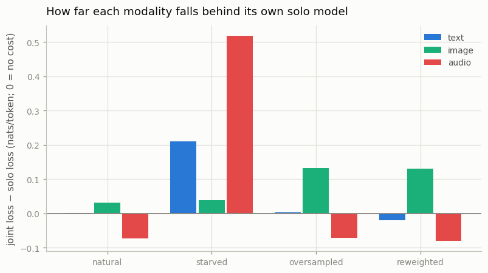
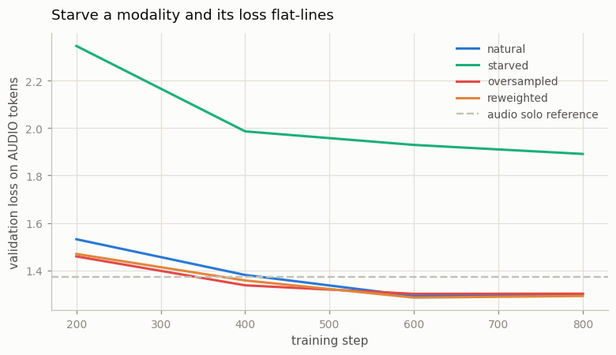

# Modality Balancing

## Key Insight

When one [transformer](/shared/glossary/#transformer) learns text, image, and audio together, the modality with the most [tokens](/shared/glossary/#token-visualaudio) quietly takes over: its share of the [next-token-prediction](/shared/glossary/#next-token-prediction) loss is the largest, so the gradient mostly improves that one modality while the others stall. [Modality balancing](/shared/glossary/#modality-balancing) is the fix — [oversample](/shared/glossary/#oversampling) the rare modality's data, or scale up its loss term, until each modality's loss falls at a comparable rate. Deliberately starving one modality and watching its loss flat-line teaches the single most common failure of [native multimodal](/shared/glossary/#native-multimodal) training, and exactly why "just throw all the data in together" is not enough.

## The measurement problem comes first

Project [33](../33-tiny-chameleon/README.md) trained one model on faces and captions. This project adds a third modality — **spoken digits** — and then confronts the question you have to answer before any balancing experiment means anything.

Here are three validation losses from one trained model:

```
text   0.61        image  4.80        audio  1.37     (nats per token)
```

**Which modality is the model neglecting?** The honest answer is that you cannot tell. Those numbers are not comparable, for three separate reasons:

1. **Different alphabet sizes.** Guessing uniformly costs `ln(22) = 3.09` nats for our 22 words, `ln(512) = 6.24` for image codes, `ln(1024) = 6.93` for audio codes. A loss of 4.80 is *well below* image chance; a loss of 1.37 is far below audio chance. Both are doing fine.
2. **Different inherent predictability.** Our captions come from 370 templates, so text is nearly memorisable. Spoken-digit codes repeat heavily. Faces do not.
3. **Different amounts of the loss are structural.** The `<eoi>` marker after exactly 64 codes is free once learned; a face's third token is not.

So the whole project rests on one method: **train a solo reference model per modality first, then report every joint model as a gap to its own ceiling.** A gap of `+0.03` means "this modality gave up 0.03 nats by sharing"; a gap of `−0.07` means it *gained*. Those numbers are comparable across modalities because each is measured against the same modality's own best.

> **"Why not just normalise each loss by its chance level and compare the ratios?"** Because chance is the wrong reference. It tells you how hard the *alphabet* is, not how hard the *data* is. Spoken-digit codes are drawn from a 1024-entry alphabet but only ~660 codes ever appear and the same short patterns recur, so a good model gets nowhere near chance — dividing by `ln(1024)` would make audio look artificially impressive. The solo model is the only reference that holds everything else fixed: same architecture, same budget, same data, one modality.

## The three modalities

| modality | tokenizer | tokens per example | rows | vocabulary block |
|---|---|---|---|---|
| text | word-level | 9.0 average (faces), 4 (digits) | — | 35 words |
| image | project [32](../32-discrete-image-tokens/README.md)'s frozen VQ-VAE | 64 | 7,200 | 512 codes |
| audio | frozen [EnCodec](/shared/glossary/#neural-codec), first codebook | 64 | 2,500 | 1,024 codes |

Rows look like this — the two corpora share the specials and the words, and differ only in which code block sits in the middle:

```
<bos> a smiling young woman with blond hair <boi>  391 12 508 ... 77  <eoi> <eos>
<bos> the spoken digit five                 <boa>  902 411 33 ... 640 <eoa> <eos>
```

> **"Project 32 built an image tokenizer from scratch. Why not build the audio one too?"** Because it would teach nothing new and cost a lot. A [neural codec](/shared/glossary/#neural-codec) is the same three parts as a VQ-VAE — encoder, codebook, decoder — applied to a waveform, and Phase 6 project [28](../28-encodec-tour/README.md) already took one apart. More importantly, using a *pretrained frozen* codec here is what real unified models do: image and audio tokenizers are trained separately, frozen, and only the transformer on top is trained jointly. Rebuilding it would change the project from "how do modalities share a backbone" into "can I train two tokenizers", which is a different question.

> **Why only EnCodec's first codebook?** EnCodec is [residual](/shared/glossary/#residual-vector-quantization-rvq): its first codebook approximates the waveform, the second encodes what the first got wrong, the third what the first two got wrong, and so on. Keeping only the first gives the coarsest, most speech-like layer and — the reason that matters here — exactly **64 tokens per clip**, matching an image. That is deliberate: with both modalities the same length per example, any imbalance we measure comes from the *mixture*, not from one modality being naturally more verbose.

The audio held-out set is a whole **unseen speaker**, exactly as Phase 2 did. A random split would put the same voice saying the same digit on both sides and let the model score well by recognising the voice.

## The natural imbalance

```
                tokens      share of the corpus
image codes    460,800        66.2%
audio codes    160,000        23.0%
words           75,045        10.8%
```

Text is the starved modality by a factor of six, and this happens without anyone choosing it: a face costs 64 tokens and its description costs nine. In a real corpus the ratio is usually the other way round (text dominates, images are rare) but the mechanism is identical — **gradient follows tokens**, so whatever supplies most of the tokens gets most of the learning signal.

## The four mixtures

Every arm trains the same 1.9M-parameter transformer for the same 800 steps on the same two corpora. Only *how examples are drawn* or *how the loss is weighted* changes.

| arm | what changes |
|---|---|
| `natural` | draw uniformly from all 9,700 rows (74% are faces) |
| `starved` | draw 99% faces, 1% audio — the failure, on purpose |
| `oversampled` | draw 50/50 — the **data-side** fix |
| `reweighted` | natural mixture, but multiply each modality's loss by the inverse of its token share (text ×3.09, audio ×1.45, image ×0.50) — the **loss-side** fix |

> **"Oversampling and reweighting both boost the rare modality. Aren't they the same fix twice?"** They push the same direction but through different channels, and the difference shows up when you look at what each one *cannot* do. Oversampling changes which examples the optimizer sees, so the rare modality gets more steps *in which it appears at all* — and its text, markers and format come along for the ride. Reweighting leaves the batch composition alone and only rescales gradients, so a modality that appears in 1% of batches still only gets gradient in 1% of steps, no matter how large the weight. In this run they land close together, but they are not interchangeable: if a modality is nearly absent, reweighting cannot manufacture examples.

## Results



Solo ceilings: **text 0.606, image 4.802, audio 1.373.**

| arm | text | image | audio |
|---|---|---|---|
| `natural` | 0.607 (**+0.001**) | 4.834 (**+0.032**) | 1.300 (**−0.073**) |
| `starved` | 0.816 (**+0.210**) | 4.841 (+0.039) | 1.891 (**+0.518**) |
| `oversampled` | 0.610 (+0.004) | 4.934 (**+0.130**) | 1.302 (−0.071) |
| `reweighted` | 0.587 (**−0.019**) | 4.932 (**+0.130**) | 1.293 (−0.081) |

*(Positive = worse than that modality's solo model. Negative = better.)*

### 1. Starvation does exactly what the textbook says



Cut audio to 1% of examples and its gap explodes to **+0.518** — more than sixteen times any other arm's. The green curve in the figure never reaches the dashed solo line and is still visibly above it at the end. This is the failure the guide warns about, reproduced on demand.

### 2. The starved modality drags its text down with it

Look at the `starved` row again: **text also degraded, by +0.210** — a larger gap than any arm's image cost. Nobody starved text. What happened is that half the text in this corpus is digit captions (*"the spoken digit five"*), and those words only ever appear in audio rows. Cutting audio rows to 1% cut those captions to 1% too.

**This is the second-order effect that makes real modality balancing hard.** Modalities are not independent columns you can dial separately; they are entangled through the shared examples. When someone downsamples a data source to fix one number, they are also downsampling everything else that source carried.

### 3. The honest inversion: both fixes made things worse

Compare the `natural` row with the two fixes:

| | audio gap | image gap |
|---|---|---|
| `natural` | −0.073 | **+0.032** |
| `oversampled` | −0.071 | **+0.130** |
| `reweighted` | −0.081 | **+0.130** |

**Neither fix improved audio (it was already beating its solo model), and both made images four times worse.** Oversampling audio to 50% means the face corpus gets half as many steps; reweighting image loss by 0.50 means face tokens contribute half the gradient. Both bought a rounding error on audio and paid 0.1 nats on the modality that actually needed the capacity.

The reason is visible in the `natural` row itself: **nothing was broken.** Audio's gap was already negative and text's was +0.001. Applying a balancing fix to a balanced run is not neutral — it is a real cost, charged to whichever modality you took from.

> **The order of operations this implies.** Measure gaps first, then balance only what has a gap. "Modality balancing" is not a hygiene step you apply because you are training a multimodal model; it is a treatment for a diagnosis, and the diagnosis is a table of gaps to solo references. The one number that would have led you astray here is the raw loss: image 4.83 next to audio 1.30 looks like a model neglecting images, and "fixing" that instinct is exactly what costs 0.1 nats.

### 4. Sharing helped the smallest corpus

Audio's gap is **negative in three of four arms** — the joint models beat the audio-only model. Audio has the fewest rows (2,500 against 7,200 faces), so its solo model is the most data-starved of the three, and it gains most from a backbone that other data helped train. Project [33](../33-tiny-chameleon/README.md) found the same asymmetry in a two-modality setting: text (11.7% of tokens there) gained, images (83.1%) lost.

**A pattern worth carrying forward: joint training is a transfer from the data-rich modality to the data-poor one.** That is a good deal when you care about the poor one and a bad deal when you care about the rich one, and it is *not* the same thing as "unification works".

## What's in this directory

| file | what it is |
|---|---|
| `tri_modal.py` | the third modality and the shared corpus: EnCodec tokenization of the spoken digits, the speaker-held-out split, and the row builders that put faces, digits and captions into one alphabet. **Project 35 imports this file.** |
| `run.py` | the stages `data` / `solo` / `joint` / `plot` |
| `outputs/data.json` | the vocabulary layout and the token-share table |
| `outputs/solo.json` | the three ceilings |
| `outputs/joint.json` | the four mixtures |
| `outputs/gaps.json` | the gap table above |
| `outputs/*.png` | both figures |

`data/` (EnCodec codes plus the merged corpus, ~90 MB) is gitignored and rebuilt by `--stage data`.

## How to run

Projects [32](../32-discrete-image-tokens/README.md) (`--stage train`) and [33](../33-tiny-chameleon/README.md) (`--stage data`) must have run first.

```bash
python3 run.py --stage data   # EnCodec-tokenize 3,000 spoken digits, ~3 min once
python3 run.py --stage solo   # the three ceilings, ~5 min
python3 run.py --stage joint  # the four mixtures, ~7 min
python3 run.py --stage plot   # figures + the gap table
```

## Takeaways

1. **Per-modality losses are not comparable to each other.** Text 0.61, image 4.80 and audio 1.37 say nothing about which modality is neglected — different alphabets, different predictability. Train a solo model per modality and report **gaps**.
2. **Starving a modality reproduces the classic failure exactly.** At 1% of examples, audio's gap went to +0.518 and its curve never reached the solo line.
3. **Starving one modality also starved its text (+0.210).** Modalities share examples, so cutting a data source cuts everything that source carried. This second-order effect was larger than any first-order image cost in the whole experiment.
4. **Both standard fixes made the run worse.** Oversampling and [loss reweighting](/shared/glossary/#modality-balancing) each quadrupled the image gap (+0.032 → +0.130) and bought audio nothing, because the natural mixture was not actually imbalanced. Diagnose before you treat.
5. **Joint training transfers from the data-rich modality to the data-poor one.** Audio (2,500 rows) beat its own solo model in three of four arms while images (7,200 rows) always paid. Whether that is good news depends entirely on which modality you are shipping.
6. **[Oversampling](/shared/glossary/#oversampling) and reweighting are not interchangeable.** Reweighting only rescales gradients in the batches a modality already appears in; if a modality is nearly absent, no weight can conjure examples for it.
