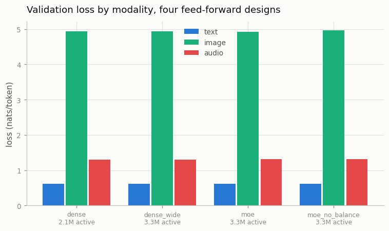
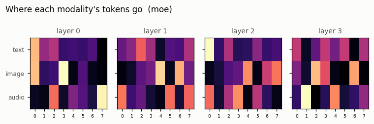
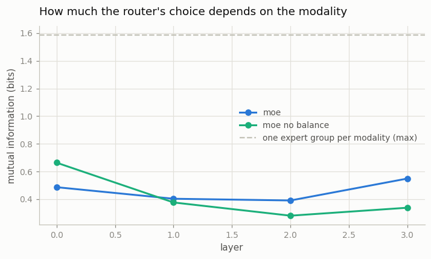

# MoE for Multimodal

## Key Insight

A [Mixture-of-Experts (MoE)](/shared/glossary/#moe) layer replaces one shared [MLP](/shared/glossary/#mlp) with many parallel [expert](/shared/glossary/#expert) MLPs plus a small [router](/shared/glossary/#moe-router) that sends each token to only the top few, so the model can hold a huge number of [parameters](/shared/glossary/#weights) while spending only a little compute per token. In a multimodal model this raises a tempting question: left to itself, will the router learn to send image tokens to one set of experts and text tokens to another — experts that [specialize by modality](/shared/glossary/#expert-specialization)? Watching which experts fire for which [modality](/shared/glossary/#modality) is a concrete window into how a unified model divides up its capacity, and a partial answer to whether modalities prefer to be processed separately even inside one shared backbone.

## What an MoE layer actually is

Take the feed-forward block that ends every transformer layer and make eight copies of it. Add one `Linear(192, 8)` — the router. For each token, score the eight experts, keep the best two, run only those two, and blend their outputs using the router's own weights.

```
token vector  ──►  router  ──►  scores for 8 experts
                                 │  keep the top 2
                                 ▼
        expert 3 ──┐
        expert 6 ──┴──►  weighted sum  ──►  output
        (the other six never run for this token)
```

Two consequences that are easy to conflate:

| | dense block | MoE block, 8 experts, top-2 |
|---|---|---|
| parameters stored | 1× | **8×** |
| arithmetic per token | 1× | **2×** |

That gap is the entire selling point, and it has a name: [conditional computation](/shared/glossary/#conditional-computation). Which weights run depends on the token, which a dense layer can never do. Papers therefore quote two parameter counts — "10.36M total, 3.28M [active](/shared/glossary/#active-parameters)" for our model — because total predicts memory and active predicts arithmetic.

> **"The router picks experts. Doesn't something have to tell it that image tokens are images?"** No, and this is the point of the experiment. The router is a plain linear layer that sees only a hidden vector; it is never given a modality flag, and its only training signal is the main [next-token-prediction](/shared/glossary/#next-token-prediction) loss reaching it through the blend weights (because those weights multiply the expert outputs, the router gets a gradient telling it which expert *helped*). Any structure that shows up in the routing table below was inferred by the model from the token content alone.

> **Why a [load-balancing loss](/shared/glossary/#load-balancing-loss) is needed at all.** Nothing in the main objective stops the router from sending everything to expert 0. Early on, whichever expert is randomly slightly better attracts more tokens, gets more training, becomes better still, and attracts more — a rich-get-richer loop that ends with six dead experts. The standard cure (Shazeer et al., 2017, unchanged in Switch Transformer and Mixtral) adds a term equal to `n_experts × Σᵢ (fraction of tokens sent to i) × (mean router probability for i)`. That product is minimised when both factors are flat, so minimising it pushes usage towards even. We train one arm **with** it and one **without**, because the difference is the clearest thing in this project.

## The four arms

All four train on project [34](../34-modality-balancing/README.md)'s tri-modal corpus — faces, spoken digits and their captions in one alphabet — sampled 50/50 so no modality is starved. Same 800 steps, same data, same seed.

| arm | feed-forward block | total params | active params |
|---|---|---|---|
| `dense` | one MLP of width 4d | 2.10M | 2.10M |
| `dense_wide` | one MLP of width **8d** | 3.28M | 3.28M |
| `moe` | 8 experts of width 4d, top-2, with balancing loss | **10.36M** | 3.28M |
| `moe_no_balance` | the same, balancing loss switched off | 10.36M | 3.28M |

> **Why does `dense_wide` exist?** Because "MoE beat the dense baseline" is meaningless unless the baseline does the same amount of arithmetic. Top-2 of width-4d experts runs two 4d MLPs per token, which is exactly the arithmetic of one 8d MLP. `dense_wide` is that model. Comparing MoE against plain `dense` instead would credit MoE for compute it was simply given more of. (A dense model matched on *total* parameters would need width 32d and cost 8× the compute — the comparison MoE is designed to avoid, and the reason it exists.)

## Result 1 — at this scale, MoE bought nothing



| arm | text | image | audio | ms/step |
|---|---|---|---|---|
| `dense` (2.10M) | 0.610 | 4.934 | **1.302** | **138** |
| `dense_wide` (3.28M) | 0.610 | 4.933 | 1.297 | 204 |
| `moe` (10.36M total, 3.28M active) | 0.609 | **4.921** | 1.321 | 312 |
| `moe_no_balance` | 0.610 | 4.960 | 1.308 | 324 |

**Five times the parameters changed the losses by less than a rounding error.** MoE's image loss is 0.012 better than `dense_wide`; its audio loss is 0.024 *worse*. Text is identical to three decimal places across all four.

The clue to why is one row up: **`dense` (2.10M) matched `dense_wide` (3.28M) too.** Extra width bought nothing either. Capacity was simply not the binding constraint here — 800 steps over 9,700 rows means the models are limited by how much data they have seen, not by how much they could remember. Adding parameters to a model that is data-limited is like buying more shelves for a library with fifty books.

**This is the honest headline: MoE is a scaling tool, and this project is not at scale.** It is included so you can see the machinery work and read the routing table, not because it helps. If you take one practical thing from the table, take this: *before adding experts, check that a wider dense layer helps.* If it does not, experts will not either.

### The cost that "active parameters" hides

`moe` ran at **312 ms/step against `dense_wide`'s 204** — 1.5× slower at *identical* active parameters. Active-parameter counting predicts arithmetic, and arithmetic is not time. Every MoE step also has to score the router, sort for the top-2, gather each expert's tokens out of the batch, and scatter the results back. On a small model that bookkeeping is a large fraction of the work. Real systems fight this with fused kernels and expert parallelism; the fight is the reason MoE is a systems topic and not just a modelling one.

## Result 2 — experts *do* specialise by modality, partially



Each panel is one layer. Rows are modalities, columns are the eight experts, brightness is the share of that modality's tokens. **If the router ignored modality entirely, all three rows would look identical.** They do not.

In layer 0 the three modalities have three *different* favourite experts:

| modality | favourite expert (layer 0) | share of its tokens |
|---|---|---|
| text | expert 0 | 32.8% |
| image | expert 3 | 38.3% |
| audio | expert 7 | 37.4% |

To turn the whole picture into one number we use the [mutual information](/shared/glossary/#mutual-information) between "which modality is this token" and "which expert did it get", in bits. Zero means the router ignores modality completely. The maximum with three modalities is log₂ 3 = **1.585 bits**, which would mean each modality has its own private expert group.



| layer | 0 | 1 | 2 | 3 |
|---|---|---|---|---|
| `moe` | 0.486 | 0.403 | 0.390 | **0.549** |
| `moe_no_balance` | **0.664** | 0.376 | 0.280 | 0.338 |

**The balanced router recovers about a third of the maximum (0.39–0.55 bits of 1.585).** So the answer to the guide's question is *yes, partially, and nobody asked it to* — but it is nowhere near one-expert-group-per-modality. Experts are shared far more than they are divided, which is itself the interesting finding: a single set of weights is apparently useful for both a face patch and a phoneme.

Note the shape of the balanced curve: highest at the input, dipping in the middle, highest again at the output (0.549). The ends of the network are where tokens are most "modality-shaped" — near the input they are still close to their raw embeddings, and near the output the model must commit to a modality-specific answer. The middle is where representations are most abstract and most shared. This matches what published routing analyses find in much larger models.

## Result 3 — higher mutual information can mean *worse* routing

Look at the table again. `moe_no_balance` has the **highest** mutual information of any measurement here (0.664 bits, layer 0). Read alone, that says the unbalanced router specialises *more*.

It is the opposite, and the load numbers show why:

| | busiest expert's share of a layer's tokens | dead experts |
|---|---|---|
| perfectly even | 12.5% | 0 |
| `moe` | 14.2 – 19.1% | **0** |
| `moe_no_balance` | 25.1 – **40.2%** | 1 |

Without the balancing loss, one expert absorbs up to 40% of everything and another dies completely. And the "specialisation" turns out to be an artefact of that pile-up — in layer 0 of the unbalanced model, **text and image share the same favourite expert** (expert 0, 42.7% and 41.9% of their tokens). The modalities are not being separated; they are being funnelled together into whichever expert won the rich-get-richer race, and the mutual information is picking up the resulting lopsidedness rather than any division of labour.

> **The measurement lesson, which generalises well beyond MoE.** A single summary statistic that goes up when things get better can also go up when things get broken. Mutual information rises both when the router usefully separates modalities and when it collapses onto a few experts. Neither number is interpretable alone: **always report the load distribution next to the specialisation score.** This is the same shape of error as project [32](../32-discrete-image-tokens/README.md)'s codebook — where reconstruction quality looked fine while 512 entries had quietly collapsed to 16 — and project [34](../34-modality-balancing/README.md)'s raw per-modality losses, which look comparable and are not.

The balancing loss also paid for itself on the actual objective, slightly: image loss 4.921 with it against 4.960 without. Spreading tokens across experts is not only tidier, it trains better.

## What's in this directory

| file | what it is |
|---|---|
| `moe.py` | `MoEFFN` (router, batched experts, top-k blending, Shazeer's balancing loss), `routing_table` (per-layer, per-modality expert counts) and `specialisation` (the mutual-information score) |
| `run.py` | the stages `train` / `route` / `plot` |
| `outputs/train.json` | the four arms: losses, total/active parameters, ms per step |
| `outputs/route.json` | the routing tables, mutual information, expert load, dead-expert counts |
| `outputs/routing_*.png` | the per-layer heatmaps |
| `outputs/specialisation.png`, `outputs/arms.png` | the two summary figures |

`checkpoints/` is gitignored; `--stage train` rebuilds it.

## How to run

Projects [32](../32-discrete-image-tokens/README.md) (`--stage train`), [33](../33-tiny-chameleon/README.md) (`--stage data`) and [34](../34-modality-balancing/README.md) (`--stage data`) must have run first — this project uses 34's tri-modal corpus.

```bash
python3 run.py --stage train   # all four arms, ~16 min
python3 run.py --stage route   # the routing tables, ~1 min
python3 run.py --stage plot    # figures
```

## Takeaways

1. **MoE bought nothing here, and neither did a wider dense layer.** 5× the parameters moved the losses by less than 0.03 nats. Capacity was not the constraint; data and steps were. Check that width helps before you reach for experts.
2. **"Active parameters" predicts arithmetic, not wall-clock.** MoE ran 1.5× slower than a dense model with identical active parameters, because routing, gathering and scattering are real work that the parameter count does not show.
3. **Experts did specialise by modality without being told to** — about a third of the maximum possible (0.39–0.55 bits of 1.585), with three distinct favourite experts for text, images and audio in the first layer.
4. **Specialisation is strongest at the ends of the network** and weakest in the middle, where representations are most abstract and most shared.
5. **Without a [load-balancing loss](/shared/glossary/#load-balancing-loss), one expert took 40% of the tokens and another died** — and the collapsed model scored *higher* mutual information. A specialisation number is uninterpretable without the load distribution beside it.
6. **Balancing improved the real objective too** (image loss 4.921 vs 4.960). Spreading tokens is not just cosmetic.
