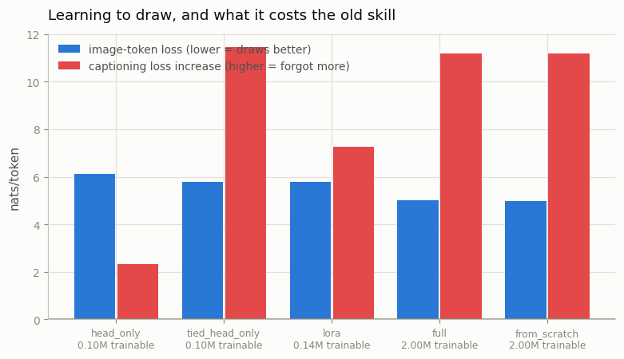
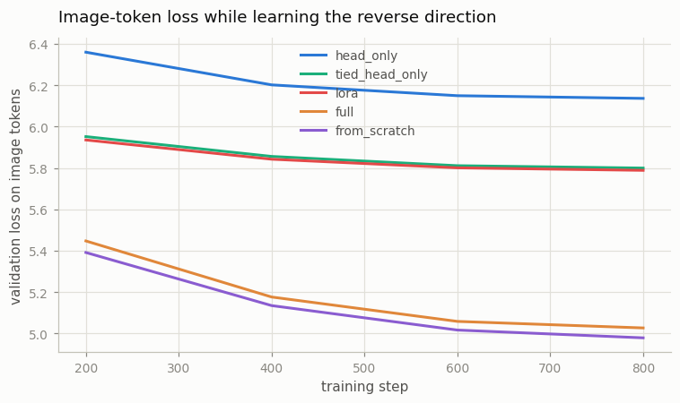
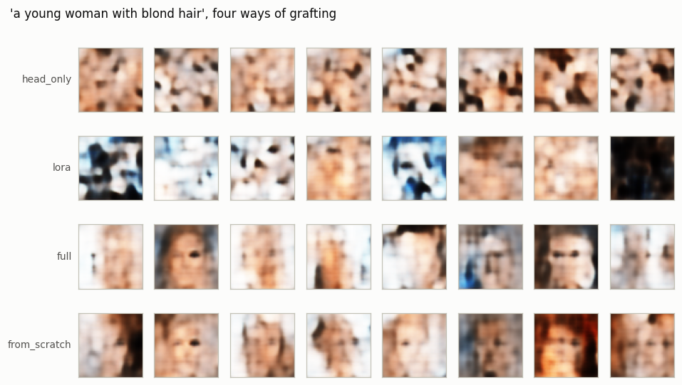

# Reverse Direction

## Key Insight

A standard [VLM](/shared/glossary/#vlm) only runs one way — pixels in, text out — because its output layer can emit text tokens and nothing else. Adding an image-token [output head](/shared/glossary/#output-head) (a second prediction layer that emits [discrete image tokens](/shared/glossary/#token-visualaudio) drawn from a [VQ-VAE](/shared/glossary/#vq-vae) [codebook](/shared/glossary/#codebook)) lets the same model predict picture codes as easily as words, which a decoder then turns back into pixels — converting an understanding-only model into one that can generate images too. This is the cheapest path toward [any-to-any](/shared/glossary/#any-to-any-model): instead of retraining a [native multimodal](/shared/glossary/#native-multimodal) model from scratch, you graft an output head onto a model that already "speaks image" on the input side and teach it to speak image on the output side as well.

**That is the promise. This project measures it, and the promise does not survive.**

## The starting point is deliberately one-way

We train a small VLM exactly the way [LLaVA](/shared/glossary/#llava) is trained: image tokens go **in** as context, and the loss is applied **only** to the caption that comes out.

```
row:     <bos> <boi> 391 12 508 ... 77 <eoi> a smiling young woman with blond hair <eos>
loss on:                                     ^^^^^^^^^^^^^^^^^^^^^^^^^^^^^^^^^^^^^^^^^^
                    \___ read, never predicted ___/        \____ predicted ____/
```

Masking the image positions out of the loss is not a technicality — it is the definition of an understanding-only model, and it is what every bolt-on VLM does. After 1,000 steps the model captions well (**0.335** nats per word).

Then we ask what it thinks about the image tokens it was never asked to predict:

| | nats per image token |
|---|---|
| base VLM's image-token loss | **12.760** |
| guessing uniformly among 512 codes | 6.238 |

**The VLM is more than twice as bad as random at the thing it supposedly already "speaks".** That number is the whole motivation for this project, so it is worth understanding exactly.

> **Why is it *worse* than chance rather than merely untrained?** Our backbone uses [weight tying](/shared/glossary/#weight-tying): the output head *is* the input embedding table, so the model can compute a score for every image code from day one. But during VLM training, every single target was a text token, which means every gradient those 512 columns ever received was a *negative* one — pushing them down so the [softmax](/shared/glossary/#softmax) would not waste probability on codes that never appear as answers. A thousand steps of "never predict these" produces a model that actively avoids them. Untrained would be chance; trained-to-suppress is worse than chance. **"The model already has image codes in its vocabulary" is true and completely misleading.**

## Five ways to add the second direction

Every arm trains on the reverse rows (`<bos> caption <boi> 64 codes <eoi> <eos>`) with the loss now on the **image** positions, for the same 800 steps.

| arm | what may move | why you would try it |
|---|---|---|
| `head_only` | a new `Linear(192, 512)` over image codes | the cheapest possible graft — 98k parameters |
| `tied_head_only` | the existing tied embedding/output matrix, no new head | "the codes are already in the vocabulary, just train them" |
| `lora` | new head + rank-8 [LoRA](/shared/glossary/#lora) on every attention projection | let the body move a little without moving far |
| `full` | everything | the usual "just fine-tune it" |
| `from_scratch` | everything, from random init | **the control** — did the VLM pretraining help at all? |

Each is scored twice: how well it draws (image-token loss), and how much captioning it destroyed ([catastrophic forgetting](/shared/glossary/#catastrophic-forgetting)).

> **Why is `from_scratch` the arm that decides the project?** Because "we grafted a head on and it learned to draw" is not a result — a randomly initialised model of the same size would also learn to draw. The claim being tested is that starting from an *understanding* model gives you generation more cheaply. Only a same-size, same-budget, random-init run can falsify that, and without it every grafted arm looks like a success.

> **Why does `lora` exist as a separate arm from `full`?** ["Low-rank adaptation"](/shared/glossary/#lora) is literal: instead of changing a weight matrix `W`, you freeze it and learn a correction `B @ A`, where `A` is r×in and `B` is out×r with r = 8. Because the product of a thin and a wide matrix can have rank at most 8, the correction is a narrow nudge rather than a free rewrite. The hypothesis is that a narrow nudge can teach a new skill without disturbing the old one. This project checks that hypothesis rather than assuming it.

## Results



| arm | trainable | image-token loss ↓ | captioning after | forgetting |
|---|---|---|---|---|
| base VLM (before any grafting) | — | 12.760 | 0.335 | — |
| `head_only` | 98k | 6.136 | 2.676 | +2.341 |
| `tied_head_only` | 104k | 5.799 | 11.780 | **+11.445** |
| `lora` | 135k | 5.788 | 7.588 | +7.253 |
| `full` | 1.996M | 5.026 | 11.514 | +11.179 |
| **`from_scratch`** | 1.996M | **4.979** | 11.518 | +11.184 |
| *chance* | | *6.238* | | |



### 1. The control wins. The VLM pretraining was worth nothing.

`from_scratch` (**4.979**) beat every arm that started from the trained VLM, including full fine-tuning (5.026). A model that had never seen a face, a caption or an image token did *better* at learning to draw than one that had spent 1,000 steps learning what faces are about.

**So the headline claim of this project's Key Insight is false at this scale.** Grafting is not a cheap path to generation, because there was nothing to be cheap *about*: the understanding model's internals carried no head start for the generation task. The gap is small (0.047 nats) and could plausibly reverse with more data or a bigger model — but it is certainly not the free lunch the framing promises.

Why would understanding not transfer to generation? Because they need different information. Captioning needs to know *that* a face is blond; drawing needs to know *which of 512 codes* goes in cell (3, 5) given the 22 codes before it. The base VLM was trained to compress an image down to the handful of facts a nine-word caption needs, and to discard everything else — which is precisely the everything-else that drawing requires. This is the same observation [Janus](/shared/glossary/#janus) is built on: DeepSeek decoupled the visual encoders for understanding and generation because one representation serves both badly.

### 2. Freezing the body does *not* protect the old skill

`head_only` froze every backbone parameter. Captioning still got worse — 0.335 → 2.676.

**How can a frozen model forget?** Because the two heads share one [softmax](/shared/glossary/#softmax). The final probability of the word "smiling" is its score divided by the sum over *all 541 vocabulary entries*, and 512 of those entries now come from a freshly trained head that is happily assigning them large scores. Raising the image codes' scores lowers every word's probability at every position, including positions where a word is the right answer. Nothing in the body changed; the denominator did.

This is a genuinely non-obvious trap. "Freeze the backbone so it cannot forget" is standard advice, and here it bought only a *smaller* amount of forgetting, not none.

### 3. The tied head learns slightly more and forgets catastrophically

`tied_head_only` reached 5.799 against `head_only`'s 6.136 — better drawing, since it starts from embeddings that already encode what each code looks like. But its captioning collapsed to **11.780 (+11.445)**, effectively total destruction.

The mechanism follows directly from [weight tying](/shared/glossary/#weight-tying): the matrix being trained to emit image codes is the *same matrix* used to embed the words. Every gradient step aimed at "make code 391 more likely here" also moves the vector that represents the word "smiling" on input. The two roles cannot be separated, so the new skill is learned on top of the old one's representation, in the destructive sense.

**This is why the extra head exists**, and the reason is not the one you would guess. It is not that a fresh head learns image codes better — it barely does. It is that a fresh head is the only version of this operation that leaves the input embeddings alone.

### 4. LoRA reduced forgetting without preventing it

`lora` sits in the middle on both axes: 5.788 image loss (essentially tied with `tied_head_only`) and +7.253 forgetting (well below full fine-tuning's +11.179, well above `head_only`'s +2.341). A rank-8 correction is narrow enough to slow the damage and wide enough for the damage to happen anyway.

**Nothing here is Pareto-optimal.** Draw the two columns against each other and there is no arm that both draws well and remembers: the arms that learned to draw (`full`, `from_scratch`, 5.0) all lost captioning entirely, and the arm that kept captioning (`head_only`, +2.3) never got below chance-ish drawing. On this budget, drawing and captioning are in direct competition for the same 1.9M parameters.

### 5. What the pictures look like



The referee from project [33](../33-tiny-chameleon/README.md) — a CNN trained on real faces, never on generated ones — grades whether flipping one word in the prompt changes the picture. Ceiling is the same referee's swing on real faces.

| arm | "…blond hair" vs "…black hair" | obeyed | "a young man" vs "a young woman" | obeyed |
|---|---|---|---|---|
| `head_only` | +0.059 | 9% | +0.031 | 4% |
| `lora` | +0.087 | 14% | +0.015 | 2% |
| `full` | +0.288 | 46% | +0.059 | 8% |
| `from_scratch` | **+0.303** | **48%** | −0.005 | −1% |
| *real faces (ceiling)* | *+0.626* | *100%* | *+0.746* | *100%* |

The picture and the numbers agree: the top two rows are texture noise, the bottom two are faces with the requested hair colour. And once again `from_scratch` matches or beats every grafted arm.

Note that **hair colour is obeyed 48% and sex barely at all**, the same ordering project [33](../33-tiny-chameleon/README.md) found. That is a property of project [32](../32-discrete-image-tokens/README.md)'s 64-token alphabet — colour survives quantization, fine facial structure does not — and it shows up identically no matter how the generation head was attached. **The tokenizer's blind spot is not something the transformer can train its way out of.**

## What this means for the real designs

The result is not that any-to-any models cannot work — it is that *bolting generation onto a finished understanding model* is not the cheap route it appears to be. That matches what the frontier actually does:

- [Chameleon](/shared/glossary/#chameleon) trains both directions **from the start** with image tokens as targets throughout, rather than grafting later. Project [33](../33-tiny-chameleon/README.md)'s unified model, trained that way, reached 4.747 nats on image tokens — better than any arm here, though at 1,500 steps against this project's 800, so treat it as suggestive rather than a matched comparison.
- [Janus](/shared/glossary/#janus) keeps **separate visual encoders** for understanding and generation, on the explicit grounds that one representation serves both badly.
- [Transfusion](/shared/glossary/#transfusion) sidesteps the discrete bottleneck for the generation half entirely, keeping image patches continuous under a [diffusion](/shared/glossary/#diffusion-model) loss while text stays autoregressive.

All three are reactions to the same wall this project ran into.

## What's in this directory

| file | what it is |
|---|---|
| `graft.py` | the surgery: `Grafted` (a trained backbone plus a second output head, spliced into one logit row) and `inject_lora` (rank-8 adapters on the attention projections) |
| `run.py` | the stages `base` / `graft` / `gen` / `plot` |
| `outputs/base.json` | the understanding-only VLM, including its 12.760-nats image loss |
| `outputs/graft.json` | the five arms: image loss, captioning after, forgetting, trainable parameters |
| `outputs/gen.json` | the referee's paired-prompt swings and the real-face ceilings |
| `outputs/*.png` | every figure on this page |

`checkpoints/` (six models, ~8 MB each) is gitignored; the stages rebuild them.

## How to run

Projects [32](../32-discrete-image-tokens/README.md) (`--stage train`) and [33](../33-tiny-chameleon/README.md) (`--stage data`, `--stage probe`) must have run first — this project uses 32's tokenizer and 33's referee.

```bash
python3 run.py --stage base   # the understanding-only VLM, ~4 min
python3 run.py --stage graft  # all five arms, ~12 min
python3 run.py --stage gen    # samples + the referee, ~4 min
python3 run.py --stage plot   # figures
```

## Takeaways

1. **A caption-only VLM scores 12.760 nats on image tokens against a 6.238 chance level.** [Weight tying](/shared/glossary/#weight-tying) means the codes are in its vocabulary; a thousand steps of never predicting them means it has learned to *avoid* them. "It already speaks image" is the most misleading true statement in this phase.
2. **The random-init control won (4.979 vs 5.026).** Understanding pretraining transferred nothing to generation at this scale. Grafting is not the cheap path it is advertised as — run the from-scratch control before you believe otherwise.
3. **Freezing the backbone did not prevent forgetting (+2.341).** Two heads share one softmax, so raising image-code scores lowers every word's probability. Frozen weights do not imply a frozen output distribution.
4. **The tied head draws marginally better and destroys captioning (+11.445).** Training the matrix that emits image codes also rewrites the word embeddings. That — not learning capacity — is the real argument for a separate [output head](/shared/glossary/#output-head).
5. **No arm was Pareto-optimal.** Everything that learned to draw forgot how to caption; the one thing that remembered never learned to draw. On a fixed small budget the two skills compete directly.
6. **Prompt obedience was set by the tokenizer, not the graft.** Hair colour 48%, sex ~0%, in every arm — the same ordering project 33 found with a completely different training recipe.
