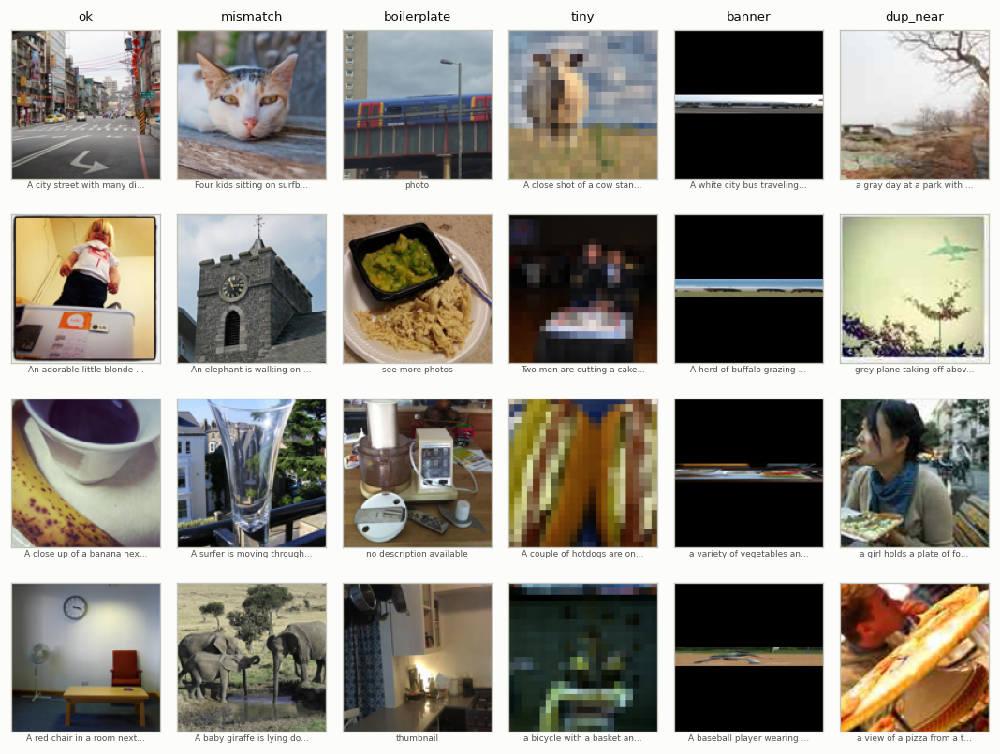
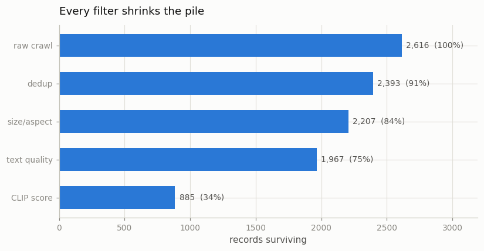
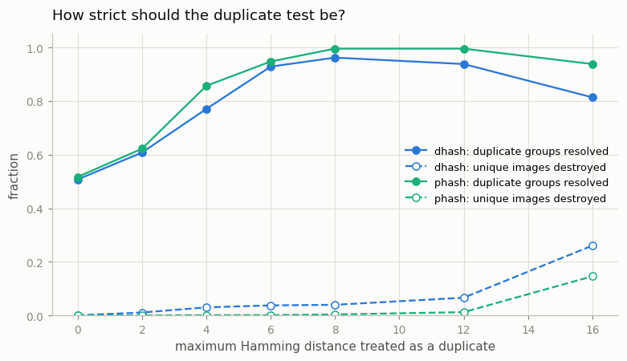
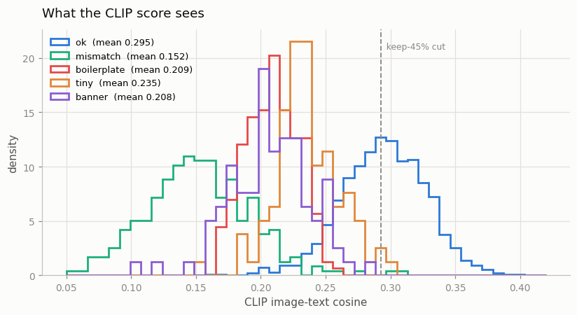
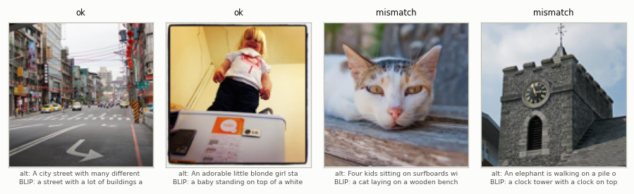

# Mini LAION Pipeline

## Key Insight

For a multimodal model the data matters more than the architecture, and raw web data like [LAION](/shared/glossary/#laion) is mostly unusable straight out of the crawl — full of duplicates, [alt-text](/shared/glossary/#alt-text) that has nothing to do with the picture, and tiny or broken images. A practical pipeline chains cheap filters in a fixed order so each one shrinks the work for the next: drop repeated images ([deduplication](/shared/glossary/#deduplication)), keep only image–caption pairs that a [CLIP](/shared/glossary/#clip) model scores as a good match (the *CLIP-score* filter — the [Phase 3 data-filtering trick](../14-data-filtering-with-clip/README.md) reused at web scale), then rewrite the weak captions into rich descriptions with a [VLM](/shared/glossary/#vlm) ([synthetic captions](/shared/glossary/#synthetic-captions)), and finally pack the survivors into streaming [WebDataset](/shared/glossary/#webdataset) shards. The lesson you feel by building it: you throw away 80–90% of a web crawl, and the clean 10–20% that remains trains a far better model than the whole noisy pile ever could.

**This is project 37.** It builds that pipeline end to end and — because we broke the data ourselves — grades every filter against the truth.

## Why we build a crawl instead of downloading one

LAION-2B is two billion rows. Even a "small" honest sample is hundreds of gigabytes, and a large share of the URLs are dead. So this project does the next best thing: it takes **2,400 real photographs with real human captions** (MS-COCO) and then *injects*, on purpose, the exact failure modes that make a real crawl unusable.

That is not a shortcut. It is the reason the project can say anything precise at all.

> **"Isn't inventing the noise cheating? Real junk is surely different."** Partly yes, and the [caveats section](#what-this-setup-cannot-tell-you) says where. But the alternative is worse. On a real crawl you have no ground truth: when your filter drops a row you cannot tell whether it removed junk or destroyed a good pair, so every claim collapses to "the numbers looked reasonable". Because *we* chose which rows to break, every filter gets a real [precision and recall](/shared/glossary/#precision-and-recall), and a badly chosen threshold becomes a visible number instead of a hunch. The defect *types* are copied from published audits of web alt-text; only their exact rate is ours.

### The eight kinds of record

| kind | count | what it is |
|---|---|---|
| `ok` | 1,680 | a genuine photo with a genuine human caption |
| `mismatch` | 288 | fluent caption, **wrong picture** (swapped with another row) |
| `boilerplate` | 192 | `IMG_4821.JPG`, `stock photo`, `click here to enlarge`, `-` |
| `dup_exact` | 108 | the same image crawled a second time, byte-identical |
| `dup_near` | 108 | the same image re-saved as JPEG quality 35 and re-cropped 3 px |
| `tiny` | 96 | a 24×24 thumbnail passed off as a photo |
| `banner` | 96 | a 960×120 website strip, not a photograph |
| `blocked` | 48 | a caption containing a safety-blocklist keyword |
| **total** | **2,616** | **64.2% genuine** |



> **"The `blocked` rows are stand-ins with invented words like `nsfwplaceholder`. Why not use the real thing?"** Because a keyword list is not how safety filtering actually works, and pretending otherwise would teach the wrong lesson. Real pipelines run a *trained* NSFW image classifier on the pixels and — non-negotiably — match every image against a database of hashes of known illegal material (CSAM detection). Those need models and hash databases a tutorial cannot ship. What this project *can* demonstrate honestly is the structural point: the safety check is a cheap test that runs **before** anything expensive, it must never be sampled or approximated, and — see below — the CLIP filter would not have caught these rows at all.

## The pipeline

```
2,616 crawled records
        │
        ▼  perceptual-hash deduplication          −223
        ▼  resolution and aspect-ratio rules      −186
        ▼  alt-text quality + safety blocklist    −240
        ▼  CLIP-score filter (keep the top 45%) −1,082
        │
   885 records  →  recaption with BLIP  →  WebDataset shards
```



**33.8% of the crawl survives, and it is 96.0% genuine — up from 64.2%.**

The ordering is not decoration. It is *cheapest test first*, and the reason is in the timings below.

---

## Filter 1: deduplication, and why a file hash is not enough

The obvious first idea is to hash the image bytes and drop repeats. We measured it:

| method | duplicate groups resolved | unique images destroyed | time |
|---|---|---|---|
| exact byte hash | **102 / 209** | 0 | 0.04 s |
| [dHash](/shared/glossary/#perceptual-hash), ≤8 bits | 201 / 209 | **87** | 0.29 s |
| [pHash](/shared/glossary/#perceptual-hash), ≤8 bits | **208 / 209** | **8** | 0.45 s |

The byte hash catches every `dup_exact` and **not one** `dup_near`. Re-saving a JPEG at a different quality changes every byte while changing nothing you can see, so exactly half of our duplicates walk straight past it. That is the whole reason [perceptual hashing](/shared/glossary/#perceptual-hash) exists.

> **"A hash is a hash. Why does a *perceptual* one need a different name?"** Because it is built to do the opposite of a normal hash. SHA-256 is designed so that changing one byte scrambles the entire output — which is what makes it good at proving two files are identical and useless at noticing two files *look* identical. A perceptual hash shrinks the picture to a tiny grey thumbnail and records a pattern of comparisons, so a re-compression flips two or three bits out of sixty-four instead of all of them. "Nearly the same picture" then becomes a small integer — the [Hamming distance](/shared/glossary/#hamming-distance), named after Richard Hamming, who defined "how many positions differ" in 1950 while designing the first error-correcting codes — and you get a tunable dial where the byte hash offers only yes or no.

### dHash versus pHash: the same idea, one much better

Both produce 64 bits. They differ in *what* they compare.

- **dHash** (difference hash) shrinks the image to 9×8 grey pixels and records, for each row, whether each pixel is brighter than the one to its right.
- **pHash** (perceptual hash) shrinks to 32×32, runs a [DCT](/shared/glossary/#dct) — a rewriting of the image as a sum of cosine waves, smoothest wave first — keeps the top-left 8×8 corner (the broad shapes, discarding fine texture) and records which coefficients are above their own median.



At every threshold pHash finds more duplicates while wrecking an order of magnitude fewer innocent images. At a tolerance of 8 bits it resolves **208 of 209** duplicate groups and destroys **8 of 2,191** unique photos (0.4%); dHash at the same tolerance resolves 201 and destroys **87** (4.0%). The cause is exactly the design difference: neighbouring-pixel comparisons flip whenever compression smooths an edge, while the low-frequency DCT corner barely moves.

> **Why the counts are per *group*, not per record.** A duplicate group is one photo plus its copies, and the filter's job is to leave exactly one of them standing. It does not matter *which* one survives. If we scored each record against its own label we would mark the filter wrong every time it happened to keep the copy and drop the original — punishing it for something that is not a mistake. Scoring per group also exposes the two failures that do matter: a group that still has two members (a duplicate got through) and a group with zero members (the photo is gone entirely).

### Not comparing 3.4 million pairs

Checking every record against every other is 2,616 × 2,615 / 2 = **3,420,420** comparisons. We did **117,858** — 29× fewer — using [locality-sensitive hashing](/shared/glossary/#locality-sensitive-hashing): cut each 64-bit hash into eight 8-bit chunks, index each chunk separately, and only compare records that share a whole chunk. Two hashes within 8 bits of each other almost always agree on at least one of the eight chunks, so the cheap bucket test throws away almost nothing. At a billion images this is the difference between possible and impossible.

**How far the copies drifted:** a byte-identical copy sits 0 bits away; a JPEG-35 re-encode plus a 3-pixel re-crop sits **3.7 bits** away on average. That number is why the threshold has to be greater than zero, and why it cannot be large.

---

## Filter 2: resolution and aspect ratio

Two rules, both about training *value* rather than correctness: drop anything whose short side is under 64 px, and anything more than 3:1 in either direction.

**Precision 0.96, recall 1.00** — it found every `tiny` and every `banner`, and the four rows it took by mistake were genuine photos that happened to be very wide. This filter costs 0.04 **milliseconds** for the whole crawl, because it reads two integers per record and never touches a pixel.

---

## Filter 3: alt-text quality and the blocklist

Pure string rules: reject a caption that matches a filename pattern (`IMG_1234.jpg`), a site template (`click here to enlarge`), has fewer than four alphabetic words, or is under 70% letters and spaces. Reject outright anything containing a blocklist word.

**Precision 0.95, recall 1.00**, in 0.03 s. Of the 240 rows it dropped, 48 were flagged by the blocklist, 181 by the filename and template patterns, and 11 as too short. The 12 false positives are genuine captions of four words or fewer -- the price of the length rule.

---

## Filter 4: the CLIP score

Now the expensive one. A frozen [CLIP](/shared/glossary/#clip) ViT-B/32 encodes each image and each caption, and we take the [cosine similarity](/shared/glossary/#cosine-similarity) between them — the [CLIP score](/shared/glossary/#clip-score). Genuine pairs score high; a caption describing a different picture scores low.



| record kind | mean CLIP score |
|---|---|
| `ok` | **0.295** |
| `blocked` | **0.292** |
| `dup_exact` | 0.265 |
| `dup_near` | 0.252 |
| `tiny` | 0.235 |
| `boilerplate` | 0.209 |
| `banner` | 0.208 |
| `mismatch` | **0.152** |

Genuine versus swapped separates at **[AUC](/shared/glossary/#auc) 0.992** — the same number Phase 3's project [14](../14-data-filtering-with-clip/README.md) measured, reproduced here on a different sample and a different kind of corruption.

**Two rows of that table matter more than the headline.**

1. **`blocked` scores 0.292, indistinguishable from a genuine pair (0.295).** Those rows are a perfect caption with one forbidden word appended, and CLIP simply does not care. Had we run the safety check *after* the CLIP filter to save time, every one of them would have survived. Safety filtering is not a quality filter and cannot be folded into one.
2. **`tiny` and `banner` score 0.235 and 0.208 — low, but not decisively low.** CLIP *would* eventually drop most of them, at 3 seconds per hundred records. The size rule does it in microseconds and with higher accuracy. Whenever a cheap deterministic rule and an expensive learned one target the same defect, the cheap one wins and runs first.

### Choosing the cut-off is a real decision, and LAION's number is not yours

| keep the top… | broken pairs caught | genuine pairs kept | purity of the result |
|---|---|---|---|
| 90% | 67.9% | 99.9% | 0.901 |
| **70%** | **99.3%** | **82.4%** | 0.955 |
| 55% | 99.6% | 65.0% | 0.958 |
| **45%** (used above) | 99.6% | **53.3%** | 0.960 |
| 30% | 100% | 35.8% | 0.969 |
| 10% | 100% | 11.9% | 0.964 |

Read the 70% and 45% rows next to each other. Tightening from 70% to 45% catches **one extra broken pair** and throws away **29% of the genuine ones** — 465 good photos for one piece of junk. Purity barely moves (0.955 → 0.960) because there is almost nothing left to remove.

LAION-2B-en kept pairs above a raw cosine of 0.28, which on this crawl keeps 68% of the genuine pairs. The reason our 45% rule looks so wasteful is that **our crawl is far cleaner than the real web**: 64% genuine, against a real crawl's few percent. The threshold is a statement about *your* pile, not a universal constant — copying LAION's number onto a cleaner corpus silently deletes half your data. Project [38](../38-caption-ablation/README.md) trains models on both cut-offs and settles which one is actually better.

> **"Filtering by CLIP score, then training a CLIP-like model on what survives — isn't that circular?"** It is worth worrying about, and the effect is real but bounded. The filter is a *frozen, already-trained* CLIP with 400 million pairs of experience; the student is a small model with a few thousand. So the filter is not grading its own homework — it is a stronger teacher deciding which examples are worth showing, which is closer to [distillation](/shared/glossary/#distillation) than to self-reference. The bounded part: the filter can only pass on pairs *it* recognises, so anything the teacher is blind to (negation, counting, fine text in the image) never reaches the student. That inherited blind spot is a known limitation of CLIP-score curation, not something this pipeline fixes.

---

## Why the order of the filters is worth money

CLIP costs **30.9 ms per record**. The three cheap filters together cost **0.6 s for the whole crawl**.

| order | records reaching CLIP | total time |
|---|---|---|
| CLIP first, then the cheap rules | 2,616 | 81.3 s |
| cheap rules first, then CLIP | 1,967 | 61.5 s |

**1.32× faster, for an identical output.** The saving is exactly the 649 records the cheap rules removed before CLIP ever loaded them.

That factor looks modest because our crawl is unusually clean. The same arithmetic on a real crawl, where the cheap rules remove 60–70% of rows, gives a 2.5–3× saving on the most expensive stage of a job that runs for weeks — and the effect compounds at the *next* stage, which is more expensive still.

---

## Recaptioning: the expensive stage goes last

Every surviving image is re-described by **BLIP-base** (224M parameters), a real pretrained captioning VLM. Nothing about it is trained here.



> **"CLIP already understands images and text. Why bring in a second model just to write captions?"** Because CLIP cannot write. It is a *matcher*: give it an image and a piece of text and it returns one number saying how well they agree. There is no way to run that backwards into a sentence — its text side is an encoder that compresses a whole caption into one vector, with no word-by-word output head at all. BLIP is a *generator*: it has a decoder that emits one word at a time conditioned on the picture. The two do different jobs at different points of the pipeline. CLIP answers "is this caption right for this image?" (a filter). BLIP answers "what *is* this image?" (a rewrite). You need both, because a filter can only delete, and deleting cannot fix an image whose caption was never any good in the first place.

### Recaptioning is a *repair*, not an upgrade

Measured on all 1,967 records that passed the three cheap filters — the honest population, before CLIP had a say — with the same frozen CLIP scoring both versions of the caption:

| records | alt-text score | BLIP score |
|---|---|---|
| all 1,967 | 0.273 | **0.288** |
| the 1,596 `ok` rows (caption was already right) | **0.295** | 0.289 |
| the 271 `mismatch` rows (caption was wrong) | 0.151 | **0.289** |

BLIP writes a **0.289** caption no matter what it is handed. Where the alt-text was junk that is a near-doubling; where the alt-text was a human describing the photo it is a small step *down*. Overall BLIP wins on 51.3% of individual images — a coin flip — and the average improves only because the losses are tiny and the wins are enormous.

Two things follow, and both are easy to get wrong:

1. **"Recaptioning improves your data" is a claim about your *baseline*, not about recaptioning.** DALL-E 3's captioner was much stronger than the alt-text it replaced. Our BLIP-base is not stronger than a paid MS-COCO annotator, so on the clean half it loses. Recaptioning raises the floor and lowers the ceiling — which is a fine trade when most of your corpus is floor, and a bad one when it is not. Project [38](../38-caption-ablation/README.md) trains models on both and on a 50/50 blend to find out which effect wins.
2. **Recaptions are more uniform than what they replace.** They are 2.3 words shorter on average (8.3 versus 10.6) and only 93.7% of them are distinct, against 99.4% for the alt-text. A generator trained on its own family of sentences learns that family; the diversity you lose is invisible in any per-image score.

> **A measurement trap worth naming.** If you score the same comparison on the **885 CLIP-selected survivors** instead, alt-text wins easily: **0.319 versus 0.298**, with BLIP ahead on only 24.6% of images. That looks like strong evidence against recaptioning and it is worth exactly nothing — those 885 records were *selected because their alt-text scores high on this very metric*. Testing a replacement caption against a set chosen for having good captions is [selection bias](/shared/glossary/#selection-bias) in its purest form. Always evaluate a repair step on the population it would actually be applied to.


**Why it goes last is the earlier argument, one order of magnitude louder.** Recaptioning costs **0.54 s per image** — roughly **17× a CLIP score**. Running it before the CLIP filter would mean captioning all 1,967 cheap-filter survivors instead of 885: about 10 extra minutes here, and on a real pipeline the difference between a week and a month. You caption what you are going to keep.

---

## The output: WebDataset shards

The survivors are written as `.tar` files, which is what every large-scale image-text loader actually reads.

```
mini-laion-00000.tar
├── 000042.jpg     the image
├── 000042.txt     the caption used for training (the recaption)
├── 000042.json    provenance: original alt-text, declared size
├── 000117.jpg
...
```

> **"Why a tar file? Millions of loose files would be simpler."** Because a filesystem hates millions of small files. Opening each one is a separate seek — on network storage, a separate request — so the loader spends its life waiting instead of training. A [shard](/shared/glossary/#webdataset) is read front to back as one long stream, so a single seek delivers thousands of examples, and shards split across machines trivially: machine 3 takes shards 30–39 and never coordinates with anyone. The grouping rule is just the filename stem — everything named `000042.*` is one sample — so adding a new field later means adding a new extension, not rewriting the format.

`outputs/shard_preview.tar` holds the first 24 samples so you can look inside without rebuilding anything.

---

## What this setup cannot tell you {#what-this-setup-cannot-tell-you}

- **Our junk is synthetic.** Real alt-text fails in messier ways — keyword spam, mixed languages, text that is *partly* right. Our `mismatch` rows are fluent captions of a completely different photo, which is close to the worst case and therefore the *easiest* case for a CLIP filter. Expect lower recall on real data.
- **Our crawl is 64% genuine; a real one is a few percent.** Every "how much survives" number here is optimistic, and — as shown above — that moves the right threshold.
- **We never tested the safety filters properly**, because we cannot. The blocklist demo shows *where* the check belongs in the pipeline, not how to build one.
- **Recaptioning MS-COCO photos with BLIP is a friendly case.** BLIP was trained on COCO, so it knows this domain unusually well. Project [38](../38-caption-ablation/README.md) discusses what that inflates.
- **Single run, one seed.** The filter precisions are counts over thousands of records and are stable; the timings vary by a few percent between runs.

## Files

| file | what it holds |
|---|---|
| `pipeline_lib.py` | the crawl builder, both perceptual hashes, LSH dedup, the size/text rules, the CLIP scorer and the BLIP recaptioner. **Project 38 imports this file.** |
| `run.py` | the stages `crawl` / `filter` / `recaption` / `shard` / `plot` |
| `outputs/crawl.json` | the composition of the dirty crawl |
| `outputs/filter.json` | every funnel step, both hash sweeps, the CLIP tables and the ordering timings |
| `outputs/recaption.json` | what BLIP changed, measured |
| `outputs/shards.json` | shard sizes |
| `outputs/shard_preview.tar` | 24 samples in real WebDataset layout |
| `outputs/*.png` | the five figures above |

`data/` (2,400 photos, the crawl, the CLIP scores, the shards; ~250 MB) is gitignored and rebuilt by `--stage crawl`.

## How to run

```bash
python3 run.py --stage crawl      # download 2,400 photos, inject the defects  (~4 min once)
python3 run.py --stage filter     # the four filters + every measurement       (~4 min)
python3 run.py --stage recaption  # BLIP rewrites the survivors' captions      (~7 min)
python3 run.py --stage shard      # write WebDataset .tar shards               (~10 s)
python3 run.py --stage plot       # the figures                                (~20 s)
```

## Takeaways

1. **A byte hash misses half your duplicates.** It resolved 102 of 209 duplicate groups; a [perceptual hash](/shared/glossary/#perceptual-hash) resolved 208. Re-saving a JPEG changes every byte and nothing visible.
2. **Which perceptual hash you pick matters more than the threshold.** At the same tolerance pHash destroyed 8 unique photos and dHash destroyed 87 — a 10× difference, because low-frequency DCT coefficients survive compression and neighbouring-pixel comparisons do not.
3. **Cheap deterministic rules beat the neural filter on the defects they both target.** The size rule caught every `tiny` and `banner` in 0.04 ms at precision 0.96; CLIP would have taken 81 s and been less certain.
4. **The CLIP filter cannot see safety violations at all** (0.292 versus 0.295 for genuine pairs). A filter chain is a set of *different* detectors, not one detector applied harder.
5. **Copying someone else's threshold can cost you half your data.** Tightening from keep-70% to keep-45% bought one extra broken pair and cost 465 genuine ones, because our crawl was already cleaner than the web.
6. **Ordering is free money.** Cheap-first made this run 1.32× faster and saves 10 minutes of captioning; on a real crawl, where the cheap rules cut 60–70% of rows, it is the difference between an affordable job and an unaffordable one.
7. **Filtering can only delete; recaptioning can repair.** That is why serious pipelines do both, and why the repair step runs last, on the smallest possible pile.
