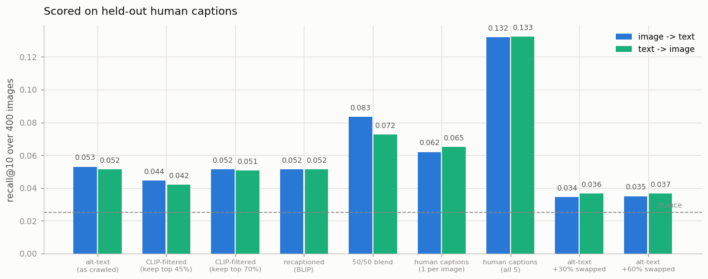
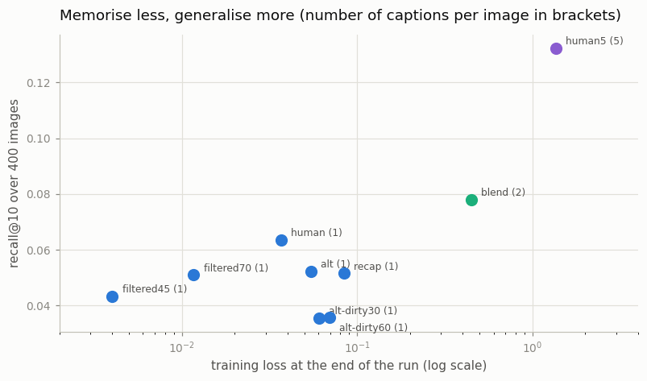
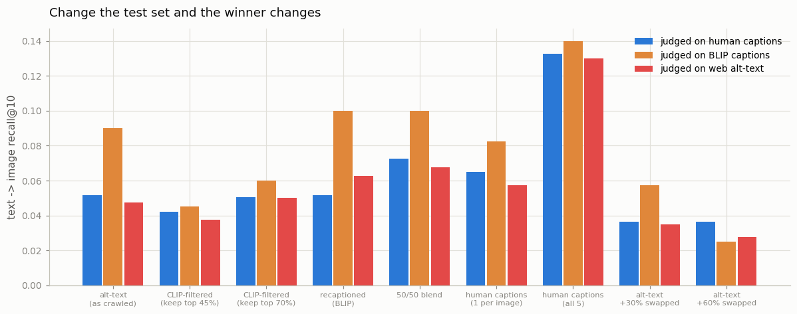

# Caption Ablation

## Key Insight

An [ablation](/shared/glossary/#ablation) isolates the effect of one variable by changing only that variable and holding everything else fixed; here the variable is the *captions*. You train two otherwise-identical small [VLMs](/shared/glossary/#vlm) — one on the original web [alt-text](/shared/glossary/#alt-text), one on [synthetic captions](/shared/glossary/#synthetic-captions) rewritten by a stronger model — over the same images, then compare their [downstream](/shared/glossary/#downstream) scores. The gap is reliably large and in the same direction: detailed, accurate captions teach the model which words map to which pixels, so the recaptioned model wins by a wide margin even though it saw the exact same pictures. This is the cleanest way to *feel* the central claim of training at scale — that in multimodal learning, caption quality, not model size, is usually the dominant lever.

**This is project 38.** It runs that ablation with eight arms instead of two — and the winner is not the one the claim predicts, for a reason worth more than the claim.

## The setup

The images come from project [37](../37-mini-laion-pipeline/README.md): **1,967 photos** that survived its three cheap filters (deduplication, size, alt-text quality) but *not* the CLIP-score filter, so the pile still contains 271 records whose caption belongs to a different picture. 1,567 are used for training and 400 are held out as the retrieval gallery.

Every arm trains the **same** 1.5M-parameter tiny CLIP from Phase 3's project [10](../10-tiny-clip/README.md) for the **same** 1,500 steps at the **same** batch size, with the **same** shared word vocabulary built over all three caption sources. Only the text moves.

> **"Why build one vocabulary across all the caption sources instead of one per arm?"** Because a per-arm vocabulary would be a *second* thing that changed between the runs. If the recaptioned model won, you could not tell whether richer captions helped or whether its vocabulary happened to be better sized. One shared word list keeps the caption text as the only moving part — which is the whole definition of an ablation.

Every arm is scored on the **same held-out human captions**, never on the captions it trained with, and the score is averaged over all five human captions per gallery image (five independent gallery draws for the price of one training run, which roughly halves the noise on recall@10).

> **"The recaptioned arm trains on BLIP's sentences. Isn't testing it on human sentences unfair to it?"** It is the only fair option, and testing on BLIP's sentences is what would be unfair — see [the last section](#change-the-test-set-and-the-winner-changes), where we measure exactly how much that choice moves the ranking. The rule of thumb: **evaluate in the distribution you actually care about.** Nobody ships a model to retrieve BLIP captions.

## The eight arms

| arm | captions per image | what it is |
|---|---|---|
| `alt` | 1 | the web alt-text exactly as project 37 crawled it |
| `filtered45` | 1 | only the pairs whose CLIP score is in the top 45% (705 images) |
| `filtered70` | 1 | the same rule, looser cut-off (1,097 images) |
| `recap` | 1 | BLIP's description of every image |
| `blend` | 2 | alt-text **and** recaption, one drawn at random each time |
| `human` | 1 | the original MS-COCO human caption |
| `human5` | 5 | **all five** human captions, one drawn at random each time |
| `alt-dirty30` / `alt-dirty60` | 1 | alt-text with a further 30% / 60% swapped between images |

> **"`human` and `alt` come from the same MS-COCO annotators. How do they differ at all?"** Only on the rows project 37 broke. For the 1,596 genuine records the alt-text *is* the human caption, so `human` differs from `alt` on exactly the 271 mismatched rows — which makes the gap between them a direct price tag on that noise: *this is what repairing 13.8% of your captions is worth.*

> **Why the `alt-dirty` arms exist.** MS-COCO alt-text is written by paid annotators looking at the photo. Real web alt-text is nothing like that, and a recaptioner cannot show what it is for until the text it replaces is genuinely broken. These two arms swap a further 30% and 60% of the captions between images, the way Phase 3's project [14](../14-data-filtering-with-clip/README.md) did, to put the same experiment on a realistically dirty crawl.

## Results

Recall@10 over the 400-image gallery, averaged over the five human captions. Chance is **0.025**.

| arm | captions per image | training images | image → text | text → image | mean | training loss at the end |
|---|---|---|---|---|---|---|
| `alt` | 1 | 1,567 | 0.053 | 0.052 | 0.052 | 0.055 |
| `filtered45` | 1 | 705 | 0.044 | 0.042 | **0.043** | 0.004 |
| `filtered70` | 1 | 1,097 | 0.052 | 0.051 | 0.051 | 0.012 |
| `recap` | 1 | 1,567 | 0.052 | 0.052 | 0.052 | 0.084 |
| `human` | 1 | 1,567 | 0.062 | 0.065 | 0.064 | 0.037 |
| `blend` | 2 | 1,567 | 0.083 | 0.072 | **0.078** | 0.447 |
| `human5` | 5 | 1,567 | 0.132 | 0.133 | **0.132** | 1.354 |
| `alt-dirty30` | 1 | 1,567 | 0.034 | 0.036 | 0.035 | 0.060 |
| `alt-dirty60` | 1 | 1,567 | 0.035 | 0.037 | 0.036 | 0.070 |



### 1. On this pool, recaptioning changed nothing at all

`recap` 0.052 versus `alt` 0.052. Not a small win — **no win**, on the same images with the same budget.

That is a direct contradiction of the claim this project set out to demonstrate, and the explanation is in project 37's measurement: BLIP writes a caption worth about 0.289 CLIP score no matter what it is handed, while 81% of this pool already carries a **human** caption worth 0.295. We are not replacing junk with gold; we are replacing an annotator with a 224M-parameter model that is slightly worse than the annotator. The claim "synthetic captions beat the original" quietly assumes the original is web alt-text — see arm 3 below, where it is.

`human` reaches 0.064, so **repairing the 13.8% genuinely broken captions is worth +0.012** (roughly +23%). That is the entire headroom that filtering or recaptioning could possibly have recovered on this pool, and it is small because the pool is mostly clean.

### 2. Filtering never helped, and filtering hard hurt

`filtered70` 0.051 and `filtered45` **0.043**, against `alt` 0.052 — both at or below the do-nothing baseline.

Project 37 showed the keep-45% rule catches 99.6% of the broken pairs. It also throws away 47% of the good ones, and the last column of the table shows what that costs: `filtered45`'s training loss ends at **0.004**, meaning it has memorised its 705 images essentially perfectly. Removing noise and removing data are the same action, and at this scale the second effect dominates. Phase 3's project [14](../14-data-filtering-with-clip/README.md) found the same inverted U from the other side — there, filtering *did* help, because the corpus it filtered was 60% broken instead of 14%.

**The rule that transfers: the right filter strength is a function of how dirty your data is, not a constant.** LAION keeps ~30% because a raw crawl is a few percent usable. Applying that number to a corpus that is already 81% clean is how you delete half your dataset for nothing.

### 3. The precondition: when the alt-text really is bad, recaptioning wins big

The two `alt-dirty` arms swap a further 30% and 60% of the captions between images. Now compare them against `recap`, which is unaffected by that corruption — BLIP looks at the picture, so it writes the same caption either way:

| corpus | training on its alt-text | training on BLIP's recaptions |
|---|---|---|
| as crawled (14% broken) | 0.052 | 0.052 (**tie**) |
| +30% swapped (39% broken) | 0.035 | 0.052 (**+46%**) |
| +60% swapped (63% broken) | 0.036 | 0.052 (**+43%**) |

That is the claim from the guide, reproduced — *once its precondition holds*. Recaptioning is not an upgrade you apply to good data; it is a **repair you apply to bad data**, and the size of the win is the size of the damage.

A second, unplanned finding sits in that table: **0.035 and 0.036 are the same number.** Going from 39% broken to 63% broken cost nothing more, because 30% noise had already pushed the model to within a whisker of chance (0.025). Caption noise does not degrade a model gracefully — it has a cliff, and past the cliff extra noise is free.

### 4. The result that dwarfs all of the above: captions *per image*



Sort the arms by how many different sentences each image comes with:

| captions per image | best arm | mean R@10 |
|---|---|---|
| 1 | `human` | 0.064 |
| 2 | `blend` | 0.078 |
| 5 | `human5` | **0.132** |

`human5` uses the *same source* as `human` — the same MS-COCO annotators, the same images, the same everything — and reaches **2.1× the retrieval score** simply because each image is described five different ways instead of one. That is more than twice the effect of every other intervention in this project combined.

The training-loss column explains it. With one caption per image, 1,500 steps over 1,567 images is 122 passes through the data, and the model does the obvious thing: it memorises. Training loss ends at 0.004–0.084 (chance for this loss is `ln(128) = 4.85`), and a model that has memorised a caption is not learning what its words *mean*. Two captions per image push the final loss to 0.447; five push it to 1.354, and the recall follows in lock-step.

> **"So does a higher training loss simply mean a better model?"** No, and the `alt-dirty` arms are the proof — they sit at training loss 0.060–0.070, *above* `human`'s 0.037, and score the worst of everything. What matters is **why** the loss is high. Genuine caption variety keeps it high because there is more real signal to fit; wrong captions keep it high because there is nothing to fit at all. The training loss is a symptom of memorisation, not the thing you want to maximise.

This reframes the recaptioning story in a way worth carrying: **DALL-E 3 did not replace its captions, it mixed 95% synthetic with 5% original.** Read alongside these numbers, part of what recaptioning buys at scale may simply be *a second description of every image* — the same lever `blend` and `human5` pull here — rather than the recaption being better than what it replaced.

### 5. Change the test set and the winner changes {#change-the-test-set-and-the-winner-changes}



Every arm re-scored against a gallery captioned by **BLIP** instead of by humans (text → image recall@10):

| arm | judged on human captions | judged on BLIP captions |
|---|---|---|
| `alt` | 0.052 | 0.090 |
| `recap` | 0.052 | **0.100** |
| `blend` | 0.072 | 0.100 |
| `human` | 0.065 | 0.083 |
| `alt-dirty60` | 0.037 | 0.025 |

On the BLIP gallery, `recap` beats `alt` by 11% and ties the blend for first place — a modest but real "home-field advantage", and every arm scores higher, because BLIP's sentences are more templated (only 87% of them are distinct, against 89% for the alt-text) and templated text is easier to retrieve.

The lesson is not that the second column is wrong; it is that **it answers a different question.** "Which model retrieves machine captions best" and "which model retrieves human captions best" are two benchmarks, and a paper that recaptions its training data *and* its evaluation data is measuring the first while claiming the second. Pick the distribution you actually care about before you look at any numbers.

## What this setup cannot tell you

- **Small absolute numbers.** The best arm reaches R@10 0.132 against a chance of 0.025 — that is 5× chance, but it is a 1.5M-parameter model trained on 1,567 images for four minutes. The *ordering* is what this project measures; nothing here is a claim about how good a real CLIP is.
- **One seed per arm.** The gaps that carry the argument (0.052 → 0.132, or 0.052 → 0.035) are 2–4×, far beyond the noise of a 400-image gallery averaged over five caption draws. The near-ties (`alt` 0.052 versus `recap` 0.052, `alt-dirty30` versus `alt-dirty60`) are exactly that — ties, not measured equalities.
- **One recaptioner.** BLIP-base is 224M parameters and was trained on COCO. A stronger captioner would write better and more varied sentences, and both of those would move the `recap` arm. The finding is not "recaptioning does not work" — it is "recaptioning works exactly as much as the recaptioner is better than what it replaces".
- **The `filtered` arms see fewer unique images at the same step count**, so their disadvantage mixes "less data" with "more repetition". That mixture is not a flaw in the experiment — it is the actual trade a practitioner faces when tightening a threshold at a fixed compute budget — but it means the filtering result is about *filtering at a fixed budget*, not about filtering in the abstract.

## Files

| file | what it holds |
|---|---|
| `run.py` | the stages `data` / `train` / `plot`; imports project 37's `pipeline_lib.py` for the pool and the recaptioner, and project 10's `tiny_clip.py` for the model |
| `outputs/data.json` | the pool's composition and caption statistics |
| `outputs/results.json` | every arm's full recall numbers on all three galleries |
| `outputs/table.json` | the summary table above |
| `outputs/*.png` | the three figures |

`data/vocab.json` (the shared word list) is gitignored and rebuilt by `--stage data`. The images, the crawl and the recaptions all live in project 37's `data/`.

## How to run

Project [37](../37-mini-laion-pipeline/README.md) must have run its `crawl` and `filter` stages first.

```bash
python3 run.py --stage data                    # recaption whatever 37 has not, ~10 min once
python3 run.py --stage train --arm alt         # one arm, ~3 min each
python3 run.py --stage train                   # or all nine, ~25 min
python3 run.py --stage plot
```

## Takeaways

1. **Recaptioning bought nothing on a mostly-human-captioned pool** (0.052 versus 0.052) and **+46% on a deliberately dirtied one** (0.052 versus 0.035). The size of the win is the size of the damage being repaired; "synthetic captions are better" is a claim about your *baseline*.
2. **The biggest lever was not caption quality but captions per image**: same annotators, five sentences instead of one, 2.1× the recall. Every arm with one caption per image memorised its data (training loss 0.004–0.084); the diverse arms could not.
3. **A high training loss is a symptom, not a goal.** The `alt-dirty` arms also failed to memorise, and scored worst of all — variety keeps the loss high because there is more to learn, noise keeps it high because there is nothing to learn.
4. **CLIP-score filtering never beat doing nothing here**, and the aggressive setting lost 17%. Removing noise and removing data are the same action; which one dominates depends on how dirty the pile is.
5. **Caption noise has a cliff.** 30% swapped captions and 60% swapped captions produced the same score, both near chance.
6. **The evaluation captions decide the ranking.** Judged on BLIP's own sentences, `recap` moves from a tie to first place and every arm looks better. Choose the distribution you care about before you look.
