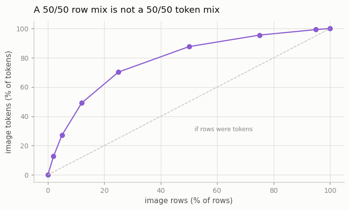
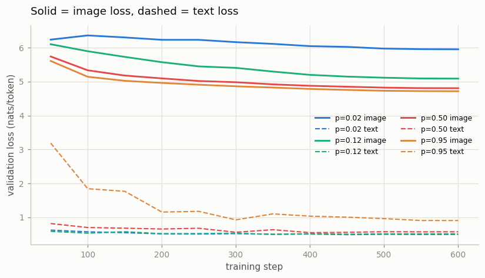
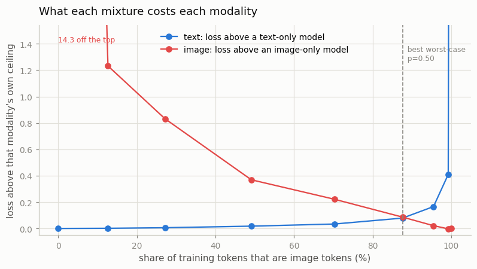
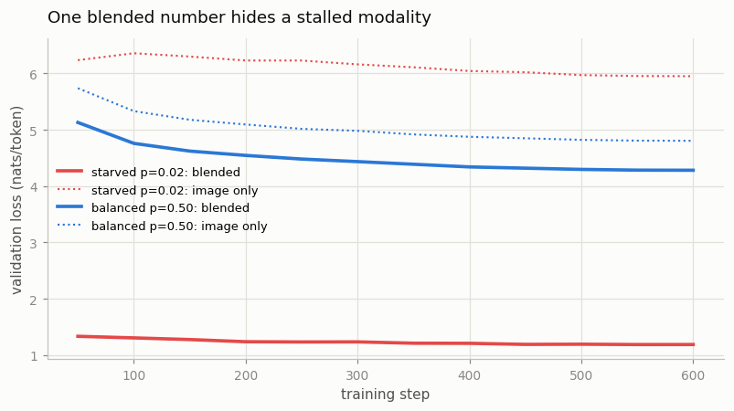
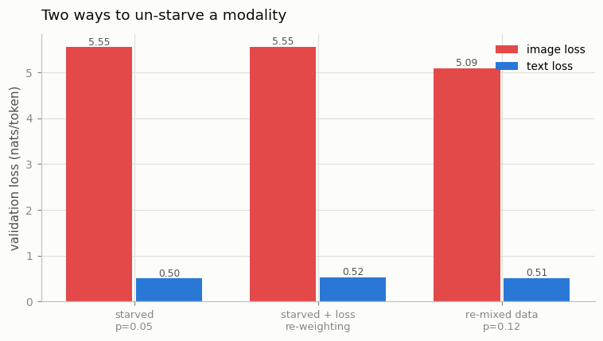

# Modality Ratio Sweep

## Key Insight

This project treats the *per-[modality](/shared/glossary/#modality) [loss](/shared/glossary/#loss-function) curve* as a measuring instrument: you deliberately turn one knob — the **sampling ratio**, how often each modality's examples show up in the data mix — and watch each modality's loss fall (or flat-line) on its own separate curve. Sweeping that knob from one extreme to the other lets you *see* the cause and effect directly: starve a modality and its curve stalls; feed it more and the curve drops. The diagnostic exposes a trap that an averaged loss hides — a single blended "multimodal loss" can look perfectly healthy while one modality the model is silently ignoring sits stuck near its starting value, because the modalities that *are* learning pull the average down and mask the one that isn't. Where the Phase 7 [Modality Balancing](../34-modality-balancing/README.md) project *applies* the remedy (oversampling the rare modality or up-weighting its loss), this one is the measurement that tells you whether the remedy is needed and by how much: [modality balancing](/shared/glossary/#modality-balancing) here is purely a data-pipeline knob — the sampling rate (or loss weight) you pick so every per-modality curve descends at a comparable pace.

**This is project 39.** Nine mixtures, one knob, two loss curves each — and the balanced point lands somewhere the standard rule of thumb does not predict.

## The setup: one knob, and the ends of the sweep are the answer key

The model is Phase 7's stack from project [33](../33-tiny-chameleon/README.md), unchanged: one small [transformer](/shared/glossary/#transformer), one [vocabulary](/shared/glossary/#vocabulary) covering words *and* [image codes](/shared/glossary/#token-visualaudio), one [next-token-prediction](/shared/glossary/#next-token-prediction) loss. The corpus is two kinds of row:

```
text row     <bos> a smiling young woman with blond hair <eos>       9.0 tokens on average
image row    <bos> <boi> 391 12 508 ... 77 <eoi> <eos>              64 image codes
```

and the knob is **`p`**, the probability that a row drawn into a training batch is an image row. Every arm trains a fresh 1.9M-parameter model for the same 600 steps at the same batch size, so compute is identical everywhere; only the mixture changes.

> **"Project 34 already starved a modality and watched it stall. What is left to do?"** Project 34 picked four mixtures and asked *does the textbook fix work?* This one turns the same knob continuously and asks *what is the right setting, and how would I know?* — which needs a curve, not four points. The two projects also differ in what they can conclude: 34's arms are not comparable to each other without a separate solo model per modality, whereas here **the two ends of the sweep are the solo models.** `p=0` is a text-only model and `p=1` is an image-only model, both trained with exactly the same architecture, steps and batch size as every mixture in between. That is what makes the middle readable — an image loss of 4.80 means nothing until you know an image-only model reaches 4.72.

> **"Why separate text-only and image-only rows instead of image-plus-caption pairs?"** Two reasons. First, it is what real unified corpora look like: [Chameleon](/shared/glossary/#chameleon)-style training mixes plain text documents with image documents as *separate rows*, and the sampling ratio is exactly the knob that decides how many of each land in a batch. Second, it makes the sweep symmetric — at `p=0` the image side is completely starved and at `p=1` the text side is, so both ends are informative. With paired rows every image drags a caption along, so text can never be starved and half the sweep would tell you nothing. The cost is that this model never learns to connect the two modalities; that is projects 33 and 36's subject, and it is deliberately out of scope here, because the question is about **gradient competition inside one shared trunk**, not about cross-modal grounding.

### A 50/50 row mix is nowhere near a 50/50 token mix



A caption is 9 tokens. An image is 64. So drawing half your *rows* from the image pool gives you **87.6% image tokens**:

| image rows (p) | 2% | 5% | 12% | 25% | 50% | 75% | 95% |
|---|---|---|---|---|---|---|---|
| **image tokens** | 12.6% | 27.2% | 49.1% | 70.3% | **87.6%** | 95.5% | 99.3% |

This is the first practical lesson, and it catches people constantly: **[gradient](/shared/glossary/#gradients) follows tokens, not rows.** A mixture recipe written as "10% images" is ambiguous until you say which unit it counts, and the two readings differ by a factor of seven here. Every result below is plotted against the *token* share for that reason.

## The sweep

Reference ceilings, from the two ends of the sweep: **text 0.496, image 4.718** [nats](/shared/glossary/#nat) per token. (A nat is the natural-log unit of surprise: a loss of 0.5 nats means the model was, on average, about as uncertain as picking between 1.6 equally likely tokens, since e^0.5 = 1.65.)

| p (rows) | image tokens | text loss | image loss | text gap | image gap |
|---|---|---|---|---|---|
| 0.00 | 0.0% | **0.496** | 18.986 | — | +14.268 |
| 0.02 | 12.6% | 0.497 | 5.951 | +0.001 | +1.233 |
| 0.05 | 27.2% | 0.501 | 5.550 | +0.006 | +0.832 |
| 0.12 | 49.1% | 0.513 | 5.087 | +0.017 | +0.369 |
| 0.25 | 70.3% | 0.529 | 4.940 | +0.034 | +0.222 |
| **0.50** | **87.6%** | 0.574 | 4.804 | **+0.079** | **+0.086** |
| 0.75 | 95.5% | 0.661 | 4.739 | +0.166 | +0.021 |
| 0.95 | 99.3% | 0.906 | 4.715 | +0.410 | −0.003 |
| 1.00 | 100% | 12.728 | **4.718** | +12.232 | — |

*(A gap is the loss above that modality's own ceiling. Positive = this mixture cost that modality something.)*





### 1. Starving a modality does not merely slow it — it inverts the model's behaviour

Look at the `p=0` row: the image loss is **18.99**, when guessing uniformly over the 541-symbol vocabulary would cost only `ln(541) = 6.29`. A model that had simply never learned images would sit at 6.29. Instead it is three times worse than chance.

That is not a bug; it is what next-token prediction *does*. Every training step tells the model "the next token is a word", never once "the next token is an image code", so the cheapest way to lower the loss is to drive the probability of all 512 image codes towards zero. The model does not ignore images — **it is actively trained to suppress them.** (Phase 7 project [36](../36-reverse-direction/README.md) hit exactly this wall when it tried to graft an image head onto a text-only VLM, and had to fight the same learned suppression.) The mirror image is `p=1`, where text costs 12.73.

The practical consequence: a modality at 0% is not "waiting to be fine-tuned in later"; it is in a hole it has to be dug out of.

### 2. The blended loss lies, and it lies in the flattering direction



This is the trap the Key Insight promises, and it is worse than "the average is uninformative". Watch two runs:

| | blended loss you would watch | image loss |
|---|---|---|
| starved, `p=0.02` | **1.19** | 5.95 |
| balanced, `p=0.50` | **4.28** | 4.80 |

The starved run's headline number is **3.6× lower**. If the only curve on your dashboard is the mixture-weighted loss, the starved run looks like a triumph and the balanced run looks broken — while the truth is the exact opposite on the modality you presumably added images for.

The mechanism is simple arithmetic, and worth spelling out: the blended loss is a weighted average whose *weights are the mixture itself*. At `p=0.02` images supply 12.6% of the tokens, so 87.4% of the blended number is text — the modality that is doing fine. The mixture you are trying to diagnose is the same thing that decides how loudly each modality speaks in the diagnostic. **Any single blended loss is structurally incapable of reporting a starved modality**, and the fix costs nothing: log one number per modality.

### 3. The balanced mixture is 88% image tokens — not 50%

The last column of the table crosses over between `p=0.25` and `p=0.75`. Taking "balanced" to mean *the smallest worst-case gap* (no modality left behind), the best mixture in the sweep is **`p=0.50` — text +0.079, image +0.086** — and that is an **87.6% image token share.**

The rule of thumb people reach for says the opposite. "Reweight by inverse token share" targets a 50/50 *token* mix, which here means `p=0.12` — and at `p=0.12` images are still **+0.369 nats** short of their ceiling while text has given up only 0.017. Following the heuristic would cost images 4.3× more than it saves text.

> **"Why does the fair split give images so many more tokens than text?"** Because the two modalities are not equally hard, and equal *exposure* is not equal *difficulty*. Our captions come from a 22-word vocabulary and only a few hundred distinct sentences, so text reaches its ceiling after a few thousand examples and then has nothing left to learn — its curve is flat by step 200 in every arm that shows it at all. Faces drawn from a 512-code alphabet at 64 codes each are far richer, and the image curve is still descending at step 600 in *every* arm. A token of text is simply worth less than a token of image here, so buying image tokens stays profitable long after text has stopped caring. The general principle: **balance gaps to each modality's own ceiling, not token counts**, because the ceiling is the only thing that knows how much a modality still has to gain.

## Does re-weighting the loss do what re-mixing the data does?

The standard toolbox has two knobs for a starved modality: change the data mixture (draw more image rows) or change the loss (multiply the starved modality's term). At `p=0.05` — image tokens 27.2%, image gap +0.832 — we tried both.



| arm | image loss | text loss |
|---|---|---|
| starved `p=0.05` | 5.550 | 0.501 |
| starved + inverse-share loss weights (image ×1.84, text ×0.69) | **5.551** | 0.519 |
| re-mixed data, `p=0.12` | **5.087** | 0.513 |

**Loss re-weighting changed the image loss by +0.001 — nothing at all — and made text slightly worse.** Re-mixing the data bought 0.463 nats.

This is not a mystery once you separate what the two knobs touch. Re-weighting scales the gradient contribution of image tokens *within the batches where images already appear*. At `p=0.05` the model saw roughly 960 image rows in the whole run against 11,400 text rows, and no multiplier creates an example that was never drawn — what the image side lacks is **data, not volume**. Re-mixing changes which rows are drawn, so the model actually sees more faces.

Project [34](../34-modality-balancing/README.md) stated this as a principle ("reweighting cannot manufacture examples"); this is the controlled test of it, with the two fixes run side by side at the same starting mixture and the same step budget. Re-weighting is the right tool for a different disease: a modality that is *present in every batch* but whose loss is drowned out — not one that is rarely drawn at all.

## What this setup cannot tell you

- **One seed per arm.** The differences that carry the argument (+0.832 versus +0.001, or the 3.6× blended-loss gap) are far larger than seed noise, but the small numbers — text +0.079 versus image +0.086 at `p=0.50` — are close enough that the exact location of the balance point is soft. The *shape* of the two curves is the result, not the crossing to three decimals.
- **Two modalities, one dataset, one budget.** The balance point being at 88% image tokens is a fact about *this* corpus (very easy text, harder images) at *this* step budget. A run with real web text would move it a long way. What transfers is the method: report gaps to per-modality ceilings, not raw losses and not token shares.
- **No cross-modal learning.** Text-only and image-only rows never appear together, so this model cannot caption or generate from a prompt. That is deliberate (see above) and it is projects [33](../33-tiny-chameleon/README.md) and [36](../36-reverse-direction/README.md)'s territory.
- **The ceilings are same-budget ceilings.** `p=0`'s text loss is what a text-only model reaches in 600 steps, not the best achievable. That is the right reference for this question — it holds compute fixed — but it is not "the best text model".

## Files

| file | what it holds |
|---|---|
| `run.py` | the stages `data` / `sweep` / `remedy` / `plot`; imports project 33's `unified.py` for the vocabulary, model and training loop |
| `outputs/data.json` | row counts, tokens per row, and the rows-versus-tokens arithmetic |
| `outputs/sweep.json` | every arm's full validation curve, per modality |
| `outputs/summary.json` | the gap table and the balanced ratio |
| `outputs/remedy.json` | the loss-reweighting comparison |
| `outputs/*.png` | the five figures above |

`data/rows.npz` (the padded rows, a few MB) is gitignored and rebuilt by `--stage data`.

## How to run

Projects [32](../32-discrete-image-tokens/README.md) (`--stage data` then `--stage train`) and [33](../33-tiny-chameleon/README.md) (`--stage data`) must have run first — this project reuses their [VQ-VAE](/shared/glossary/#vq-vae) tokenizer and its cached face codes.

```bash
python3 run.py --stage data     # build the text and image rows      (~10 s)
python3 run.py --stage sweep    # nine mixtures, 600 steps each      (~18 min)
python3 run.py --stage remedy   # the loss-reweighting comparison    (~2 min)
python3 run.py --stage plot     # figures + the gap table
```

`--stage sweep` remembers which ratios it has already run, so `--ratios 0.5,0.75` adds arms without repeating the rest.

## Takeaways

1. **Rows are not tokens.** A 50/50 row mix is an 87.6/12.4 token mix here. Gradient follows tokens, so always convert before reasoning about a mixture.
2. **A blended loss cannot report a starved modality**, because the mixture that starved it is the same weighting that hides it: the starved run's blended loss was 3.6× *better* than the balanced run's while its image loss was a nat worse. One number per modality costs nothing and is the entire diagnostic.
3. **A modality at 0% is not neutral, it is suppressed.** Its loss went to 18.99 against a chance level of 6.29, because every step trained the model to make image codes unlikely.
4. **Balance gaps to per-modality ceilings, not token counts.** The best worst-case mixture put 87.6% of tokens on images; the inverse-token-share heuristic would have chosen 50% and left images +0.369 nats short to save text 0.017.
5. **Loss re-weighting did nothing here (+0.001) while re-mixing the data bought 0.463 nats.** Weighting rescales gradient inside batches a modality already appears in; it cannot conjure examples it was never shown. Diagnose which of the two you actually have before reaching for a knob.
6. **The cheapest reference model is the end of your own sweep.** `p=0` and `p=1` cost one run each and turn every number in between from unreadable into a gap.
