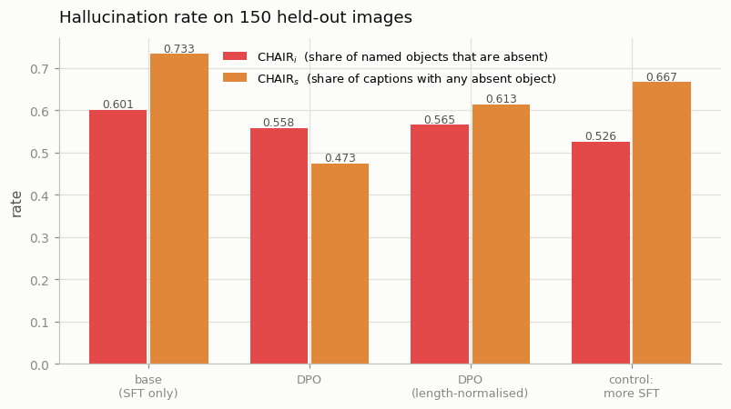
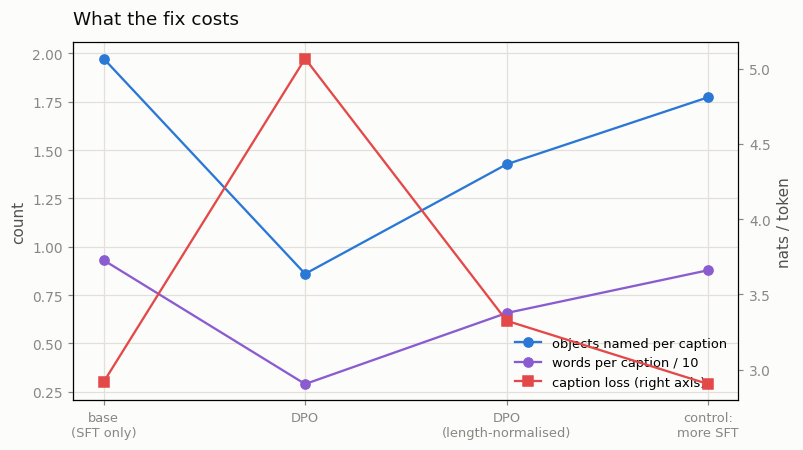
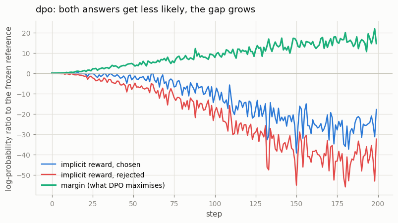

# Multimodal DPO

## Key Insight

[DPO (Direct Preference Optimization)](/shared/glossary/#dpo) teaches a model to prefer better answers by training directly on pairs of (chosen, rejected) responses, with no separate [reward model](/shared/glossary/#reward-model) and no [reinforcement-learning loop](/shared/glossary/#rlhf) to babysit — which is exactly what makes it cheap enough to run on a small project. The multimodal twist is *where the preference pairs come from*: each pair is two [VLM](/shared/glossary/#vlm) answers to the same image-and-question, and a common reason one answer is "rejected" is [hallucination](/shared/glossary/#hallucination) — confidently describing an object that isn't actually in the picture. Collecting even a few hundred such image-grounded preference pairs and [fine-tuning](/shared/glossary/#fine-tuning) with DPO measurably cuts that hallucination, showing that alignment for multimodal models is less about new algorithms than about preference data anchored to what the image really contains.

**This is project 40.** It builds the preference data, runs DPO on a real VLM, and puts a control next to it that most write-ups leave out.

## The model, and why it is Phase 5's

The system under test is project [20](../20-llava-from-scratch/README.md)'s [LLaVA](/shared/glossary/#llava)-in-miniature, unchanged:

```
frozen CLIP ViT-B/32  →  49 image tokens  →  trainable projector  →  SmolLM2-135M
```

with the **top four of SmolLM2's thirty blocks unfrozen** — 14.9M trainable parameters out of 135M. First we teach it to caption (350 supervised steps, loss 3.43 → 2.81), then we try to stop it inventing objects.

> **"The [projector](/shared/glossary/#projector) is what connects the image to the language model. Why unfreeze parts of the LLM as well — isn't the projector the thing that should learn?"** The projector decides *what the model is looking at*; the top LLM blocks decide *what it says about it*. Hallucination is a speaking habit, not a seeing failure: the model writes "a man riding a horse on the beach" because that sentence is fluent and common, not because it saw a beach. Nothing the projector can do to 49 image vectors will make the language model less willing to complete a plausible sentence — that willingness lives in the layers that choose words. Project [21](../21-visual-instruction-tuning/README.md) measured the same split from the other side: freezing the LLM left its VLM unable to learn the *answer format*, no matter how good the image tokens were. So the projector is necessary and not sufficient, and preference training needs both halves to have somewhere to move.

The two halves are trained at very different rates — the projector at 3e-4, the LLM blocks at 3% of that. A single shared rate either leaves the freshly-initialised projector barely trained or drags the pretrained language model off its footing.

## The preference data

Real preference pipelines (RLHF-V, HA-DPO) generate candidate answers with the model, then have a human or a stronger model mark which one hallucinated. We cannot afford either, so the rejected half is *scripted*: take a true human caption and glue on one object that is **not** in the picture.

```
chosen    "A man riding a horse on a beach."
rejected  "A man riding a horse on a beach next to a dog."
                                            ^^^^^^^^^^^^ the only difference
```

2,600 pairs, one per training image, drawing the absent object from a 64-concept vocabulary.

> **"Why make the pair so similar? Wouldn't a really bad rejected answer teach more?"** The opposite — it would teach *less*, and possibly the wrong thing. DPO learns from the **difference** between the two answers, so whatever else differs is something it can latch onto instead of the behaviour you wanted. If the rejected answer were also longer, clumsier, and about another subject, the model could satisfy the objective by learning "prefer short fluent text about the right subject" and never learn anything about the picture. Making the pair a *minimal pair* — one inserted phrase, nothing else — is what forces the gradient onto the one behaviour we care about. (Phase 7 project [33](../33-tiny-chameleon/README.md) learned this the hard way: two prompts that differed in four attributes gave an uninterpretable, sign-flipped result.)

The scripted rejections buy control and cost realism: real hallucinations follow the model's own biases (it invents *surfboards near water*), while ours are uniformly sampled, so this is an easier target than the real thing. The [caveats](#what-this-setup-cannot-tell-you) say what that means for the numbers.

**One consequence of the construction is worth flagging now: the rejected caption is on average 3.5 words longer than the chosen one** (13.9 versus 10.4). Keep that number in mind.

## The DPO objective, unpacked

```
reward(answer)  =  log π(answer)  −  log π_ref(answer)
loss            = −log sigmoid( β · [ reward(chosen) − reward(rejected) ] )
```

> **"The model already knows how likely each answer is. Why bring in a second, frozen copy of the same model?"** Because "make the good answer more likely" has a trivial and useless solution: make *everything* less likely, as long as the bad answer falls faster. Probabilities are a fixed budget spread over all possible sentences, so a model can win at that game while getting worse at everything. The frozen [reference model](/shared/glossary/#reference-model) is an unchanging yardstick: what DPO maximises is not the chosen answer's probability but how much *more* the trained model likes it **than the reference did**. Drifting far from the reference costs you, which keeps the model recognisably itself. That log ratio is also where the name [implicit reward](/shared/glossary/#implicit-reward) comes from — there is no reward model anywhere in this project, and the ratio between the two copies plays its part.

Because the reference never trains, its numbers never change, so we compute all of them once before the run and reuse them. That turns four forward passes per step into two.

`β` (beta) is the leash length: small β lets the model wander far from the reference, large β keeps it close. We use 0.1, the standard value.

## The arms

| arm | what it is |
|---|---|
| `base` | the captioner straight out of supervised fine-tuning |
| `dpo` | 200 DPO steps on the pairs above |
| `dpo-lennorm` | the same, but each log-probability is divided by its token count |
| `sft-chosen` | **the control**: 200 more supervised steps on the *chosen* captions only, same optimiser, same learning rate, same images, same number of scored captions |

> **"Why is `sft-chosen` the control, and not just 'no training'?"** Because `base` alone cannot separate two very different explanations of any improvement. DPO shows the model 800 correct captions *and* 800 wrong ones. If simply seeing 800 more correct captions produces the same effect, then the rejected half — the entire reason to build preference data — bought nothing, and you should keep doing ordinary supervised training, which is simpler and half the compute. A `base`-versus-`dpo` comparison cannot tell those apart; this one can.

> **Why `dpo-lennorm` exists.** DPO adds up log-probabilities across a whole answer, and every extra token can only subtract (a probability is below 1, so its log is negative). Longer answers therefore score lower *automatically*, regardless of quality — the well-known [length bias](/shared/glossary/#length-bias). Our rejected captions are 3.5 words longer **by construction**, so plain DPO can lower the loss simply by learning "prefer shorter", without ever noticing the inserted object. Dividing each log-probability by its token count removes that shortcut; it is the ingredient [SimPO](/shared/glossary/#simpo) isolates. Running both arms turns a suspicion into a measurement.

## How hallucination is measured

**[CHAIR](/shared/glossary/#chair)** — *Caption Hallucination Assessment with Image Relevance* (Rohrbach et al., 2018). Generate a caption for each of 150 held-out images, list the objects it names, and check each against what the five human captions say is there:

- **CHAIR_i** — of all objects *named*, the share that are absent (an "instance" rate)
- **CHAIR_s** — of all *captions*, the share containing at least one absent object (a "sentence" rate)

CHAIR_i is the honest headline. A model that names one object per caption and gets it wrong half the time and a model that names ten and gets one wrong look identical on CHAIR_s and completely different on CHAIR_i.

> **A rate has a denominator, and this one can be gamed.** A model that says "a photo" and stops has CHAIR_i = 0 and is useless. So CHAIR is only readable next to **how many objects each caption names** and **how long it is** — both reported below, and both are the reason the results section spends as much space on the cost as on the win.

## Results

150 held-out images, one greedy caption each.

| arm | CHAIR_i | CHAIR_s | objects named per caption | words per caption | caption loss |
|---|---|---|---|---|---|
| `base` | 0.601 | 0.733 | 1.97 | 9.3 | 2.917 |
| `dpo` | 0.558 | **0.473** | 0.86 | **2.9** | **5.066** |
| `dpo-lennorm` | 0.565 | 0.613 | 1.43 | 6.6 | 3.324 |
| `sft-chosen` (control) | **0.526** | 0.667 | 1.77 | 8.8 | **2.904** |



### 1. DPO worked — and the control worked better

Preference training moved CHAIR_i from 0.601 to 0.558, a 7% relative drop. Then the control moved it to **0.526**, a 12% drop, using the *same* number of steps, the *same* optimiser and only the chosen half of every pair.

The whole point of building preference data is the rejected half. Here it not only failed to help, it actively cost: `sft-chosen` beat `dpo` on hallucination *and* kept its captions three times longer *and* ended with a slightly better caption loss than the base model. If you had run only `base` versus `dpo` — which is what most write-ups show — you would have concluded that preference training fixed hallucination.

### 2. What DPO actually learned: stop talking



Look at the two columns the headline metric does not include:

```
base         "A man is sitting on a bench with a plate of food."       9.3 words
dpo          "a skateboard"   "A refrigerator"   "a store"             2.9 words
dpo-lennorm  "a person wearing a helmet and wearing sunglasses."       6.6 words
sft-chosen   "A man is standing in front of a snowboard."             8.8 words
```

The `dpo` arm's captions collapsed to **2.9 words**, it names **0.86 objects per caption** against the base's 1.97, only 35% of its captions are distinct (the base manages 66%), and its held-out caption loss nearly doubled (2.917 → 5.066). Its impressive-looking CHAIR_s of 0.473 is mostly arithmetic: a three-word caption has almost nothing in it to be wrong about.

**A model that says nothing cannot hallucinate.** This is why CHAIR must never be read on its own, and it is a real failure mode, not an artefact of our toy: [reward hacking](/shared/glossary/#reward-hacking) in preference training usually looks like the model finding the cheapest behaviour that satisfies the objective, rather than the behaviour you meant.

### 3. Why it happened, and the fix that half-works

Our rejected captions are longer than the chosen ones by construction (13.9 words versus 10.4). Plain DPO sums log-probabilities over the whole answer, so a shorter answer scores higher for free — and "get shorter" is a much easier policy to learn than "check whether the object is in the picture". The model took the easy route.

`dpo-lennorm` divides each log-probability by its token count, removing exactly that shortcut, and the numbers move the way the diagnosis predicts: **6.6 words instead of 2.9, 1.43 objects per caption instead of 0.86, caption loss 3.324 instead of 5.066 — at essentially the same CHAIR_i (0.565 versus 0.558).** So length normalisation bought back most of the fluency for free. It still did not beat the plain supervised control.

The two arms' training curves show the same thing from the inside:



| | `dpo` | `dpo-lennorm` |
|---|---|---|
| preference accuracy | 1.00 by step 25 | 1.00 by step 50 |
| final implicit reward, chosen | **−17.9** | −0.01 |
| final implicit reward, rejected | −32.4 | −0.62 |
| final margin | +14.6 | +0.61 |

> **"The chosen answer's reward went *negative*. Isn't DPO supposed to make the good answer more likely?"** This is the single most-reported surprise about DPO in practice, and the objective explains it exactly. What DPO maximises is the *difference* between the two implicit rewards, not either one. Pushing the rejected answer down drags the chosen answer down with it, because the two share almost every token — remember they are a minimal pair. As long as the chosen falls more slowly, the loss keeps improving. So a healthy DPO run routinely ends with the preferred answer *less* likely than the reference model thought it was, and only the gap is guaranteed to grow. Watch both curves, not the loss.

### 4. Is 200 steps just too few?

No — the opposite. Preference accuracy hit **1.00 by step 25**, meaning the model already ranked every training pair correctly; there was no headroom left in the objective. Everything after that was the model spending capacity to widen a margin it had already won, which is precisely how it ended up at three-word captions. More steps would make the collapse worse, not better.

### 5. What this says about the recipe (and what it does not)

The honest reading is not "DPO does not work" — it is **"scripted rejections teach the shortcut, not the skill."** Our rejected half was built by a rule: take a true caption, glue on a uniformly-random absent object with one of six fixed templates. A model can satisfy that preference by learning "never emit that template" or "stop early", and neither requires looking at the image. Real pipelines (RLHF-V, HA-DPO) sample the rejected half from the **model's own mistakes**, which are exactly the errors it is currently inclined to make and cannot be dodged with a length policy. That difference is the ingredient this project could not afford, and the measurement above is the price of leaving it out.

Project [41](../41-hallucination-eval/README.md) tests these same two checkpoints on a completely different question format (yes/no probes it was never trained on), which is the strongest available check on whether anything generalised.

## What this setup cannot tell you

- **CHAIR's denominator is strict.** An object counts as present only if one of the five human captions names it, so a caption mentioning a real but un-annotated object is scored as a hallucination. That inflates every CHAIR_i here — the base model's 0.601 is not "60% of what it says is invented" in absolute terms. The *comparison between arms* is unaffected, because all four are graded by the same rule.
- **One seed, 150 images, one budget.** The CHAIR_i spread across arms (0.526–0.601) is not large relative to a 150-caption sample. The results that carry weight are the ones with a mechanism attached and a huge effect size: 2.9 versus 9.3 words, caption loss 5.07 versus 2.92.
- **The base model is small and its captions are generic.** A 135M language model with 14.9M trained parameters writes COCO-shaped sentences; its hallucinations are the "sitting on a bench" kind, not subtle factual errors.
- **Scripted rejections, discussed above**, are the main threat to the DPO conclusion.
- **Wall-clock numbers in `outputs/train_dpo.json` are unreliable** — the machine slept mid-run, so `seconds` there is inflated by about 24,000. The per-step timing from the clean part of the run is ~2 s.

## Files

| file | what it holds |
|---|---|
| `dpo_lib.py` | the object vocabulary, the CHAIR meter, the preference-pair builder, `sequence_logp` (with gradients), the DPO loss with the length-normalisation switch, and the VLM builder. **Project 41 imports this file.** |
| `run.py` | the stages `data` / `sft` / `train` / `eval` / `plot` |
| `outputs/data.json` | the preference-pair statistics |
| `outputs/pair_examples.json` | eight (chosen, rejected) pairs |
| `outputs/sft.json` | the base captioner's training curve |
| `outputs/train_*.json` | each arm's full history, including both implicit rewards |
| `outputs/eval.json` | CHAIR and the cost columns, plus example captions per arm |
| `outputs/*.png` | the four figures |

`data/pairs.json` and `checkpoints/` are gitignored; the checkpoints hold only the trained weights (the projector plus the top four LLM blocks).

## How to run

Project [20](../20-llava-from-scratch/README.md)'s `--stage data` must have run first (it builds the shared frozen-CLIP cache).

```bash
python3 run.py --stage data                 # build the preference pairs      (~1 min)
python3 run.py --stage sft                  # the base captioner              (~7 min)
python3 run.py --stage train --arm dpo      # one preference arm              (~8 min each)
python3 run.py --stage eval                 # captions + CHAIR for every arm  (~8 min)
python3 run.py --stage plot
```

## Takeaways

1. **Always run the "chosen-only" control.** More supervised training on just the good captions cut hallucination *more* than DPO (CHAIR_i 0.526 versus 0.558) at the same cost. Without that arm, `base` versus `dpo` reads as a clean win for preference training.
2. **A hallucination rate is meaningless without the length and object count beside it.** DPO's best-looking number (CHAIR_s 0.473) came from captions that shrank to 2.9 words and named 0.86 objects — a model that stopped talking, not one that started looking.
3. **Summed log-probabilities are biased toward short answers**, and if your rejected examples are longer by construction, "get shorter" is the cheapest way to win. Dividing by token count ([SimPO](/shared/glossary/#simpo)'s ingredient) recovered most of the fluency at the same hallucination rate.
4. **A healthy DPO run makes the chosen answer *less* likely too** (implicit reward −17.9). Only the *margin* is guaranteed to grow, because the pair shares almost all of its tokens. Log both curves.
5. **Preference accuracy saturated at step 25.** Past that point the objective had nothing left to teach and the extra steps only bought degeneracy — a reason to watch that number as an early-stopping signal.
6. **The rejected half has to come from the model's own errors.** A scripted corruption can be dodged by a policy that never looks at the image, and ours was.
