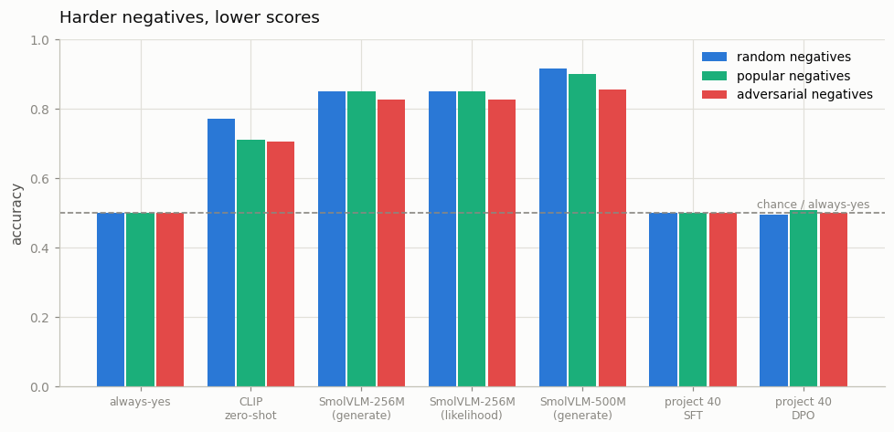
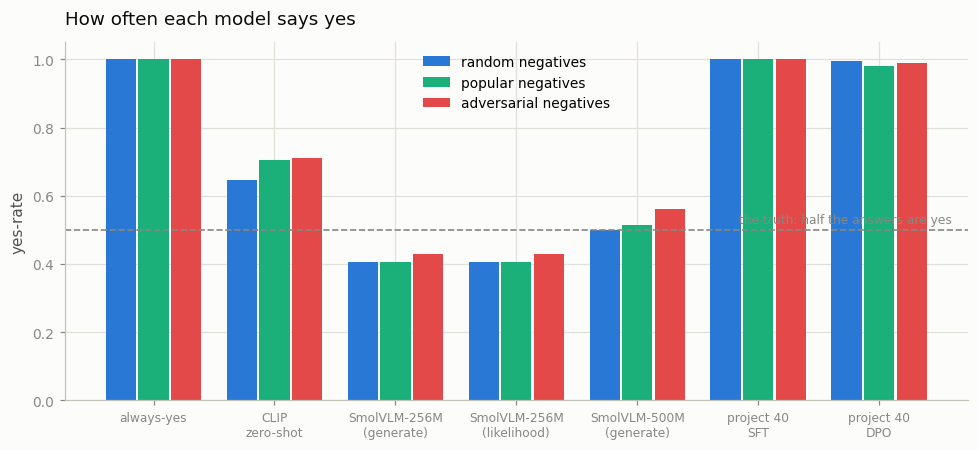
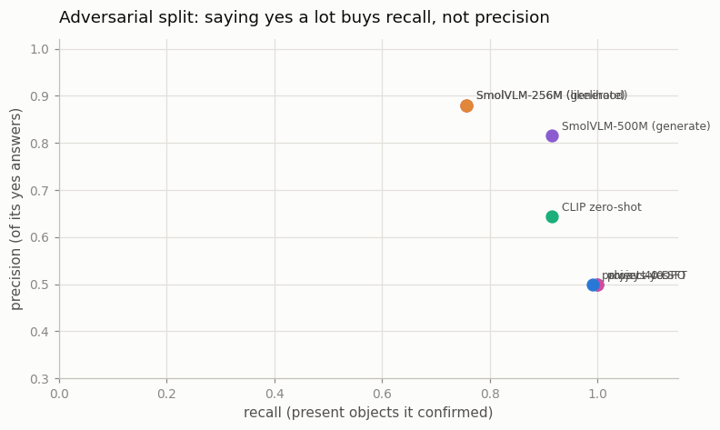
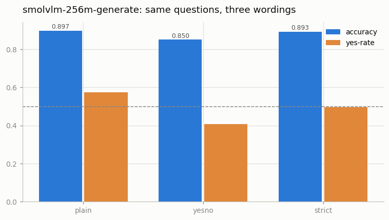

# Hallucination Eval

## Key Insight

Ask a [VLM](/shared/glossary/#vlm) "is there a dog in this image?" and it will often answer "yes" even when there is no dog — a [hallucination](/shared/glossary/#hallucination), where the model produces a fluent, confident claim the pixels do not support. This project builds a tiny [benchmark](/shared/glossary/#benchmark) of *paired* trick questions — half about an object that is present, half about one that is absent — so a model cannot score well just by always guessing "yes"; counting how often it falsely confirms absent objects versus correctly spots present ones turns a vague worry into concrete [precision and recall](/shared/glossary/#precision-and-recall) numbers you can compare across several [open](/shared/glossary/#open-model) VLMs. The design lesson is that a hallucination test must balance true and false cases, because a one-sided test secretly rewards a model that simply agrees with every question.

**This is project 41.** It rebuilds [POPE](/shared/glossary/#pope) in miniature, runs seven systems through it — including two real open VLMs and project [40](../40-multimodal-dpo/README.md)'s model before and after preference training — and finds that two of the benchmark's design choices move the scores more than the choice of model does.

## The benchmark

107 held-out MS-COCO photos, and for each one a matched pair of questions:

```
Is there a person in the image? Answer yes or no.     ← truth: yes
Is there a beach  in the image? Answer yes or no.     ← truth: no
```

**214 questions per split, exactly 50% yes by construction.** The ground truth is read off the five human captions using the same object vocabulary project 40's hallucination meter uses — one definition of "in the picture" for the whole phase.

> **"Why not just ask the model to describe the picture and check what it says?"** That is [CHAIR](/shared/glossary/#chair), and project 40 does exactly that. It is the more natural test and the harder one to grade: you have to decide whether "a group of people" counts as naming a person, whether an unmentioned object is a hallucination or just an omission, and what to do with a model that writes three words. Polling with yes/no questions gives up realism and buys **exactness** — every answer is right or wrong, no judgement calls, and the two halves of each pair are perfectly matched. The name says so: [POPE](/shared/glossary/#pope) is *Polling-based Object Probing Evaluation*, and the polling is the point.

### The three ways to pick the absent object

The same 107 photos and the same yes-questions appear in all three splits. Only the **no**-question changes, so any difference between the three scores is caused by the negative-sampling rule and nothing else.

| split | rule | what it catches |
|---|---|---|
| `random` | any object the photo does not contain | plain guessing |
| `popular` | the most common object in the corpus that this photo lacks | "COCO photos usually contain people" |
| `adversarial` | the object that most often appears *together with* what is really in this photo | "surfboards come with water" |

The frequency and co-occurrence tables are counted over the **whole 3,000-image corpus**, not over the 107 images we ask about — "which objects are popular" is a fact about the data a model was trained on, and estimating it from a hundred photos would mostly measure sampling noise.

The three rules pick a **different** object for the same photo 2.28 times out of 3 on average, so the splits really are three different exams. What they ask about differs sharply:

| split | the objects it asks about most |
|---|---|
| `random` | sign (5), cow (5), beach (4), sheep (4), cake (4) — a long flat tail |
| `popular` | person (61), street (41), table (5) |
| `adversarial` | person (43), street (42), grass (12), table (4) |

Two of these look alike, and the difference is *why* the object was chosen. `popular` picks whatever is commonest in the corpus regardless of this photo; `adversarial` picks whatever most often keeps company with what is actually in *this* photo. They land on the same words here because our corpus is MS-COCO, where people and streets are both the commonest objects and the commonest companions. On a corpus with sharper co-occurrence structure the two lists would separate — worth knowing before reading the two columns as independent evidence.

## The systems under test

| system | how it answers |
|---|---|
| `always-yes` | says yes to everything |
| `clip-zeroshot` | frozen [CLIP](/shared/glossary/#clip) scores the image against "a photo of a dog" and compares to a threshold |
| `smolvlm-256m` | a real open VLM, asked the question and read literally |
| `smolvlm-256m-lik` | the *same* model, scored by whether "Yes" or "No" is more likely |
| `smolvlm-500m` | its larger sibling |
| `tinyvlm-sft` | project 40's captioner, scored by likelihood |
| `tinyvlm-dpo` | the same after DPO, scored by likelihood |

> **"`always-yes` cannot see. Why is it in the table?"** Because it is the only entry that tells you whether the *benchmark* works. On a test where 70% of the answers are yes — which is what you get if you only ask about objects that are present — this system scores 70% and looks like a competent model. Here it scores exactly 50%, which is the proof that the balancing worked. Any system that cannot beat it has produced no evidence that it looked at the image, whatever its accuracy says.

> **"CLIP is a matcher, not a chatbot. Is it fair to put it in a hallucination benchmark?"** It is not competing for the same job, and that is why it is interesting. CLIP cannot hallucinate in the usual sense — it never generates a word, it only reports how close an image and a phrase are. Including it answers a question the VLM scores alone cannot: *how much of this benchmark is solvable by simple image-text matching, with no language modelling at all?* Whatever CLIP gets is the part of the task that needs no reasoning; whatever a VLM gets **above** CLIP is what its language half is buying.

> **Why the same model appears twice.** `smolvlm-256m` is asked the question and we read its words. `smolvlm-256m-lik` never lets it speak: we compare the probability it assigns to "Yes" against "No" and take the larger. Evaluation harnesses prefer the second because it always parses — no "I'm not sure, but…" to argue with — while a user only ever sees the first. The two do not have to agree, and the size of the gap is a fact about the *protocol*, not about the model. Measuring it is one of the points of this project.

> **Why project 40's captioner is scored by likelihood.** It was trained only to write captions and was never taught to answer questions, so asking it "is there a dog?" out loud produces a caption, not an answer. Likelihood scoring works on any language model — you do not need it to be able to follow the instruction, only to prefer one word over another. That is what lets the same benchmark grade a chat-tuned VLM and a bare captioner side by side, and it is how project 40's before/after checkpoints get tested by something other than the metric they were trained against.

### One deliberate cost: no image tiling

SmolVLM normally splits an image into four tiles plus a thumbnail, which turns one question into **1,148 prompt tokens** and takes 9.5 s on this CPU. We disable the splitting, giving one 512×512 view and 88 tokens — **14× faster**. That is a real accuracy cost on small objects, and project [22](../22-dynamic-resolution/README.md) measured exactly what tiling buys. Here we buy the speed and say so; every model is treated the same way, so the comparison between them is unaffected.

## Results



| system | random | popular | adversarial | drop | yes-rate (random) |
|---|---|---|---|---|---|
| `always-yes` | 0.500 | 0.500 | 0.500 | 0.000 | 1.000 |
| `clip-zeroshot` | 0.771 | 0.710 | 0.706 | **0.065** | 0.645 |
| `smolvlm-256m` (generate) | 0.850 | 0.850 | 0.827 | 0.023 | **0.407** |
| `smolvlm-256m` (likelihood) | 0.850 | 0.850 | 0.827 | 0.023 | 0.407 |
| `smolvlm-500m` (generate) | **0.916** | **0.902** | **0.855** | 0.061 | 0.500 |
| `tinyvlm-sft` (project 40) | 0.500 | 0.500 | 0.500 | 0.000 | **1.000** |
| `tinyvlm-dpo` (project 40) | 0.495 | 0.509 | 0.500 | −0.005 | 0.995 |

### 1. The benchmark works: `always-yes` scores exactly 0.500

Not approximately — exactly, on all three splits, because every question about a present object is paired with one about an absent object on the same photo. That number is what licenses every other row: anything above 0.500 is evidence the system looked at the image, and anything at 0.500 is not.

### 2. Harder negatives really are harder, and the bigger model has more to lose

SmolVLM-500M falls 0.916 → 0.902 → 0.855 across the three splits, and its yes-rate climbs 0.500 → 0.514 → 0.561 as it does. That is POPE's finding reproduced: the adversarial questions ask about the object that usually *accompanies* what is in the photo, and the model says yes to it 22 times out of 107 instead of 9. Nothing about the image changed — only which absent object we asked about.

The false-positive column tells the same story more precisely. Because all three splits share the same yes-questions, the true positives are identical everywhere (98 for the 500M model, 81 for the 256M, 98 for CLIP); *only* the false positives move:

| system | false positives: random → popular → adversarial |
|---|---|
| `clip-zeroshot` | 40 → 53 → 54 |
| `smolvlm-256m` | 6 → 6 → 11 |
| `smolvlm-500m` | 9 → 12 → 22 |

**A single-number "hallucination score" cannot be compared across papers unless the negative-sampling rule matches.** Between the easiest and hardest split, the same model moves by up to 6.5 points.

### 3. The textbook yes-bias is not there — the small model has the opposite bug



POPE's headline in 2023 was that VLMs say "yes" far too often. SmolVLM-256M says yes only **40.7%** of the time when the truth is 50%, and its errors are almost entirely the other kind: 26 missed present objects against 6 false confirmations. Its precision is 0.931 and its recall 0.757.

That is not a contradiction of POPE; it is what happens after two years of everyone training against it. Hallucination-mitigation data pushes models toward caution, and an over-cautious model is still a wrong model — it just fails a test built for the opposite failure. **The reason to report the yes-rate next to the accuracy is that it tells you *which* mistake you are looking at**, and F1 is the number that refuses to be gamed by either: `always-yes` gets recall 1.000 and F1 only 0.667.

The 500M model is the well-calibrated one: yes-rate exactly 0.500 on the random split, with 9 errors of each kind.

### 4. A frozen CLIP with one threshold gets 0.771



No language modelling, no generation, one number per (image, phrase) pair and a threshold picked on 40 development images we never test on. That is **77% of a benchmark about "hallucination" solved by a matcher that cannot hallucinate.**

The honest reading is a warning about what the benchmark measures. Most POPE questions are about whether a large, common object is present, and that is an image-text *matching* problem, which is what CLIP was built for. A VLM's extra 8–15 points is the part that needed language modelling. CLIP's weakness shows up exactly where you would predict: on the adversarial split its false positives nearly reach 54 of 107, because "a photo of a surfboard" is genuinely close to a beach photo in CLIP space, and a single global similarity has no way to say "close, but not present".

### 5. Generation and likelihood scoring agreed on **all 214** questions

Two protocols, same model, **zero disagreements** — identical accuracy, F1, precision, recall and yes-rate on every split.

That is a clean null result, and worth stating as one. It holds because this model is well-behaved on this task: it answered every one of the 642 generated questions with a parseable yes or no. The gap the two protocols are supposed to expose only opens when a model hedges ("It's hard to tell, but…"), refuses, or answers in another language — then the generation protocol has to guess and the likelihood protocol quietly cannot. **The right conclusion is not "the protocols are equivalent", it is "on this model the protocol was not the bottleneck" — measure it rather than assuming it.**

### 6. The prompt wording moved the score more than the negative sampling did



Same model, same 214 questions, same images — only the sentence changes:

| wording | accuracy | yes-rate | unparsed |
|---|---|---|---|
| `Is there a dog in the image?` | **0.897** | 0.575 | 3 |
| `Is there a dog in the image? Answer yes or no.` | 0.850 | 0.407 | 0 |
| `Answer the question using a single word, yes or no. Is there a dog in the image?` | 0.893 | 0.495 | 0 |

**Adding "Answer yes or no." cost 4.7 points.** That instruction is in the prompt for the evaluator's convenience — it makes parsing trivial — and it pushed the model's yes-rate from 0.575 down to 0.407, turning a nearly-calibrated answerer into an over-cautious one.

Put that beside the model's own random→adversarial drop of 2.3 points and the ranking of causes is uncomfortable: **the choice of phrasing moved this model twice as much as the difficulty of the benchmark did.** The third wording recovers almost all of it (0.893) while still parsing perfectly, so the cost was not "instructing the format" — it was *that particular sentence*. A benchmark result without its exact prompt is not reproducible, and a comparison between two papers that used different phrasings is measuring the phrasings as much as the models.

### 7. Project 40's captioner is an `always-yes` machine, and DPO did not change that

`tinyvlm-sft` answers **yes to 100% of 642 questions**. `tinyvlm-dpo` answers yes to 99.5%. Both score 0.500 — the degenerate baseline exactly.

This is the most useful thing project 41 tells project [40](../40-multimodal-dpo/README.md). Measured on captions, DPO cut hallucination (CHAIR_i 0.601 → 0.558) and the plain-SFT control cut it further. Measured here, on a question format neither model was ever trained on, **nothing generalised at all** — not the DPO training, not the supervised training, not the frozen CLIP features underneath.

Two things are tangled together and worth separating:

- **The models were never taught to answer questions.** Project 20 measured the same thing from the other side: a caption-only VLM scores *below* chance on balanced yes/no because it describes rather than answers. Likelihood scoring lets a captioner sit the exam, but it does not give it the concept of "no".
- **Whatever DPO changed, it was not a general sense of what is in the picture.** If preference training had installed "do not claim objects that are absent", some of it should show up as a lower yes-rate here. It moved from 1.000 to 0.995.

**Any single benchmark can be satisfied without the underlying ability.** That is the argument for running a model on a task it was not tuned against, and it is why this project exists next to project 40 rather than inside it.

## What this setup cannot tell you

- **107 images, 214 questions per split.** The standard error on an accuracy near 0.85 is about ±2.4 points, so differences under ~5 points are not resolved. The claims that survive that bar: always-yes at exactly 0.500, CLIP at 0.771, the 500M model's 6.1-point drop across splits, the 4.7-point prompt swing, and the tinyvlm arms' 1.000 yes-rate.
- **No image tiling** (see above). Both SmolVLM sizes would score higher with their default 4-tile preprocessing, especially on small objects; the comparison between models is unaffected because every system got the same pixels.
- **Our object list is 64 concepts read off five human captions.** An object the annotators did not mention is scored as absent, so some "false positives" may be true sightings. This inflates every model's error rate equally.
- **`popular` and `adversarial` overlap on MS-COCO** because people and streets are both the most frequent and the most co-occurring objects. On a corpus with sharper structure they would separate more.
- **One prompt-sensitivity model.** The 4.7-point swing is measured on SmolVLM-256M only; larger instruction-tuned models are usually more robust to phrasing, which is itself a claim someone should check rather than assume.

## Files

| file | what it holds |
|---|---|
| `pope.py` | the benchmark builder (three negative-sampling rules), the scorer, the full-resolution image fetcher, and the four system adapters. Imports project 40's `dpo_lib.py` for the object vocabulary so both projects grade "in the picture" the same way. |
| `run.py` | the stages `data` / `run` / `prompts` / `plot` |
| `outputs/data.json` | the benchmark's composition |
| `outputs/examples.json` | two questions from each split |
| `outputs/results.json` | every system's full confusion matrix per split |
| `outputs/prompts.json` | the three wordings |
| `outputs/table.json` | the summary table above |
| `outputs/*.png` | the four figures |

`data/images_336.npz` (107 photos at 336 px, ~15 MB) is gitignored and re-downloaded by `--stage data`.

## How to run

Project [20](../20-llava-from-scratch/README.md)'s `--stage data` must have run (it provides the image URLs and the captions). The two `tinyvlm` systems additionally need project [40](../40-multimodal-dpo/README.md)'s `base.pt` and `dpo.pt`.

```bash
python3 run.py --stage data                            # build the splits, fetch photos (~1 min)
python3 run.py --stage run --model always-yes,clip-zeroshot   # (~1 min)
python3 run.py --stage run --model smolvlm-256m        # a real open VLM (~13 min)
python3 run.py --stage run --model smolvlm-500m        # (~20 min)
python3 run.py --stage run --model tinyvlm-sft,tinyvlm-dpo    # (~2 min)
python3 run.py --stage prompts                         # three wordings (~13 min)
python3 run.py --stage plot
```

## Takeaways

1. **A hallucination benchmark needs a degenerate baseline in the table.** `always-yes` scored exactly 0.500 here — and two of our seven systems matched it, which no accuracy number alone would have revealed.
2. **The negative-sampling rule is part of the score.** The same model moved up to 6.5 points between random and adversarial negatives, entirely through false positives; the true positives are identical by construction.
3. **The prompt moved the score more than the benchmark's difficulty did** — 4.7 points from adding "Answer yes or no.", against a 2.3-point random→adversarial drop. Publish the exact prompt or the number is not reproducible.
4. **The classic yes-bias is model-dependent and dated.** SmolVLM-256M is *under*-confident (yes-rate 0.407, precision 0.931, recall 0.757). Report the yes-rate so you know which failure you are looking at, and F1 so neither can be gamed.
5. **A frozen CLIP with one threshold reaches 0.771.** Most of this benchmark is an image-text matching problem; a VLM's margin over that is what its language half is worth.
6. **Generation and likelihood scoring agreed on all 214 questions** — a null result that holds because the model never hedged. Measure the gap rather than assuming either protocol is safe.
7. **Project 40's DPO gains did not transfer at all.** Both checkpoints answer yes to ~100% of questions in a format they were never trained on. Improving a metric is not the same as improving the model, and the cheapest way to find out is a second, differently-shaped test.
