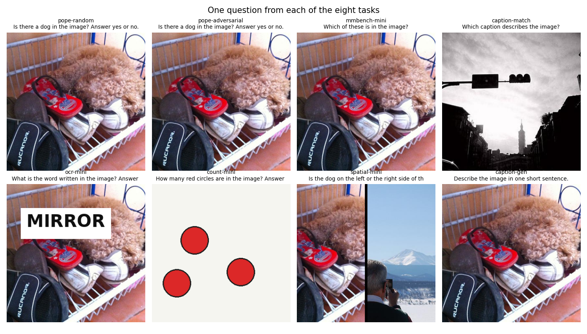
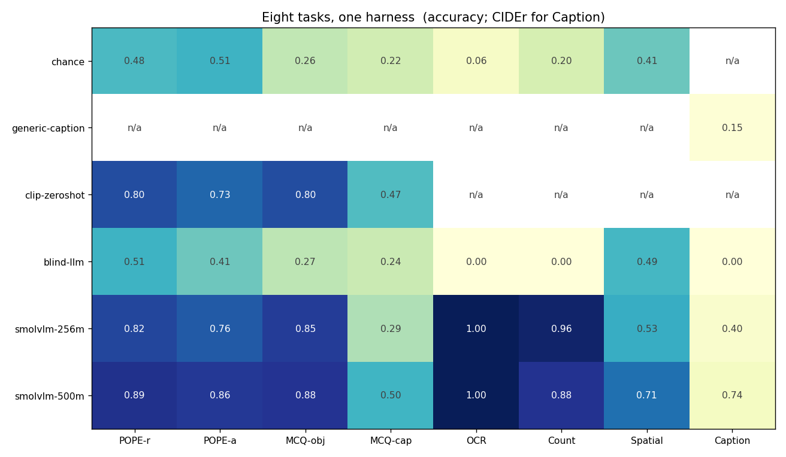
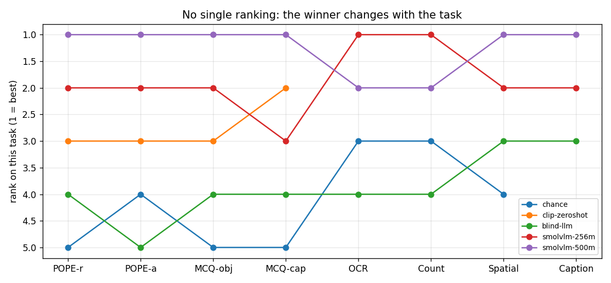
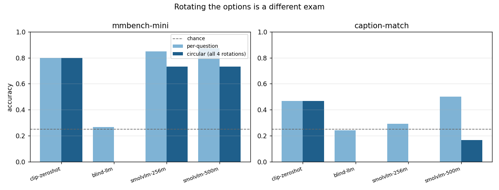
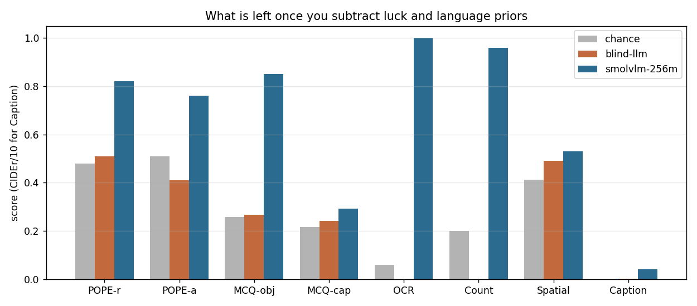
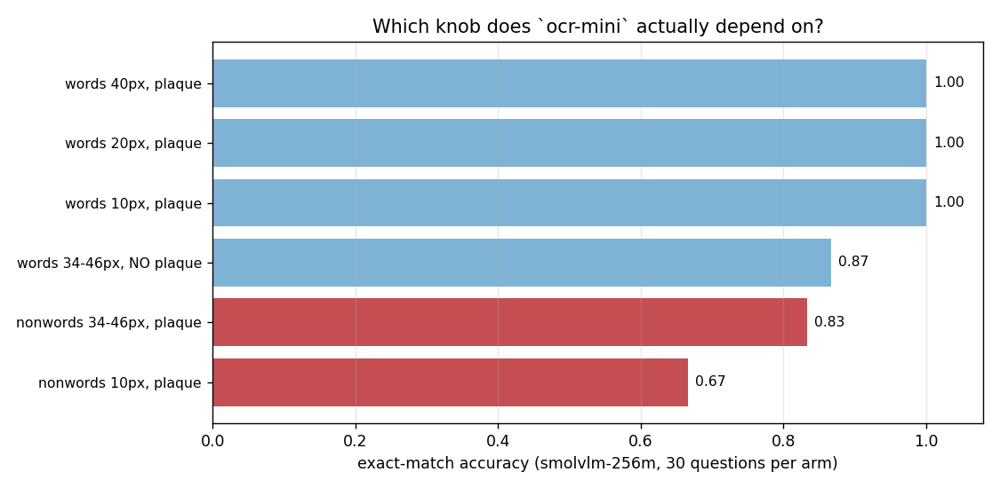

# Run a VLM Evaluation Harness

## Key Insight

Scoring a [VLM](/shared/glossary/#vlm) by hand is hopeless: there are dozens of [benchmarks](/shared/glossary/#benchmark), each with its own answer format, prompt wording, and scoring script. An [evaluation harness](/shared/glossary/#evaluation-harness) like `lmms-eval` or `VLMEvalKit` packages all of that so a single command runs your model across many benchmarks ([MMBench](/shared/glossary/#mmbench), [MMMU](/shared/glossary/#mmmu), DocVQA, and more) under identical, version-pinned conditions. This project's real lesson is that comparisons are only fair when every model sees the same prompt and is graded by the same parser — a small change in how a multiple-choice letter is extracted can swing a score by several points, so a shared harness is what makes one paper's numbers actually comparable to another's. Running it on an [open VLM](/shared/glossary/#open-model) across 6+ benchmarks turns "is this model good?" into a concrete, reproducible score table you can defend.

**This is project 42.** It builds the harness rather than installing one — eight tasks, six systems, one runner — and the sentence above turns out to understate the case. Swapping one line of the answer parser moved a real model from **0.850 to 0.000** on the same 120 answers.

## What a harness actually is

Strip `lmms-eval` down and three objects are left:

```
Task     knows how to turn a dataset into questions, and how to grade one answer.
         It never knows which model is answering.
Model    knows how to turn (image, question) into a string.
         It never knows which benchmark it is sitting.
run()    walks every (task, model) pair and writes one row per cell.
```

That separation is the entire product. Once a task is written down as *data plus a grading function*, every model is asked exactly the same thing and graded by exactly the same parser — which is the only condition under which two numbers can be compared at all.

> **"Why not just call the model and eyeball the answers?"** Because the thing you are measuring is not the model alone; it is the model *plus the prompt plus the parser*. Eyeballing silently gives every model a different, generous parser — your own eyes — and produces a number nobody else can reproduce. Section 2 below measures exactly how much that matters.

## The eight tasks



| task | shape | what it stands in for | questions |
|---|---|---|---|
| `pope-random` | yes/no | [POPE](/shared/glossary/#pope) [hallucination](/shared/glossary/#hallucination), easy negatives | 100 |
| `pope-adversarial` | yes/no | POPE with co-occurring negatives | 100 |
| `mmbench-mini` | 4-way choice | [MMBench](/shared/glossary/#mmbench)-style general QA, with [circular evaluation](/shared/glossary/#circular-evaluation) | 120 |
| `caption-match` | 4-way choice | sentence grounding, [minimal pairs](/shared/glossary/#minimal-pair) | 120 |
| `ocr-mini` | free text | [OCR](/shared/glossary/#ocr) / documents | 50 |
| `count-mini` | free number | counting | 50 |
| `spatial-mini` | free text | grounding, left vs right | 51 |
| `caption-gen` | free text | open-ended, scored by [BLEU](/shared/glossary/#bleu) and [CIDEr](/shared/glossary/#cider) | 50 |

**Total: 641 questions**, which is one full pass of a small VLM in about nine minutes on a CPU.

Five tasks are built from 200 real MS-COCO photos and their five human captions. Three (`ocr-mini`, `count-mini`, `spatial-mini`) **draw their own images** — a word painted on a plaque, coloured circles on a blank canvas, two photos side by side.

> **"Isn't drawing your own images cheating?"** It is a trade, and the honest thing is to name it. Real OCR, counting and grounding benchmarks need human annotation we do not have, and their ground truth is exactly what a CPU budget cannot buy. Drawing the image means the answer is known by construction — we *placed* three circles, we *pasted* the dog on the left — so grading is exact and free. What does **not** transfer is the absolute score: `ocr-mini` is not DocVQA and 1.000 here does not mean a model can read a receipt. What *does* transfer is the protocol — a free-form answer, a parser, a number with a chance floor next to it — and that is what a harness project is about.

### Two task designs that had to be repaired

**`caption-match` started out useless.** The first version drew the three wrong captions at random from the corpus, and a frozen [CLIP](/shared/glossary/#clip) scored **1.000**. When the distractors describe unrelated scenes, "which caption fits this picture?" collapses into plain topic matching, and *a task every system aces separates no systems*.

The repair is to build each distractor by changing **one thing** in the true caption:

```
A traffic light over a street surrounded by tall buildings.      ← true
A traffic light over a buildings surrounded by tall street.      ← two nouns swapped
A traffic light over a bicycle surrounded by tall buildings.     ← one noun replaced
A traffic light beneath a street surrounded by tall buildings.   ← relation flipped
```

These are [minimal pairs](/shared/glossary/#minimal-pair), the design behind ARO and SugarCrepe, and they target a specific known weakness: a contrastively-trained matcher largely treats a sentence as an unordered *bag of words*, so the swapped version looks nearly identical to it while a reader spots the difference instantly. CLIP fell from **1.000 to 0.467**.

**`ocr-mini` was too easy in the other direction** — both VLMs scored a flat 1.000. Section 6 turns its difficulty knobs one at a time to find out which one the score actually depends on, and the answer is not the obvious one.

## The six systems

| system | how it answers | why it is in the table |
|---|---|---|
| `chance` | guesses at random | the floor: what does 0.25 mean here? |
| `blind-llm` | SmolLM2-135M, question only, **no image** | how much is answerable from language alone |
| `clip-zeroshot` | frozen CLIP scores each option against the picture | how much needs no language modelling at all |
| `smolvlm-256m` | a real open VLM, asked and read literally | the system under test |
| `smolvlm-500m` | its larger sibling | does size help, and where |
| `generic-caption` | always emits the same sentence | what the captioning metrics should score near zero |

> **"`chance` and `blind-llm` both ignore the image. Why two of them?"** They measure different things, and the difference is the useful part. `chance` measures *luck*: what pure guessing is worth. `blind-llm` measures *prior knowledge*: what knowing English and the dataset's habits is worth. If a "visual" task can be half-solved blind, half of its score was never about seeing — and no amount of chance-level reasoning would have revealed that. Our [blind baseline](/shared/glossary/#blind-baseline) turns out to sit at chance on every task here, which is a result worth having: the tasks are not leaking through the text.

> **"CLIP cannot write. Isn't putting a matcher in a generation benchmark unfair?"** It is not competing for the same job, which is why it is informative. CLIP never produces a word; it reports how close an image and a phrase are. Its score is therefore the part of the benchmark solvable by pure image-text matching, and a VLM's margin *above* it is what the language half is buying. When it cannot sit a task at all it says so — the harness records `skipped`, not a fake zero, because a zero would silently tell you CLIP is bad at OCR when the truth is that it was never asked.

### One deliberate cost: no image tiling

SmolVLM normally splits an image into four tiles plus a thumbnail, turning one question into 1,148 prompt tokens. We disable that: one 512×512 view, 88 tokens, **14× faster** (project [41](../41-hallucination-eval/README.md) measured it). This lowers absolute scores on small details. Every system gets the same pixels, so the comparison between rows is unaffected — and project [43](../43-reproduce-a-leaderboard-result/README.md) measures what the choice is worth.

## Results



| system | POPE-r | POPE-a | MCQ-obj | MCQ-cap | OCR | Count | Spatial | Caption (CIDEr) |
|---|---|---|---|---|---|---|---|---|
| *chance level* | 0.500 | 0.500 | 0.250 | 0.250 | 0.040 | 0.250 | 0.500 | — |
| `chance` | 0.480 | 0.510 | 0.258 | 0.217 | 0.060 | 0.200 | 0.412 | n/a |
| `blind-llm` | 0.510 | 0.410 | 0.267 | 0.242 | 0.000 | 0.000 | 0.490 | 0.004 |
| `clip-zeroshot` | 0.800 | 0.730 | 0.800 | 0.467 | n/a | n/a | n/a | n/a |
| `smolvlm-256m` | 0.820 | 0.760 | **0.850** | 0.292 | **1.000** | **0.960** | 0.529 | 0.400 |
| `smolvlm-500m` | **0.890** | **0.860** | **0.875** | **0.500** | **1.000** | 0.880 | **0.706** | **0.741** |
| `generic-caption` | n/a | n/a | n/a | n/a | n/a | n/a | n/a | 0.149 |

Run time on this CPU: `clip-zeroshot` 32 s, `blind-llm` 39 s, `smolvlm-256m` 532 s, `smolvlm-500m` 666 s.

### 1. There is no ranking — the winner changes with the task



`smolvlm-500m` wins six cells. `smolvlm-256m` wins `count-mini`. `clip-zeroshot` — which cannot produce a single word — beats the 256M VLM on `caption-match` by 17.5 points, and gets within 5 points of it on `mmbench-mini`.

Averaging the row would hide all of that. It would also be arithmetically meaningless: the columns have different chance floors (0.25, 0.50, 0.04) and one of them is a CIDEr score on a different scale entirely. **A suite is a suite because the numbers are not commensurable, and the right output of a harness is a table, not a mean.**

### 2. The answer parser was worth 85 points

This is the finding that justifies the whole project.

SmolVLM does not answer `B`. It answers `Answer: B`. Our first parser accepted only a leading letter — the obvious first draft, and what a strict harness does — and it marked **all 120** multiple-choice answers unparsed:

| model | task | lenient parser | strict parser | unparsed under strict |
|---|---|---|---|---|
| `smolvlm-256m` | mmbench-mini | **0.850** | **0.000** | 120 / 120 |
| `smolvlm-256m` | caption-match | 0.292 | 0.000 | 120 / 120 |
| `smolvlm-500m` | mmbench-mini | **0.875** | **0.250** | 89 / 120 |
| `smolvlm-500m` | caption-match | 0.500 | 0.000 | 120 / 120 |

Same model, same weights, same images, same 120 generated strings. **The only thing that changed is a regular expression, and the score moved by 85 points.**

Worse, it does not move every model equally. Under the lenient parser the two VLMs are 2.5 points apart; under the strict one they are 25 points apart, because the 500M model happens to answer with a bare letter more often. **A parser difference does not just shift scores, it distorts the gaps between models** — which is precisely the comparison a leaderboard exists to support.

A harness fixes this not by having the *right* parser (there isn't one) but by having **the same** parser for everyone, published alongside the number. Project [43](../43-reproduce-a-leaderboard-result/README.md) takes this apart in detail.

### 3. Circular evaluation is a different exam, and it costs 12 to 33 points



Each multiple-choice item is asked four times with the options rotated into different slots. Credit only if all four are right.

| system | mmbench per-question → circular | caption-match per-question → circular |
|---|---|---|
| `chance` | 0.258 → **0.000** | 0.217 → **0.000** |
| `blind-llm` | 0.267 → **0.000** | 0.242 → **0.000** |
| `clip-zeroshot` | 0.800 → **0.800** | 0.467 → **0.467** |
| `smolvlm-256m` | 0.850 → 0.733 | 0.292 → **0.000** |
| `smolvlm-500m` | 0.875 → 0.733 | 0.500 → 0.167 |

Three things fall out of that table.

**Random guessing goes to exactly zero.** That is the point of the design: a strategy of always answering "A" collects 25% on a normal four-way test and 0% here, because no fixed letter can be right in all four rotations. [MMBench](/shared/glossary/#mmbench) introduced circular evaluation for exactly this reason.

**CLIP is completely unaffected** — 0.800 → 0.800, 0.467 → 0.467, to the digit. It never reads a letter; it scores each option's *text* against the picture and reports which won. Rotating a list it does not perceive as a list changes nothing. **Circular evaluation only bites systems that read options in an ordered prompt**, which is a fact about the interface, not about visual ability.

**The two VLMs lose 12 and 14 points on `mmbench-mini`, and 29 and 33 on `caption-match`.** The letter histogram says why: on `caption-match` the 500M model picks **A 63.3%** of the time and D 9.2%, and the 256M model picks A 67%. When a model is uncertain it falls back on position, and a per-question score quietly pays it for that. The gap between the two numbers *is* the measurement of how much it was leaning on the ordering.

### 4. Two tasks are at chance, and that is the most useful thing in the table



`caption-match`: `smolvlm-256m` scores **0.292** against a chance level of 0.250, and **0.000** under circular scoring. `spatial-mini`: it scores **0.529** against a chance level of 0.500, answering "left" only 25.5% of the time.

Neither of those is a small deficiency. They are *no evidence of the ability at all*, from a model that reads painted words perfectly and counts circles at 0.960.

The 500M model does better on both (0.500 and 0.706), so the tasks are not broken — they are hard, and they are hard in the way the literature says: word order and spatial relations are where contrastive pretraining leaves the biggest hole, because "cat on table" and "table on cat" are nearly the same [bag of words](/shared/glossary/#minimal-pair) and neither the caption data nor the objective ever forces the distinction.

**This is why a suite beats a headline.** `smolvlm-256m` looks strong at 0.850 on the general-QA task; on two of the eight it has produced no evidence of the skill being tested.

### 5. The captioning metrics rank a caption that ignores the image above one from a real model

| system | BLEU-4 | CIDEr | mean words |
|---|---|---|---|
| `blind-llm` (no image) | 0.000 | 0.004 | 9.0 |
| `generic-caption` (one fixed sentence, always) | **0.054** | **0.149** | 11.0 |
| `smolvlm-256m` | 0.117 | 0.400 | 16.0 |
| `smolvlm-500m` | 0.186 | 0.741 | 15.5 |

`generic-caption` emits *"a man is standing next to a table in a room"* for all 50 photos. It never looks at anything. It collects **37% of the 256M model's CIDEr and 46% of its BLEU-4.**

That is a lot of credit for a constant. It happens because these metrics reward *n-gram overlap*, and a generic English sentence about a person in a room overlaps a fair amount with human captions of a random photo collection, which contain a great many people, tables and rooms. [BLEU](/shared/glossary/#bleu)'s brevity penalty and [CIDEr](/shared/glossary/#cider)'s [TF-IDF](/shared/glossary/#tf-idf) weighting both push against this — the fixed sentence would score much higher without them — but neither can eliminate it, because neither has any way to ask "is this sentence *about this picture*".

The metrics do still order the systems correctly here, which is the honest counterweight: 0.004 < 0.149 < 0.400 < 0.741. **They are usable as a coarse ranking and nearly worthless as an absolute number**, which is exactly what the guide means when it calls the captioning benchmarks "largely solved and increasingly meaningless". Project [45](../45-human-correlated-eval/README.md) measures how well they track human judgement.

### 6. `ocr-mini` scored 1.000 for both VLMs — and finding out why exposed a language prior



A task everybody aces is a task that is not measuring, so we turned its knobs one at a time. The obvious suspect for [OCR](/shared/glossary/#ocr) is letter size — text smaller than the model's patch grid should be unreadable. It turned out not to be the variable at all.

| arm | accuracy |
|---|---|
| real words, 40 px, white plaque | 1.000 |
| real words, 20 px, white plaque | 1.000 |
| real words, **10 px**, white plaque | **1.000** |
| real words, 34–46 px, **no plaque** (painted on the photo) | 0.867 |
| **random letter strings**, 34–46 px, plaque | **0.833** |
| **random letter strings, 10 px**, plaque | **0.667** |

Shrinking a real word from 40 px to 10 px costs **nothing**. Replacing it with a pronounceable non-word at full size costs **17 points**. And the two together cost 33.

The reason is in the errors: at 10 px the model returned `leofhe` for `LEFOHE` — it recovered the letters and scrambled their order. **A real English word does not need to be read that carefully.** Six blurry letter-shapes plus a language model that knows `MIRROR` is a word is enough to reconstruct it; six blurry letter-shapes with no word to snap to are not. Part of what looked like perfect OCR was the language half filling in for the vision half.

That is worth generalising, because the same confound sits inside real OCR benchmarks: documents contain dictionary words, and a model that half-reads them and guesses well scores like a model that reads them. **Non-words are the control that separates the two**, and they cost nothing to generate.

The white plaque matters too, though less: painting the same words directly onto the photograph costs 13 points, which is the contrast-handling part of the task that the plaque was deliberately removing.

**Any benchmark has knobs like these.** If every system scores the same, some knob is at its easiest setting — and turning it produced more information here than a sixth model in the table would have.

## What this setup cannot tell you

- **50–120 questions per task.** The standard error near 0.85 with n=100 is about ±3.6 points, so differences under ~7 points are not resolved. Claims that survive that bar: the parser's 85-point swing, circular evaluation's 12–33 point drop, CLIP beating the 256M model on `caption-match`, both models at chance on `caption-match`, and `generic-caption` reaching 37% of a real model's CIDEr.
- **Three of the eight tasks are synthetic.** Their absolute scores are not comparable to DocVQA, RefCOCO or any counting benchmark. They exercise the protocol, not the domain.
- **No image tiling**, so both SmolVLM sizes would score higher on small detail with their default preprocessing.
- **Two real models, both from one family.** "SmolVLM-500M beats SmolVLM-256M" is not "bigger is better in general"; they share a training recipe and a vision tower.
- **`caption-gen` is graded against five human captions with n-gram metrics.** A correct paraphrase using none of the reference vocabulary scores near zero. That is a property of the metric, not of the caption.
- **The object vocabulary is 64 concepts read off human captions**, so an object the annotators did not mention counts as absent. This inflates every system's error rate on the POPE tasks equally.

## Files

| file | what it holds |
|---|---|
| `harness.py` | the whole harness: `Bank` (photos + captions), the eight `Task` classes, the synthetic renderers, `bleu`/`cider` implemented from scratch, the six model adapters, and `run()`. Imported by projects [43](../43-reproduce-a-leaderboard-result/README.md), [44](../44-benchmark-contamination-check/README.md) and [45](../45-human-correlated-eval/README.md). |
| `run.py` | the stages `data` / `run` / `ocr-probe` / `plot` |
| `outputs/tasks.json` | each task's shape, size and chance level |
| `outputs/examples.json` | two questions from every task |
| `outputs/results.json` | every (model, task) cell, with the raw strings and parsed answers |
| `outputs/table.json` | the headline table above |
| `outputs/ocr_probe.json` | the six difficulty arms of section 6 |
| `outputs/*.png` | the six figures |

`data/photos_336.npz` (200 photos, ~35 MB) is gitignored and rebuilt automatically.

## How to run

Project [20](../20-llava-from-scratch/README.md)'s `data/rows.json` supplies the COCO listing (any of its stages that fetch data will create it).

```bash
python3 run.py --stage data                                    # photos + questions (~15 s)
python3 run.py --stage run --model chance,generic-caption      # instant
python3 run.py --stage run --model clip-zeroshot,blind-llm     # ~1 min
python3 run.py --stage run --model smolvlm-256m                # ~9 min
python3 run.py --stage run --model smolvlm-500m                # ~11 min
python3 run.py --stage ocr-probe                               # ~4 min
python3 run.py --stage plot
```

## Takeaways

1. **A harness is a separation, not a library.** Tasks own the questions and the grading; models own the answering; the runner owns nothing. That is what makes two numbers comparable.
2. **The answer parser is part of the score.** One regular expression moved a real model from 0.850 to 0.000 on identical output — and changed the gap between two models from 2.5 points to 25.
3. **Publish a chance level and a blind baseline next to every column.** Two of our eight tasks put a competent-looking model at chance, which no accuracy number alone would have revealed.
4. **[Circular evaluation](/shared/glossary/#circular-evaluation) measures something different from per-question accuracy** — 12 to 33 points different — and it leaves a matcher like CLIP untouched, because [position bias](/shared/glossary/#position-bias) is a property of reading an ordered prompt, not of seeing.
5. **A frozen CLIP is a serious entry, not a joke one.** It beat a real VLM on the minimal-pair caption task and came within 5 points on general QA; whatever it scores is the part of the benchmark that needed no language modelling.
6. **Captioning metrics give a constant sentence 37% of a real model's CIDEr.** Use them to order systems, never to describe one.
7. **If everything scores 1.000, look for the difficulty knob.** `ocr-mini` was flat until the font size was swept; sweeping it produced more information than a sixth model would have.
