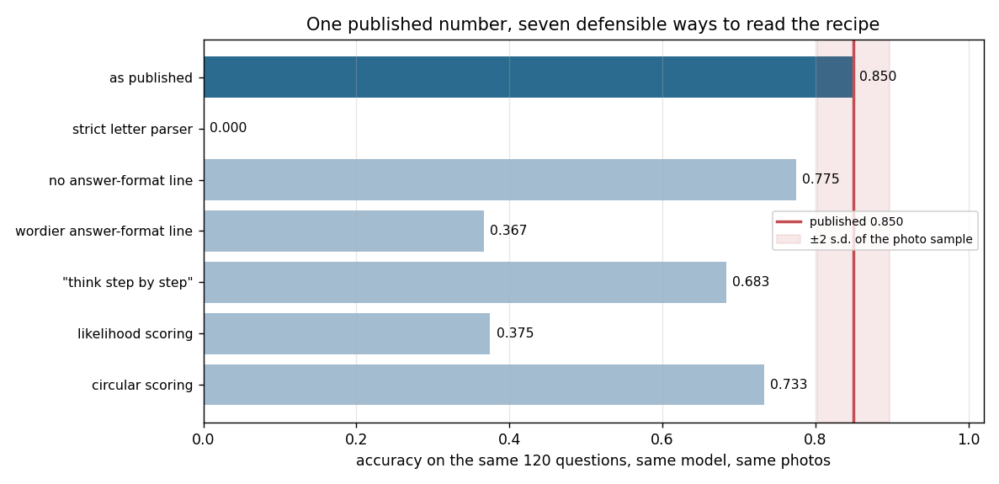
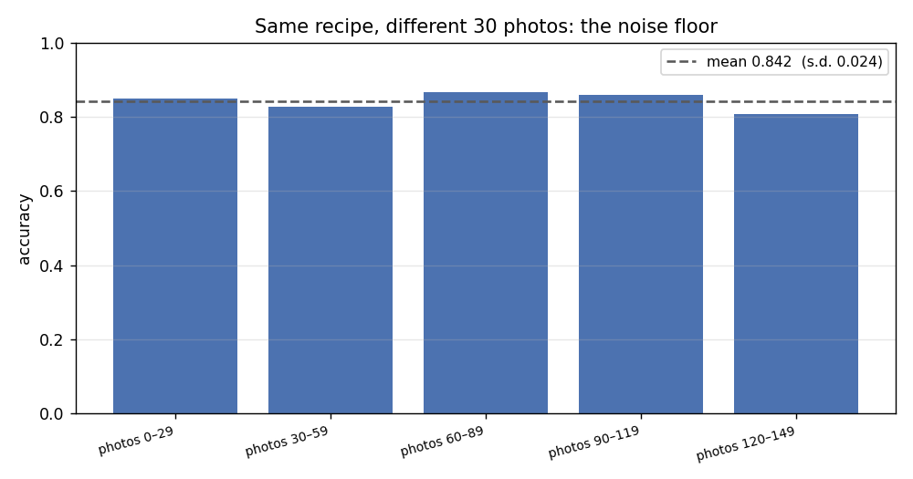

# Reproduce a Leaderboard Result

## Key Insight

A single number on a [leaderboard](/shared/glossary/#leaderboard) hides a hundred quiet choices — the exact prompt template, how multiple-choice answers are parsed, the image resolution, whether a few example questions were shown first. Picking a published [MMBench](/shared/glossary/#mmbench) score and trying to reproduce it almost always leaves a gap, and chasing that gap is the fastest way to learn where multimodal evaluation silently leaks or inflates accuracy. A *wide* gap usually means your prompt or parser differs from the paper's; a suspiciously *small* gap (or a score that beats the paper) can mean the [benchmark](/shared/glossary/#benchmark)'s questions leaked into the model's training data ([contamination](/shared/glossary/#contamination)). The discipline you build here — pinning every setting and documenting exactly why your number differs — is what separates a trustworthy result from a cherry-picked one.

**This is project 43.** It reproduces one published number **exactly** — same accuracy to every decimal, same first six generated strings — and then turns the unstated knobs one at a time. Seven defensible readings of the same recipe produce scores from **0.000 to 0.850**, against a measured sampling noise floor of **±0.024**.

## The target, and why it is a neighbouring project rather than a paper

The "leaderboard entry" we go after is project [42](../42-run-a-vlm-evaluation-harness/README.md)'s headline for `smolvlm-256m` on `mmbench-mini`:

```
accuracy 0.8500   (circular 0.7333)
```

Using a project from this repository instead of a real paper is not a shortcut — **it is what makes the exercise sharp.** With a real paper you get one number and a hundred unknowns, so any gap you find is unattributable: was it the prompt, the parser, the resolution, the checkpoint, the hardware, or a bug? Here we have the original code, the original seed and the original machine, so after the pinned reproduction succeeds, **every subsequent difference is caused by exactly the knob we turned and nothing else.** That is the only setting in which "the prompt was worth 48 points" is a measurement rather than a guess.

> **"If you have the original code, haven't you assumed away the whole problem?"** The opposite. The hard part of reproduction is not running someone's code — it is that a published number is a property of *five* things and papers publish one of them:
>
> ```
> score = f(model weights, prompt template, answer parser, image preprocessing, item sample)
>              ↑ published    ↑ sometimes      ↑ almost never   ↑ almost never   ↑ sometimes
> ```
>
> This project measures how much each of the four unpublished arguments is worth. You cannot do that on a paper, because you cannot hold the other four fixed.

## The knobs

| arm | what changed from the published run |
|---|---|
| `pinned` | nothing — same seed, same photos, same prompt, same parser |
| `no-suffix` | drop `Answer with the option's letter from the given choices directly.` |
| `verbose-suffix` | replace it with `Please look at the image, choose the correct option from the list above, and reply with its letter.` |
| `cot-suffix` | replace it with `Think step by step, then give the letter of the answer.` |
| `likelihood` | never let the model speak: compare the probabilities of the tokens `A`/`B`/`C`/`D` |
| *(re-grading)* | the strict letter parser, and circular scoring — both free, computed from the pinned run's own output |
| `photos-30/60/90/120` | the same recipe on four other groups of 30 photos |
| `subset-1view` / `subset-5views` | one 512×512 view vs four tiles plus a thumbnail |

> **"Why is the answer-format sentence one of the knobs? It is not part of the question."** That is exactly why. It exists for the *grader's* convenience — it makes the reply easy to parse — and it is therefore the part of the prompt an author is least likely to print in the paper, because it feels like plumbing rather than method. Project [41](../41-hallucination-eval/README.md) already found this sentence moving a POPE score by 4.7 points, which was more than the benchmark's own difficulty settings moved it. Section 2 finds a much larger effect here.

## Results

### 1. The pinned reproduction is exact — which is what licenses everything after it

| | accuracy | circular | strict-parser accuracy |
|---|---|---|---|
| published (project 42) | 0.8500 | 0.7333 | 0.0000 |
| reproduced here | **0.8500** | **0.7333** | **0.0000** |

Not "within noise" — identical, and the first six raw generated strings match character for character. Nothing is sampled at inference (greedy decoding), the question construction is seeded, and the seed does not depend on Python's per-process string hash. (It nearly did: an early version derived the per-task seed from `hash(task_name)`, which is salted differently in every Python process, so the "same" benchmark would have been a different benchmark on every run. That bug is invisible until you try to reproduce something.)

**A reproduction that matches exactly is not a boring result — it is the control.** Without it, every gap below could be a bug in this project rather than the effect of the knob.

### 2. The answer-format sentence is worth 48 points



Same model, same 120 questions, same photos, greedy decoding. Only the instruction appended after the options changes:

| the sentence appended to the options | accuracy | circular | what the model tends to say |
|---|---|---|---|
| `Answer with the option's letter from the given choices directly.` (**published**) | **0.850** | 0.733 | `Answer: B` |
| *(nothing)* | 0.775 | 0.667 | `Answer: B` |
| `Think step by step, then give the letter of the answer.` | 0.683 | 0.367 | a sentence, then a letter |
| `Please look at the image, choose the correct option from the list above, and reply with its letter.` | **0.367** | **0.000** | `D.` — almost always `D` |

**0.850 → 0.367 from rewording one sentence that carries no information about the question.** All three replacements are things a careful person might write; the wordiest one is arguably the *clearest* instruction for a human, and it is the one that destroys the score.

The letter histogram shows what actually broke. Under the published prompt the model's answers are spread across all four slots (A 31%, B 24%, C 23%, D 22%). Under the wordy one it answers **D 88% of the time**:

| prompt | A | B | C | D |
|---|---|---|---|---|
| published | 0.31 | 0.24 | 0.23 | 0.22 |
| wordier | 0.00 | 0.03 | 0.10 | **0.88** |

It did not become worse at seeing; it fell back on a position habit, which is exactly the failure [circular evaluation](/shared/glossary/#circular-evaluation) is built to expose — and circular accuracy for that arm is **0.000**, because a model answering D every time cannot be right in all four rotations.

For scale: on most leaderboards the distance between the top model and the tenth is smaller than 48 points. **A benchmark result published without its exact prompt string is not a measurement of the model.**

The `cot-suffix` row is worth a second look. "Think step by step" is a well-known way to *improve* language-model reasoning, and here it costs 16.7 points on per-question accuracy and 36.6 on circular. Nothing about the model's ability changed — the instruction spends the model's few generated tokens on prose instead of on the answer. **An intervention that helps in one output format can be pure cost in another**, which is why an eval harness pins `max_new_tokens` too.

### 3. Generation and likelihood scoring disagree by 47.5 points

| protocol | accuracy | circular | unparsed |
|---|---|---|---|
| generate and parse (published) | **0.850** | 0.733 | 0 |
| compare the probability of `A`/`B`/`C`/`D` | **0.375** | 0.000 | 0 |

Both are standard. Harnesses like this one prefer the second because it *always* parses — there is no "I'm not sure, but…" to argue with — while a user only ever experiences the first.

Put this beside project [41](../41-hallucination-eval/README.md)'s result on the same model family: on balanced **yes/no** questions, generation and likelihood agreed on **all 214** answers, exactly. On **four-way multiple choice** they differ by 47.5 points.

The difference is what "the next token" means in each case. For yes/no the model's next word really is `Yes` or `No`, so reading the probability of those two tokens reads its answer. For multiple choice the model's next word is `Answer` — the letter arrives two tokens later — so scoring position zero over `A`/`B`/`C`/`D` is scoring a token the model was never about to emit. The letter histogram confirms it: under likelihood scoring the "answer" is **A 77%** of the time, against a well-spread 31/24/23/22 when the model is allowed to speak. **The protocol is not a neutral implementation detail; it is a claim about where the answer lives in the output**, and that claim is true for one question format and false for another.

The practical rule: if you score by likelihood, score the token position where the answer actually appears — which means either forcing the format (`Answer: ` prefilled into the prompt) or scoring the full option string rather than a single letter. This project scores position zero deliberately, because that is the naive implementation and its failure is the lesson.

### 4. The noise floor: a different 30 photos moves the score by ±0.024



Same model, same prompt, same parser — only which 30 photographs the questions are built from:

| photos | accuracy | circular |
|---|---|---|
| 0–29 (**published**) | 0.850 | 0.733 |
| 30–59 | 0.828 | 0.690 |
| 60–89 | **0.866** | 0.643 |
| 90–119 | 0.858 | 0.667 |
| 120–149 | **0.808** | **0.533** |
| **mean ± s.d.** | **0.842 ± 0.024** | 0.653 ± 0.073 |

**This is the number every other row in this project has to be read against.** A reproduction attempt that lands 3 points from the published figure has reproduced it; one that lands 5 points away is inside two standard deviations and has probably reproduced it too. Every effect in sections 2 and 3 clears that bar comfortably — the smallest of them, dropping the answer-format line, is 7.5 points, three standard deviations out — while the tiling difference in section 5 does not.

Two practical consequences. First, **a leaderboard that ranks models 2 points apart on 120 questions is ranking noise**; you would need roughly 25× the items to resolve that reliably. Second, the circular column is three times noisier than the per-question one (0.073 vs 0.024), which is what you would expect — it turns 120 graded answers into 30 all-or-nothing verdicts, so it discards most of the sample. **Circular evaluation buys robustness to [position bias](/shared/glossary/#position-bias) and pays for it in statistical power**, and if you report it you need more items than you thought.

### 5. The preprocessing nobody writes down costs 15× the compute for 2 points

SmolVLM can look at a picture two ways: one 512×512 view, or four tiles plus a thumbnail (five views). Papers almost never say which. On a 12-item subset:

| preprocessing | accuracy | circular | seconds |
|---|---|---|---|
| one view | 0.812 | **0.667** | **33** |
| four tiles + thumbnail | **0.833** | 0.583 | **517** |

**+2.1 points of per-question accuracy for 15.5× the wall-clock time** — and circular accuracy went *down* by 8.3 points, which on 12 items is one item changing its mind.

Both numbers sit well inside the noise floor from section 4, so the honest reading is: **on this task, at this scale, the preprocessing choice this project's parent made (one view, for a 14× speedup) cost nothing measurable.** That is a useful thing to be able to say with a number rather than a hope, and it is the opposite of what you would find on a document or small-object benchmark, where tiling is the whole game — project [22](../22-dynamic-resolution/README.md) measures that side.

The compute column is the part worth carrying away. A reproduction that quietly used the default five-view preprocessing would take **fifteen times longer** and land within noise of one that did not. If a paper does not state its preprocessing, you cannot tell which of those two runs produced its number, and you cannot budget for reproducing it either.

## The reproduction card

Everything above is one argument for a short, boring checklist. To make a benchmark number reproducible, publish:

| what | why, from the measurements above |
|---|---|
| the **exact prompt string**, including the answer-format sentence | worth 48 points |
| the **answer parser**, ideally as code | worth 85 points (project 42) |
| **generation vs likelihood** scoring, and `max_new_tokens` | worth 47.5 points |
| **per-question or circular** scoring | worth 12–33 points (project 42) |
| the **image preprocessing** (tiles, resolution, aspect handling) | see section 5 |
| the **item list**, or the seed and split that generates it | ±0.024 between samples of 30 photos |
| the **chance level** of the task | otherwise the number has no scale |

None of that is difficult. All of it is routinely omitted.

The full envelope, ordered by how much each unstated choice moved the published 0.850:

| reading of the recipe | accuracy | distance from published |
|---|---|---|
| **as published** | **0.850** | — |
| circular scoring | 0.733 | −0.117 |
| no answer-format line | 0.775 | −0.075 |
| "think step by step" | 0.683 | −0.167 |
| likelihood scoring | 0.375 | −0.475 |
| wordier answer-format line | 0.367 | −0.483 |
| strict letter parser | **0.000** | −0.850 |
| *sampling noise (5 photo samples)* | *0.842 ± 0.024* | *±0.024* |

**Every single one of those gaps is larger than the noise floor**, and five of the six are larger than the distance between most adjacent models on a real leaderboard.

## What this setup cannot tell you

- **One model, one task, 120 questions.** The prompt effect is measured on `smolvlm-256m` and `mmbench-mini` only. Larger instruction-tuned models are generally more robust to phrasing — which is itself a claim worth checking rather than assuming.
- **We reproduced a project, not a paper.** The exact match in section 1 is only achievable because the hardware, the seed and the code are identical. A real reproduction attempt has none of that, which is why real gaps are so hard to attribute — and why this project measures attribution instead of gap size.
- **Four prompt variants are not the space of prompts.** They are four things a reasonable person might write. The envelope is a lower bound on how much prompt wording can matter, not an upper one.
- **No sampling, no temperature, no few-shot prompting.** Adding any of those would widen the envelope further.
- **The strict/lenient parser comparison is inherited from project 42** and is re-derived here from the pinned run's own raw output, not re-measured on new generations.

## Files

| file | what it holds |
|---|---|
| `run.py` | the whole project: `build_docs` (rebuilds project 42's task with one knob changed), `run_arm`, and the stages `pinned` / `sweep` / `subsets` / `tiling` / `report`. Imports project 42's `harness.py` so the questions are constructed by the same code that made the published number. |
| `outputs/arms.json` | every arm's full metric dict, its config, and its first six raw answers |
| `outputs/report.json` | the envelope, the subset spread, and the tiling comparison |
| `outputs/envelope.png` | seven readings of one recipe, against the noise floor |
| `outputs/subsets.png` | the same recipe on five different groups of 30 photos |

## How to run

Project [42](../42-run-a-vlm-evaluation-harness/README.md) must have run `--stage run --model smolvlm-256m`, because `--stage pinned` compares against its `outputs/results.json`.

```bash
python3 run.py --stage pinned     # everything specified (~3 min)
python3 run.py --stage sweep      # four unstated choices (~9 min)
python3 run.py --stage subsets    # four other photo samples (~7 min)
python3 run.py --stage tiling     # one view vs five (~10 min)
python3 run.py --stage report
```

## Takeaways

1. **Get an exact reproduction first, then vary one thing.** Section 1's bit-for-bit match is what makes every later number attributable to a knob rather than to a bug.
2. **Seed everything, and check that your seeds survive a new process.** A per-task seed derived from Python's `hash()` of a string silently changes the benchmark on every run.
3. **The answer-format sentence — the throwaway line added for the grader — moved the score by 48 points.** It is the part of the prompt least likely to be published and one of the most consequential.
4. **"Think step by step" cost 16.7 points** here, because the tokens it spends are the tokens the answer needed. Interventions do not transfer across output formats.
5. **Generation and likelihood scoring differ by 47.5 points on multiple choice and by nothing at all on yes/no.** The protocol encodes an assumption about *where in the output the answer lives*.
6. **Measure the noise floor before you interpret a gap.** Five different samples of 30 photos gave 0.842 ± 0.024, so a 3-point "failed reproduction" is not a failure — and circular scoring is three times noisier than per-question, because it turns 120 graded answers into 30 verdicts.
7. **The preprocessing that costs 15× the compute bought 2 points, inside the noise.** Worth knowing before you budget a reproduction run — and worth stating in the paper so somebody else can.
8. **Publish the prompt, the parser, the protocol, the preprocessing and the item list.** Every one of them moved the score by more than the sampling noise, and most by more than the gap between adjacent models on a real leaderboard.
