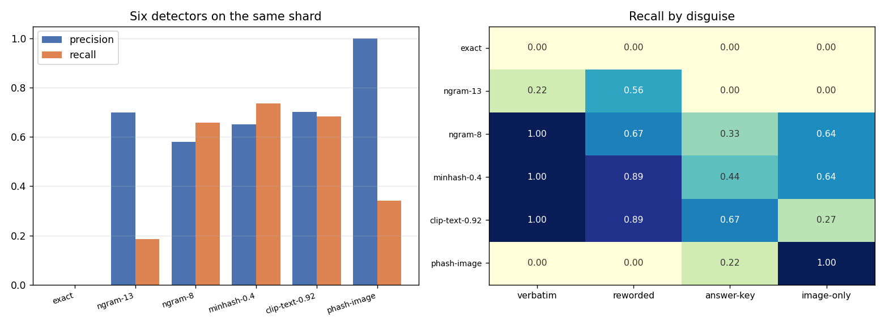
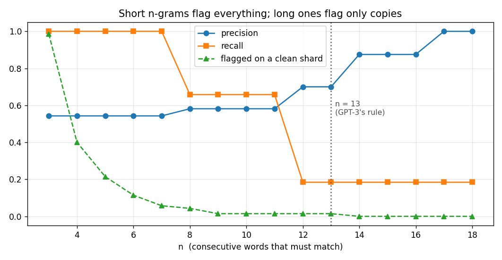
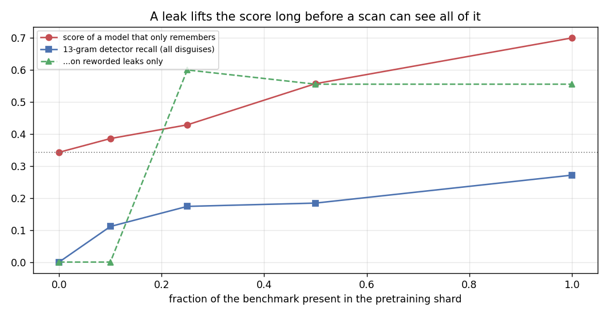

# Benchmark Contamination Check

## Key Insight

When a [benchmark](/shared/glossary/#benchmark)'s test questions have already appeared in a model's [pretraining](/shared/glossary/#pretraining) data, a high score measures memorization, not skill — this is [contamination](/shared/glossary/#contamination) (also called leakage), the AI equivalent of a student who studied from a stolen copy of the exam. This project searches a slice of a pretraining corpus for verbatim or near-verbatim copies of a benchmark's questions, typically by checking [n-gram](/shared/glossary/#n-gram) overlap — sliding a window of, say, 13 consecutive words across both and flagging exact matches — to estimate how much of the model's apparent "skill" is really recall. The lesson is a habit, not a tool: any suspiciously strong result deserves a contamination check before you believe it, because as benchmarks age they steadily seep into the web crawls that train the next generation of models.

**This is project 44.** It builds a pretraining shard with **known** leaks planted in four different disguises, runs six detectors over it, and finds that the standard 13-word scan sees **18%** of the contamination — and that a shorter scan, run on a benchmark whose questions share a template, reports **55 of 70 items contaminated when exactly one question leaked**.

## Why plant the leaks yourself

Run a detector over a real corpus and you get a number like "41 items flagged". That number is unusable on its own. You cannot tell how many leaks it *missed*, and you cannot tell how many of the 41 were coincidences. A detector with no ground truth has no [precision and recall](/shared/glossary/#precision-and-recall) — only a count.

So this project does what project [37](../37-mini-laion-pipeline/README.md) did for data filters: **it injects the defects it is going to hunt for.** We know exactly which benchmark items were leaked, in what form, and how many were not, so every detector gets a real precision and a real recall.

### The corpus

| part | what it is | size |
|---|---|---|
| clean text | MS-COCO captions from photos the benchmark never asks about | 2,400 documents |
| clean image-text pairs | photos 90–199 with their captions, so the image detector has something to be wrong about | 110 pairs |
| planted leaks | see below | 35 documents |
| **total shard** | | **2,645 documents** |

### The benchmark

70 questions taken **from project [42](../42-run-a-vlm-evaluation-harness/README.md)'s harness**, so these are literally the questions a model would be scored on: 40 [POPE](/shared/glossary/#pope)-style yes/no existence questions and 30 four-way caption multiple-choice items.

Their median length is **11 words**, and **40 of the 70 are shorter than 13 words**. Remember that number — it decides the fate of the standard detector.

### The four disguises

A leak in the wild almost never arrives as a clean copy-paste. These four are ordered from the version everybody imagines to the version nobody checks for:

| disguise | what lands in the corpus | why it happens in reality |
|---|---|---|
| `verbatim` | `Q: Is there a dog in the image? Answer yes or no. A: yes` | someone posted the eval set to a blog, a repo, or a quiz site |
| `reworded` | `Can we see any dog in the picture? The correct reply: yes` | a forum discussion, a translation, a retyped quiz |
| `answer-key` | `Answer key, item 12: yes` | a solutions file scraped without its questions |
| `image-only` | *a different annotator's caption of the benchmark's photo*, with the photo attached | the picture itself is on the web — no benchmark text involved at all |

> **"The last one has no benchmark text in it. Why does it count as contamination?"** Because a [VLM](/shared/glossary/#vlm) is trained on pictures *and* words. If the exam photo, together with a description of it, was in pretraining, the model may recognise the picture and recall what it was told about it — without ever having seen the question. This is the multimodal case that the standard text-scanning toolchain, borrowed wholesale from language-model work, is structurally unable to see. It is the reason this project sits in a multimodal guide rather than an LLM one.

### One thing that must be decided before any detector runs: what "contaminated" means

Our injection sheet records *which item* we leaked. But POPE asks **two** questions about each photo. When a photo lands in the corpus, both of its questions are compromised — even though only one of them is written on the sheet.

The first version of this project scored the image detector against the raw sheet, and the detector looked like it was producing false positives. It was not: it was right, and the label sheet was wrong. `expand_image_leaks` fixes this by marking every question that shares a leaked photo. **Defining the unit of contamination is part of the measurement, not a detail** — get it wrong and you will blame the detector for your own bookkeeping.

## The six detectors

| detector | what it compares | catches, in principle |
|---|---|---|
| `exact` | the lower-cased question string against whole documents | copy-paste, and nothing else |
| `ngram-13` | any 13 consecutive words in common | GPT-3's published rule |
| `ngram-8` | any 8 consecutive words in common | the same idea, looser |
| `minhash-0.4` | estimated [Jaccard](/shared/glossary/#jaccard-similarity) overlap of 5-word shingles ≥ 0.4 | near-duplicates; survives edits |
| `clip-text-0.92` | [cosine similarity](/shared/glossary/#cosine-similarity) of frozen [CLIP](/shared/glossary/#clip) text embeddings ≥ 0.92 | paraphrases with no shared words |
| `phash-image` | [perceptual hash](/shared/glossary/#perceptual-hash) of the *photo*, [Hamming distance](/shared/glossary/#hamming-distance) ≤ 6 | the picture, whatever the text says |

> **"Isn't [MinHash](/shared/glossary/#minhash) just a slower n-gram scan?"** No — the two ask different questions. An n-gram scan asks "is there *one* long stretch these documents share?", which is all-or-nothing: delete a single word from the middle of a 13-word run and the match vanishes. MinHash asks "what *fraction* of their short chunks overlap?", which degrades gracefully — dropping one word removes a handful of 5-word shingles out of hundreds, so a reworded copy still scores high. That difference is exactly what the `reworded` column shows below.

> **"And why a [perceptual hash](/shared/glossary/#perceptual-hash) rather than just hashing the image file?"** A file hash such as SHA-256 changes completely if one byte changes, so re-saving a JPEG at a different quality gives a totally unrelated hash. A perceptual hash is built to do the opposite: shrink the picture to 32×32 grey, keep only the eight-by-eight lowest-frequency [DCT](/shared/glossary/#dct) coefficients, and record which of them are above their own median. Re-compression and resizing barely move those numbers, so "the same photo, re-saved" lands within a few bits — "nearly identical" becomes a small integer instead of a yes/no. Project [37](../37-mini-laion-pipeline/README.md) measured how much better this is than a byte hash at finding duplicates.

## Results



70 benchmark items, 2,645 shard documents, 38 items contaminated (54%).

| detector | precision | recall | verbatim | reworded | answer-key | image-only | time |
|---|---|---|---|---|---|---|---|
| `exact` | — | **0.000** | 0.00 | 0.00 | 0.00 | 0.00 | 0.01 s |
| `ngram-13` | 0.700 | **0.184** | 0.22 | 0.56 | 0.00 | 0.00 | 0.01 s |
| `ngram-8` | 0.581 | 0.658 | **1.00** | 0.67 | 0.33 | 0.64 | 0.02 s |
| `minhash-0.4` | 0.651 | **0.737** | **1.00** | **0.89** | 0.44 | 0.64 | 0.23 s |
| `clip-text-0.92` | 0.703 | 0.684 | **1.00** | **0.89** | **0.67** | 0.27 | 106 s |
| `phash-image` | **1.000** | 0.342 | 0.00 | 0.00 | 0.22 | **1.00** | 0.19 s |

### 1. The strictest detector catches nothing at all

`exact` fires **zero** times, on a shard where more than half the benchmark is present. Every leak is embedded in something — a `Q:`/`A:` wrapper, a forum sentence, a caption — so the question is never a whole document by itself.

This is worth dwelling on, because "we checked for exact matches and found none" is a sentence that appears in real papers. It is close to meaningless: contamination almost never arrives as a standalone copy of your test file.

### 2. The industry-standard 13-gram scan sees 18% of the contamination, and the reason is arithmetic

`ngram-13` catches **0.22** of the *verbatim* leaks. Not the paraphrases — the literal copy-pastes.

The cause is the number flagged earlier: **40 of our 70 questions are shorter than 13 words.** A question that is 11 words long *has no 13-gram*. There is nothing for the scan to match, so it cannot fire, however blatantly the item was copied.

**Every short-question benchmark is invisible to a 13-gram scan.** That covers POPE, most of MMLU, most multiple-choice science QA, and every yes/no probe. The rule was designed for GPT-3's pretraining audit, where the test items were paragraphs. Copying it onto a benchmark of one-line questions produces a clean bill of health that means nothing.

### 3. Why 13, then? Because at 5 the scan flags everything



Same detector, same shard, only the window length changes. The third column is the one to read: it is the fraction of benchmark items flagged when the scan is run against a shard with **no leaks in it at all**.

| n | precision | recall | flagged on a **clean** shard |
|---|---|---|---|
| 3 | 0.543 | **1.000** | **0.986** |
| 5 | 0.543 | 1.000 | 0.214 |
| 8 | 0.581 | 0.658 | 0.043 |
| 11 | 0.581 | 0.658 | 0.014 |
| **13** | 0.700 | 0.184 | 0.014 |
| 14 | 0.875 | 0.184 | **0.000** |
| 17 | **1.000** | 0.184 | 0.000 |

At n=3, **98.6%** of items match something in a corpus that contains none of them, because English says "in the image" and "on a table" all the time. By n=14 the false-alarm rate is zero: fourteen consecutive words essentially never coincide by accident, so a match *is* evidence of copying.

That is the entire justification for the number 13. It is not a modelling insight — it is roughly where the two curves cross, chosen on corpora whose test items were long enough for the crossing to sit there. **On your corpus, with your question lengths, the crossover is somewhere else, and finding it is a five-second experiment.**

### 4. The templated-benchmark trap: one leaked question, 55 items flagged

Our benchmark's multiple-choice questions all end the same way — `Answer with the option's letter from the given choices directly.` — because that is what makes them machine-gradable. Every item shares that boilerplate.

So we planted **exactly one** verbatim leak in an otherwise clean shard and re-ran the scan:

| window | items flagged out of 70 | precision | did it find the leaked item? |
|---|---|---|---|
| 5-gram | **55** | 0.018 | yes, plus 54 others |
| 8-gram | 4 | 0.250 | yes, plus 3 others |
| 13-gram | 1 | **0.000** | **no** — the one item it flagged is a different one |

One leak, and a 5-gram scan reports 79% of the benchmark as contaminated. The scan is not detecting the leak; it is detecting that the leaked question **shares a template with the other 69**.

The 13-gram row is the previous section's finding arriving from the other direction: the leaked question is eleven words long, so it has no 13-gram, so the scan cannot find it — and the single item it *does* flag is an unrelated coincidence. Zero precision and zero recall, from a detector that fired.

The fix is to identify the boilerplate — the n-grams appearing in a quarter or more of the benchmark's *own* questions — and exclude it before matching:

| window | boilerplate n-grams found | plain (precision → recall) | template removed |
|---|---|---|---|
| 5 | 13 | 0.543 → 1.000 | **0.657** → 0.605 |
| 8 | 4 | 0.581 → 0.658 | **0.720** → 0.474 |
| 13 | 0 | 0.700 → 0.184 | unchanged |

Precision rises by 12–14 points at both short windows. **Any benchmark with a fixed answer-format instruction — which is nearly all of them — needs this step, or its contamination report is mostly a report about its own template.**

### 5. The picture is a leak channel, and no text detector can see it

`phash-image` has precision **1.000** and catches **every** image-only leak. The three sharpest text detectors catch 0.64, 0.64 and 0.27 of them — and even those are largely accidents, because a caption-multiple-choice question *contains* a caption, and two annotators describing the same photo do share words.

Stacking the detectors makes the division of labour explicit:

| combination | recall | image-only recall |
|---|---|---|
| all five text detectors, unioned | 0.971 | 0.875 |
| **+ the image hash** | **1.000** | **1.000** |

The image hash costs 0.19 s over the whole shard. **If you are auditing a vision-language benchmark and your contamination pipeline only reads text, you have left the cheapest and most specifically multimodal check on the floor.**

### 6. How much does a leak actually inflate a score?



Detecting contamination only matters if contamination changes results. To measure that we need a model whose *only* ability is recall, so every point above chance is provably memorization and nothing else.

`LookupModel` is that model. It finds the shard document with the largest 4-gram overlap with the question and copies any answer it can see there; if nothing is close enough, it guesses. It has no vision, no reasoning and no training.

| fraction of the benchmark leaked | lookup-model accuracy | what a 13-gram scan reports |
|---|---|---|
| 0% | **0.343** (its guessing floor) | 0.000 |
| 10% | 0.386 | 0.111 |
| 25% | 0.429 | 0.174 |
| 50% | 0.557 | 0.184 |
| 100% | **0.700** | 0.271 |

A pure memorizer doubles, 0.343 → 0.700, while the standard scan never reports more than 27% of the leak. On the `image-only` disguise the scan reports **0.00 at every leak rate**.

**Read the two columns together and the shape of the problem is clear: the score moves smoothly and early, the detector lags badly and then saturates.** A benchmark can be materially inflated at a leak rate where a 13-gram audit still comes back almost clean.

## What this setup cannot tell you

- **70 items and 2,645 documents.** Real audits run over billions of documents; the *shapes* of these curves transfer, the exact precisions do not. With 38 leaks, one item is worth 2.6 points of recall.
- **Our paraphrase is crude** — a synonym table plus a clause reorder. Someone retyping a question from memory would defeat every detector here except possibly the embedding one.
- **The `clip-text` detector uses [CLIP](/shared/glossary/#clip)'s text tower**, which truncates at 77 tokens and was trained on captions rather than questions. A sentence embedder built for retrieval would do better; the qualitative point — catches paraphrase, confuses "similar" with "copied" — would not change.
- **`LookupModel` is not a language model.** It shows that a leak *can* be converted into score, not how efficiently a transformer converts it. A real model's inflation from the same leak could be larger (it generalises from what it memorised) or smaller (one epoch may memorise nothing).
- **We never checked a real pretraining corpus.** We could not: the pretraining data of the models used in this phase is not public — which is itself the point. For most models you are auditing a corpus you cannot see, and the methods that still work are the ones that probe the *model* rather than the data.

## Files

| file | what it holds |
|---|---|
| `contam.py` | the benchmark builder, the four-disguise shard injector, the six detectors, `expand_image_leaks`, and `LookupModel`. Imports project 42's `harness.py` for the questions and project 37's `pipeline_lib.py` for `phash`/`hamming`. |
| `run.py` | the stages `detect` / `order` / `template` / `dose` / `plot` |
| `outputs/detect.json` | every detector's confusion matrix and per-disguise recall |
| `outputs/union.json` | text detectors alone vs text plus the image hash |
| `outputs/order.json` | the n-gram window sweep, including the clean-shard false-alarm rate |
| `outputs/template.json` | the boilerplate trap and the single-leak experiment |
| `outputs/dose.json` | score inflation vs leak rate |
| `outputs/*.png` | the three figures |

## How to run

Project [42](../42-run-a-vlm-evaluation-harness/README.md)'s photo bank is used and downloaded automatically if missing; project [20](../20-llava-from-scratch/README.md)'s `data/rows.json` supplies the COCO listing.

```bash
python3 run.py --stage detect     # six detectors (~2 min, almost all of it CLIP)
python3 run.py --stage order      # the n sweep (~10 s)
python3 run.py --stage template   # the boilerplate trap (~10 s)
python3 run.py --stage dose       # leak rate vs score (~20 s)
python3 run.py --stage plot
```

## Takeaways

1. **Inject the leaks so the detectors can be graded.** Without ground truth a contamination check reports a count, not a precision and a recall — and a count cannot tell you what it missed.
2. **"We found no exact matches" is close to meaningless.** Our `exact` detector fired zero times on a shard containing 54% of the benchmark.
3. **A 13-gram scan cannot see short questions.** 40 of our 70 items are under 13 words, so no 13-gram exists to match; the scan recovered 18% of the leak and 22% of the *verbatim* leak.
4. **The 13 in "13-gram" is a crossover point, not a law.** On this corpus a 3-gram scan flags 98.6% of items on a leak-free shard and a 14-gram scan flags 0.0%. Sweep it for your own question lengths — it takes seconds.
5. **A templated benchmark poisons its own audit.** One leaked question made a 5-gram scan flag 55 of 70 items; stripping the boilerplate bought 12–14 points of precision.
6. **In a multimodal benchmark the leak can arrive as pixels.** A perceptual hash caught 100% of the image-only leaks at precision 1.000 in 0.19 s; the text detectors caught them only by accident.
7. **The score inflates faster than the detector reacts.** A pure memorizer doubled its accuracy across the leak sweep while a 13-gram scan never reported more than 27% of the leak — so a clean audit is weak evidence, and a suspiciously strong result deserves a second, differently-shaped check.
