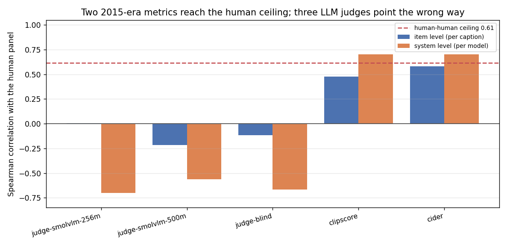
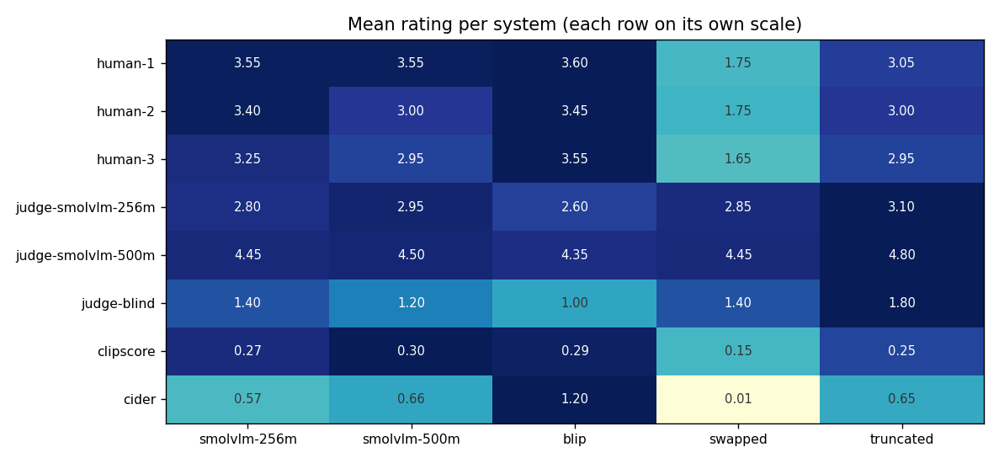
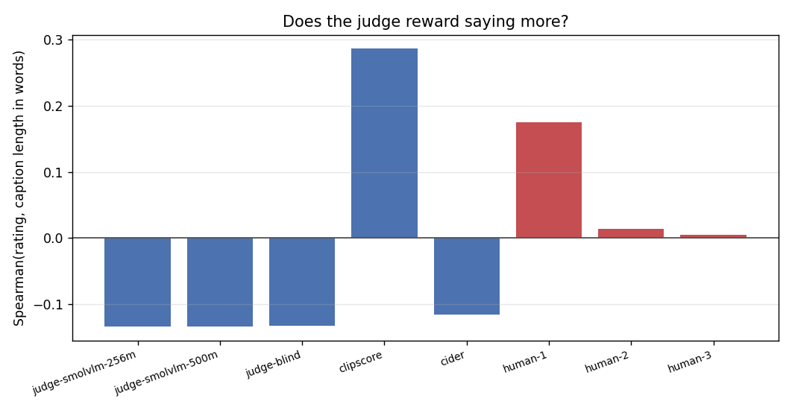

# Human-Correlated Eval

## Key Insight

[LLM-as-judge](/shared/glossary/#llm-as-judge) grading is only trustworthy if it actually agrees with humans, so you have to *measure* that agreement rather than assume it. This project collects both human ratings and LLM-judge ratings on the same 100 outputs and computes an [inter-rater agreement](/shared/glossary/#inter-rater-agreement) score (a correlation or Cohen's kappa): a high score means the cheap automatic judge can stand in for expensive human review, a low one means it cannot. The subtlety the project exposes is that an LLM judge carries consistent biases — it tends to favor longer answers and ones written in its own style — so lining up with a single human rater is not enough; you gather *three* human and *three* model ratings per output and check whether the model agrees with people about as well as people agree with each other.

**This is project 45.** It runs that measurement on 100 captions, and the answer is worse than "a bit noisy": the three small VLM judges are **negatively** correlated with the human panel at system level (−0.56 to −0.70), all three rank a three-word fragment *first*, and none of them can tell a caption of a **different photograph** from a correct one. Meanwhile [CIDEr](/shared/glossary/#cider), a word-counting metric from 2015, comes within 0.03 of the human ceiling.

## The honest problem: we have no human raters

There is no way around stating this plainly. So the design works around it by noticing that MS-COCO already contains something better than a rating panel — **five independent people describing the same photograph.**

Three "human raters" are built from three of those annotators. Rater *k* scores a caption by how well its content lines up with annotator *k*'s own sentence, using one fixed rule:

```
hits   = objects the caption and annotator k both name
extra  = objects the caption claims that annotator k did not mention
missed = objects annotator k mentioned that the caption ignores

rating = clip(round(3 + 1.25*hits - 1.0*extra - 0.5*missed), 1, 5)
```

> **"If the rule is mechanical, in what sense are these human raters?"** The *rule* is mechanical; the **disagreement between the three raters is genuinely human.** It comes from three people looking at one picture and choosing different things to say about it — one wrote "a dog in a shopping basket", another "shoes and a bag" — and the raters inherit that disagreement exactly. That is the quantity we need, because the [inter-rater agreement](/shared/glossary/#inter-rater-agreement) among the panel is the **ceiling**: no automatic judge should be expected to agree with people better than people agree with each other.
>
> What this proxy is **not** is a measurement of what humans mean by "quality". A real rater also weighs fluency, detail, and tone, and this rule is blind to all three. Every number below is agreement **about content**.

`extra` is punished harder than `missed` because inventing an object is a worse error than skipping one — the same asymmetry project [40](../40-multimodal-dpo/README.md)'s [hallucination](/shared/glossary/#hallucination) meter uses.

## The 100 outputs

Five systems × 20 photos. The five are chosen to span the failure modes a judge has to be able to tell apart:

| system | what it is | example output | mean words |
|---|---|---|---|
| `smolvlm-256m` | a real open VLM | *"In the image there is a metal pole with a bolt and a metal object on the ground."* | 14.5 |
| `smolvlm-500m` | its larger sibling | *"In the image there are two black scissors and a rusted nail on the ground."* | 15.6 |
| `blip` | project [37](../37-mini-laion-pipeline/README.md)'s recaptioner | *"a pair of rusty scissors sitting on top of a tree"* | 8.6 |
| `swapped` | **a human caption of a different photo** | *"Horses communing with each other on a shady street."* | 9.9 |
| `truncated` | a real caption cut to three words | *"A pair of"* | 3.0 |

> **"Why include two outputs that are obviously bad?"** Because they are the exam. `swapped` is fluent, grammatical, human-written and *about the wrong picture* — it is the [hallucination](/shared/glossary/#hallucination) case in its purest form, and a judge that cannot mark it down is not looking at the image at all. `truncated` is correct as far as it goes and useless, which separates "says nothing wrong" from "says something". A judge panel is validated by the cases where the right answer is unambiguous, not by the close calls.

## The five judges

| judge | what it sees | why it is here |
|---|---|---|
| `judge-smolvlm-256m` | image + caption, asked for 1–5 | LLM-as-judge, in miniature |
| `judge-smolvlm-500m` | image + caption, asked for 1–5 | does a bigger judge help? |
| `judge-blind` | **a blank grey card** + caption, asked for 1–5 | how much of the rating is about the picture at all? |
| `clipscore` | [CLIP](/shared/glossary/#clip) similarity between photo and caption | reference-free, no generation, no references |
| `cider` | [CIDEr](/shared/glossary/#cider) against the five human captions | the metric captioning papers actually report |

> **"The blind judge gets the same model and the same prompt — isn't it just a worse copy of the first one?"** That is the point of it. It is the same model, the same prompt, and the same number of image tokens; the *only* thing removed is the evidence. Whatever it still scores is what the judge was getting from the caption's wording alone. If the sighted judge barely beats it, the "vision-language judge" was grading English.

> **"[CIDEr](/shared/glossary/#cider) sees the answer key. Isn't that an unfair advantage?"** Yes, deliberately. It is reference-*based* — it is handed the five human captions — while the LLM judges are reference-*free* and must decide from the picture. Putting them side by side answers a practical question: **is it worth collecting references, or can a judge model replace them?** That is the actual trade a team faces, so the comparison should be run as the trade really is, unfairness included.

### The statistics, and why these ones

No `scipy` or `sklearn` here, so all four are implemented in `judge.py` in a dozen lines each.

- **[Spearman rank correlation](/shared/glossary/#spearman-correlation)** — an ordinary correlation computed on *ranks* instead of values. Ratings only guarantee that 5 beats 4, not that the step from 4 to 5 is the same size as from 1 to 2, and ranks are the only currency that respects that. It also shrugs off judges using different parts of the scale: our 500M judge rates everything 4.35–4.80 and our blind judge everything 1.0–1.8, and a rank correlation does not care.
- **[Cohen's kappa](/shared/glossary/#cohens-kappa)** — agreement between two raters with luck subtracted out. Two raters who both hand out 3s constantly agree often without either of them looking; kappa removes exactly that much credit. Named after Jacob Cohen (1960).
- **[Fleiss' kappa](/shared/glossary/#fleiss-kappa)** — the same idea for a whole panel rather than a pair (Joseph Fleiss, 1971).
- **System level vs item level** — correlate the 100 individual ratings, or first average each system's 20 ratings and correlate the five means. Papers usually report the second, and it is a much easier test.

## Results



### 1. The ceiling: three annotators agree at 0.62

| statistic | value |
|---|---|
| mean pairwise [Spearman](/shared/glossary/#spearman-correlation) | **0.615** |
| mean pairwise [Cohen's kappa](/shared/glossary/#cohens-kappa) | **0.621** |
| [Fleiss' kappa](/shared/glossary/#fleiss-kappa) (all three) | **0.620** |

By the usual reading of kappa that is "substantial" agreement — good but not identical, because two people describing one photo genuinely disagree about what matters in it. **This is the number every row below has to be read against.** A judge at 0.55 would be doing well; a judge at 0.62 would be indistinguishable from a fourth person.

### 2. Every LLM judge is at or below zero — and two of them rank the systems *backwards*

| judge | item-level ρ | kappa (3 bands) | **system-level ρ** |
|---|---|---|---|
| `judge-smolvlm-256m` | 0.003 | −0.039 | **−0.700** |
| `judge-smolvlm-500m` | −0.216 | −0.039 | **−0.564** |
| `judge-blind` | −0.116 | 0.000 | **−0.667** |
| `clipscore` | 0.475 | 0.184 | **+0.700** |
| `cider` | **0.581** | **0.199** | **+0.700** |
| *human panel (ceiling)* | *0.615* | *0.621* | — |

A correlation of 0.003 is not "weak agreement", it is **no relationship**. A *system-level* correlation of −0.700 is worse: it means that if you ranked the five caption systems by what this judge said, you would get an order that is closer to reversed than to right.

`cider` reaches 0.581 against a human ceiling of 0.615 — it recovers **94%** of the agreement a fourth human would have.

### 3. The reason, in one table



| rater | smolvlm-256m | smolvlm-500m | blip | **swapped** | **truncated** |
|---|---|---|---|---|---|
| `human-1` | 3.55 | 3.55 | 3.60 | **1.75** | 3.05 |
| `human-2` | 3.40 | 3.00 | 3.45 | **1.75** | 3.00 |
| `human-3` | 3.25 | 2.95 | 3.55 | **1.65** | 2.95 |
| `judge-smolvlm-256m` | 2.80 | 2.95 | 2.60 | **2.85** | **3.10** |
| `judge-smolvlm-500m` | 4.45 | 4.50 | 4.35 | **4.45** | **4.80** |
| `judge-blind` | 1.40 | 1.20 | 1.00 | **1.40** | **1.80** |
| `clipscore` | 0.27 | 0.30 | 0.29 | **0.15** | 0.25 |
| `cider` | 0.57 | 0.66 | **1.20** | **0.01** | 0.65 |

Read the two bold columns.

**All three humans mark `swapped` down by about 1.7 points** — a caption of a completely different photograph is the one thing everybody agrees is wrong. **The 256M judge rates it 2.85, which is *higher* than the 2.80 it gives the correct caption from the same model.** The 500M judge gives it 4.45, tied with the correct caption. The blind judge, which cannot see anything, gives it exactly what it gives the real ones.

**And all three judges rank `truncated` first.** *"A pair of"* is the single best caption in the set, according to every LLM judge we ran. The humans put it fourth of five.

`clipscore` and `cider` both get `swapped` right — 0.15 against 0.25–0.30, and 0.01 against 0.57–1.20. Neither is clever; they are just actually *comparing the caption to something*.

### 4. This is a judge-capacity failure, and the protocol is what found it

The honest framing matters here. "LLM-as-judge" in the literature means GPT-4-class models, and there is good published evidence that those *do* correlate with human raters. SmolVLM-256M and 500M are two to three orders of magnitude smaller. **What this project shows is not "LLM judges do not work" — it is that the method's validity is a property of the specific judge model, and it does not survive shrinking.**

Which is exactly why the measurement exists. Nothing about the judges' *outputs* looked broken: they returned well-formed numbers on a 1–5 scale for all 100 captions, with **no parse failures at all**. Handed a leaderboard built from them, you would have read plausible-looking scores and ranked five systems backwards. **The only thing that revealed the problem was correlating them against a panel and reading the sign.**

There is one cheap warning sign you *can* see without a panel, and it is worth checking first because it costs nothing — **how much of the scale the judge actually uses**:

| judge | distinct scores it ever gave, out of 1–5 |
|---|---|
| `judge-smolvlm-256m` | 1, 4, 5 |
| `judge-smolvlm-500m` | **4, 5** |
| `judge-blind` | **1, 5** |
| each human rater | 1, 2, 3, 4, 5 |

The 500M judge answered "4" or "5" to all 100 captions. A rating scale that collapses to two adjacent points is carrying at most one bit per item, and no amount of averaging recovers information that was never there. **If your judge never says 2, the problem is upstream of the correlation.**

### 5. The bias probes: the classic biases are not the ones here



**Length.** The textbook complaint about LLM judges is that they reward longer answers. Ours do the opposite:

| rater | Spearman(rating, caption length) |
|---|---|
| `judge-smolvlm-256m` | **−0.13** |
| `judge-smolvlm-500m` | **−0.13** |
| `judge-blind` | **−0.13** |
| `clipscore` | +0.29 |
| `cider` | −0.12 |
| `human-1` / `human-2` / `human-3` | +0.17 / +0.01 / +0.01 |

All three judges lean *short*, which is what put a three-word fragment at the top of their rankings. The lesson is not "judges prefer short" — it is that **the direction of the bias is a property of the model you are using, and you have to measure it rather than import it from a paper about a different model.**

**Self-preference.** The other classic worry is that a judge inflates outputs written in its own style. We measured it as (own-system rating − others) minus the same gap according to the panel:

| judge | own − others | panel's own − others | excess |
|---|---|---|---|
| `judge-smolvlm-256m` | −0.08 | +0.55 | **−0.62** |
| `judge-smolvlm-500m` | −0.01 | +0.25 | **−0.27** |

No self-preference — the excess is negative in both cases. That is a clean null result, and it has a mundane explanation: a judge that gives every system nearly the same score cannot show a preference for anything. **You cannot detect a bias in a judge that is not discriminating at all**, which is the right order to check things in: discrimination first, bias second.

### 6. Averaging first flatters the judges, and the direction of that flattery is the warning

Item-level ρ is computed over all 100 captions. System-level ρ averages each system's 20 ratings first, then correlates five numbers.

For `clipscore` the second is much kinder: 0.475 → 0.700. For `cider`, 0.581 → 0.700. **This is the standard result and it is why papers report system-level correlation** — averaging cancels per-item noise, and if all you want is to rank models, it is the number that matters.

But it cuts both ways. The LLM judges' system-level correlations (−0.70, −0.56, −0.67) are *more extreme* than their item-level ones (0.003, −0.216, −0.116), because averaging also amplifies a consistent bias into a confident wrong ranking. **A high system-level correlation on five systems is five data points, and it can be produced by a judge that is right about nothing in particular.** Report both.

## What this setup cannot tell you

- **The panel is a proxy.** Three independent human *descriptions*, converted to ratings by one fixed rule. It measures agreement about **content** and is blind to fluency, detail and tone, which real raters weigh. The ceiling of 0.62 is a real annotator-disagreement number; the ratings themselves are not real human ratings.
- **The judges are two to three orders of magnitude smaller than the models "LLM-as-judge" normally means.** Do not read section 2 as a claim about GPT-4-class judges. Read it as a demonstration of the protocol, and of how badly the method degrades with judge capacity.
- **20 photos, 100 outputs, five systems.** A system-level correlation over five points is very noisy — that is why the item-level column is reported next to it. The claims that survive: the ceiling near 0.62, `cider` near it, and every LLM judge failing to mark `swapped` down.
- **`truncated` is cut from the same caption `human-1` grades against**, giving it a small advantage on that rater. It scores below the real systems on all three raters regardless.
- **One prompt, one scale, one pass.** No swapped-order re-ask, no pairwise comparison, no self-consistency vote — all of which are standard tricks for stabilising a judge. A better prompt would raise these numbers; it would not turn −0.70 into +0.60.
- **`clipscore` is measured on the same frozen CLIP** used elsewhere in this phase, and CLIP is known to be weak at word order (project [42](../42-run-a-vlm-evaluation-harness/README.md)'s `caption-match` shows it at 0.467). Its 0.475 here is agreement about *topic*, largely.

## Files

| file | what it holds |
|---|---|
| `judge.py` | the five caption systems, the human-panel rule, the three judge classes, and from-scratch `spearman` / `cohen_kappa` / `fleiss_kappa` / `pearson` / `rankdata`. Imports project 42's `harness.py` for the photo bank and CIDEr, and project 37's `pipeline_lib.py` for BLIP and CLIP. |
| `run.py` | the stages `outputs` / `rate` / `analyse` |
| `outputs/captions.json` | the 100 rated outputs |
| `outputs/ratings.json` | all eight raters' scores for all 100 outputs |
| `outputs/agreement.json` | the ceiling, every judge's correlations, and the bias probes |
| `outputs/*.png` | the three figures |

## How to run

Project [42](../42-run-a-vlm-evaluation-harness/README.md)'s photo bank is used and downloaded automatically if missing.

```bash
python3 run.py --stage outputs    # 100 captions from 5 systems (~2 min)
python3 run.py --stage rate       # 3 human-derived + 5 automatic raters (~7 min)
python3 run.py --stage analyse    # agreement, bias probes, figures (~5 s)
```

## Takeaways

1. **Measure the ceiling before measuring the judge.** Three human annotators agree at Spearman 0.615 and [Fleiss' kappa](/shared/glossary/#fleiss-kappa) 0.620. Without that number, "the judge scored 0.48" has no meaning.
2. **Put a case in the set where the right answer is not arguable.** `swapped` — a fluent human caption of the *wrong photo* — is what exposed the judges; every human marked it down 1.7 points and not one LLM judge marked it down at all.
3. **A judge can produce perfectly formatted, plausible numbers and still be anti-correlated with people.** All 100 ratings parsed; the system-level correlations were −0.70, −0.56 and −0.67.
4. **[LLM-as-judge](/shared/glossary/#llm-as-judge) validity is a property of the judge model, not of the method.** It does not survive being shrunk to 256M parameters, and nothing in the outputs tells you that — only the correlation does.
5. **A 2015 n-gram metric beat all three neural judges**, reaching 94% of the human ceiling. Reference-based metrics are unfashionable, but if you have references they are very hard to beat cheaply.
6. **Check that a judge discriminates before hunting for its biases.** Our self-preference probe came back clean, for the uninteresting reason that a judge which rates everything 4.4 cannot prefer anything.
7. **Report item-level and system-level correlation together.** Averaging 20 ratings per system lifted the good metrics from 0.48 to 0.70 — and made the bad judges' wrong rankings look *more* confident, not less.
