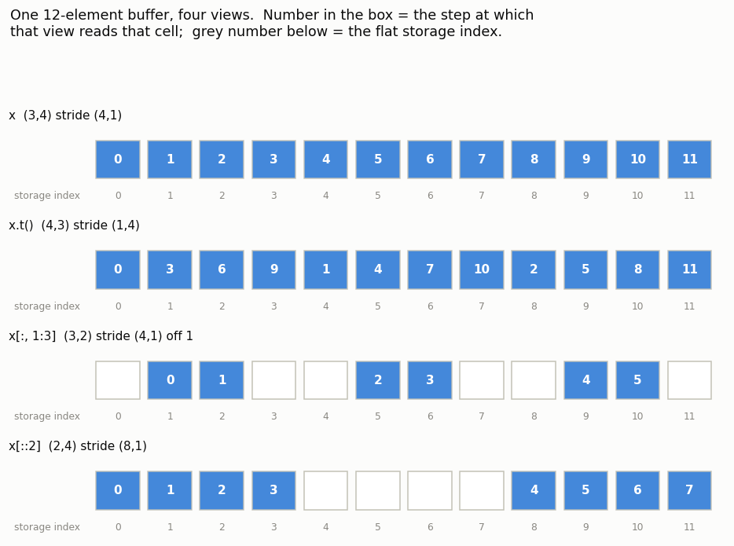
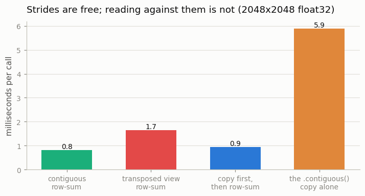

# Stride Explorer

---

> Tensors don't store grids; they store lines and use "strides" to jump through them.

---

## Key Insight

A [tensor](/shared/glossary/#tensor) is a view into a flat [storage](/shared/glossary/#storage) buffer. By changing [strides](/shared/glossary/#stride), PyTorch can "re-shape" data instantly without moving a single byte.

## Why This Matters

Understanding strides explains why some operations (like `.view()`) fail and why others (like `.transpose()`) are free. It is the secret to writing fast, memory-efficient code.

---

**This is project 1.** It takes one 12-number buffer and looks at it sixteen
different ways, printing `.shape`, `.stride()`, `.storage_offset()` and
`.is_contiguous()` for each. Two things come out of it that most PyTorch users
get wrong: **[broadcasting](/shared/glossary/#broadcasting) is literally a stride of 0**, and **`.view()` does not
actually require a [contiguous](/shared/glossary/#contiguous) tensor** — one of the six cases here is
non-contiguous and `.view(-1)` works on it anyway.

---

## Files

| file | what it is |
|---|---|
| `run.py` | all five experiments and the three figures |
| `plot_style.py` | shared chart colors, imported by projects 02–05 |
| `outputs/` | figures, `layout_table.csv`, `timings.csv` |

```bash
python3 run.py     # ~4 seconds; needs torch, numpy, matplotlib
```

---

## The one idea

Your computer's memory is a line. Not a grid, not a cube — a line, numbered
`0, 1, 2, 3, …`. But you want to write `x[2, 3]`. Something has to translate
between the two.

That something is a tiny piece of arithmetic:

```
storage_index  =  offset  +  i * stride[0]  +  j * stride[1]  +  ...
```

`stride[d]` answers one question: **"if I take one step along dimension `d`,
how many places do I move along the line?"** That is where the word comes
from — the same *stride* as a walking stride, the size of one step. It is not a
metaphor about speed; it is a distance.

So a [tensor](/shared/glossary/#tensor) is not a container of numbers. It is a **set of instructions for
reading a container of numbers**: which buffer, where to start (`offset`), and
how far to step along each axis (`stride`). Change the instructions and you get
a completely different-looking tensor **for free**, because the numbers never
moved.

Here are four views of the very same 12 numbers. The number inside each box is
*when* that view reads that cell (step 0, step 1, step 2…); the grey number
underneath is the fixed position in storage:



Look at row 2, `x.t()`. It reads exactly the same twelve cells as row 1 — it
just reads them in a different **order**: 0, 3, 6, 9, then 1, 4, 7, 10… That is
the whole of what "transpose" does. No number was copied, moved, or even read.

---

## 1. Sixteen views of one tensor

```
expression                          shape           stride                   off  contig  shares
------------------------------------------------------------------------------------------------
x = arange(12).reshape(3,4)         (3, 4)          (4, 1)                     0    True    True
x.t()                               (4, 3)          (1, 4)                     0   False    True
x.permute(1,0)                      (4, 3)          (1, 4)                     0   False    True
x.reshape(4,3)                      (4, 3)          (3, 1)                     0    True    True
x.view(2,6)                         (2, 6)          (6, 1)                     0    True    True
x.flatten()                         (12,)           (1,)                       0    True    True
x[1]                                (4,)            (1,)                       4    True    True
x[:, 2]                             (3,)            (4,)                       2   False    True
x[:, 1:3]                           (3, 2)          (4, 1)                     1   False    True
x[::2]                              (2, 4)          (8, 1)                     0   False    True
x[:, ::2]                           (3, 2)          (4, 2)                     0   False    True
x.unsqueeze(0)                      (1, 3, 4)       (12, 4, 1)                 0    True    True
x.t().contiguous()                  (4, 3)          (3, 1)                     0    True   False
x.t().reshape(12)                   (12,)           (1,)                       0    True   False
x.diagonal()                        (3,)            (5,)                       0   False    True
x.clone()                           (3, 4)          (4, 1)                     0    True   False
```

`shares` is the honest test: does this tensor still point at the original
buffer? Thirteen of the sixteen do. Read a few rows slowly:

- **`x[1]`** — offset jumped to 4. Row 1 starts at storage position 4, and from
  there it is four consecutive numbers, so its stride is `(1,)`. Slicing a row
  costs nothing.
- **`x[:, 2]`** — a *column*. Offset 2, stride `(4,)`: start at position 2, then
  jump 4 each time. Non-contiguous, because a column of a row-major matrix is
  scattered through memory. Still free.
- **`x.diagonal()`** — stride `(5,)`. To walk a diagonal you move one row *and*
  one column at once, so you step `4 + 1 = 5`. PyTorch expresses "diagonal" as a
  single number. Nothing is copied.
- **`x.t().contiguous()`** — `shares = False`. This one *did* copy. That is what
  `.contiguous()` means: "give me a tensor with the same numbers whose strides
  are back in the normal descending order," and the only way to get that is to
  physically rewrite them.

> **Why does `.diagonal()` deserve a mention when `x[i, i]` in a loop gives the
> same numbers?** Because the loop version is a Python loop over `n`
> single-element reads, each one a separate dispatch into PyTorch's C++ layer.
> `.diagonal()` produces one tensor whose stride happens to be `n+1`, and every
> later operation on it (`.sum()`, `.mean()`, `+= 1`) runs as one vectorised C++
> kernel. Same numbers, but one is a Python loop and the other is not.

### The word "contiguous"

*Contiguous* is Latin for "touching" — the same root as *contact*. A contiguous
tensor is one whose elements sit **touching each other in memory, in exactly the
order you would read them**: `[0,0]`, `[0,1]`, `[0,2]`, `[1,0]`… no gaps, no
back-tracking. That is the layout every fast kernel assumes.

The normal, no-gaps layout is called **row-major** (also "C order", because the
C language stores arrays this way): the *last* index is the one that changes
fastest as you walk memory. That is why the stride of a `(3, 4)` tensor is
`(4, 1)` — the last dimension steps by 1. Fortran, MATLAB and Julia use the
opposite convention, **column-major**, which is exactly what `x.t()`'s stride
`(1, 4)` describes. Transposing does not create a weird tensor; it creates a
column-major one.

---

## 2. Broadcasting is a stride of zero

```
expression                          shape           stride                   off  contig  shares
------------------------------------------------------------------------------------------------
col = arange(3).reshape(3,1)        (3, 1)          (1, 1)                     0    True    True
col.expand(3, 5)                    (3, 5)          (1, 0)                     0   False    True
col.expand(3, 1000)                 (3, 1000)       (1, 0)                     0   False    True
col.repeat(1, 5)                    (3, 5)          (5, 1)                     0    True   False
col.broadcast_to((4,3,5))           (4, 3, 5)       (0, 1, 0)                  0   False    True

col.expand(3, 1_000_000): 3,000,000 logical elements, 12 bytes of real storage
col.repeat(1, 1_000_000): would need 12,000,000 bytes
```

**Stride 0 means "taking a step along this axis moves you nowhere."** Every
column reads the same memory cell. The tensor claims to be 3×1,000,000 and
occupies 12 bytes.

This is the mechanism behind broadcasting, and it explains why broadcasting is
free. When you write `matrix + column_vector`, PyTorch does not build a big
copy of the column vector — it gives it a stride of 0 on the axis it needs to
stretch and hands that to the kernel. In plain terms: **stretching a tensor
costs nothing because the stretch is a lie told to the index formula.**

`repeat` is the opposite: `shares = False`, real memory, a million times more of
it. The rule that follows: **prefer `expand` over `repeat` unless you actually
need to write into the result** (you cannot safely write into a stride-0 tensor —
several logical positions would fight over one memory cell).

---

## 3. A real image batch, and `channels_last`

```
expression                          shape           stride                   off  contig  shares
------------------------------------------------------------------------------------------------
img (N,C,H,W)                       (8, 3, 32, 32)  (3072, 1024, 32, 1)        0    True    True
img.permute(0,2,3,1)  # NHWC        (8, 32, 32, 3)  (3072, 32, 1, 1024)        0   False    True
img.to(memory_format=channels_last) (8, 3, 32, 32)  (3072, 1, 96, 3)           0   False   False
img.flatten(2)                      (8, 3, 1024)    (3072, 1024, 1)            0    True    True
img[:, 0]                           (8, 32, 32)     (3072, 32, 1)              0   False    True
img[2:4]                            (2, 3, 32, 32)  (3072, 1024, 32, 1)     6144    True    True
```

Read the strides of `img` right to left: step 1 to move one pixel across,
step 32 to move one row down, step 1024 (= 32×32) to move to the next colour
channel, step 3072 (= 3×1024) to move to the next image. Strides are just the
sizes of the blocks below you.

`img[2:4]` has offset 6144 = 2 × 3072: "skip the first two images." Slicing a
batch is free.

> **`permute(0,2,3,1)` and `channels_last` produce the same memory order — so
> why does PyTorch have a separate `channels_last` flag?** Because they differ
> in the *shape you index with*. After `permute` the tensor's shape is
> `(8,32,32,3)`: every layer downstream now has to be written for NHWC, and
> `nn.Conv2d` will refuse it. After `.to(memory_format=channels_last)` the shape
> is still `(8,3,32,32)` — your code, and `nn.Conv2d`, see the ordinary NCHW
> tensor they expect — but the *strides* say the channel is the fastest-moving
> axis. That is the whole trick: `channels_last` changes the memory order while
> leaving the API untouched, which is what lets a convolution kernel pick the
> layout it prefers without you rewriting the model.

---

## 4. `.view()` does not require contiguity

This is the honest inversion of this project. The usual rule of thumb — and the
one in the guide's Key Insight — is "`view` needs a contiguous tensor." Here is
what actually happens:

```
expression                stride                contiguous    view(-1) works
----------------------------------------------------------------------------
x                         (12, 4, 1)                  True              True
x.transpose(1,2)          (12, 1, 4)                 False             False
x.permute(2,0,1)          (1, 12, 4)                 False             False
x[:, :, ::2]              (12, 4, 2)                 False              True     <--
x[:, 1:]                  (12, 4, 1)                 False             False
x[:, :1].expand(2,3,4)    (12, 0, 1)                 False             False
```

Row 4 is not contiguous and `.view(-1)` works anyway. The real rule is:

> `.view(new_shape)` succeeds when the elements you are asking for can be
> described by **some** set of strides on the same memory. It fails when they
> cannot.

`x[:, :, ::2]` is every other column: storage positions 0, 2, 4, 6, 8, 10, 12…
— a perfectly regular ladder, so "stride 2, length 12" describes it. `x[:, 1:]`
drops the first row of each image, leaving gaps of *different* sizes, and no
single stride can express that.

So "contiguous" is a **sufficient** condition, not a **necessary** one. In plain
terms: if your tensor is contiguous, `.view()` is guaranteed to work; if it is
not, `.view()` might still work, and PyTorch will tell you when it cannot. The
rule of thumb is a safe simplification, not the mechanism — and now you know the
mechanism.

The practical advice does not change: when `.view()` raises *"view size is not
compatible with input tensor's size and stride"*, either call `.contiguous()`
first or use `.reshape()`, which does that for you.

---

## 5. What non-contiguity actually costs

Strides are free to *create*. Reading against them is not.



```
(single-threaded, best of 7 x 20 calls)
row-sum over contiguous 2048x2048             0.82 ms
row-sum over transposed view                  1.65 ms   (2.0x slower)
row-sum after .contiguous()                   0.93 ms
cost of the .contiguous() copy itself         5.89 ms
-> copying pays for itself after 8.2 reuses
```

The same arithmetic — 4 million additions — takes about twice as long when the
numbers are walked column-wise. Nothing about the maths changed. What changed is
that the CPU pulls memory in 64-byte **cache lines**: reading consecutive floats
gets 16 useful numbers per fetch, while jumping 2048 floats between reads gets 1
useful number per fetch and throws the other 15 away.

But notice the last two lines, which is where people go wrong: `.contiguous()`
costs about **5.9 ms** — seven times a single row-sum. Calling it "to make things
fast" makes things *slower* unless you reuse the copy several times over. The
decision rule:

- reading a non-contiguous tensor **once or twice** → just read it
- feeding it to something that will scan it **many times** (a matmul, a
  convolution, a training loop) → `.contiguous()` once, up front

(Exact milliseconds vary with the machine and with what else it is doing — this
run's contiguous baseline moved between 0.5 and 1.1 ms across launches. The
*ratios* are the stable part, and the script reports single-threaded best-of-7
to keep even those honest.)

---

## What to take away

1. A tensor is `(storage, shape, stride, offset, dtype, device)`. Only
   `storage` holds numbers; everything else is instructions for reading it.
2. `transpose`, `permute`, `unsqueeze`, basic slicing, `expand` and `diagonal`
   **never copy**. They rewrite strides.
3. `clone`, `contiguous`, `repeat` and *sometimes* [`reshape`](/shared/glossary/#reshape) **do** copy.
   `shares_storage` in `outputs/layout_table.csv` tells you which is which.
4. Broadcasting = stride 0. That is the entire mechanism.
5. `.view()` needs the request to be *expressible* in strides. Contiguity
   guarantees that; it is not the requirement itself.
6. Non-contiguous reads cost roughly 2× here, and fixing them costs more than
   eight reads — so measure before you sprinkle `.contiguous()` around.

Next: [project 2](../02-view-vs-copy-detective/README.md) asks the dangerous
follow-up question — if thirteen of those sixteen tensors share memory, what
happens when you write into one?
