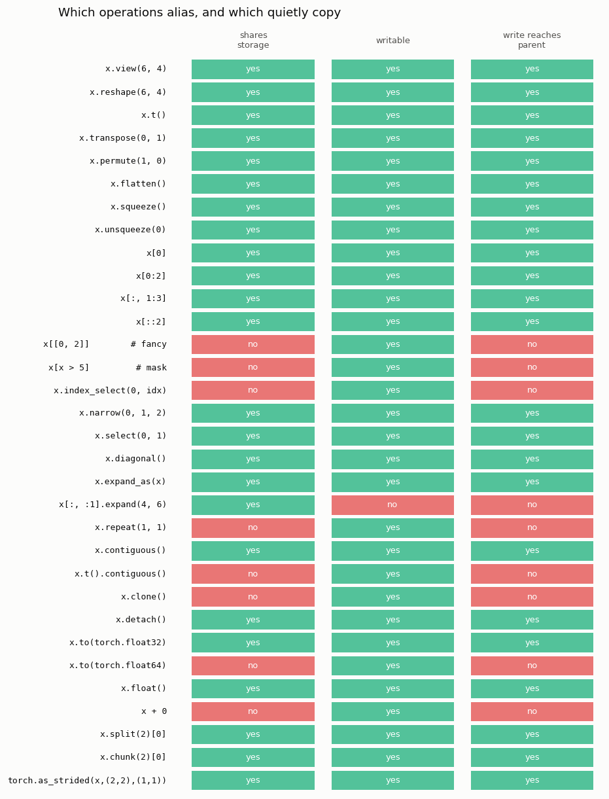
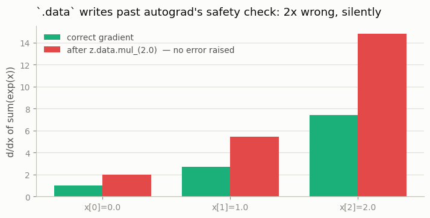

# View vs. Copy Detective

---

> Is it a new tensor, or just a new way of looking at the old one?

---

## Key Insight

A [view](/shared/glossary/#view) shares memory with its parent; a copy is independent. If you change a view, you change the original [storage](/shared/glossary/#storage).

## Why This Matters

Accidentally modifying a view can corrupt your original dataset or model weights. Learning to spot the difference prevents these silent, hard-to-find bugs.

---

**This is project 2.** [Project 1](../01-stride-explorer/README.md) showed that
most operations do not copy. This one asks the follow-up question that actually
bites: **if I write into the result, does the original change?** Thirty-two
operations get tested, and the answer is "yes" for twenty-three of them. Then three
consequences — a dataset that quietly rewrites itself between epochs, a
`reshape` that aliases on one tensor and copies on the next, and a gradient that
comes out exactly 2× wrong with no error message at all.

---

## Files

| file | what it is |
|---|---|
| `run.py` | the detector, the five demos, both figures |
| `outputs/` | `view_vs_copy.csv`, `findings.csv`, two figures |

```bash
python3 run.py     # ~3 seconds; needs torch, numpy, matplotlib
```

(`plot_style.py` is imported from
[project 1](../01-stride-explorer/README.md) so every figure in Phase 1 looks
the same.)

---

## The detector

For each operation the script asks three questions that are *not* the same
question:

| question | how it is tested | why it is separate |
|---|---|---|
| **shares storage?** | do parent and child point at the same buffer? | pure metadata — cheap, but does not tell you what a write does |
| **writable?** | does `child.add_(100)` raise? | some tensors share memory yet refuse writes |
| **write reaches parent?** | did the parent's numbers change? | the only question your bug actually cares about |



```
expression                          shares  _is_view  writable   write hits parent
----------------------------------------------------------------------------------
x.view(6, 4)                          True      True      True                True
x.reshape(6, 4)                       True      True      True                True
x.t()                                 True      True      True                True
x.permute(1, 0)                       True      True      True                True
x.flatten()                           True      True      True                True
x[0]                                  True      True      True                True
x[0:2]                                True      True      True                True
x[:, 1:3]                             True      True      True                True
x[::2]                                True      True      True                True
x[[0, 2]]        # fancy             False     False      True               False
x[x > 5]         # mask              False     False      True               False
x.index_select(0, idx)               False     False      True               False
x.narrow(0, 1, 2)                     True      True      True                True
x.select(0, 1)                        True      True      True                True
x.diagonal()                          True      True      True                True
x[:, :1].expand(4, 6)                 True      True     False               False
x.repeat(1, 1)                       False     False      True               False
x.contiguous()                        True      True      True                True
x.t().contiguous()                   False     False      True               False
x.clone()                            False     False      True               False
x.detach()                            True     False      True                True
x.to(torch.float32)                   True      True      True                True
x.to(torch.float64)                  False     False      True               False
x + 0                                False     False      True               False
x.split(2)[0]                         True      True      True                True
x.chunk(2)[0]                         True      True      True                True
```

(Six near-duplicate rows trimmed for space — `transpose`, `squeeze`,
`unsqueeze`, `expand_as`, `float`, `as_strided` — all of them views. The full
32-row table is in `outputs/view_vs_copy.csv` and in the figure above.)

Four rows are worth stopping on.

### `x[0:2]` aliases; `x[[0, 2]]` does not

These look like the same thing — "give me some rows" — and one of them writes
through to your data while the other does not.

- **`x[0:2]` is basic slicing.** Rows 0 and 1 are next to each other in memory,
  so "start here, take two steps of this size" describes them. That is a
  [stride](/shared/glossary/#stride), so PyTorch returns a view.
- **`x[[0, 2]]` is advanced (or "fancy") indexing.** Rows 0 and 2 with row 1
  skipped — but the general case is `x[[3, 0, 3, 7]]`, in any order, with
  repeats. No single stride can express that, so PyTorch has no choice: it
  allocates and copies.

The rule underneath: **PyTorch returns a view exactly when the elements you
asked for form a regular ladder in memory.** When they do not, it copies. Boolean
masks (`x[x > 5]`) are in the same boat — the result's length is not even known
until the mask is evaluated.

### `x[:, :1].expand(4, 6)` shares memory but refuses writes

This is the [broadcasting](/shared/glossary/#broadcasting) trick from project 1: stride 0, six logical columns
all reading one memory cell. PyTorch marks it read-only, because a write like
`t[0, 3] = 5` has no sensible meaning when positions `[0,0]` through `[0,5]` are
all the same byte. It is the one row in the table where "shares storage" is
`yes` and "writable" is `no`.

### `x.to(torch.float32)` on a float32 tensor returns the *same tensor*

```
x.to(torch.float32) shares storage: True
x.to(torch.float64) shares storage: False
after 'same += 99',  x = [100.0, 100.0, 100.0, 100.0]
```

> **If `.to(dtype)` is supposed to convert, why does it sometimes not copy?**
> Because `.to()` promises the *result's* [dtype](/shared/glossary/#dtype), not a fresh allocation. If
> the tensor is already that dtype there is nothing to do, so it hands the same
> tensor back. This trips people who write `x = x.to(torch.float32)` at the top
> of a function believing they have made a private copy — they have not, and
> their in-place work then leaks out to the caller. When you want a copy, say
> `.clone()`; that is the operation whose *only* job is copying.

### `x.detach()` shares storage but is not flagged a view

`_is_view()` says `False`, yet the numbers are the same memory. `detach()`
does not change the layout at all — it produces a tensor with the same storage
and the same strides but no link to the [autograd](/shared/glossary/#autograd) graph. It is
"a copy" only in the sense of *history*, never in the sense of *memory*. That
distinction is the whole subject of the last section below.

---

## `reshape()` is a view on one tensor and a copy on the next

```
a.is_contiguous()=True  -> a.reshape(12) shares storage: True
b.is_contiguous()=False -> b.reshape(12) shares storage: False
after writing -1 into each result:  a[0,0]=  -1.0   b[0,0]=   0.0
  -> identical code. The write escaped into `a` and vanished for `b`.
```

Same line of code, opposite behaviour, decided by a property of the *input* that
nothing in the line mentions. [`reshape`](/shared/glossary/#reshape) is defined as
"give me this shape by whatever means necessary": it returns a view when one
exists and copies when one does not.

This is why `.view()` still exists even though `.reshape()` is strictly more
capable. `.view()` **fails loudly** rather than silently copying, so when you
need the no-copy guarantee — you are about to write through the result, or you
are counting bytes — `.view()` is the one that will tell you when your
assumption breaks. Reach for `.reshape()` when you only care about the shape,
and `.view()` when you also care about the memory.

---

## The NumPy bridge: two of three constructors alias

```
numpy array after writing through all three tensors: [7.0, 8.0, 1.0, 1.0, 1.0]
  torch.from_numpy -> alias (index 0 changed)
  torch.as_tensor  -> alias (index 1 changed)
  torch.tensor     -> copy  (index 2 unchanged)
```

`torch.from_numpy(arr)` and the tensor share one buffer in both directions:
change the tensor, the NumPy array changes; change the array, the tensor
changes. `torch.tensor(arr)` copies (and warns if you hand it a tensor instead
of an array, precisely because the copy is usually not what you wanted).

This is a genuine feature — it is how you move data between libraries for free —
but it means a `Dataset.__getitem__` that does `torch.from_numpy(self.data[i])`
and then normalises in place is editing the file-backed array underneath.

---

## The realistic bug: a dataset that rewrites itself

```python
def get_batch(i):
    return dataset[i]        # a VIEW into the dataset

b = get_batch(i)
b -= b.mean()                # in-place normalisation
```

```
total change to the dataset, view version : 45.0
total change to the dataset, clone version: 0.0
```

Nothing raised. Nothing warned. The loss curve still went down. But epoch 2
trained on data that epoch 1 rewrote, and epoch 3 on data that epoch 2 rewrote
again — a slow drift that looks exactly like a model that stops improving for
mysterious reasons.

The fix is one of:

- `b = dataset[i].clone()` — pay for a copy per batch
- `b = b - b.mean()` — the out-of-place version allocates a new tensor
- do the normalisation once, up front, deliberately, on the whole dataset

The general habit worth building: **an in-place operator (`-=`, `.add_()`,
`.clamp_()`, anything ending in `_`) on a tensor you did not allocate yourself
is a question mark.** Ask where it came from.

---

## The silent wrong gradient

Two ways to make the same edit. One is caught; one is not.

```
correct  d/dx sum(exp(x)) = [1.0, 2.7182817459106445, 7.389056205749512]

z.mul_(2.0)      -> one of the variables needed for gradient computation
                    has been modified by an inplace operation
z.data.mul_(2.0) -> no error, gradient = [2.0, 5.4366, 14.7781]
                    correct would be     [1.0, 2.7183, 7.3891]
  -> every gradient is 2.0x too large, silently.
```



Here is the mechanism. `z = x.exp()` records a node in the [autograd](/shared/glossary/#autograd) graph, and
that node saves `z` itself — because the derivative of `exp` is `exp`, so
backward can reuse the output instead of recomputing it. Every saved tensor
carries a **version counter**: a small integer that PyTorch bumps on every
in-place write. At `backward()` time it compares the counter against the value
recorded when the tensor was saved, and if they differ it refuses to continue,
because the number it saved is no longer the number that is there.

`z.mul_(2.0)` bumps the counter → caught, with the paragraph-long error message
everyone has seen.

`z.data.mul_(2.0)` makes exactly the same edit to exactly the same memory, but
`.data` hands back a tensor **whose version counter is a fresh one**, so the
bump never reaches the saved tensor. Backward runs happily and returns `2·exp(x)`
— twice the true gradient, with no complaint at any point.

> **If `.data` and `.detach()` both "remove the gradient history", why prefer
> `.detach()`?** Because they differ in exactly one thing, and it is the thing
> that matters here. `.detach()` returns a tensor that **shares the version
> counter** with the original, so an in-place write through it is still noticed
> and still raises. `.data` returns one that does not, so the same write becomes
> undetectable. `.data` is a leftover from the pre-0.4 era when tensors and
> `Variable`s were different types; today it is `.detach()` with the safety
> check removed, which is why the docs steer you away from it.

Training with a gradient that is 2× too big is not a crash — it is a run that
converges to a slightly worse place, or diverges at a learning rate that "should
have been fine". That is the whole category of bug this project exists to make
visible.

---

## What to take away

1. Views are the default. Twenty-three of the thirty-two operations tested
   write through to their parent, and a twenty-fourth shares memory but is
   read-only.
2. Basic slicing views; fancy indexing and boolean masks copy. The dividing
   line is whether the elements form a regular stride pattern.
3. `reshape`, `flatten` and `.to(dtype)` are **conditional** — view or copy
   depending on the input. Never rely on them for either behaviour.
4. `torch.from_numpy` and `torch.as_tensor` alias; `torch.tensor` copies.
5. In-place ops on a tensor you were handed are the top source of silent data
   corruption. `.clone()` when in doubt; the copy is cheaper than the bug.
6. Autograd's version counter catches in-place edits to saved tensors — unless
   you route around it with `.data`, which turns a loud error into a silently
   wrong gradient.

Next: [project 3](../03-manual-indexing/README.md) stops taking PyTorch's word
for any of this and computes the memory addresses by hand.
