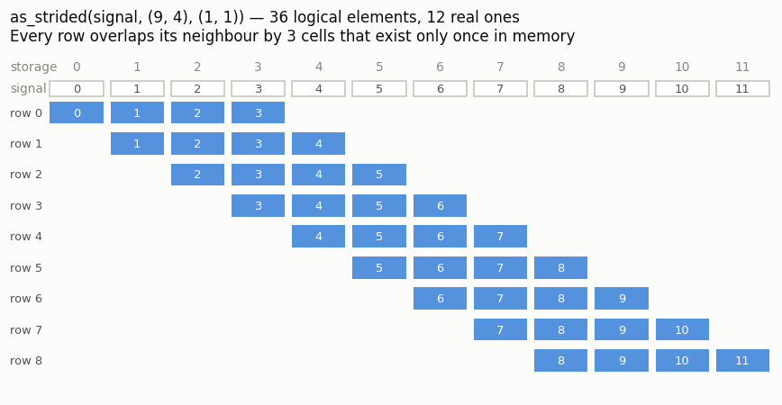
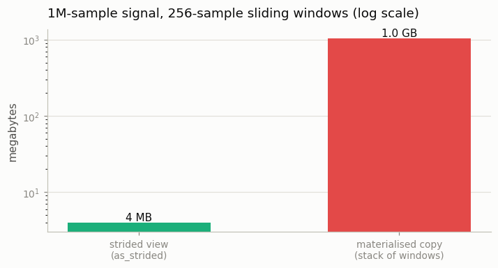

# The Indexing Formula

---

> Under the hood, every 5D tensor is just a 1D list.

---

## Key Insight

PyTorch uses a simple math formula to find data in memory: [`flat_index = offset + Σ(index * stride)`](/shared/glossary/#indexing). Mastering this formula demystifies how tensors actually work.

## Why This Matters

This formula is why PyTorch is fast. Knowing it helps you predict when operations will be efficient and why "non-contiguous" errors happen.

---

**This is project 3.** Projects [1](../01-stride-explorer/README.md) and
[2](../02-view-vs-copy-detective/README.md) took PyTorch's word for how tensors
are laid out. This one stops doing that: it computes **862 memory addresses by
hand** and checks every one against `.data_ptr()` (0 mismatches), reimplements
a working tensor class in 40 lines of plain Python, and then runs the formula
*backwards* — inventing a stride PyTorch would never have chosen, to get
1,000,000 sliding windows out of a 4 MB signal instead of a 1 GB copy.

---

## Files

| file | what it is |
|---|---|
| `run.py` | the formula, the verification, `MiniTensor`, the sliding-window trick |
| `outputs/` | `verification.csv`, `findings.csv`, two figures |

```bash
python3 run.py     # ~4 seconds; needs torch, numpy, matplotlib
```

---

## The formula, and why you should be able to write it

```python
def flat_index(stride, offset, idx):
    total = offset
    for i, s in zip(idx, stride):
        total += i * s
    return total
```

That is it. Four lines. Every `x[i]`, `x[i, j]`, `x[b, c, h, w]` you have ever
written turns into this. `offset` says where this tensor starts inside the
buffer; `stride[d]` says how far one step along dimension `d` moves you.

Two details are easy to get wrong, and the verification below only passes
because both are handled:

- **`.data_ptr()` is not the start of the storage.** It is the address of
  element `[0, 0, …]`, which already includes `storage_offset()`. To recover
  the flat index you must subtract the *storage's* base address:
  `(v[idx].data_ptr() - v.untyped_storage().data_ptr()) // v.element_size()`.
- **Divide by `element_size()`.** Addresses are in bytes; strides are in
  elements. A float32 tensor's stride of 1 is 4 bytes.

### Verifying it

Ten views — transposed, permuted, sliced with steps, `channels_last`, and a
stride-0 `expand` — every element checked:

```
view                          shape             stride                  checks  mismatch
----------------------------------------------------------------------------------------
base                          (4, 5, 6)         (30, 6, 1)                 120         0
base.transpose(0, 2)          (6, 5, 4)         (1, 6, 30)                 120         0
base.permute(2, 0, 1)         (6, 4, 5)         (1, 30, 6)                 120         0
base[1:3, ::2, 2:]            (2, 3, 4)         (30, 12, 1)                 24         0
base[:, :, ::3]               (4, 5, 2)         (30, 6, 3)                  40         0
base[2]                       (5, 6)            (6, 1)                      30         0
img                           (2, 3, 4, 4)      (48, 16, 4, 1)              96         0
img.permute(0, 2, 3, 1)       (2, 4, 4, 3)      (48, 4, 1, 16)              96         0
img.to(channels_last)         (2, 3, 4, 4)      (48, 1, 12, 3)              96         0
base[:, :1].expand(4, 5, 6)   (4, 5, 6)         (30, 0, 1)                 120         0

862 element addresses predicted by hand, 0 mismatches.
```

Read `base[1:3, ::2, 2:]` — stride `(30, 12, 1)` — against the original's
`(30, 6, 1)`. Slicing changed exactly two numbers:

- `::2` on dimension 1 **doubled** that stride: 6 → 12. Taking every second
  element means each logical step is two physical steps.
- `1:` on dimension 0 and `2:` on dimension 2 changed no stride at all; they
  moved the **offset** to 30·1 + 1·2 = 32.

That is the complete rule for basic slicing: *start* moves the offset, *step*
multiplies the stride, *stop* shrinks the shape. Nothing else happens, which is
why slicing is free.

---

## A tensor class in 40 lines

If `(storage, shape, stride, offset)` really is the whole model, then writing
those four fields plus the formula should give a working tensor. It does:

```python
class MiniTensor:
    def __getitem__(self, idx):
        return self.storage[flat_index(self.stride, self.offset, idx)]

    def transpose(self, a, b):
        shape, stride = list(self.shape), list(self.stride)
        shape[a], shape[b] = shape[b], shape[a]     # swap the labels
        stride[a], stride[b] = stride[b], stride[a] # swap the step sizes
        return MiniTensor(self.storage, shape, stride, self.offset)
```

`self.storage` is a plain Python list. There is no array library underneath.

```
  as built                 shape (3, 4, 5)    stride (20, 5, 1)     contiguous=True
  transpose(0, 2)          shape (5, 4, 3)    stride (1, 5, 20)     contiguous=False
  [:, 1:4:2]               shape (3, 2, 5)    stride (20, 10, 1)    contiguous=False
  transpose then slice     shape (3, 3, 4)    stride (20, 1, 5)     contiguous=False

  element mismatches vs PyTorch: 0
```

Shapes, strides *and* all elements match PyTorch on every case, including
transpose-then-slice, where the two transformations compose. Note what
`transpose` costs: two swaps of Python integers. No loop over data exists in
that method because no data moves.

> **If `MiniTensor` is only 40 lines, what is the rest of PyTorch for?** Not for
> indexing — that part really is this small. The other million lines are the
> *kernels*: the code that, once it knows the layout, adds a million floats at
> once using vector instructions, or dispatches the work to a GPU, or records a
> node in the [autograd](/shared/glossary/#autograd) graph. `MiniTensor` shows that the addressing model is
> simple; it does not make PyTorch redundant, it isolates the one piece you
> need in your head to reason about views, copies and `.contiguous()`.

### The inverse direction, and why it is not always possible

`run.py` also has `unravel`, which turns a flat storage index back into
`[i, j, k]`. It only works for contiguous tensors, and the reason is worth
seeing: after `expand`, stride `(30, 0, 1)` means dimension 1 does not move at
all, so storage cell 31 is the answer for `[1,0,1]`, `[1,1,1]`, `[1,2,1]`, …
Many logical positions, one memory cell — so "which index is this?" has no
single answer. **The mapping logical → storage is always a function; storage →
logical is only a function when no stride is 0 and no cells are skipped.**

---

## Running the formula backwards: sliding windows for free

Once you can write the formula, you can *choose* the strides yourself.
`torch.as_strided(tensor, shape, stride)` builds a tensor from a triple you
supply, with no check that it makes sense.

```
signal  [0, 1, 2, 3, 4, 5, 6, 7, 8, 9]
windows shape (7, 4) stride (1, 1)
[[0. 1. 2. 3.]
 [1. 2. 3. 4.]
 [2. 3. 4. 5.]
 ...
matches signal.unfold(0, 4, 1): True
```

Stride `(1, 1)` is the whole trick: **moving to the next window costs one step,
and moving to the next sample inside a window also costs one step.** The rows
overlap, so element 3 of the signal appears in four different rows without
existing four times.



The name for this in PyTorch is `unfold` (it "unfolds" a signal into
overlapping patches), and it is exactly what a convolution needs. On a
realistic size the memory difference is not subtle:



```
1,000,000-sample signal, 256-sample windows:
  strided view   :      4.0 MB (255,934,720 logical elements)
  materialised   :      1.0 GB
  saving         :      256x

  moving average of 20,000 windows, strided view :     0.3 ms
  moving average of 20,000 windows, python loop  :    86.2 ms (282x slower)
  the two results agree: True
```

**256 million logical elements out of 4 MB of real memory.** The saving factor
equals the window length, which makes sense: every sample is visible from 256
different windows, so a materialised copy would store it 256 times.

The speed number is a separate win and comes from a different place: the strided
view lets `.mean(dim=1)` run as **one** C++ kernel over the whole thing, whereas
the loop makes 20,000 separate Python-level slices and then a `stack` that
copies everything. Same arithmetic, roughly 300× apart (the exact ratio
moves a little from run to run; the order of magnitude does not).

> **If `signal.unfold(0, 4, 1)` already exists, why learn `as_strided`?**
> Because `unfold` is one fixed pattern (overlapping windows along one
> dimension) and `as_strided` is the general tool that pattern is built from.
> When you need something `unfold` does not offer — a diagonal band of a matrix,
> a Toeplitz matrix built from one row, a batch of shifted copies for a
> circular-convolution trick — there is no library function, but there *is* a
> stride triple. Knowing the formula turns "PyTorch has no function for this"
> into a two-line answer.

---

## The sharp edge: `as_strided` checks nothing

Freedom has a price. `as_strided` takes your shape and stride at face value:

```
y = x[5:10] -> [5.0, 6.0, 7.0, 8.0, 9.0]   (numel 5)
as_strided(y, (8,), (1,)) -> [5.0, 6.0, 7.0, 8.0, 9.0, 10.0, 11.0, 12.0]
  y only has 5 elements. The extra 3 came from x, which y happens
  to share storage with. No error was raised.
  bounds check against the STORAGE: last element 12, capacity 20, in bounds = True
  asking for 40 instead: last element 44, capacity 20, in bounds = False
```

Asking a 5-element view for 8 elements returned data belonging to a *different
tensor* that happened to share the buffer. Nothing raised, because the read was
still inside the storage. Ask for 40 and it would run past the buffer entirely —
undefined behaviour, which on a bad day is a crash and on a worse day is silent
garbage in your loss.

The one-line guard is in `run.py`, and it is worth internalising because it is
also the definition of "does this triple make sense":

```python
last_reachable = offset + sum((size - 1) * stride for size, stride in zip(shape, strides))
assert last_reachable < storage.nbytes() // element_size
```

The furthest cell a tensor can address is its offset plus one full step along
every dimension. If that fits in the buffer, the triple is safe.

---

## What to take away

1. `storage_index = offset + Σ idx[d] · stride[d]`. Write it once by hand and
   the rest of Phase 1 stops being mysterious.
2. `.data_ptr()` already includes the offset; compare against
   `untyped_storage().data_ptr()` and divide by `element_size()`.
3. Basic slicing does three independent things: *start* → offset,
   *step* → stride, *stop* → shape.
4. Logical → storage is always well-defined. Storage → logical is not, once a
   stride is 0.
5. `as_strided` lets you invent layouts PyTorch has no function for — a 256×
   memory saving here — and gives you zero protection while you do it. Always
   bounds-check the triple.

Next: [project 4](../04-dtype-precision-study/README.md) leaves layout behind
and asks what the numbers in that buffer can actually represent.
