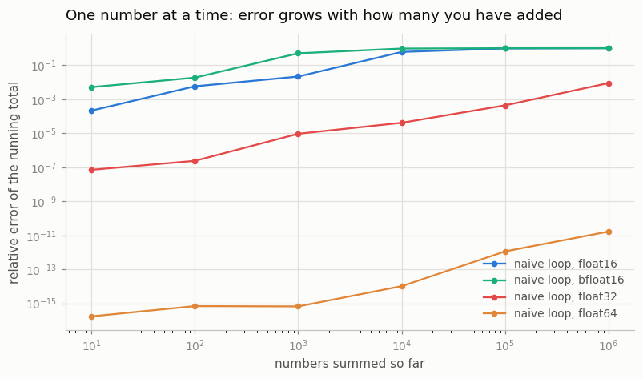
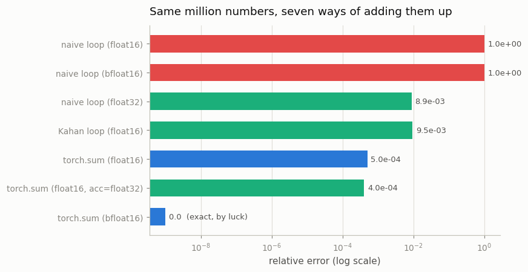
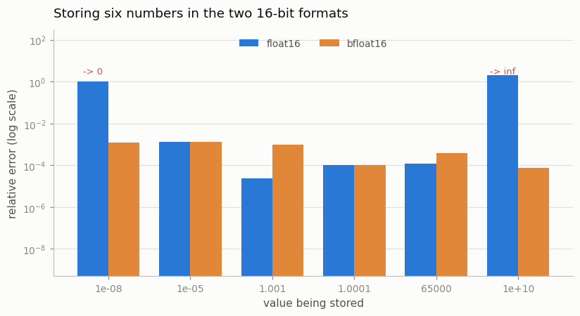

# The Precision Trade-off

---

> Smaller numbers are faster, but they can't always tell the truth.

---

## Key Insight

A tensor's [dtype](/shared/glossary/#dtype) determines its memory size and accuracy. Low-precision types (like `float16`) save space but can "round off" important small values to zero.

## Why This Matters

In deep learning, small values (like gradients) are everything. Choosing the wrong precision can cause your model to stop learning or explode with "NaN" errors.

---

**This is project 4.** It adds up one million copies of `0.001` — true answer
`1000.0` — in four dtypes and seven ways, and the results disagree by a factor
of two thousand. Two findings run against the usual advice: **the dtype is often
not what ruins your sum, the algorithm is** (compensated summation in
[float16](/shared/glossary/#float16) matches naive summation in [float32](/shared/glossary/#float32)), and
**[bfloat16](/shared/glossary/#bfloat16) is not more accurate than float16 — it is 8× *less* accurate on
these numbers**, and still the right default, for a reason that has nothing to
do with accuracy.

---

## Files

| file | what it is |
|---|---|
| `run.py` | all six experiments and the three figures |
| `outputs/` | `dtype_facts.csv`, `summation_methods.csv`, `findings.csv`, three figures |

```bash
python3 run.py     # ~15 seconds; needs torch, numpy, matplotlib
```

---

## What the names mean

Before the numbers, the vocabulary — every one of these names is a description
of the thing it names, once you unpack it.

- **float** — short for *floating point*. The decimal point "floats": instead of
  storing a fixed number of digits after the point, the format stores a value
  and a separate exponent that says where the point goes. That is what lets one
  4-byte number hold both `0.0000001` and `100000000`.
- **float16 / float32 / float64** — the number is the total **bit** count.
  16 bits = 2 bytes, 32 = 4, 64 = 8.
- **mantissa** (also *significand*) — the digits of the number, without the
  exponent. From the Latin *mantisa*, "a small addition thrown in" — it was the
  fractional leftover in a logarithm table. More mantissa bits = more
  significant digits = finer distinctions between nearby numbers.
- **exponent** — the bits that say *how big*. More exponent bits = a wider range
  between the smallest and largest number the format can hold.
- **bfloat16** — "**b**rain float", invented at Google Brain. It is not a
  redesign of float16 but a **truncated float32**: same 8 exponent bits, with 16
  of the 23 mantissa bits chopped off the bottom. Converting float32 → bfloat16
  is literally "keep the top half of the bits", which is why the conversion
  hardware is nearly free and why `to_bf16()` in `run.py` is eight lines of bit
  masking.
- **epsilon (ε)** — the Greek letter mathematicians have used for "an
  arbitrarily small amount" since Cauchy. **Machine epsilon** is the smallest
  number you can add to `1.0` and get something other than `1.0`. It is the
  format's resolution near 1.
- **underflow / overflow** — [underflow](/shared/glossary/#underflow) is a number too small for the format,
  which becomes `0`. [Overflow](/shared/glossary/#overflow) is a number too big, which becomes `inf`.

---

## 1. What each dtype can hold

```
dtype        bytes  exp  mant         eps         max   min normal  decimal digits
----------------------------------------------------------------------------------
float64          8   11    52   2.220e-16  1.798e+308   2.225e-308            16.0
float32          4    8    23   1.192e-07   3.403e+38    1.175e-38             7.2
bfloat16         2    8     7   7.812e-03   3.390e+38    1.175e-38             2.4
float16          2    5    10   9.766e-04   6.550e+04    6.104e-05             3.3
```

Everything about the 16-bit formats is in these two rows. Both are 2 bytes, so
both have exactly 16 bits to spend, and they spend them opposite ways:

|  | float16 | bfloat16 |
|---|---|---|
| exponent bits (range) | 5 | **8** |
| mantissa bits (precision) | **10** | 7 |
| largest number | 65,504 | 3.4 × 10³⁸ |
| smallest normal number | 6.1 × 10⁻⁵ | 1.2 × 10⁻³⁸ |
| decimal digits you can trust | 3.3 | 2.4 |

**bfloat16 has the range of float32 and less precision than float16.** Hold that
sentence; sections 5 and 6 are about why that is the trade you want.

---

## 2. Two different errors, which everyone conflates

Before adding a single number, the dtype has already changed your data:

```
  float64    stores 0.001 as 0.001000000000  (relative error 0.00e+00)  -> a perfect sum would be  1000.0000
  float32    stores 0.001 as 0.001000000047  (relative error 4.75e-08)  -> a perfect sum would be  1000.0000
  bfloat16   stores 0.001 as 0.000999450684  (relative error 5.49e-04)  -> a perfect sum would be   999.4507
  float16    stores 0.001 as 0.001000404358  (relative error 4.04e-04)  -> a perfect sum would be  1000.4044
```

`0.001` is not representable in binary — same reason `1/3` is not representable
in decimal. So there are two independent sources of error, and they need
different fixes:

| | what it is | fixed by |
|---|---|---|
| **representation error** | the dtype of your *data* rounds each value | storing the data in a wider dtype |
| **accumulation error** | the dtype of your *running total* rounds each partial sum | accumulating in a wider dtype, or a better algorithm |

A perfect adder working on bfloat16 data can only ever reach `999.4507`. That
0.055 % is a floor no summation algorithm can go below — it is baked into the
inputs. Everything worse than that floor is the algorithm's fault, and that is
where the interesting failures live.

---

## 3. Adding one number at a time

```
  naive loop, float16   ->       4.0000   relative error  9.96e-01   (0.6s)
  naive loop, bfloat16  ->       0.5000   relative error  1.00e+00   (5.2s)
  naive loop, float32   ->     991.1415   relative error  8.86e-03   (0.4s)
  naive loop, float64   ->    1000.0000   relative error  1.67e-11   (0.2s)
```

**float16 answers 4.0 when the truth is 1000.0.** bfloat16 answers 0.5. These
are not small errors — they are 99.6 % and 99.95 % wrong. And nothing overflowed,
nothing produced a [NaN](/shared/glossary/#nan), no warning appeared.



### Why the total freezes

```
  adding 1.0     -> total freezes at  2048.0000 after 2,048 additions   (rule of thumb 2*value/eps = 2048.0)
  adding 0.001   -> total freezes at     4.0000 after 3,070 additions   (rule of thumb 2*value/eps = 2.0)
```

This is called **stagnation**, and the mechanism is one sentence: *a
floating-point number has a fixed number of significant digits, so the gap
between representable values grows as the values get bigger.*

Concretely, in float16 the spacing near `2048` is exactly `1.0`. So
`2048 + 1` has to round to either `2048` or `2049`, and the tie-breaking rule
(round-to-nearest-even) picks `2048`. From then on, **every single addition
does nothing**. The loop runs another 997,952 times and changes nothing.

The rule of thumb is `total ≈ 2 · value / ε`: a running total stops growing once
it is about `2/ε` times larger than the thing being added. For float16
(ε ≈ 9.8 × 10⁻⁴) that is about 2000×. Adding `1.0` matched the prediction
exactly (2048); adding `0.001` froze at `4.0` instead of the predicted `2.0`,
because spacing only doubles at each power of two, so the exact freezing point
lands somewhere in the next binade. The order of magnitude is what the rule
gives you, and it is enough.

An analogy: you are adding one cent at a time to a bank balance displayed to
three significant figures. At $9.99 you can still see each cent. At $2,048 the
display only shows whole dollars, so a cent changes nothing — and it will never
change anything again, no matter how many you add.

---

## 4. Same dtype, better algorithm — the honest inversion

```
  Kahan loop, float16   ->     990.5000   relative error  9.50e-03
  naive loop, float32   ->     991.1415   relative error  8.86e-03
```



**Compensated summation in float16 is as accurate as naive summation in
float32** — 990.5 versus 991.1, error 9.5 × 10⁻³ versus 8.9 × 10⁻³. Half the
memory, essentially the same answer. The 2000× disaster in the previous section
was never really about float16.

[Kahan summation](/shared/glossary/#kahan-summation) — named after **William Kahan**, the numerical analyst who
designed the IEEE 754 floating-point standard and won the Turing Award for it —
works by keeping a second variable for the crumbs:

```python
y     = value - comp          # the value, plus whatever we lost last time
t     = total + y             # this rounds, and throws something away
comp  = (t - total) - y       # exactly what it threw away
total = t
```

`(t - total)` is what *actually* got added; subtracting the value we *meant* to
add gives the rounding loss, to be repaid on the next iteration. In the
stagnation example, `total + 0.001` rounds back to `total`, so the whole `0.001`
lands in `comp`; after four iterations `comp` reaches `0.004`, which *is* big
enough to change the total. The crumbs are saved up until they are worth
spending.

### What PyTorch actually does

```
  torch .sum(), float16   ->    1000.5000   relative error  5.00e-04
  .sum(dtype=float32),  float16   ->    1000.4044   relative error  4.04e-04
  torch .sum(), bfloat16  ->    1000.0000   relative error  0.00e+00
  .sum(dtype=float32),  bfloat16  ->     999.4507   relative error  5.49e-04
```

`torch.sum()` on float16 gets within 0.05 % — **2000× better than the naive loop
in the same dtype**. PyTorch does not sum one element at a time; it splits the
array into blocks, sums each block separately, then sums the block totals. Each
partial sum stays small, so it never stagnates. (This is usually called
*pairwise* or *blocked* summation. NumPy does the same thing, which is why
`np.sum` and a Python `for` loop can disagree on the same array.)

> **Two warnings about that bfloat16 row, which reports zero error.** First, it
> is luck: bfloat16's spacing near 1000 is about 4, the true answer is 1000, and
> the accumulated value happened to round onto it. Second — and this is the row
> that catches people — `.sum(dtype=torch.float32)` gives a *worse* number
> (999.45) than plain `.sum()` (1000.0). That is not a bug. 999.45 is the
> **correct** sum of the bfloat16 data, which is not 0.001 a million times. The
> wider accumulator did its job perfectly and revealed the representation error
> from section 2 that the sloppier accumulator was accidentally cancelling.
> **A more accurate accumulator can produce a number further from the answer you
> expected — because it is closer to the answer your data actually encodes.**

---

## 5. Underflow, and what `GradScaler` is really doing

```
  float16    loses  23.4% of them to zero
  bfloat16   loses   0.0% of them to zero

  float16 after multiplying by 1024 first:   0.0% lost,
  mean relative error 1.25e-03 after dividing back
```

Take 200,000 gradient-sized numbers around `1e-7` and convert them to float16:
**a quarter of them become exactly zero.** They are below float16's smallest
representable value, so they [underflow](/shared/glossary/#underflow). A parameter whose gradient is zero
does not move; a layer whose gradients are all zero stops learning, silently,
while the loss curve for the rest of the network keeps looking fine.

The fix in the last line is embarrassingly simple: multiply everything by 1024
*before* converting, then divide by 1024 after. `1e-7 × 1024 = 1e-4`, comfortably
inside float16's range. Nothing is lost, and the numbers come back with 0.1 %
error instead of 100 %.

> **That is exactly what `torch.cuda.amp.GradScaler` does — so why does it need
> to be a whole class?** Because the right multiplier is not knowable in advance
> and does not stay right. Too small and gradients still underflow; too big and
> they overflow to `inf` and the step is garbage. `GradScaler` starts with a
> large factor, checks after every backward pass whether any gradient became
> `inf` or `NaN`, and if so **skips that optimiser step** and halves the factor;
> after a stretch of clean steps it doubles it again. The multiply-then-divide
> is the idea; the feedback loop that keeps the multiplier in the safe window is
> the work.
>
> **And why does bfloat16 not need it?** Because bfloat16 has float32's exponent
> bits, so its smallest number is `1.2 × 10⁻³⁸` instead of `6.1 × 10⁻⁵`. There is
> nothing to rescue — 0.0 % lost, as the second line shows. The scaler exists to
> patch float16's missing range, and bfloat16 does not have that hole.

---

## 6. The trade, and why bfloat16 wins anyway



```
       value           float16          bfloat16   verdict
       1e-08                 0     1.0011718e-08   bfloat16 better
       1e-05      1.001358e-05      1.001358e-05   tie
       1.001         1.0009766                 1   float16 better
      1.0001                 1                 1   tie
       65000             64992             65024   float16 better
       1e+10               inf     9.9992207e+09   bfloat16 better
```

And on a real operation — a 512×512 matmul, 512 products accumulated per output,
compared against a float64 reference:

```
  float32    relative error 2.416e-07
  bfloat16   relative error 2.878e-03
  float16    relative error 3.603e-04
```

**float16 is 8× more accurate than bfloat16 here.** That is not a fluke of this
test — it follows directly from the table in section 1, where float16 has three
more mantissa bits. So the guide's advice that bfloat16 is "almost always the
right choice" is not an accuracy claim, and reading it as one leaves you
confused by these numbers.

The actual argument is about **failure modes**, and the two formats fail
differently:

- float16 fails by **hitting a wall**. Below `6.1e-5` numbers become `0`; above
  `65,504` they become `inf`. Both are unrecoverable — a zero gradient carries no
  information and an `inf` poisons every number it touches, producing the `NaN`
  loss that ends a training run.
- bfloat16 fails by **being vague**. It has two to three good digits everywhere,
  from `1e-38` to `1e+38`. Its errors are small, everywhere, always — and
  gradient descent averages over thousands of noisy steps anyway, so a bit of
  extra noise mostly washes out.

In plain terms: **float16 is more precise where it works and catastrophic where
it does not; bfloat16 is slightly sloppy everywhere and almost never
catastrophic.** Training runs for days without a human watching, so "never
catastrophic" is worth more than "more precise". That is the whole reason
Ampere-and-later GPUs made bfloat16 the default, and the reason bfloat16 needs
no `GradScaler` while float16 does.

Both, note, are used for the *arithmetic*. Accumulators stay in float32 —
which is precisely the section-4 lesson applied by the hardware: [Tensor Cores](/shared/glossary/#tensor-core)
multiply in 16 bits and add up in 32.

---

## What to take away

1. Error has two independent sources: what the dtype does to your **data**, and
   what it does to your **running total**. They need different fixes.
2. Naive sequential summation stagnates once the total is about `2/ε` times the
   addend. In float16 that is 2000×, and a million additions can leave you at
   `4.0` instead of `1000.0`.
3. `torch.sum` is 2000× better than a naive loop *in the same dtype*, because it
   sums in blocks. Never benchmark a dtype using a Python loop.
4. Kahan summation in float16 ≈ naive summation in float32. Algorithm beats
   precision more often than people expect.
5. A *more* accurate accumulator can move the answer *away* from what you
   expected, by exposing representation error that a sloppier one cancelled.
6. float16 loses ~23 % of gradient-sized values to zero; bfloat16 loses none.
   That is what `GradScaler` exists to patch, and why bfloat16 does not need it.
7. bfloat16 is *less* accurate than float16 — 8× less on this matmul. It is the
   default because it fails gently instead of catastrophically.

Next: [project 5](../05-broadcasting-bug-hunt/README.md) turns to the errors
that are not about precision at all — the ones where every number is exact and
the shape is wrong.
