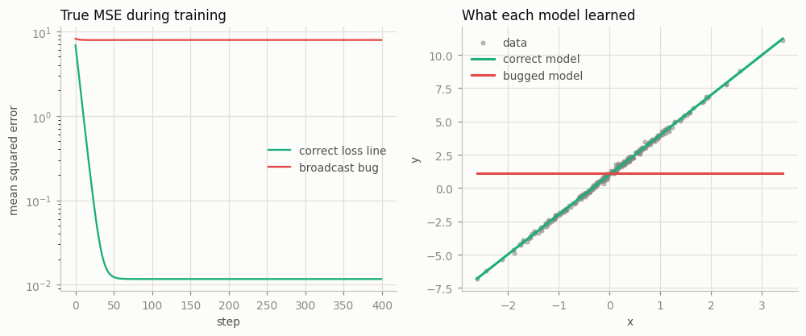
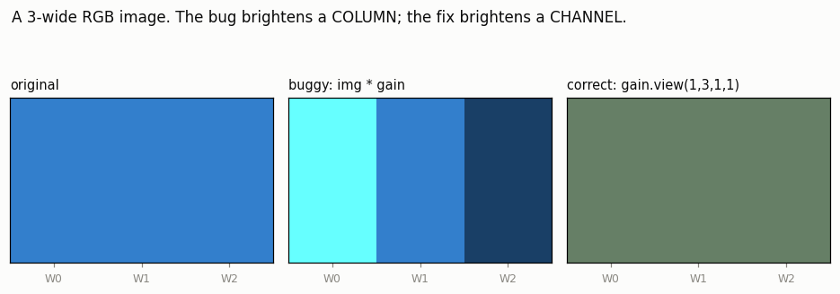
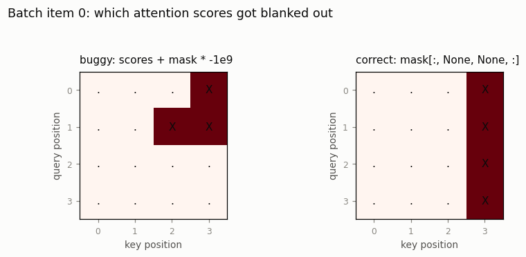

# Broadcasting Bug Hunt

---

> The most dangerous bugs are the ones that don't crash.

---

## Key Insight

[Broadcasting](/shared/glossary/#broadcasting) automatically "stretches" tensors to match shapes. While powerful, it can silently apply math to tensors that weren't meant to interact.

## Why This Matters

Silent errors are the hardest to find. A broadcasting mistake won't give you an error message; it will just give you wrong results that can ruin your model's training.

---

**This is project 5.** Five expressions that run cleanly and compute the wrong
thing, each with the rule it violated and the fix. Then the bill for the first
one, paid in full: a linear model trained with the buggy loss line ends with
**slope exactly 0.0000** and an intercept equal to the batch mean — it learned
to ignore its input completely, while the loss curve went down the whole time.

The pattern that connects all five: **every one of them is silent only because
two unrelated dimensions happened to be the same number.** Change one size and
four of the five turn into an immediate error.

---

## Files

| file | what it is |
|---|---|
| `run.py` | the five bugs, the training experiment, three figures |
| `outputs/` | `findings.csv`, three figures |

```bash
python3 run.py     # ~3 seconds; needs torch, numpy, matplotlib
```

---

## The rule, in full

Broadcasting is three sentences:

1. **Line the two shapes up from the right.** (Not the left — the right.)
2. **Pad the shorter one with 1s on the left.**
3. For each pair of dimensions: **they must be equal, or one of them must
   be 1.** A dimension of size 1 gets stretched to match the other.

`run.py` implements this in ten lines (`explain()`), and prints the padded
shapes for every bug so you can see the mistake happen:

```
  (pred - target)
                (8, 1)  ->  padded to (8, 1)
                  (8,)  ->  padded to (1, 8)
    result (8, 8)   expected (8,)   <-- WRONG
      dim 0: right stretched 1->8
      dim 1: left stretched 1->8
```

Why "from the right"? Because the rightmost dimensions are the *innermost* ones
— the pixel within a row, the feature within a sample. Aligning from the right
means "a per-feature vector automatically applies to every sample", which is the
common case. Aligning from the left would mean the opposite, and would break
every `image + bias` in existence. The convention is inherited from NumPy, which
took it from APL in the 1960s.

**And here is the part that makes broadcasting dangerous:** rule 3 talks about
*sizes*, and never about *meaning*. PyTorch has no idea that dimension 1 of your
tensor is "colour channel" and dimension 3 is "image width". If they are both 3,
they are interchangeable as far as the rule is concerned.

---

## Bug 1 — a column of predictions minus a row of targets

```python
pred   = model(x)          # (N, 1) — one output per sample
target = labels            # (N,)   — loaded from a CSV as a flat vector
loss   = ((pred - target) ** 2).mean()
```

```
                (8, 1)  ->  padded to (8, 1)
                  (8,)  ->  padded to (1, 8)
    result (8, 8)   expected (8,)   <-- WRONG

    buggy loss 2.7824   correct loss 0.0052   ratio 532.9x
    (target variance is 1.4008 — the buggy loss cannot go below roughly
     2x that, no matter how good the model gets.)
    F.mse_loss warns: Using a target size (torch...
```

You asked for 8 errors and got 64: every prediction compared against every
label, including the 56 pairs that have nothing to do with each other.

**Notice how the bug hides.** With an untrained model both losses are around 2
and the ratio is about 1 — nothing looks wrong. Only once the model gets *good*
does the gap open up, because the correct loss can fall to 0 while the buggy one
has a floor at roughly `2 · var(target)`. The bug is invisible exactly while you
are still debugging everything else, and becomes obvious only after you have
stopped looking.

`F.mse_loss` does warn about this, which is one good reason to prefer it over a
hand-written `((a - b) ** 2).mean()`.

### The bill

Train the same model, same data, same seed — changing only that one line:



```
  correct  slope  2.9915 (true 3.0)   intercept  1.0101 (true 1.0)   real MSE   0.0117
  buggy    slope  0.0000 (true 3.0)   intercept  1.0871 (true 1.0)   real MSE   7.9005

  y has mean 1.0871 and the buggy model's intercept is 1.0871 with slope 0.0000
```

The slope is **exactly zero** and the intercept is **exactly the mean of `y`**.
The model learned to output one constant, ignoring `x` entirely.

That is not bad luck; it is what the buggy loss asks for. Averaging the squared
error over all `N × N` pairs works out to:

```
mean over all pairs (pred_i - y_j)²  =  var(y)  +  mean_i (pred_i - mean(y))²
                                        ^^^^^^     ^^^^^^^^^^^^^^^^^^^^^^^^^
                                        constant   minimised by pred_i = mean(y)
```

The first term does not depend on the model at all — it is a fixed floor. The
second is minimised by making every prediction equal `mean(y)`. So gradient
descent works perfectly, on the wrong objective. **The loss went down for 400
steps and the model learned nothing.** A loss curve that decreases is not
evidence that your loss is correct.

---

## Bug 2 — `mean()` that lost its dimension

```python
x = x - x.mean(dim=1)          # meant: subtract each row's mean from that row
```

```
                (4, 4)  ->  padded to (4, 4)
                  (4,)  ->  padded to (1, 4)
    result (4, 4)   OK

    row means after the buggy version : [-6.0, -2.0, 2.0, 6.0]
    row means after the correct version: [0.0, 0.0, 0.0, 0.0]
```

`x.mean(dim=1)` *removes* dimension 1, leaving `(4,)`. Padding puts that back on
the **left**, as `(1, 4)` — so it lines up with the columns, and row `j`'s mean
gets subtracted from column `j`.

The shape check passes and the shape is right. Only the numbers are wrong, and
the giveaway is that the rows still have non-zero means — the exact property the
line was supposed to create.

**Fix:** `x.mean(dim=1, keepdim=True)`. That is what `keepdim` is *for*: it
leaves the reduced dimension in place as a 1, so it lines up where you meant it
to. Any time you reduce along an axis and then combine the result back with the
original tensor, `keepdim=True` is almost always what you want.

This bug is silent only on a square tensor. With `(3, 4)` the same line raises
immediately.

---

## Bug 3 — a per-channel gain applied to image width

```python
img  = torch.zeros(1, 3, 8, 3)     # N, C, H, W
gain = torch.tensor([2.0, 1.0, 0.5])   # one gain per COLOUR channel
out  = img * gain
```

```
          (1, 3, 8, 3)  ->  padded to (1, 3, 8, 3)
                  (3,)  ->  padded to (1, 1, 1, 3)
    result (1, 3, 8, 3)   <-- WRONG axis

    channel means, buggy : [0.233, 0.583, 0.933]
    channel means, correct: [0.4, 0.5, 0.4]

    with W=4 instead of 3, does `img * gain` raise? True
```



The picture says it all: the buggy version brightened the left **column** of the
image; the correct one brightened the red **channel**. Right-alignment put the
gain on `W`, the last axis, and `W` happened to be 3 — the same as `C`.

**Fix:** say which axis you mean — `gain.view(1, -1, 1, 1)`, or
`gain[:, None, None]`, or `torch.einsum`, or a named-tensor library. All of them
amount to the same thing: **put the 1s in yourself instead of letting the
padding rule guess.**

Every `nn.BatchNorm2d`, `nn.Conv2d` bias and per-channel scale in PyTorch is
reshaped to `(1, C, 1, 1)` internally for exactly this reason.

---

## Bug 4 — pairwise distances that are not pairwise

```python
d = (a - b).pow(2).sum(-1)     # meant: distance from every a to every b
```

```
                (5, 3)  ->  padded to (5, 3)
                (5, 3)  ->  padded to (5, 3)

    buggy result shape (5,), correct (5, 5)
    the buggy vector equals the diagonal of the correct matrix: True
```

No stretching happened at all — the shapes matched exactly, so PyTorch paired
`a[0]` with `b[0]`, `a[1]` with `b[1]`, and returned 5 numbers. You wanted 25 and
got the 5 on the diagonal.

**Fix:** insert the missing axes so the two sets are forced to disagree in shape
and therefore to broadcast against each other:

```python
d = (a[:, None, :] - b[None, :, :]).pow(2).sum(-1)   # (N,1,D) vs (1,M,D) -> (N,M,D)
```

`a[:, None, :]` is `(5, 1, 3)` and `b[None, :, :]` is `(1, 5, 3)`; both stretch
to `(5, 5, 3)`, which is every pair.

> **This bug hides precisely where it does the most damage.** With 5 queries and
> 7 keys the buggy line raises immediately. It stays quiet only when the two
> sets are the same size — which is exactly the situation in self-attention
> (queries and keys are the same sequence), in a contrastive loss (images and
> captions come in matched pairs), and in nearest-neighbour retrieval on a
> symmetric batch. The most common setups are the ones with no error message.

---

## Bug 5 — a padding mask on the wrong axis

```python
scores = torch.zeros(B, 1, T, T)   # batch, heads, query, key
mask   = torch.zeros(B, T)         # 1 where a token is padding
out    = scores + mask * -1e9
```

```
          (4, 1, 4, 4)  ->  padded to (4, 1, 4, 4)
                (4, 4)  ->  padded to (1, 1, 4, 4)
    result (4, 1, 4, 4)   expected (4, 1, 4, 4)   OK
```



```
    batch item 0, positions masked (buggy) :   batch item 0, positions masked (correct):
    [[0 0 0 1]                                 [[0 0 0 1]
     [0 0 1 1]                                  [0 0 0 1]
     [0 0 0 0]                                  [0 0 0 1]
     [0 0 0 0]]                                 [0 0 0 1]]
```

**The shape check said OK, and it was right to.** The result really is
`(B, 1, T, T)`. Broadcasting compared sizes and had nothing to say about which
axis *means* "batch" and which means "query position" — that part only ever
existed in your head.

The correct mask blanks a whole **column**: nobody may attend *to* the padding
token, regardless of who is asking. The buggy one aligned the mask's *batch*
dimension with the *query* dimension, so batch item 0 got a mask built from four
different sentences' padding patterns, and batch items 2 and 3 got no masking at
all.

**Fix:** `mask[:, None, None, :]` — spell out that the mask's second axis is the
key axis, and that it applies to every head and every query.

Silent only because `B == T == 4`. That is common in a quick test and rare in
production, which is exactly how a bug like this reaches production.

---

## Three ways to make these loud

```
  1. Ask first:   torch.broadcast_shapes((8, 1), (8,)) = (8, 8)
  2. Refuse to broadcast where it matters: strict_sub: (8, 1) != (8,)
  3. Matching shapes on purpose: F.mse_loss(pred, target.unsqueeze(1)) = 0.0000, no warning
```

1. **`torch.broadcast_shapes(a.shape, b.shape)`** tells you the result shape
   *without* doing the work. Print it once when a line surprises you; it is
   faster than reasoning about it.
2. **A strict wrapper.** Broadcasting is a convenience for element-wise
   arithmetic, not for loss functions. Three lines —
   `if u.shape != v.shape: raise` — turn every silent loss bug in this project
   into an immediate stack trace. Use it at the boundaries where a shape mistake
   is expensive: loss computation, metric computation, anything that consumes
   labels.
3. **Assert the shape you expect**, right after you compute it:
   `assert loss_terms.shape == (N,)`. One line, no runtime cost worth
   mentioning, and it documents the intent for the next reader.

> **If `nn` modules and losses already validate their inputs, why write your own
> checks?** Because they validate the shapes they *require*, not the shapes you
> *meant*. `F.mse_loss` accepted `(8,1)` against `(8,)` and computed a
> perfectly valid 8×8 comparison — it warned, but it did not refuse, because
> broadcasting them together is legal. The framework can only check the rule;
> it cannot check your intent. Assertions are how you write the intent down.

Two habits are worth more than any tool here:

- **`keepdim=True` whenever a reduction feeds back into the tensor it came
  from.** It costs nothing and removes bug 2 as a category.
- **Never let a size-1 or a coincidence do the aligning.** Write
  `x[:, None]`, `.view(1, -1, 1, 1)`, `.unsqueeze(0)` explicitly. The extra
  characters are the only place your intent is recorded.

---

## What to take away

1. Shapes align **from the right**; missing dimensions are padded with 1s on the
   left; a 1 stretches to fit.
2. Broadcasting checks **sizes**, never **meaning**. It cannot tell a colour
   channel from an image width, or a batch index from a query position.
3. All five bugs are silent only because two unrelated dimensions coincided.
   Test with unequal sizes (batch ≠ sequence length, height ≠ width, N ≠ M) and
   most of them become loud.
4. A `(N,1)` prediction against a `(N,)` target produces an `N×N` loss whose
   optimum is "predict the batch mean". The measured result: slope 0.0000,
   intercept `mean(y)`, and a loss curve that fell smoothly for 400 steps.
5. A falling loss curve is not evidence that the loss is correct.
6. `keepdim=True`, explicit `None`/`unsqueeze`, `torch.broadcast_shapes`, and a
   shape assertion at each boundary. That is the whole defence.

---

This is the last project of Phase 1. You can now say what a
[tensor](/shared/glossary/#tensor) is made of ([project 1](../01-stride-explorer/README.md)), predict
whether an operation copies ([project 2](../02-view-vs-copy-detective/README.md)),
compute a memory address by hand ([project 3](../03-manual-indexing/README.md)),
choose a [dtype](/shared/glossary/#dtype) knowing what it costs
([project 4](../04-dtype-precision-study/README.md)), and read a shape mismatch
before it becomes a wrong number. Phase 2 puts a graph on top of all of it.
