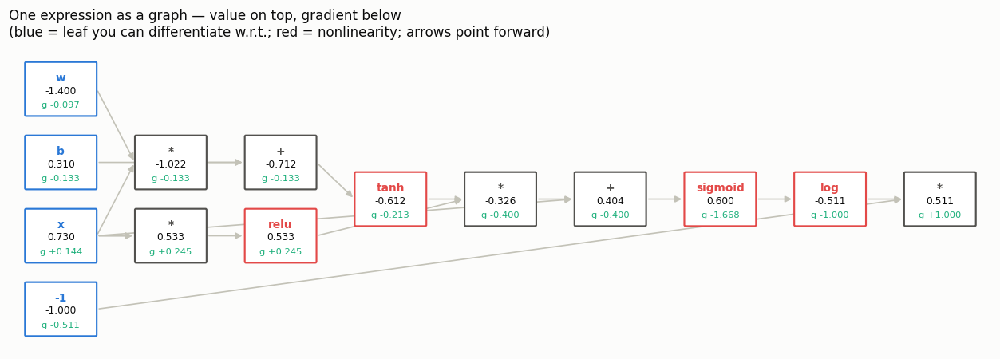
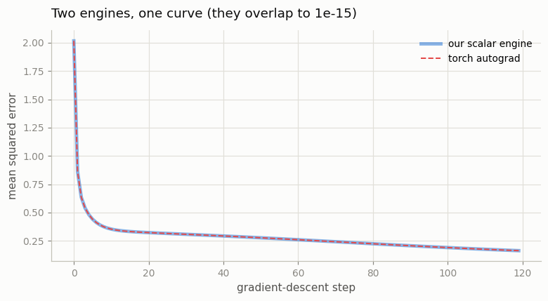
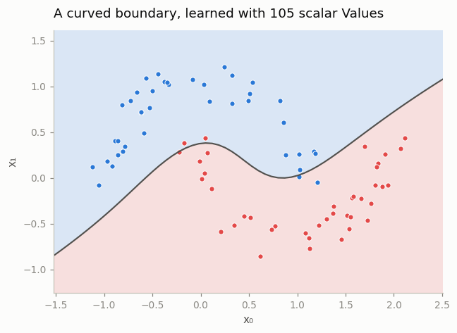
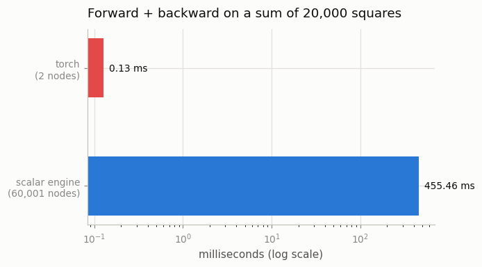

# Micrograd in PyTorch Style

---

> To understand autograd, build it yourself.

---

## Key Insight

PyTorch's [autograd](/shared/glossary/#autograd) is powered by a [dynamic computation graph](/shared/glossary/#dynamic-computation-graph) (DAG). Every time you perform an operation on a [tensor](/shared/glossary/#tensor) with `requires_grad=True`, PyTorch records it as a node in this graph. By recreating a simplified educational engine like [micrograd](/shared/glossary/#micrograd), you learn exactly how the forward pass builds the graph and how the [backward pass](/shared/glossary/#backward-pass) uses the [chain rule](/shared/glossary/#chain-rule) to calculate [gradients](/shared/glossary/#gradients).

## Why This Matters

It is easy to use `loss.backward()` as a magic black box, but understanding the underlying graph is the only way to debug [vanishing gradients](/shared/glossary/#vanishing-gradients), [detached tensors](/shared/glossary/#detached-tensor), and [memory leaks](/shared/glossary/#memory-leak) caused by holding onto graph references.

---

**This is project 6.** A scalar autograd engine in about 180 lines, then held
against the real thing: same expression, same MLP, same weights, same random
seed.

The headline numbers, all measured by `run.py`:

- **every gradient in a tangled 14-node expression agrees with torch to
  2.78e-17** — the last bit of a `float64`
- **the same MLP, trained 120 steps by both engines from identical weights,
  ends with a maximum parameter disagreement of 6.66e-16**
- **and torch does it 490× faster**, because it builds **18** graph nodes where
  our engine builds **15,784**

That last pair is the point of the project. Once you have written autograd
yourself, the reason PyTorch is a *tensor* framework and not a *number*
framework stops being a design opinion and becomes a measurement.

---

## Files

| file | what it is |
|---|---|
| `engine.py` | the `Value` class: forward ops, the backward closures, the graph walk |
| `run.py` | the five experiments and four figures |
| `outputs/` | `findings.csv`, four figures |

```bash
python3 run.py     # ~30 seconds; needs torch, numpy, matplotlib
```

---

## The whole idea, in one object

A `Value` holds one number. It also holds the answer to "where did I come
from?":

```python
class Value:
    data        # the number
    grad        # d(final output) / d(me) -- filled in by backward()
    _prev       # the Values I was computed from
    _op         # what operation made me ("+", "*", "tanh", ...)
    _backward   # a function that pushes my grad into _prev's grads
```

Those five fields line up one-for-one with PyTorch:

| ours | PyTorch |
|---|---|
| `Value.data` | the `Tensor` itself |
| `Value.grad` | `Tensor.grad` |
| `Value._prev` | `grad_fn.next_functions` — the edges |
| `Value._op` | the name in `grad_fn` (`AddBackward0`, `MulBackward0`, …) |
| `Value._backward` | the `Node`'s backward function |

**Nobody builds the graph on purpose.** It appears as a side effect of doing
arithmetic. `a * b` computes the product *and* creates a node that remembers
`a` and `b`. That is what "dynamic" means in *dynamic computation graph*: there
is no separate "define the model" step, because running the model **is** the
definition.

Here is one operation in full — everything else in `engine.py` follows the same
shape:

```python
def __mul__(self, other):
    out = Value(self.data * other.data, (self, other), "*")

    def _backward():
        # d(a*b)/da = b   and   d(a*b)/db = a
        self.grad  += other.data * out.grad
        other.grad += self.data  * out.grad

    out._backward = _backward
    return out
```

Two things in those three lines are worth stopping on.

**Why `out.grad` appears on the right.** `out.grad` is "how much the final
output changes when `out` changes". Multiplying by the local derivative turns
that into "how much the final output changes when `self` changes". That
multiplication *is* the [chain rule](/shared/glossary/#chain-rule), and skipping
it is the most common bug in a hand-written backward (project 8 measures what it
costs).

**Why `+=` and never `=`.** See section 3 below.

**Why the multiply saves `other.data`.** Its backward needs the *other* operand's
value, so the forward values have to stay alive until backward runs. That is the
whole reason a forward pass costs memory, and it is what
[project 10](../10-gradient-checkpointing/README.md) trades away.

---

## 1. The same expression, twice

`run.py` builds a deliberately tangled expression — `x` is used three separate
times, so its gradient arrives from three directions and has to be summed:

```python
h = (x * w + b).tanh()
g = (x * x).relu()
out = (h * g + x).sigmoid().log() * -1
```

Then it builds the identical thing in torch, calls `backward()` on both, and
compares every node — including the intermediates, which torch will not give you
unless you ask with `retain_grad()`.

```
  node              ours .grad           torch .grad      abs diff
  x          0.144178693971223     0.144178693971223      0.00e+00
  w         -0.097429901489119    -0.097429901489119      0.00e+00
  b         -0.133465618478245    -0.133465618478245      0.00e+00
  h         -0.213359844561597    -0.213359844561597      2.78e-17
  g          0.245001261200644     0.245001261200644      2.78e-17

  worst disagreement anywhere in the graph: 2.78e-17
```

For scale: `float64` can only distinguish numbers about 2.2e-16 apart. A
disagreement of 2.78e-17 means **the two engines produced the same number**, and
the difference is which order they happened to add things in.



The picture is the graph `run.py` walks. Value on top of each box, gradient
below. Notice `x` (bottom left) has arrows leaving it in three directions, and
its gradient `+0.144` is the sum of what came back along all three.

The same expression in torch names the same nodes:

```
NegBackward0 -> LogBackward0 -> SigmoidBackward0 -> AddBackward0 -> MulBackward0 -> TanhBackward0
```

You can print this yourself on any tensor: `loss.grad_fn`, then
`.next_functions`. It is the same list our `_prev` holds.

---

## 2. Why the order matters — and what "topological" means

`backward()` cannot just visit nodes in any order. It has to obey one rule:

> **Never run a node's backward until every node that consumed its output has
> run.**

A **topological sort** of a graph is any ordering of the nodes where every arrow
points forwards. ("Topological" here is borrowed from mathematics and just means
"respecting the structure of the connections", not distances or positions.) Run
the forward-order list backwards and you get exactly the rule above.

Here is what happens without it. `run.py` builds a graph where one intermediate
is used twice:

```python
x = Value(3.0)
a = x + 0.0      # a shared intermediate
b = a * 2.0      # ... used once through b ...
y = a + b        # ... and once directly.   y = a + 2a = 3x
```

`dy/dx` is obviously 3. Now walk the graph **breadth-first** from the output —
visit `y`, then everything `y` touches, then everything those touch. That sounds
completely reasonable:

```
  order visited (breadth-first): ['+', '+', '*', 'x', '0', '2']
    topological order  : dx = 3.0   <- right
    breadth-first order: dx = 1.0   <- wrong, and it did not crash
```

Breadth-first reaches `a` one hop from the output, so it runs `a`'s backward
while `a.grad` is still only `1.0` — the `+2.0` coming through `b` has not been
delivered yet. `a` passes the partial number on and is never asked again. **The
answer is short by exactly the path that arrived late, and nothing raises.**

PyTorch enforces the same rule in its C++ engine with a *dependency counter*:
each node knows how many gradients to expect, and only runs once it has them
all.

### One implementation detail that is not optional

The textbook topological sort is a three-line recursive function. `engine.py`
uses an explicit stack instead, and section 5 shows why:

```
  same graph, recursive topological sort: RecursionError (Python's limit is 1000 frames)
  the iterative one in engine.py: fine, 60,001 nodes
```

A plain Python loop summing 20,000 terms builds a graph 20,000 nodes **deep**.
Python's default recursion limit is 1000 frames. This is not an exotic edge
case — it is `for x in data: total = total + f(x)`. PyTorch's engine keeps its
own worklist in C++ for exactly this reason.

---

## 3. Why `.grad` accumulates, and what `zero_grad` is really for

Call `backward()` three times without clearing:

```
  backward #1: w.grad =   12.0   (one pass is worth 12.0)
  backward #2: w.grad =   24.0
  backward #3: w.grad =   36.0
  torch does exactly the same: [12.0, 24.0, 36.0]
```

**This is not a design wart, and it is not there to enable gradient
accumulation** (though that is a happy consequence). It is forced by section 2.

A node whose output is used twice receives two gradients and must **add** them —
that is the sum rule of calculus, and section 2's diamond is exactly that case.
So `_backward` has to be `+=`.

And now the engine has no way to tell these two situations apart:

- "this is the second consumer *within one graph*" → must add
- "this is a second `backward()` call *on a new graph*" → should not add

Both look like "a gradient arrived at a node that already has one". Since the
first case is mandatory, the second one comes along for free — and clearing
between training steps becomes **your** job. That is all `optimizer.zero_grad()`
does: set `.grad` to zero (or, with `set_to_none=True`, to `None`) on every
parameter.

> **"But surely the optimizer could just clear the gradients itself after
> `step()`?"** It could, and some frameworks do. PyTorch leaves it to you
> because the accumulation is genuinely useful: run four small batches, call
> `backward()` on each, and `step()` once, and you have trained on a batch four
> times larger than fits in memory — with the gradients summed exactly as if it
> had been one big batch. Making the clear implicit would take that away.
> [Project 28](../28-gradient-accumulation/README.md) builds on this.

---

## 4. The same MLP, trained by both engines

Two 2-8-8-1 MLPs with `tanh` hidden layers — 105 parameters — trained on 80
points arranged in two interleaving half-circles. Same initial weights, same
data, same learning rate, 120 steps of plain gradient descent. One is built from
`Value` objects, the other from `nn.Linear`.

```
  final loss   ours 0.163496901165   torch 0.163496901165
  biggest loss disagreement over all 120 steps : 5.55e-16
  biggest final-parameter disagreement (105 params): 6.66e-16
  training accuracy after 120 steps            : 0.950
```



The two curves are drawn on top of each other. You cannot see two lines because
there is only ever one line to see.



A curved decision boundary, learned by 105 Python objects doing arithmetic one
number at a time.

> **A note for later.** These two runs stay identical for all 120 steps because
> both engines compute the *same* floating-point operations in the *same* order.
> Change the order even slightly — a different but equally valid gradient
> formula, say — and the runs drift apart within a few hundred steps even though
> every individual gradient still agrees to 1e-16.
> [Project 7](../07-manual-backprop/README.md) measures that drift and explains
> why comparing two implementations by their loss *curves* is the wrong test.

---

## 5. What a scalar node costs

Sum 20,000 squares. Same arithmetic both ways:

```
  sum of 20,000 squares
    ours : forward    384.2 ms   backward     71.2 ms   (60,001 graph nodes)
    torch: forward    0.026 ms   backward    0.101 ms   (2 graph nodes)
    ratio: 3590x
```



And in the MLP:

```
  wall clock   ours 23.10s   torch 0.05s   -> torch is 490x faster
  one forward pass over 80 points builds 15,784 Value nodes;
  torch's graph for the same forward pass has 18 nodes.
```

**Nothing here is about the arithmetic.** Both engines do 20,000 multiplies and
20,000 adds, and get the same answer. The difference is bookkeeping: our engine
allocates a Python object, a closure and a tuple *per number*; torch allocates
**two** nodes for the entire 20,000-element operation, and hands the actual
arithmetic to a vectorised C++ loop.

This is the whole reason deep learning frameworks are tensor-shaped. The graph
has to be walked in Python-speed code — building it, sorting it, dispatching it
— so the only way to go fast is to make each node do a lot of work. One node per
*array operation*, not one per *number*.

Look at the two node counts again: **15,784 versus 18**. That ratio, not the
arithmetic, is where the 490× went.

> **A useful corollary.** If your PyTorch code is slow and the tensors are small,
> you are probably paying our engine's cost, not torch's — thousands of tiny ops,
> each with fixed per-node overhead. The fix is the same one torch already
> applied: fewer, bigger operations. That is what `torch.compile`
> ([project 26](../26-torch-compile-test/README.md)) automates, and what kernel
> fusion ([phase 6](../../README.md#phase-6-custom-kernels--c-cuda-and-triton-extensions))
> does by hand.

---

## Things you can try

- **Add an operation.** `sin`, `abs`, `max(a, b)`. Each needs a forward value and
  a `_backward` closure; check it against torch with the same comparison
  `run.py` uses.
- **Break the topological sort on purpose** and watch the MLP's loss curve. It
  usually still goes down, just more slowly — which is exactly why this class of
  bug survives.
- **Print `loss.grad_fn.next_functions` in a real PyTorch model** and follow it a
  few levels. It is our `_prev`, with better names.
- **Count nodes.** `run.py` walks `grad_fn` to count torch's graph. Do it on a
  real model and compare to the number of `nn.Module`s.

---

## What to take away

1. A computation graph is a **side effect of doing arithmetic**, not a separate
   build step. That is what "dynamic" means.
2. Each node stores a **local derivative rule** plus whatever forward values that
   rule needs. Backward multiplies the local rule by the incoming gradient —
   that multiplication is the chain rule.
3. Backward must visit nodes in **topological order**. Breadth-first from the
   output looks reasonable, gives 1.0 instead of 3.0, and does not crash.
4. `.grad` **accumulates** because one node can have many consumers, and the
   engine cannot tell that case from a second `backward()` call. Hence
   `zero_grad()`.
5. Written this way, the two engines agree to **2.78e-17** on a tangled
   expression and **6.66e-16** on 105 trained parameters. Autograd is not
   approximate; it is exact arithmetic on the chain rule.
6. Torch is **490×** faster on the same MLP because it builds **18** graph nodes
   instead of **15,784**. Frameworks are tensor-valued for this one reason.
7. A recursive graph walk dies at depth 1000. `total = total + x` in a loop
   reaches that immediately.

---

Next: [project 7](../07-manual-backprop/README.md) throws the engine away and
derives the gradients of a 2-layer network by hand — then checks them against
autograd, against finite differences, and against a 400-step training run.
