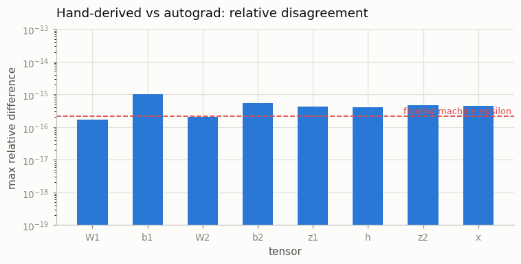
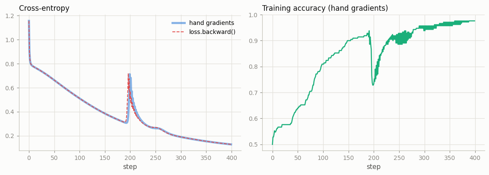
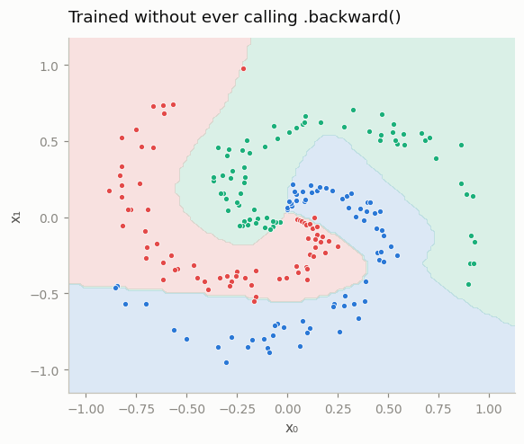
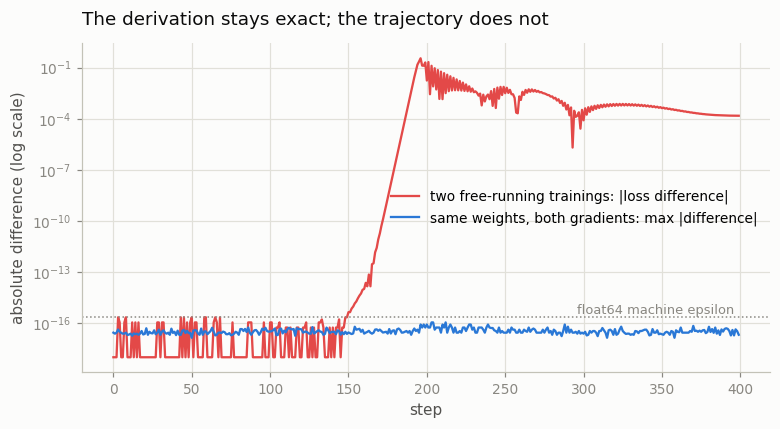
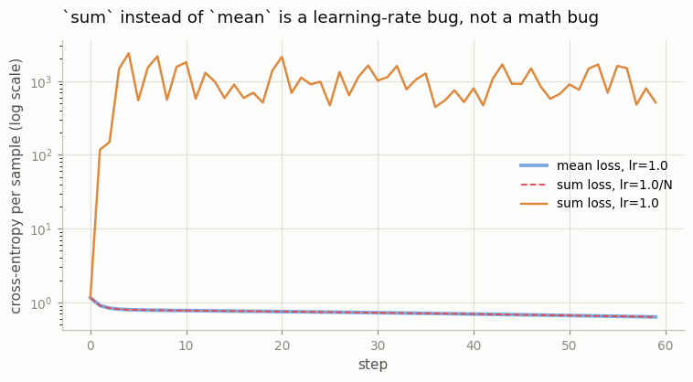

# Manual Backprop

---

> Trust the autograd, but verify it by hand.

---

## Key Insight

Before relying entirely on [autograd](/shared/glossary/#autograd), it is crucial to compute the [gradients](/shared/glossary/#gradients) manually for a simple network. By applying the [chain rule](/shared/glossary/#chain-rule) step-by-step, you see exactly how the error signal flows backwards from the [loss](/shared/glossary/#loss-function) to the weights during the [backward pass](/shared/glossary/#backward-pass).

## Why This Matters

Writing manual backpropagation builds a strong intuitive foundation. When you understand the math behind the gradients, you can spot and fix [numerical issues](/shared/glossary/#numerical-issues), write more efficient custom operations, and truly grasp how deep learning models learn.

---

**This is project 7.** A 2-layer [MLP](/shared/glossary/#mlp) trained on a
three-armed spiral **without ever calling `.backward()`**. Nine lines of hand-
written matrix arithmetic replace the autograd engine, and then get checked three different ways.

What `run.py` measures:

- every gradient — weights, biases, *and* the intermediates — agrees with
  autograd to a **relative 1.04e-15**
- and agrees with [central finite differences](/shared/glossary/#finite-difference)
  to **1.4e-6**, which is the finite differences being wrong, not us
- the hand-gradient run reaches **97.6% accuracy** in 400 steps
- and the honest surprise: **the two training runs still drift apart.** Per step
  the gradients agree to 1.1e-16; after 400 steps the loss curves differ by
  **0.357**. Both end at exactly the same accuracy on different weights.

That last result is the one worth carrying around. It changes how you test a
reimplementation.

---

## Files

| file | what it is |
|---|---|
| `run.py` | the forward pass, the hand-written backward, three checks, two classic bugs, five figures |
| `outputs/` | `findings.csv`, five figures |

```bash
python3 run.py     # ~5 seconds; needs torch, numpy, matplotlib
```

Everything runs in [`float64`](/shared/glossary/#float64). Not for accuracy in the model — for the finite-
difference check in section 2, which needs the spare digits.

---

## The network

```
x (N,2) ──[@W1 + b1]── z1 ──[tanh]── h ──[@W2 + b2]── z2 ──[softmax+CE]── loss
```

147 parameters, 210 points, 3 classes. The three spiral arms are not separable
by any straight line, so the hidden layer has to do real work.

---

## The backward pass, line by line

Nine lines. Each one is a single link of the chain rule, and each one is worth
reading slowly.

### The fused softmax + cross-entropy

```python
p = logp.exp()                     # (N, C) probabilities
dz2 = p.clone()
dz2[torch.arange(N), y] -= 1.0     # subtract 1 from the true class
dz2 /= N                           # because the loss used .mean()
```

Two derivatives collapse into one line here — [softmax](/shared/glossary/#softmax)'s
[Jacobian](/shared/glossary/#jacobian) and the log's `1/p` almost entirely cancel,
leaving `(p − onehot)/N`. Written out separately it is a full N×C×C tensor
contraction; fused it is a subtraction.

This is not just an elegance win. `p` can underflow to 0, and the separate
version then divides by it. The fused form never forms `1/p` at all, which is
why `F.cross_entropy` takes **logits** rather than probabilities and why you
should never hand it a `softmax` output.

The `/N` is there because the loss averaged over the batch. Section 4 shows what
happens when it is not.

### The linear layers

```python
dW2 = h.T @ dz2      # (H,N)@(N,C) -> (H,C), matching W2
db2 = dz2.sum(0)     # sum over the batch
dh  = dz2 @ W2.T     # (N,C)@(C,H) -> (N,H), matching h
```

**Where the transposes come from.** They are not a trick to make the shapes fit,
though checking the shapes is a good way to remember them. `z2 = h @ W2` is
linear in each argument, so its Jacobian *is* the other argument, and the
gradient is a matrix product with it — transposed because the contraction runs
over the other index. A reliable shortcut: **there is only one way to arrange
each product so the result has the right shape**, and that arrangement is
correct.

**Why `db2` sums.** `b2` has shape `(3,)` and was added to a `(210, 3)` tensor,
so [broadcasting](/shared/glossary/#broadcasting) copied it to 210 rows. Each
copy gets its own gradient, and 210 gradients into one bias means addition.

> **The rule worth memorising: the backward of a broadcast is a sum over the
> axis that was stretched.** It is the mirror image of the forward operation —
> forward copies one value to many positions, backward adds many gradients into
> one. Every "why is there a `.sum(0)` here?" in every backward you will ever
> read is this rule.

### The tanh

```python
dz1 = dh * (1.0 - h * h)
```

`d(tanh(z))/dz = 1 − tanh(z)²`, and `tanh(z1)` is already sitting in `h`.
Writing the derivative in terms of the **output** instead of the input means
backward needs no `tanh` call at all. This is exactly what torch's
`TanhBackward` does, and it is the same trick
[project 8](../08-custom-autograd-function/README.md) uses for `sigmoid`.

---

## 1. Against autograd, tensor by tensor

`run.py` runs the same forward pass through autograd, calls `retain_grad()` on
the intermediates (torch discards non-leaf gradients otherwise), and compares
everything:

```
  tensor  shape          max |mine - autograd|      relative
  W1      (2, 24)                    1.388e-17     1.657e-16
  b1      (24,)                      2.776e-17     1.036e-15
  W2      (24, 3)                    2.776e-17     2.030e-16
  b2      (3,)                       2.776e-17     5.303e-16
  z1      (210, 24)                  1.301e-18     4.158e-16
  h       (210, 24)                  1.301e-18     4.088e-16
  z2      (210, 3)                   2.168e-18     4.733e-16
  x       (210, 2)                   5.204e-18     4.342e-16

  worst relative disagreement: 1.04e-15
```



`float64` machine epsilon — the smallest relative gap it can represent — is
2.2e-16. Everything here is within a few multiples of it. **The two computations
produced the same numbers**; they only differ in the order the additions
happened.

Note that `x` is on the list. The gradient with respect to the *input* is a real
quantity, not an accident. It is what
[project 11](../11-double-backward/README.md)'s gradient penalty is built on,
what adversarial examples move along, and what saliency maps display.

---

## 2. Against finite differences

Autograd and a hand derivation could in principle share a mistake — if you
derived the formula by reading torch's source, they certainly could. So `run.py`
also checks against something that shares nothing with either: nudge a weight,
watch the loss.

```
  W1   40 random entries   worst relative error 1.43e-06
  b1   24 random entries   worst relative error 4.60e-08
  W2   40 random entries   worst relative error 7.33e-08
  b2   3 random entries    worst relative error 2.75e-09
```

Those errors are **finite differences being imprecise**, not the analytic
gradient being wrong. Which is exactly why this method is a check and not a
technique: it costs two full forward passes *per parameter*, and it still only
gets you six digits.

### One-sided versus central

```
  on W1[0,0]:  analytic 0.023432123399
               one-sided 0.023432126461   error 3.06e-09
               central   0.023432123464   error 6.48e-11
```

The obvious formula is one-sided: `(f(x+ε) − f(x)) / ε`. The **central**
difference uses both sides: `(f(x+ε) − f(x−ε)) / 2ε`.

Same number of function evaluations (two either way, since you already have
`f(x)` — so really it costs one extra), and **47× more accurate here**. The
reason is that the leading error terms of the two one-sided estimates have
opposite signs and cancel: one-sided error shrinks like ε, central like ε². Free
accuracy for rearranging a formula.

This is the same estimator `torch.autograd.gradcheck` uses internally —
[project 8](../08-custom-autograd-function/README.md) uses it in anger.

---

## 3. Training on hand gradients — and the surprise

400 steps, plain gradient descent, no autograd anywhere in the loop:

```
  final loss     manual 0.128081756663   autograd 0.128232725689
  final accuracy manual 0.9762           autograd 0.9762
```




But look at the two comparisons `run.py` prints, side by side:

```
  LOCKSTEP CHECK -- same weights, both gradients, every step:
    worst |manual - autograd| over all 400 steps: 1.11e-16
    median: 3.12e-17

  FREE-RUNNING -- two independent 400-step runs:
    worst loss disagreement  : 3.57e-01
    worst final-weight gap   : 4.87e-03
    step 1 loss gap 0.00e+00   step 400 loss gap 1.51e-04
```

The **lockstep** check asks autograd for the gradient at every step from the
*same* weights the manual run is using, then throws it away. It never disagrees
by more than one bit, all 400 steps. The derivation is right, and stays right.

The **free-running** comparison lets the two runs each follow their own
gradients. They agree exactly for about 150 steps, then separate — and end up
0.357 apart at the worst point.



The blue line is flat along the bottom, at machine precision, for the whole run.
The red line sits on top of it until step ~150 and then climbs almost vertically
through **fourteen orders of magnitude**.

### Why

Gradient descent is a chaotic map: it feeds its own output back in, 400 times.
Two trajectories that start a distance `d` apart typically end up roughly
`d · e^(λ·steps)` apart — the growth is exponential, so a difference in the last
bit of a `float64` reaches "visible on a plot" in a few hundred steps. Around
step 150 the two runs first make *different* decisions about which way to go on
some ridge in the loss surface, and after that they are simply exploring
different paths down the same hill. Both arrive: **0.9762 accuracy each**, on
different weights.

Nothing here is a bug. The two gradient computations differ only in the order
they sum floating-point numbers, which is enough.

**Two things follow, and both are practical:**

1. **"My rerun gave a slightly different loss" is almost never a bug.** Change
   the thread count, the batch order, the GPU model, or the torch version, and
   the summation order changes. The curves will separate. Reproducibility to the
   last bit takes real work —
   [project 17](../17-reproducible-training/README.md) is about exactly that.

2. **Comparing two implementations by their loss curves is the wrong test.**
   That test cannot distinguish "different rounding" from "wrong by 0.1%": both
   look like curves that drift apart. The right test is the lockstep one — fix
   the weights, compute both gradients, compare. It gives a clean 1e-16 for a
   correct implementation and an unmissable number for a broken one.

---

## 4. The two mistakes every hand-derivation makes

### Bug A: the bias gradient that forgot to sum

```python
db2 = dz2          # instead of dz2.sum(0)
```

```
    dz2 has shape (210, 3), but b2 has shape (3,).
    does `b2 - lr*dz2` raise? False
    broadcasting turns b2 (3,) into (210, 3) and the update silently
    produces a (210, 3) 'bias'.
```

**It does not raise.** Broadcasting is perfectly happy to stretch `(3,)` against
`(210, 3)`, so your bias silently becomes a 210×3 matrix and every sample gets
its own. The model still trains — differently, and wrongly.

The related near-miss, which is even quieter:

```
    sum-over-batch  db2 = [-0.028693 -0.023643  0.052337]
    mean-over-batch db2 = [-0.000137 -0.000113  0.000249]  <- off by 1/N = 1/210
```

`.mean(0)` has the right *shape* and the wrong *value*, by exactly `1/N`. Your
biases then learn 210× slower than your weights, forever, and no shape check can
see it. The reason it must be `sum` and not `mean` is back in the rule above:
the forward copied the bias to 210 rows, so 210 gradients come back, and
combining copies means adding.

### Bug B: `sum` where you meant `mean`

```
    mean loss, lr=1.0     : per-sample loss   0.634624, acc 0.652
    sum  loss, lr=1.0     : per-sample loss 515.041526, acc 0.371
    sum  loss, lr=1.0/210 : per-sample loss   0.634624, acc 0.652
    the last two curves agree to 3.33e-16
```



The blue and red curves lie on top of each other. **A `sum` loss is not a wrong
loss — it is the same run at a learning rate N times larger.** Every gradient is
multiplied by exactly N = 210.

That is why this bug never announces itself as a shape error. It announces
itself as "my loss exploded" or "my loss became `nan`", and you go looking at
your learning rate, your initialisation, your data — anywhere except the
`reduction` argument. The tell: the damage scales with **batch size**. Halve the
batch and the explosion halves too.

> **A corollary worth knowing.** If you switch from `mean` to `sum` reduction (or
> from `mean` over tokens to `sum` over tokens, which is common in language-model
> code), you must divide the learning rate by the same factor or you have
> silently changed your optimiser settings. This is a real source of "the paper's
> hyperparameters don't work for me".

---

## Things you can try

- **Break one line and find it with the lockstep check.** Drop the `(1 − h²)`,
  transpose the wrong matrix, forget the `/N`. Each shows up as a specific
  tensor in section 1's table, and the tensor tells you which line.
- **Add a layer.** The pattern repeats exactly: `dW = input.T @ dz`,
  `db = dz.sum(0)`, `dinput = dz @ W.T`.
- **Swap `tanh` for `relu`.** The derivative becomes `(z1 > 0)` — and note it
  needs `z1`, not `h`, because `relu`'s output does not determine its input's
  sign at 0.
- **Run section 3 with 4000 steps** instead of 400 and watch where the two runs
  separate. Then set `lr` to 0.1 and watch it happen later.

---

## What to take away

1. The backward of a 2-layer MLP is **nine lines**. `dW = inputᵀ @ dz`,
   `db = dz.sum(0)`, `dinput = dz @ Wᵀ`, and one elementwise multiply per
   nonlinearity.
2. **The backward of a broadcast is a sum** over the stretched axis. This single
   rule explains every `.sum(0)` in every backward.
3. **Softmax + cross-entropy fuse to `(p − onehot)/N`.** The fusion is the reason
   loss functions take logits.
4. Written correctly, hand gradients match autograd to a relative **1.04e-15**
   and finite differences to **1.4e-6** — the finite differences being the
   imprecise one.
5. **Central differences beat one-sided by 47×** for one extra evaluation,
   because the leading error terms cancel.
6. Two runs whose gradients agree to **1.1e-16 at every step** still end up
   **0.357** apart after 400 steps. Gradient descent amplifies the last bit.
7. So **compare gradients at fixed weights, not loss curves.** The lockstep check
   is the test; the curve comparison cannot tell rounding from a real error.
8. A `sum` loss is a **learning-rate bug wearing a costume**. It shows up as
   divergence, and the damage scales with batch size.

---

Next: [project 8](../08-custom-autograd-function/README.md) puts the hand-written
backward *back* into autograd, as a `torch.autograd.Function` — and finds out
what you actually gain by doing so, which is not what the folklore says.
