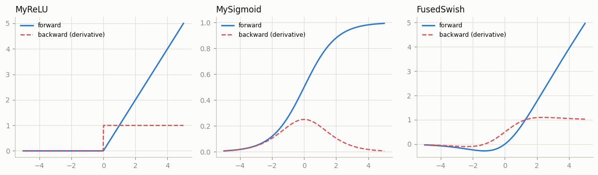
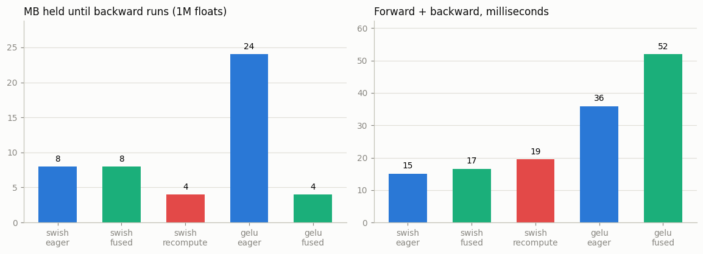

# Custom Autograd Function

---

> Sometimes, you need to teach autograd new tricks.

---

## Key Insight

You are not limited to PyTorch's built-in operations. By subclassing `torch.autograd.Function`, you can define custom forward and [backward pass](/shared/glossary/#backward-pass) logic. You explicitly save required inputs using `ctx.save_for_backward()` and provide the exact [derivative](/shared/glossary/#derivative) computation.

## Why This Matters

Custom autograd functions allow you to implement novel research ideas, optimize memory usage, or bypass non-differentiable steps. It is a powerful tool for bridging the gap between theoretical math and practical deep learning implementation.

---

**This is project 8.** `ReLU` and `Sigmoid` written as
`torch.autograd.Function` subclasses — and then the question a beginner should
be asking out loud:

> **torch already has `relu` and `sigmoid`. Why write them again?**

The honest answer is: *for those two, you should not.* `run.py` proves ours match
torch exactly, and that is all matching proves. The real reason to write a
`Function` is that **you choose what `backward` needs, and therefore what has to
stay in memory until `backward` runs.** Sections 4 and 5 measure that, and the
answer is not what the folklore says:

- fusing `x * sigmoid(x)` into one `Function` saved **exactly zero memory**
- rewriting it to *recompute* `sigmoid(x)` in backward saved **half**
- fusing a tanh-GELU saved **6×** — 24 MB down to 4 MB
- and every fused version was **slower** than eager on CPU

Plus two broken backwards: one `gradcheck` catches instantly, one it can never
catch.

---

## Files

| file | what it is |
|---|---|
| `run.py` | the functions, `gradcheck`, two bugs, the memory study, the safety-net demo, two figures |
| `outputs/` | `findings.csv`, two figures |

```bash
python3 run.py     # ~5 seconds; needs torch, matplotlib
```

---

## The shape of a Function

```python
class MySigmoid(torch.autograd.Function):
    @staticmethod
    def forward(ctx, x):
        y = torch.sigmoid(x)
        ctx.save_for_backward(y)        # note: y, not x
        return y

    @staticmethod
    def backward(ctx, grad_output):
        (y,) = ctx.saved_tensors
        return grad_output * y * (1 - y)
```

Call it with `MySigmoid.apply(x)`, never `MySigmoid()(x)`.

Three rules, and all three cause errors when broken:

1. **`forward` and `backward` are `@staticmethod`s.** There is no `self`; `ctx`
   is the only channel between them.
2. **`backward` returns exactly one value per `forward` argument, in order.**
   Non-tensor arguments get `None`. `run.py`'s `Scale(x, alpha)` shows this — a
   Python `float` cannot receive a gradient, so its slot is `None`.
3. **Multiply by `grad_output`.** That multiplication is the
   [chain rule](/shared/glossary/#chain-rule). Section 3(a) measures what
   skipping it costs.

### Why save the output, not the input

`d(sigmoid)/dx = y(1 − y)` where `y` is the sigmoid's own output. Saving `y`
means `backward` needs no `exp()` at all. Saving `x` would mean recomputing
`sigmoid(x)` first.

This is exactly what torch's own `SigmoidBackward` does, and the same trick as
`tanh`'s in [project 7](../07-manual-backprop/README.md). `ctx.save_for_backward`
does not care whether a tensor is an input or an output — it only cares that
`backward` will need it.

`MyReLU` cannot use the trick: `relu`'s output is 0 for every negative input, so
it does not tell you where the input was negative. It has to save `x`.

Verified against the built-ins with a **random** upstream gradient (section 3
explains why that matters):

```
  relu      forward max diff 0.00e+00   backward max diff 0.00e+00
  sigmoid   forward max diff 0.00e+00   backward max diff 1.11e-16
```



---

## 2. `gradcheck`, and why it needs float64

[`torch.autograd.gradcheck`](/shared/glossary/#gradcheck) is exactly what its name says — **grad** + **check**.
It nudges every entry of the input by ±ε, watches the output, and builds the
[Jacobian](/shared/glossary/#jacobian) numerically. Then it compares that to the
Jacobian your `backward` implies. Same idea as
[project 7](../07-manual-backprop/README.md)'s
[finite differences](/shared/glossary/#finite-difference), packaged.

It costs **two forward passes per input element**, so it is for 10-element test
tensors, not real ones. Test small, then trust it.

```
  MyReLU    float64: True
  MySigmoid float64: True
  MySigmoid float32: FAILED -- Jacobian mismatch for output 0 with respect to input 0,
```

**Same code, same maths, and `float32` fails.** This is not a subtle numerical
point; it is a big effect:

```
    float32  numerical 0.1937150955   analytic 0.1932556182   error 4.59e-04
    float64  numerical 0.2159802641   analytic 0.2159802641   error 2.62e-12
```

The numerical Jacobian divides by `eps = 1e-6`. Dividing by a small number
**multiplies the error by a million**. `float32` keeps about 7 decimal digits, so
its rounding error is already around 1e-7 of the value; divide that by 1e-6 and
you get noise of order 0.1 — enough to swamp the answer. `float64` keeps about
16 digits, so there are nine spare.

**Always `gradcheck` in [`float64`](/shared/glossary/#float64).** `torch.set_default_dtype(torch.float64)` at
the top of your test file, or build the test tensors with `dtype=torch.double`.
torch warns about this when it sees a `float32` input, which is a hint worth
taking.

---

## 3. Two broken backwards

### (a) Forgetting `grad_output` — caught immediately, and hidden by `.sum()`

```python
def backward(ctx, grad_output):
    (x,) = ctx.saved_tensors
    return (x > 0).to(grad_output.dtype)     # the missing `grad_output *`
```

```
      gradcheck: caught by gradcheck
      but under `y.sum().backward()` the two agree: True
      with a random upstream grad: max diff 2.998
```

Read the middle line again. **The obvious way to test a custom function hides
this bug completely.** `y.sum().backward()` sends an upstream gradient of exactly
`1.0` into your `backward`, and multiplying by 1.0 changes nothing — so the
broken version and the correct version return the same numbers.

The habit that fixes it costs one extra word:

```python
(y * torch.randn_like(y)).sum().backward()     # not y.sum().backward()
```

A random upstream gradient exposes the bug at once — here by 2.998, which is not
a rounding error. `gradcheck` does this internally, which is one more reason to
use it.

### (b) Wrong at exactly zero — never caught, and it does not matter

```python
return grad_output * (x >= 0)     # >= instead of >
```

```
      gradcheck on random inputs: passed
      at x = 0 exactly (same upstream grad for both):
        broken  [ 1.3921  0.6553 -2.0622 -0.1775]
        correct [ 0.  0. -0. -0.]
```

`gradcheck` passes because `torch.randn` hits exactly `0.0` with probability
essentially zero. Neither will your data.

And that is fine, because **`relu` is genuinely not differentiable at 0.** There
is no right answer, only a convention: torch picks 0, TensorFlow picks 0, some
papers argue for 0.5. Matching the convention matters only when you are
comparing two implementations bit for bit.

The two bugs are worth contrasting: **(a) is invisible to a bad test and obvious
to a good one; (b) is invisible to every test and harmless.** Knowing which kind
you have is most of debugging.

---

## 4. So why bother? The memory answer

Sections 1–3 only proved we can *match* torch. Here is what a `Function` actually
buys.

`run.py` measures the exact bytes autograd stashes for backward, using
`torch.autograd.graph.saved_tensors_hooks` — a hook that fires on every saved
tensor. On CPU there is no `torch.cuda.max_memory_allocated` to ask, so this is
how you find out.

### The null result first

`swish(x) = x * sigmoid(x)`, one million floats:

```
    eager (two ops):   2 tensors saved,   8.00 MB
    fused Function:    2 tensors saved,   8.00 MB
    recompute variant: 1 tensor saved,    4.00 MB
```

**Fusing bought nothing.** Eager already saved exactly two tensors — the
multiply's two operands — and the fused version saves the same two. "Fuse it into
one `Function` to save memory" is not a law; it only pays when the eager
expression leaves intermediates lying around, and two operations do not.

What *did* pay is the third variant, which refuses to save `sigmoid(x)` and
recomputes it inside `backward`:

```python
@staticmethod
def forward(ctx, x):
    ctx.save_for_backward(x)          # only x
    return x * torch.sigmoid(x)

@staticmethod
def backward(ctx, grad_output):
    (x,) = ctx.saved_tensors
    s = torch.sigmoid(x)              # pay compute to save memory
    return grad_output * (s + x * s * (1 - s))
```

Half the memory, for one extra `sigmoid` in backward. That is
[gradient checkpointing](/shared/glossary/#gradient-checkpointing) in miniature —
[project 10](../10-gradient-checkpointing/README.md) applies the identical trade
to whole layers.

### And where fusion really does pay

The tanh-approximated [GELU](/shared/glossary/#gelu), which is a genuine chain of
operations:

```
0.5 * x * (1 + tanh(0.7978 * (x + 0.044715 * x^3)))
```

```
    eager:  6 tensors saved,  24.00 MB
    fused:  1 tensor saved,    4.00 MB   (6x less)
```

**Six intermediates versus one.** Eager autograd has no idea that `x³`, the inner
sum, the `tanh` input and the `tanh` output can all be rebuilt from `x` alone —
each op only knows its own backward, so each one saves what it personally needs.
You know the whole expression, so you can save one tensor and rebuild the rest.
This is why every serious library ships a fused GELU.



### The time column, which is the other honest result

```
  variant                 saved    fwd+bwd    max grad diff vs eager
  swish eager             8.0MB     15.1ms                  0.00e+00
  swish fused             8.0MB     16.6ms                  4.77e-07
  swish recompute         4.0MB     19.4ms                  4.77e-07
  gelu eager             24.0MB     35.9ms                  0.00e+00
  gelu fused              4.0MB     51.9ms                  7.60e-07
```

**Every fused version is slower.** That is not a mistake in the implementation,
and it is worth being precise about why:

> **A custom `Function` fuses the *graph*, not the *kernels*.** It collapses
> several autograd nodes into one, which saves graph bookkeeping and lets you
> choose what to save. It does **not** merge the underlying C++ loops. Our
> `backward` is still a sequence of separate tensor operations, and here it is
> more of them than eager's hand-tuned backward, not fewer.

Real kernel fusion — one loop over memory doing all the arithmetic — needs a
custom kernel, which is
[phase 6](../../README.md#phase-6-custom-kernels--c-cuda-and-triton-extensions).
On a GPU the picture also shifts, because saved tensors compete for a much
scarcer resource and the memory traffic itself is usually the bottleneck.

The `4.77e-07` differences are `float32` rounding: the fused backward computes
the same quantity by a different route.

---

## 5. `save_for_backward` is not just a place to put things

You *can* write `ctx.x = x` and it works. Here is the bill.

```
  save_for_backward: RuntimeError: one of the variables needed for gradient
                     computation has been modified by an inplace operation
  ctx.x = x        : no error, x.grad = 60.0
  the true gradient at x = 3 is 2*3 = 6.0
```

Both versions computed `x²` and then something modified the saved tensor
[in place](/shared/glossary/#in-place-operation) before `backward` ran. `save_for_backward` **noticed and refused**. The
plain attribute quietly used the modified value and returned a gradient that is
**ten times too large**.

The mechanism: `save_for_backward` records the tensor's **[version counter](/shared/glossary/#version-counter)** — a
number torch increments on every in-place write. At backward time it compares,
sees the mismatch, and raises. A plain Python attribute stores only the
reference, so it sees whatever the tensor happens to contain by then.

> **This is the same trap `.data` sets, from the other side of the fence.**
> [Project 2](../02-view-vs-copy-detective/README.md) found that `z.data.mul_(2)`
> silently produces a 2× gradient because `.data` hands back a tensor with a
> *fresh* version counter, so the check never fires. Same missing check, same
> class of silently-wrong answer. `detach()` shares the counter and is safe.

`save_for_backward` also:

- **frees the tensor as soon as `backward` runs**, instead of keeping it alive as
  long as the `ctx` object lives
- **cooperates with `saved_tensors_hooks`** — which is the only reason section 4
  could measure anything at all, and the mechanism behind offloading saved
  tensors to CPU in large-model training

Use it for tensors. Use `ctx.something = value` only for the things that are not
tensors: shapes, flags, Python numbers.

---

## When to actually write one

The four cases, in rough order of how often they come up:

1. **Save less.** Recompute in backward instead of storing (section 4). This is
   the main one.
2. **Make a non-differentiable step trainable.** `round`, `sign`, a nearest-
   codebook lookup. That is [project 9](../09-straight-through-estimator/README.md).
3. **Numerically different maths.** A backward that is stable where the naive
   composition is not — the fused softmax + cross-entropy of
   [project 7](../07-manual-backprop/README.md) is exactly this, done inside
   torch.
4. **Something not expressible in torch ops at all** — a call into C++, a solver,
   a simulator. (That is when you need `once_differentiable`; see
   [project 11](../11-double-backward/README.md).)

Note what is *not* on the list: speed. On CPU, a custom `Function` is a slower
way to compute the same thing.

---

## Things you can try

- **Write `MyTanh`** saving the output, and `gradcheck` it. Then write it saving
  the input and confirm both pass — same maths, different memory.
- **Break `Scale`'s backward** to return only one value instead of `(grad, None)`
  and read the error message. It is very specific.
- **Run `count_saved` on your own model's activation function.** If it saves more
  than one or two tensors per call, a fused version is available.
- **Use `saved_tensors_hooks` to print the shape of every saved tensor** in a
  real forward pass. It is the cheapest activation-memory audit there is.

---

## What to take away

1. A `Function` is two `@staticmethod`s and a `ctx`. `backward` returns one value
   per `forward` argument, `None` for non-tensors, and multiplies by
   `grad_output`.
2. **Save the output when the derivative is expressible in it** (`sigmoid`,
   `tanh`, `exp`). `save_for_backward` does not care whether a tensor was an
   input.
3. **`gradcheck` in `float64` or not at all.** Dividing by `eps = 1e-6`
   multiplies rounding error by a million; `float32` fails on correct code.
4. **Never test with `y.sum().backward()`** — it sends an upstream gradient of
   1.0 and hides a missing chain rule. Use `(y * torch.randn_like(y)).sum()`.
5. Some bugs `gradcheck` cannot see, like the derivative at exactly `x = 0`.
   Those are usually the ones that do not matter.
6. **Fusing a two-op expression saved zero memory.** The win comes from choosing
   to *recompute* (2× less) or from fusing an expression with real intermediates
   (GELU: 6× less).
7. **A custom `Function` fuses the graph, not the kernels.** Every fused version
   here was slower on CPU.
8. `save_for_backward` buys a **version-counter check** that turns a silently
   10×-wrong gradient into an exception, plus early freeing and hook support.

---

Next: [project 9](../09-straight-through-estimator/README.md) uses a custom
`Function` for the thing only a custom `Function` can do — differentiating
through an operation that has no usable derivative at all.
