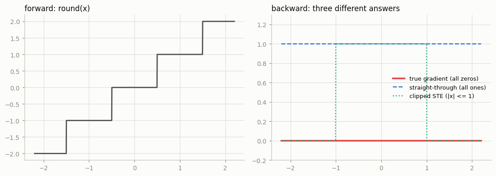
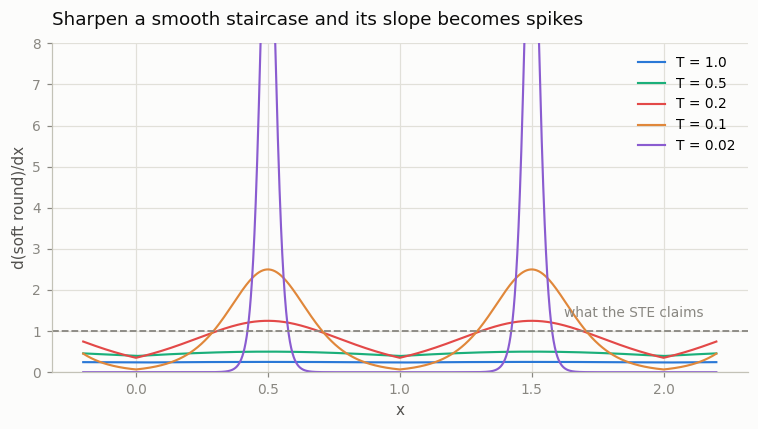
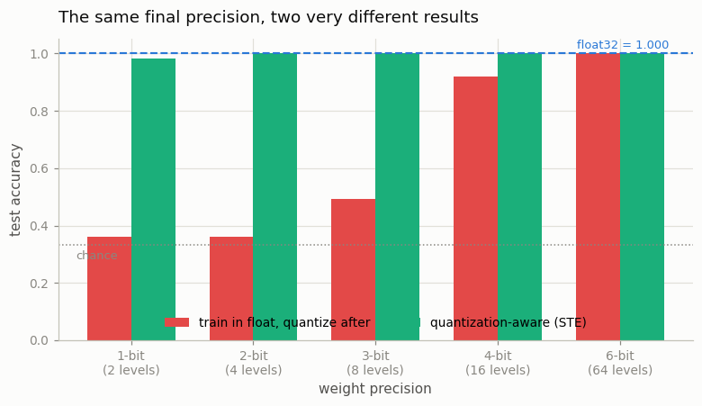
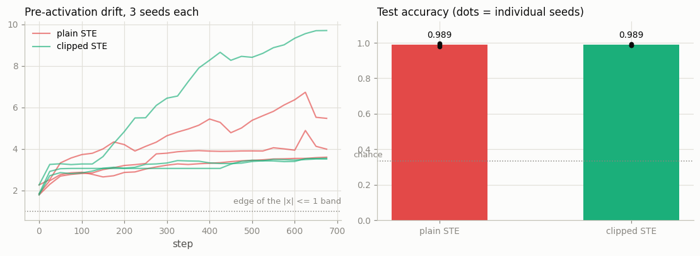

# Straight-Through Estimator

---

> Pretend the non-differentiable is differentiable.

---

## Key Insight

Some operations, like rounding or thresholding, are non-differentiable because their derivative is zero almost everywhere. A [straight-through estimator](/shared/glossary/#straight-through-estimator) (STE) solves this by using the non-differentiable operation in the forward pass, but passing the gradients straight through unchanged during the [backward pass](/shared/glossary/#backward-pass) as if the operation was an [identity function](/shared/glossary/#identity-function).

## Why This Matters

STEs are essential for training models with discrete components, such as [VQ-VAE](/shared/glossary/#vq-vae)s or discrete latent variables. They offer a practical workaround for incorporating hard decision boundaries into continuous [autograd](/shared/glossary/#autograd) pipelines.

---

**This is project 9.** `torch.round` has a derivative of exactly zero. Put it in
a model and training stops dead — measurably, and with no error message. The STE
lies about that derivative on purpose, and the lie is how every quantized network
and every [VQ-VAE](/shared/glossary/#vq-vae) is trained.

What `run.py` measures:

- `round`'s gradient norm: **exactly 0.0**. Train a 3-bit network without an STE
  and **0 of 4,416 weights** ever receive a gradient — while the loss still goes
  down, because the biases are not quantized.
- with an STE, **1-bit weights reach 0.9833** test accuracy where
  quantize-after-training reaches **0.3600**, which is chance.
- and the STE's gradient is genuinely, deliberately wrong: it reports a slope of
  1 where the true slope is 0 almost everywhere and **250,000** at the steps.
- an honest null result: **clipped STE changed nothing** — same accuracy to four
  decimals, over three seeds.

---

## Files

| file | what it is |
|---|---|
| `run.py` | the dead gradient, the two ways to write an STE, the bias measurement, the QAT study, the sign-network comparison, four figures |
| `outputs/` | `findings.csv`, four figures |

```bash
python3 run.py     # ~25 seconds; needs torch, numpy, matplotlib
```

---

## 1. Why `round` kills training

```
  x            [-2.  -1.5 -1.  -0.5  0.   0.5  1.   1.5  2. ]
  round(x)     [-2.  -2.  -1.  -0.   0.   0.   1.   2.   2. ]
  d/dx         [ 0.   0.   0.   0.   0.   0.   0.   0.   0. ]
  gradient norm: 0.0
```

**Every entry is 0, and every entry is correct.** `round` is a staircase: flat
between the steps, so the slope really is 0; vertical at each step, where the
slope is undefined and torch reports 0 as well.

A slope of zero says "nudging `x` does not change the output", and for almost
every `x` that is exactly true. But *almost every* is not *every*, and the entire
learning signal lives in the steps that the flat parts cannot see.



### The two ways to write the fix

As a `Function`, in the style of [project 8](../08-custom-autograd-function/README.md):

```python
class RoundSTE(torch.autograd.Function):
    @staticmethod
    def forward(ctx, x):
        return torch.round(x)

    @staticmethod
    def backward(ctx, g):
        return g            # d(identity)/dx = 1, so pass it straight through
```

Or as one line, which is what most repositories actually contain:

```python
y = x + (torch.round(x) - x).detach()
```

```
  with RoundSTE: d/dx = [1. 1. 1. 1. 1. 1. 1. 1. 1.]   norm 3.0000
  the one-liner `x + (round(x) - x).detach()` gives the same: True
```

**Why the one-liner works.** Read it as two separate questions:

- *What value comes out?* `x + round(x) − x` = `round(x)`. Correct.
- *What does backward see?* `.detach()` removes the whole bracket from the graph,
  so the only path back to `x` is the leading `x`, whose derivative is 1.

It is the same object as the `Function`, in a third of the space. The `Function`
version is worth writing when you want a name, a docstring, or a variant like the
clipped one below.

### Decoding the name

- **"Straight-through"** — the gradient goes *straight through* the block,
  unchanged, as if the block were not there.
- **"Estimator"** — it is not the derivative of `round`. That is 0. It is a
  stand-in we chose, and calling it an *estimator* is an admission that it
  estimates something rather than computing it.

---

## 2. How wrong is it, exactly?

Three answers to "what is `d round(x)/dx` at `x = 0.3`?":

```
    finite difference : 0.0   (the honest answer for x away from a step)
    autograd          : 0.0
    STE               : 1.0   <- a deliberate fiction
```

And straddling a step:

```
    finite difference straddling the step at x = 0.5: 250,000
```

So the true derivative is **0 almost everywhere and unbounded on a set of
measure zero**. Neither number can steer gradient descent: 0 says "do nothing",
and infinity says "do everything".

### So what *is* the STE the gradient of?

Of a **smoothed** staircase. Replace `round` with a soft version that has a
temperature `T` and gets sharper as `T` shrinks, then look at its slope:

```
    T = 1.0   mean slope  0.245   peak slope      0.25
    T = 0.5   mean slope  0.462   peak slope      0.50
    T = 0.2   mean slope  0.848   peak slope      1.25
    T = 0.1   mean slope  0.987   peak slope      2.50
    T = 0.02  mean slope  1.006   peak slope     12.50
```



The **mean** slope settles at 1 and stays there no matter how sharp the staircase
gets. That is the number the STE reports.

What changes is the **shape**: as `T` shrinks the slope piles into ever-taller
spikes at the steps and vanishes between them. The STE spreads that same total
slope out evenly across `x`.

> **In plain terms:** the STE is right on average and wrong everywhere in
> particular. A weight sitting in the middle of a quantization bin is told "move
> and the output moves with you", when in truth it can wander a long way before
> anything happens. A weight sitting right at a bin edge is told the same thing,
> when in truth one nudge flips the whole output. Both get the same answer: 1.
>
> That is what **"biased estimator"** means — not "noisy", which would average
> out over many steps, but *systematically* wrong in a way that does not.

The remarkable thing is not that the STE is biased. It is that a bias this large
still trains a network, which is what section 3 measures.

---

## 3. Quantization-aware training vs quantize-afterwards

An MLP (2-64-64-3, 4,547 parameters) on a three-arm spiral, with its weights
quantized to `k` bits **on the way into every matmul**:

```python
def quantize(w, bits):
    lo, hi = w.min().detach(), w.max().detach()
    scale = (hi - lo) / (2 ** bits - 1)
    return torch.round((w - lo) / scale) * scale + lo

def quantize_ste(w, bits):
    return w + (quantize(w, bits) - w).detach()
```

Two ways to end up with a k-bit model:

- **quantize-after-training** (PTQ): train in `float32`, round the weights once
  at the end
- **[quantization-aware training](/shared/glossary/#quantization-aware-training)** (QAT): quantize on *every forward pass* during
  training, with an STE so gradients still flow

```
  float32 baseline: test accuracy 1.0000

  1-bit weights ( 2 levels):  quantize-after 0.3600   QAT with STE 0.9833   +0.6233
  2-bit weights ( 4 levels):  quantize-after 0.3600   QAT with STE 1.0000   +0.6400
  3-bit weights ( 8 levels):  quantize-after 0.4933   QAT with STE 1.0000   +0.5067
  4-bit weights (16 levels):  quantize-after 0.9200   QAT with STE 1.0000   +0.0800
  6-bit weights (64 levels):  quantize-after 1.0000   QAT with STE 1.0000   +0.0000
```



Chance is 0.3333. **Quantize-after-training is at chance for 1 and 2 bits. The
STE-trained network matches the `float32` baseline at 2 bits and is within 0.017
of it at 1 bit** — one bit per weight.

> **Why does it matter *when* you round, if the final precision is identical?**
> Because rounding once at the end gives nothing a chance to compensate. Every
> weight moves to its nearest level simultaneously, all the errors land at once,
> and the network has never seen them.
>
> QAT quantizes on every forward pass, so the loss the optimizer sees is the loss
> of the **quantized** network. The rounding error is present from step one, and
> the other 4,546 weights spend the whole run adapting to it — a weight that
> cannot represent 0.37 gets neighbours that lean the other way to make up the
> difference. Same final precision, completely different final weights.
>
> The trade also explains where PTQ *does* work: at 6 bits the rounding error is
> small enough that nothing needs to compensate, and both methods hit 1.0000.
> This is why production pipelines reach for PTQ first and only pay for QAT when
> they need to go below about 8 bits.

---

## 4. The control: what happens without the STE

Same network, 3-bit weights, `round` with its **real** gradient:

```
    weight-gradient norm, max over 200 steps: 0.00000000
    weights with a non-zero gradient: 0 of 4,416
    loss  1.0860 -> 1.0188
    test accuracy 0.6400   (chance is 0.3333, float32 baseline is 1.0000)
```

Not one weight received a gradient in 200 steps. **And the loss still went
down**, from 1.086 to 1.019, and accuracy still reached 0.64 — because the
*biases* are not quantized and trained normally the whole time.

That is exactly the shape that makes a dead-gradient bug hard to spot. The loss
curve moves. Something is clearly learning. It is just not the thing you think.

> **Check the gradient norm of the tensor you believe is learning, not the loss.**
> One line after `loss.backward()`:
> `assert model.some_weight.grad.abs().max() > 0`.

### The subtler version of the same bug

`quantize` computes its step size from `w.min()` and `w.max()`. Leave those in
the graph instead of detaching them, and:

```
    weight-gradient norm, max over 200 steps: 4.7959  <- not zero!
    weights with a non-zero gradient: 6 of 4,416
    test accuracy 0.5467
```

A **healthy-looking gradient norm of 4.8**, arriving at six weights: the ones
that happen to *be* the minimum or the maximum of their tensor. Every other
weight still gets nothing.

> **A non-zero gradient norm is not proof that gradients are flowing.** A norm is
> a single number and it cannot tell you whether the gradient reached 4,416
> weights or 6. Count the non-zero entries:
> `(p.grad != 0).sum()`. It is the same amount of typing and it cannot be fooled.

---

## 5. Plain STE vs clipped STE — an honest null result

The classic refinement (Hinton 2012, Bengio 2013) is to pass the gradient
through **only where a small change could plausibly flip the output**:

```python
return g * (x.abs() <= 1)     # clipped STE
```

Outside that band the unit is saturated, and "this input does not matter" is
arguably the *less* dishonest answer. `run.py` tests it on a network where every
hidden activation is `sign(x)` — one bit per activation — over three seeds:

```
  plain STE  : accuracy 0.9889 (seeds 0.997, 0.990, 0.980)   peak |pre-act| 5.1   21% outside the band
  clipped STE: accuracy 0.9889 (seeds 0.987, 0.993, 0.987)   peak |pre-act| 5.6   25% outside the band

  gap between the two: +0.0000   spread within one method across seeds: 0.0167
```



**Clipping changed nothing.** Not the accuracy — identical to four decimals, with
a seed-to-seed spread 17× larger than the gap. And not the pre-activation drift
it was supposed to control either; if anything the clipped runs drifted slightly
further.

This is a real result, not a failed experiment. The reason is scale: this network
is **two quantized layers deep on an easy task**, so the bogus gradient from
saturated units never gets a chance to compound. Clipping was invented for
binarized networks tens of layers deep, where each layer's error feeds the next
and the compounding is the whole problem.

> **The transferable lesson:** an STE variant that helps in a 40-layer binarized
> ResNet can be pure noise in a 2-layer toy, and a single-seed run would have let
> you claim either direction. Every number in this section is the mean of three
> seeds with the individual seeds printed, which is why the null result is
> trustworthy rather than just unimpressive.

---

## Where STEs show up

- **[VQ-VAE](/shared/glossary/#vq-vae)** — the encoder output is snapped to the
  nearest [codebook](/shared/glossary/#codebook) entry. Same problem, same fix:
  `z_q = z + (nearest(z) - z).detach()`.
- **Quantization-aware training** — section 3, and every `int8`/`int4` model you
  have downloaded.
- **Binary and 1-bit networks** — `sign` instead of `round`, section 5.
- **Discrete latent variables and hard attention** — anywhere a model has to
  *commit* to a choice in the forward pass.
- **Gumbel-softmax with hard sampling** — `hard=True` is an STE around an
  `argmax`.

And one place they must **not** go: anything that needs a *second* derivative.
[Project 11](../11-double-backward/README.md) measures why — an STE's backward
returns a constant, so there is nothing left to differentiate.

---

## Things you can try

- **Sweep the STE's constant.** Return `0.5 * g` instead of `g` and see whether
  QAT still works. (It does, more slowly — it is a learning-rate change in
  disguise, exactly like [project 7](../07-manual-backprop/README.md)'s
  `sum`-vs-`mean`.)
- **Anneal a soft-round instead of using an STE.** Start at `T = 1` and shrink to
  `T = 0.02` over training. Compare final accuracy.
- **Quantize the activations too**, not just the weights, and re-run the bit
  sweep. The cliff moves.
- **Make the sign network 10 layers deep** and re-run section 5. This is where
  clipping is supposed to earn its keep.

---

## What to take away

1. `round`'s gradient is **exactly 0** everywhere it exists, and that is
   mathematically correct. It is also useless.
2. An STE runs the hard operation forward and **passes the gradient through
   unchanged** backward. `x + (round(x) - x).detach()` is the whole thing.
3. The STE is the gradient of a **smoothed** staircase: the same total slope,
   spread evenly instead of piled into spikes. Right on average, wrong in
   particular — a **biased** estimator, not a noisy one.
4. **1-bit QAT: 0.9833. 1-bit quantize-after-training: 0.3600 (chance).** Same
   final precision; the difference is whether the other weights got to
   compensate.
5. Without an STE, **0 of 4,416 weights** get a gradient — and the loss still
   falls, because the biases still train. Check gradient norms, not loss curves.
6. **A non-zero gradient norm proves nothing.** Leaving `min()`/`max()` in the
   graph gave a norm of 4.8 that reached exactly 6 weights. Count non-zero
   entries.
7. **Clipped STE bought nothing here** — 0.0000 gap against a 0.0167 seed spread.
   Report the seeds; the variant is insurance against a failure mode this problem
   never reaches.

---

Next: [project 10](../10-gradient-checkpointing/README.md) uses a custom
`Function` for the other thing only a custom `Function` can do — deciding what
`backward` is allowed to remember.
