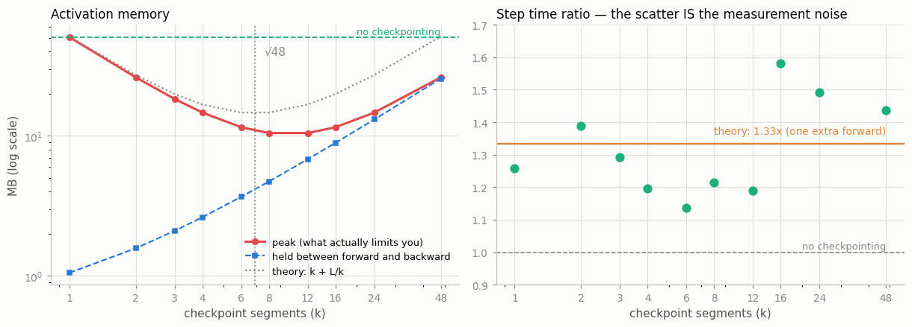
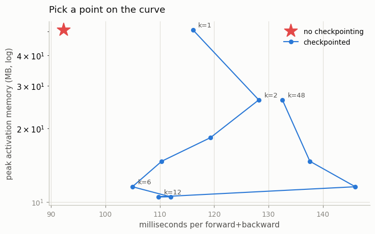

# Gradient Checkpointing

---

> Trade compute for memory to train bigger models.

---

## Key Insight

Normally, PyTorch saves all intermediate [activations](/shared/glossary/#activations) during the forward pass to use them in the [backward pass](/shared/glossary/#backward-pass). [Gradient checkpointing](/shared/glossary/#gradient-checkpointing) discards most of these activations to save memory, and simply recomputes them on-the-fly during the backward pass when they are needed.

## Why This Matters

Memory is often the biggest bottleneck in deep learning. Checkpointing allows you to train significantly larger models or use larger batch sizes on a single GPU, making it a critical technique for scaling up.

---

**This is project 10.** We write checkpointing ourselves first — it is about
fifteen lines of `torch.autograd.Function`, building directly on
[project 8](../08-custom-autograd-function/README.md) — and then measure it.

Writing it ourselves is not a stunt. It is the only way to make the memory
visible: `torch.utils.checkpoint` installs its own saved-tensor hooks, which
means an outside observer cannot see what happens during recomputation. And our
version turns out to have the *exact* bug the real API shipped with for years,
which makes section 5 a lot more convincing.

What `run.py` measures:

- a 48-block network holds **50.9 MB** of activations, in **97 tensors**
- checkpointing brings the peak to **10.5 MB — 4.8× less** — and the minimum
  lands at **8 segments**, against a predicted √48 = 6.9
- the gradients are **bit-for-bit identical**. Checkpointing is not an
  approximation.
- **one checkpoint around the whole model is the worst configuration**, tied with
  no checkpointing at all
- turn off RNG preservation and the gradient is wrong by 1.4e-2 with a cosine
  similarity of **0.9992** — wrong enough to slow training, right enough that
  nothing complains
- and **2 of 5** checkpointing setups silently trained nothing at all

---

## Files

| file | what it is |
|---|---|
| `run.py` | `Checkpoint` and `CheckpointNaive`, the byte tracker, the sweep, the dropout trap, the reentrant no-op, two figures |
| `outputs/` | `findings.csv`, two figures |

```bash
python3 run.py     # ~45 seconds; needs torch, numpy, matplotlib
```

---

## 1. What a forward pass leaves behind

48 blocks of `Linear(512,512) + GELU`, batch 256:

```
  one activation tensor = 256 x 512 x 4 B = 0.52 MB

  activations autograd held : 50.9 MB in 97 tensors (2 per block)
  parameters it ALSO saved  : 48 references, 50.4 MB -- already resident, not counted again
  step time                 : 80 ms
```

**Two activation tensors per block, and neither is optional.** `Linear`'s
backward needs its *input* to compute `dW` (`dW = inputᵀ @ dz`, straight out of
[project 7](../07-manual-backprop/README.md)); `GELU`'s backward needs *its*
input to compute the local slope. The chain rule genuinely wants both numbers.

Checkpointing does not make them unnecessary. It makes them **arrive later**,
from a recomputation, instead of sitting in memory the whole time.

Note the second line. Autograd also "saves" the weight of every `Linear` — but
the weight was already resident and checkpointing cannot move it, so the tracker
excludes it. Counting it would flatter every configuration equally and tell you
nothing.

> **Activations (51 MB) and weights (50 MB) are neck and neck here — so why is
> everyone always talking about activation memory?** Because only one of them
> grows. Double the batch size and the weights do not move while the activations
> double. Add 48 more layers and the same. Weight memory is fixed by the
> architecture; activation memory is fixed by the architecture **times the batch
> size**, and the batch size is the knob you actually wanted to turn. That is why
> "lower the batch size" is the reflex answer to an out-of-memory error — and
> checkpointing is how you avoid having to.

### How the measurement works

There is no `torch.cuda.max_memory_allocated` on a CPU, so `run.py` counts the
bytes itself with `torch.autograd.graph.saved_tensors_hooks`:

```python
def pack(self, t):
    h = Holder(t)                                  # wrap it
    self.live += t.numel() * t.element_size()
    self.peak = max(self.peak, self.live)
    weakref.finalize(h, self._release, nb)         # fires when the graph lets go
    return h
```

The hook fires the moment a tensor is stashed for backward. Wrapping it in a
`Holder` and attaching a `weakref.finalize` means the counter also goes back
**down**: when the graph node owning the `Holder` is released, CPython's
refcounting drops it immediately and the finalizer runs. Running forward *and*
backward inside the hook context therefore traces the real curve — including the
tensors a recomputed segment saves and then frees.

That "and then frees" is the part that matters, and it is why section 3 has two
different memory columns.

---

## 2. Checkpointing in fifteen lines

```python
class Checkpoint(torch.autograd.Function):
    @staticmethod
    def forward(ctx, fn, rng_state, x, *params):
        ctx.fn, ctx.rng_state = fn, rng_state
        ctx.save_for_backward(x, *params)
        with torch.no_grad():          # <- the whole point: record nothing
            return fn(x)

    @staticmethod
    def backward(ctx, grad_out):
        x, *params = ctx.saved_tensors
        x = x.detach().requires_grad_(True)
        if ctx.rng_state is not None:
            torch.set_rng_state(ctx.rng_state)     # replay the same randomness
        with torch.enable_grad():      # now DO record a graph, for this piece only
            y = ctx.fn(x)
        return (None, None) + torch.autograd.grad(y, [x] + list(params), grad_out,
                                                  allow_unused=True)
```

Four things in there are worth a sentence each.

**`with torch.no_grad()` in forward.** This is the entire mechanism. The segment
runs, produces its output, and saves nothing — no graph, no intermediates.

**`with torch.enable_grad()` in backward.** Grad mode is *off* inside a backward
pass by default, so it has to be switched back on to build the little graph the
recomputation needs.

**`torch.autograd.grad` rather than `.backward()`.** `grad` *returns* the
gradients; `.backward()` accumulates them into `.grad`. We hand ours back to the
engine and let it do the accumulating. Calling `.backward()` here as well would
count every gradient twice — a bug that halves nothing and doubles everything.

**`*params` — the argument that looks completely pointless.** `fn` is a closure
over the very same `Parameter` objects; it can reach them without our help. Why
pass them?

> Because **autograd creates a graph node for a `Function` only if at least one
> of its tensor arguments requires grad.** `fn` is a Python closure, invisible to
> autograd. `x` is often raw data with `requires_grad=False`. Without the
> parameters in the argument list, this call is invisible to the graph and the
> entire segment silently trains nothing.
>
> `run.py` keeps a `CheckpointNaive` that omits them, precisely so section 5 can
> measure that.

And it is exact:

```
  our Checkpoint    vs no checkpointing: max |diff| 0.000e+00
  torch.checkpoint  vs no checkpointing: max |diff| 0.000e+00
```

**Bit-for-bit identical.** Recomputation replays the same forward pass with the
same weights, so the same numbers come back in the same order. Checkpointing is a
memory strategy, not an approximation — unlike mixed precision
([project 25](../25-amp-speedup-study/README.md)), which really does change the
answer.

What ours is missing versus the real thing: multiple inputs and outputs,
non-tensor arguments, autocast state, and RNG handling by default (section 4).
The mechanism is complete; the edge cases are what the other 400 lines of
`torch/utils/checkpoint.py` are for.

---

## 3. The segment sweep, and where √L comes from

Split the 48 blocks into `k` segments and checkpoint each one:

```
   segments blocks/seg  held after fwd     PEAK  sec/step    peak vs baseline
       none          -         50.9 MB   50.9MB     0.092            baseline
          1         48          1.0 MB   50.9MB     0.116           1.0x less
          2         24          1.6 MB   26.2MB     0.128           1.9x less
          3         16          2.1 MB   18.4MB     0.119           2.8x less
          4         12          2.6 MB   14.7MB     0.110           3.5x less
          6          8          3.7 MB   11.5MB     0.105           4.4x less
          8          6          4.7 MB   10.5MB     0.112           4.8x less
         12          4          6.8 MB   10.5MB     0.110           4.8x less
         16          3          8.9 MB   11.5MB     0.146           4.4x less
         24          2         13.1 MB   14.7MB     0.138           3.5x less
         48          1         25.7 MB   26.2MB     0.133           1.9x less
```



**Read the two memory columns together — they pull in opposite directions, and
that is the whole story.**

- **`held after fwd`** is one saved input per segment boundary. More segments →
  more boundaries → **more** memory. It rises monotonically, 1.0 MB to 25.7 MB.
- **`PEAK`** is those boundaries *plus* the activations of the one segment
  currently being recomputed. Bigger segments → a bigger recompute → **more**
  memory. It falls, bottoms out, and rises again.

In units of one activation tensor, with `k` segments of `L/k` blocks:

```
peak  ≈  k  +  L/k
         ↑     ↑
    boundaries  the segment being rebuilt
```

Calculus on that expression puts the minimum at **k = √L**. For L = 48 that is
6.9, and the measured minimum is at **k = 8** (tied with 12). Peak memory drops
from **O(L)** to **O(√L)**.

> **So the "checkpoint every √depth layers" rule of thumb is not folklore.** It is
> the minimum of `k + L/k`, and you can watch it happen in the left-hand panel:
> the dotted theory curve and the measured peak lie on top of each other.

### The counter-intuitive row

**k = 1 — one checkpoint around the entire model — holds almost nothing between
forward and backward (1.0 MB) and still has the worst peak (50.9 MB), tied with
no checkpointing at all.** Backward has to rebuild all 48 blocks in one go, and
while it does, every activation is live again.

"Just wrap the whole model in `checkpoint()`" is the intuitive move and it buys
you nothing.



### About that time column

```
  Theory says every checkpointed run should cost about 1.33x: forward +
  recompute + backward is 1+1+2 units of work instead of 1+2. Measured here:
    min 1.14x   median 1.29x   max 1.58x
```

The median lands almost exactly on the prediction. But the **spread between
configurations is as large as the effect itself**, because this is a shared CPU
and each step takes about 100 ms. There is no real trend across `k` in that
column — the right panel of the figure is showing you measurement noise, and it
is labelled as such.

Take the time column as *"roughly a third more, give or take"*. The memory
columns are exact byte counts and do not move between runs.

---

## 4. The dropout trap

Recomputation *replays* the forward pass. Anything random in it has to come out
the same the second time, or backward differentiates a network that never ran.

```
  ours, no RNG handling            max |diff| 1.394e-02   cosine similarity 0.9992
  ours, RNG restored               max |diff| 0.000e+00   cosine similarity 1.0000
  torch, preserve_rng_state=True   max |diff| 0.000e+00   cosine similarity 1.0000
  torch, preserve_rng_state=False  max |diff| 1.394e-02   cosine similarity 0.9992
```

Our fifteen-line version is exactly right without dropout and quietly wrong with
it. Three lines fix it:

```python
state = torch.get_rng_state()      # in forward
...
torch.set_rng_state(state)         # in backward, before recomputing
```

That is the entire reason `torch.utils.checkpoint` has a `preserve_rng_state`
argument, and why it defaults to `True`.

> **Look at the shape of the failure, because it is the important part.** Cosine
> similarity 0.9992 means the gradient still points *almost* the right way.
> Nothing raises. Nothing is `nan`. The loss still falls. It just falls a little
> more slowly, forever, and the run that would have hit your target in 40 epochs
> takes 55.
>
> A bug that breaks everything gets found on the first run. A bug that costs you
> 8% is the one that ships.

---

## 5. `use_reentrant=True`: the silent no-op

Five ways to checkpoint the same network, with plain data as the input:

```
  ours, params passed in                            grad norm 0.00016   params with no grad: 0
  ours, naive (params not passed in)                grad norm 0.00000   params with no grad: 16
  torch, use_reentrant=False                        grad norm 0.00016   params with no grad: 0
  torch, use_reentrant=True                         grad norm 0.00000   params with no grad: 16
  torch, use_reentrant=True, input.requires_grad_() grad norm 0.00016   params with no grad: 0
```

**Two of those five trained nothing at all in the checkpointed blocks**, and
neither raised anything. Same cause both times, and it is the rule from
section 2:

> Autograd builds a graph node for a `Function` only if at least one of its
> **tensor arguments** requires grad.

The input to the first checkpointed segment is raw data, `requires_grad=False`.
The weights inside the segment very much do require gradients — but autograd
cannot see them, because they arrive through a Python closure rather than the
argument list. No node, no backward, no gradients, no error.

**Two ways out, and they are not equally good:**

- **Put the parameters in the argument list**, so autograd can see them. That is
  our `Checkpoint`, and it fixes the cause.
- **Mark the input as requiring grad** — the classic Stack Overflow answer, line
  5 above. It works, by making the check pass. It also makes torch compute and
  keep a gradient for your input data that you will never look at.

`use_reentrant=False` does neither: it **replaces the rule** rather than working
around it, using saved-tensor hooks (the same mechanism as
`saved_tensors_hooks`) and never asking whether the inputs require grad. That is
why modern torch warns when you leave the argument out, and why the answer is
always `False`.

> **Why does a "legacy" default matter enough to warn about?** Because the
> failure is invisible. Code written for the old default and run today produces a
> model whose early layers never trained, with no error, no warning in the log,
> and a loss curve that still goes down because the later layers still learn.
> Deprecating the default was cheaper than letting people find out from their
> results.

---

## Things you can try

- **Change `DEPTH` to 100** and re-run the sweep. The minimum should move to
  `k ≈ 10`.
- **Checkpoint only the deepest half** of the network. Memory is dominated by
  whichever part you leave alone, which is worth seeing.
- **Put a `BatchNorm` inside a checkpointed segment** and think about what
  recomputation does to its running statistics. (It updates them twice. This is a
  known and real problem.)
- **Print the shape of every saved tensor** with `saved_tensors_hooks` on a
  transformer block, and work out which ones a fused attention kernel removes.

---

## What to take away

1. A forward pass keeps **two activation tensors per Linear+GELU block**, and
   both are genuinely needed. Checkpointing makes them arrive later, not
   disappear.
2. Checkpointing is `torch.no_grad()` in forward, `torch.enable_grad()` and a
   replay in backward. **Fifteen lines**, and the gradients are **bit-for-bit
   identical** to not checkpointing.
3. Autograd only builds a node when a **tensor argument** requires grad — so the
   segment's parameters must go in the argument list. Miss that and the whole
   segment silently trains nothing.
4. **Peak memory ≈ k + L/k**, minimised at **k = √L**. Measured minimum at k = 8
   for L = 48 (√48 = 6.9); **10.5 MB, 4.8× less** than the baseline.
5. **One checkpoint around everything is the worst configuration** — same peak as
   no checkpointing, because backward rebuilds all 48 blocks at once.
6. The time cost is about **1.33×** (one extra forward), and on a shared CPU the
   measurement noise is as large as the effect. Trust the byte counts.
7. **Recomputation must replay the same randomness.** Without
   `preserve_rng_state`, the gradient is wrong with cosine similarity 0.9992 —
   the expensive kind of wrong.
8. **Always pass `use_reentrant=False`.** The old default drops gradients
   silently when the checkpointed input does not require grad.

---

Next: [project 11](../11-double-backward/README.md) goes the other way — instead
of asking autograd to remember less, it asks autograd to record its own backward
pass so the gradient can be differentiated again.
