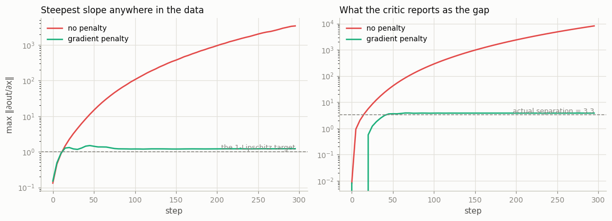
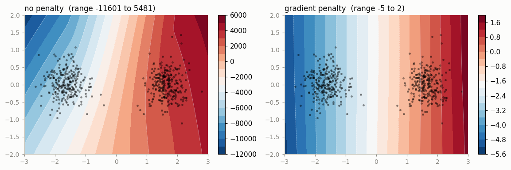
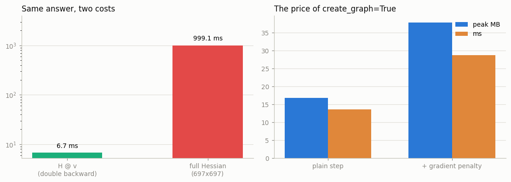

# Double Backward

---

> Taking the gradient of a gradient.

---

## Key Insight

PyTorch's [autograd](/shared/glossary/#autograd) engine is capable of computing higher-order derivatives. By setting `create_graph=True` during the first [backward pass](/shared/glossary/#backward-pass), PyTorch tracks the gradient computation itself in a new [dynamic computation graph](/shared/glossary/#dynamic-computation-graph), allowing you to compute a [double backward](/shared/glossary/#double-backward) (the gradient of the gradient).

## Why This Matters

Higher-order derivatives are required for advanced techniques like gradient penalty in generative adversarial networks ([GANs](/shared/glossary/#gans)), [meta-learning](/shared/glossary/#meta-learning), and optimizing learning rates. Understanding double backward unlocks these cutting-edge optimization methods.

---

**This is project 11**, the last of Phase 2. One flag —
`create_graph=True` — turns the backward pass from a calculation into a
*recorded* calculation, and the gradient becomes an ordinary tensor you can
differentiate again.

What `run.py` measures:

- a real [gradient penalty](/shared/glossary/#gradient-penalty) on a
  [WGAN](/shared/glossary/#wgan-gp) critic: the unconstrained critic's slope runs
  away to **3,392**; the penalised one settles at **1.22**
- the one-character bug: `.detach()` in the wrong place gives a penalty with the
  **exactly correct value** and a weight gradient **bit-identical to having no
  penalty at all** — and it does not raise
- a [Hessian](/shared/glossary/#hessian)-vector product via double backward is
  **190× faster** than building the Hessian, on a 697-parameter model, and the
  gap grows without limit
- `create_graph=True` costs **2.25× the memory and 2.66× the time**
- and the STE from [project 9](../09-straight-through-estimator/README.md) turns
  out to be **differentiable exactly once, by construction**

---

## Files

| file | what it is |
|---|---|
| `run.py` | six experiments and three figures |
| `outputs/` | `findings.csv`, three figures |

```bash
python3 run.py     # ~10 seconds; needs torch, numpy, matplotlib
```

---

## 1. The smallest possible example

`y = x³` at `x = 2`. First derivative `3x² = 12`; second derivative `6x = 12`.

```
  torch.autograd.grad(y, x)                   -> 12.0   grad_fn = None
  differentiating that again                  -> element 0 of tensors does not require grad...

  torch.autograd.grad(..., create_graph=True) -> 12.0   grad_fn = MulBackward0
  differentiating THAT                        -> 12.0   (6x = 12.0)
```

Same number, `12.0`, both times. The difference is entirely in the **`grad_fn`**.

Without `create_graph`, the backward pass runs in "just compute the numbers"
mode and throws its own workings away. The result is a [leaf tensor](/shared/glossary/#leaf-tensor) with nothing
behind it, and there is nothing to differentiate.

With `create_graph=True`, **the backward pass is recorded exactly like a forward
pass**. Every operation the engine performs while computing the gradient becomes
a node in a new graph. The gradient is then an ordinary tensor with a history,
and `backward` works on it the same way it works on a loss.

> **That is the entire feature.** There is no separate second-order engine. The
> backward pass is just more arithmetic, and autograd can record arithmetic. Ask
> it to record its own, and you get second derivatives for free.

A multi-variable check against the hand-derived answer:

```
  f = sum(x^2 * y) + sum(x*y^2)
    autograd  d(df/dx)/dy = [ 3.  2. 10.]
    by hand   2x + 2y     = [ 3.  2. 10.]
    max difference        = 0.00e+00
```

That is a **mixed partial derivative** — differentiate once by `x`, then by `y`.
Exact.

One thing `run.py` has to work around, and you will meet it in your first hour
with `create_graph`: the graph is freed after the first `grad()` call, so
computing `y` again (or passing `retain_graph=True`) is necessary before the
second. The `"Trying to backward through the graph a second time"` error is that,
and it is a different error from the one above.

---

## 2. The gradient penalty

### What "Lipschitz" means, and why the name

A [WGAN](/shared/glossary/#wgan-gp) critic is only a valid critic if it is
**1-Lipschitz**: moving its input by a distance `d` may change its output by at
most `d`.

The condition is named after **Rudolf Lipschitz**, who wrote it down in the 1860s
for an entirely different purpose — proving that differential equations have
exactly one solution. It says, in plain language: **no cliffs.** The function may
rise and fall, but there is a cap on how fast, and the cap holds everywhere.

For a scalar function, the slope in the steepest direction is the **norm of its
input-gradient**. So "1-Lipschitz" is `‖∂out/∂x‖ ≤ 1` everywhere, and you can
penalise the violation:

```python
penalty = ((grad_norm - 1) ** 2).mean()
```

That penalty **contains a gradient**. Differentiating it to update the weights is
a second derivative — which is why WGAN-GP could not have been written before
frameworks supported double backward.

### What it does

```
  no penalty  : final max ||d out/d x|| over the data =  3391.90   critic gap =  8153.96
  with penalty: final max ||d out/d x|| over the data =     1.22   critic gap =     3.82
```

The two clouds are actually **3.28** apart.



The unconstrained critic's slope is **2,774× larger**, and its reported
"distance" between the clouds is meaningless — it is 8,154 because nothing stops
the critic from scaling itself up, and scaling up is the cheapest way to make its
objective bigger. The penalised critic settles near slope 1 and reports **3.82**
against a true separation of 3.28.



The picture makes the runaway obvious. Both panels show the same two clouds; only
the colour scales differ. The unconstrained critic spans **−11,601 to 5,481**.
The penalised one spans **−5 to 2**.

> **Why does a critic that "reports a bigger number" count as broken?** Because
> the number is supposed to *mean* something — an approximation to how far apart
> the two distributions are. A critic free to multiply itself by 1000 reports
> 1000× the distance without having learned anything about the distributions.
> Constraining the slope is what turns the output back into a measurement. The
> generator being trained against it is reading that number; garbage in, garbage
> out.

---

## 3. The one-character bug

```
  variant                             penalty value   weight-grad norm
  no penalty term at all                          -           2.453077
  penalty, create_graph=True                 0.8627          13.382113
  penalty, then g.detach()                   0.8627           2.453077
  penalty, create_graph=False                0.8627           2.453077

  detached-penalty gradient == no-penalty-at-all gradient: True
```

Read the last two rows carefully.

Both print **exactly the right penalty value** — the same `0.8627` as the correct
version. That number appears in your training log. It falls as the model
improves. It looks entirely healthy.

And both produce a weight gradient that is **bit-for-bit identical to not having
the penalty at all**. You pay for the extra computation and buy nothing.

### And note what did *not* happen: an error

`create_graph=False` is famous for raising *"element 0 of tensors does not
require grad and does not have a grad_fn"* — and it does, when the penalty is
your **entire** loss. But nobody writes it that way. In real code the penalty is
added to a critic loss:

```python
loss = -(critic(real).mean() - critic(fake).mean()) + 10.0 * penalty
```

The first term keeps the graph alive, so `backward()` succeeds and the penalty is
simply a constant that contributes nothing. **The loud version of this bug is the
lucky version.**

### Why a `.detach()` gets in there

Because detaching is the standard fix for a memory leak, and here the tensor you
would instinctively detach — the gradient — is the one whose history is the entire
point. If you compute a quantity **from** a gradient, every operation between the
gradient and the loss has to stay in the graph.

**How to check, in one line.** After `loss.backward()`, run the step once with
the penalty weight set to `0` and once at its real value. If the weight gradients
match, the penalty is not connected to anything. That test takes a minute and
would have caught all three broken variants here.

---

## 4. Hessian-vector products

The **Hessian** is the matrix of all second derivatives — named after **Ludwig
Otto Hesse**, who introduced it in 1857. For `n` parameters it has `n²` entries,
so for any real model you cannot store it, let alone build it.

But most algorithms that "need the Hessian" only ever need `H @ v` for some
vector `v`. And that is cheap, because of one identity:

```
H v  =  d/dθ ( (dL/dθ) · v )
```

Differentiate the **dot product of the gradient with v** — a single scalar — and
one extra backward pass hands you the entire matrix-vector product without ever
forming the matrix.

```
  model has 697 parameters, so the Hessian is 697 x 697 = 485,809 numbers
  H @ v via double backward :      5.5 ms
  full Hessian, then H @ v  :   1052.1 ms   (190x slower)
  max difference            : 6.56e-07
```



And the gap **grows without limit**: `H @ v` costs one extra backward pass no
matter how big the model is, while the full matrix costs one per parameter. At
697 parameters that is already 190×. At a million parameters the full matrix
would be 4 TB and the HVP would still cost one pass.

> **Translated into plain consequences:** this is why second-order methods are
> usable at all. TRPO's natural-gradient step, influence functions, Newton-style
> optimisers, and sharpness measures all reduce to "multiply by the Hessian a few
> times", and each multiplication is one extra backward pass. Nobody ever builds
> the matrix.

---

## 5. What `create_graph=True` costs

```
  plain critic step                        16.81 MB peak    17.4 ms
  + gradient penalty (create_graph=True)   37.83 MB peak    46.3 ms
  ratio                                     2.25x            2.66x
```

Roughly: you are running a **second forward pass** — the recorded backward — and
it needs its own saved tensors, on top of the ones the original forward already
holds.

That is the honest price of a second derivative, and it explains two things you
will see in real code: WGAN-GP training is noticeably slower than plain WGAN,
and gradient penalties are usually applied to a **subset** of the batch rather
than all of it.

It also composes badly with
[checkpointing](../10-gradient-checkpointing/README.md), which is the other
place activation memory goes — `create_graph` wants to keep more, checkpointing
wants to keep less, and combining them takes care.

---

## 6. The operations that quietly refuse

Double backward needs the **backward** to be differentiable too. Not every
backward is.

```
  once_differentiable    RuntimeError: element 0 of tensors does not require grad...
  plain backward         second derivative = 2.0  (exact: 2.0)
```

`torch.autograd.function.once_differentiable` is a decorator you put on a custom
`Function`'s `backward` to declare *"my backward runs outside the graph"* —
typically because it calls into C++, numpy, or a solver. It turns a silently
wrong answer into a loud error, which is exactly why it exists. A backward
written in ordinary torch operations needs no decorator and differentiates as
many times as you like.

### And the straight-through estimator

```
    round + STE          first derivative  1.0000   grad_fn None          second derivative  no graph
    soft round (T=0.1)   first derivative  1.0499   grad_fn AddBackward0  second derivative     7.9963
```

The STE's first derivative has **no `grad_fn`** — there is nothing behind it. Its
`backward` returns the incoming gradient unchanged, a value that does not depend
on `x` at all, so once you differentiate it the trail simply ends. The soft
version's slope genuinely varies with `x`, so it has a real second derivative.

**This is not a bug in the STE; it is what an STE is.** It replaces a staircase
with a straight line, and a straight line has no curvature to report. Which means:

> An STE cannot be combined with anything that needs a second derivative — a
> gradient penalty, MAML-style [meta-learning](/shared/glossary/#meta-learning),
> a sharpness-aware optimiser — without silently losing exactly the term you were
> trying to compute. If you need both, you need a smooth surrogate like the
> soft-round above, not an STE.

That connection runs both ways, and it is a good note to end Phase 2 on:
[project 9](../09-straight-through-estimator/README.md)'s trick and this
project's flag are incompatible, and nothing in the API will tell you.

---

## Things you can try

- **Compute a full Hessian eigenvalue** with power iteration: repeatedly apply
  `H @ v` and normalise. Ten HVPs, no matrix.
- **Penalise the input-gradient of a classifier** instead of a critic — that is
  double-backpropagation regularisation, and it measurably improves adversarial
  robustness.
- **Try `torch.func.hessian` / `jacrev`** on the same model. Same maths,
  different (often faster) machinery.
- **Take one MAML step**: differentiate through an inner SGD update. It is
  `create_graph=True` on the inner `backward`, and nothing else.
- **Break it deliberately.** Add a `.detach()` somewhere in the penalty chain and
  confirm the zero-weight test from section 3 catches it.

---

## What to take away

1. `create_graph=True` makes the **backward pass itself** a recorded graph. There
   is no second-order engine; there is just autograd differentiating more
   arithmetic.
2. A **gradient penalty** enforces a Lipschitz bound — "no cliffs, everywhere" —
   and needs a second derivative because the penalty contains a first one.
   Measured: slope **3,392 → 1.22**, critic range **±11,601 → ±5**.
3. A `.detach()` in the wrong place gives the **right penalty value** and a weight
   gradient **identical to no penalty at all**. So does `create_graph=False`, and
   neither raises when the penalty is added to a real loss.
4. Test it by running with the penalty weight at 0 and at its real value. If the
   gradients match, the penalty is disconnected.
5. **`H @ v` = differentiate `(gradient · v)`.** One extra backward pass, no
   matrix. **190× faster** at 697 parameters, and the ratio keeps growing.
6. `create_graph=True` costs about **2.25× memory and 2.66× time** — you are
   running a second forward pass.
7. `once_differentiable` converts a silent wrong answer into an error. Backwards
   written in plain torch ops need no decorator.
8. **An STE is differentiable exactly once.** Its first derivative is a constant,
   so a gradient penalty on top of it silently contributes nothing.

---

## Phase 2 is done

You can now say what the graph is made of
([project 6](../06-micrograd-in-pytorch-style/README.md)), derive a backward pass
by hand and check it three ways
([project 7](../07-manual-backprop/README.md)), write your own node and choose
what it remembers ([project 8](../08-custom-autograd-function/README.md)),
differentiate through something that has no derivative
([project 9](../09-straight-through-estimator/README.md)), trade recomputation
for memory ([project 10](../10-gradient-checkpointing/README.md)), and
differentiate a gradient.

The sentence from Phase 0 should be sharp now:

```
A PyTorch tensor is a (storage, shape, stride, dtype, device, requires_grad) tuple,
and autograd is a graph of operations recorded on the forward pass that gets
traversed backward to compute gradients.
```

Phase 3 goes up one level, to the objects that own those tensors: `nn.Module`,
the optimizers, and the five-line training step that costs more than it looks.
