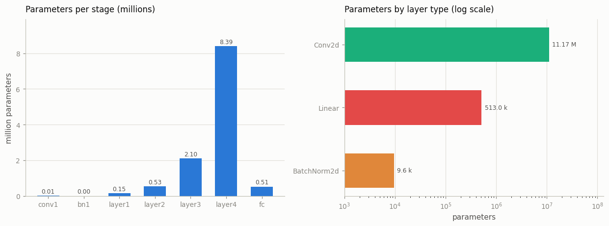
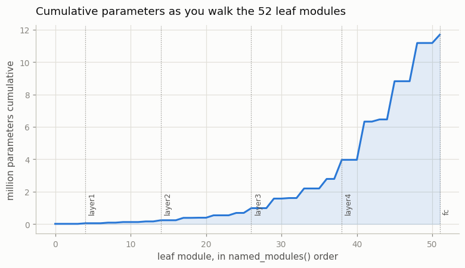

# Module Introspection

---

> A model is a tree. Every node is a module, and every leaf is a parameter.

---

## Key Insight

[`nn.Module`](/shared/glossary/#nnmodule) is PyTorch's base class for all neural network components. When you assign `self.linear = nn.Linear(...)` inside `__init__`, the parent class notices and registers it. `named_modules()` walks this tree recursively, yielding every sub-module and its dot-separated path, so you can inspect any model without modifying it.

## Why This Matters

Knowing every layer's name, type, and parameter count is the foundation for debugging, profiling, and targeted fine-tuning. It is also the first step toward weight surgery: you must know the exact key names in a model before you can load or remap them.

---

**This is project 12**, and the first of Phase 3. Phases 1 and 2 were about
[tensors](/shared/glossary/#tensor) and [autograd](/shared/glossary/#autograd) —
the raw material. From here on we look at the objects that *own* tensors:
`nn.Module`, the [optimizers](/shared/glossary/#optimizer), and the training
loop.

We take a model somebody else wrote — torchvision's pretrained
[ResNet-18](/shared/glossary/#resnet) — and answer six questions about it using
nothing but `named_modules()`, `named_parameters()`, `named_buffers()` and
`state_dict()`. No training, no downloads beyond the 45 MB of weights.

What `run.py` finds:

- the tree has **68 modules**, of which **52 are leaves** — the ones that
  actually compute. The other 16 are containers that hold nothing but other
  modules.
- **95.5 %** of the parameters are in `Conv2d`, **4.4 %** in the single `Linear`
  head, and **0.08 %** in all twenty
  [BatchNorm](/shared/glossary/#batch-normalization) layers put together
- `named_parameters()` gives **62** tensors, `named_buffers()` gives **60**, and
  `state_dict()` gives **122** — and the difference is the whole reason
  BatchNorm works in `eval()` mode
- a model that keeps its layers in a plain Python list reports **0 parameters**
  and trains nothing
- **52 leaf modules but 60 forward calls**: eight `ReLU`s are called twice each
- a weight-tied model is **64 000** parameters by `parameters()` and **128 000**
  by `state_dict()` — the same tensor, counted twice
- and one training step of this model needs **187 MB** before a single
  activation is stored: four copies of the weights

---

## Files

| file | what it is |
|---|---|
| `run.py` | the whole walk: tree, parameter budget, buffers, the registry, the two disagreeing counts, memory arithmetic, two figures |
| `outputs/findings.csv` | every number quoted above |
| `outputs/resnet18_modules.txt` | the full 68-line walk, committed so you can read it without running anything |

```bash
python3 run.py     # ~10 s; needs torch, torchvision, matplotlib
```

---

## 1. What the tree is shaped like

```
  named_children()    10   direct children only, one level deep
  named_modules()     68   the whole tree, including the model itself
  ...of which leaves  52   modules with no children = the ones that compute
  ...of which inner   16   containers: they only hold other modules
```

There are three walks and they answer three different questions.

- **`named_children()`** — one level down. Ten entries for ResNet-18: the stem
  (`conv1`, `bn1`, `relu`, `maxpool`), the four `Sequential` stages
  (`layer1`…`layer4`), the pooling, and the classifier `fc`.
- **`named_modules()`** — the whole subtree, depth-first, *including the model
  itself* as the first entry with the empty name `''`. This is the one you
  usually want.
- **leaves** — modules with no children. A `Sequential` has no parameters of its
  own; it is a box. Only the leaves hold weights.

Names are paths, and paths are reversible:

```python
model.get_submodule("layer4.1.conv2")   # -> Conv2d, weight (512, 512, 3, 3)
```

That string is exactly the prefix used for the parameter keys
(`layer4.1.conv2.weight`), which is why section 5 of
[project 16](../16-state-dict-surgery/README.md) can rename layers by string
surgery alone.

> **Why is a name like `layer4.1.conv2` built out of dots and numbers?**
> Because the tree is built out of attribute lookups and list indices.
> `model.layer4` is an attribute, `[1]` is the second block in that
> `Sequential`, `.conv2` is an attribute of the block. PyTorch just writes that
> chain out as text. The `1` is a number because `Sequential` names its children
> by position — it has no other name to give them.

What the leaves are:

```
    Conv2d                20
    BatchNorm2d           20
    ReLU                   9
    MaxPool2d              1
    AdaptiveAvgPool2d      1
    Linear                 1
```

Twenty convolutions and twenty BatchNorms, in matched pairs — that pairing is
the standard "conv then normalize" unit. Nine ReLUs for seventeen activation
points; section 5 explains that gap, and it is not a typo.

---

## 2. Where the 11.7 million parameters actually live

```
  total: 11.69 M parameters = 46.8 MB in float32

  layer type            params    share
  Conv2d               11.17 M   95.53%
  Linear               513.0 k    4.39%
  BatchNorm2d            9.6 k    0.08%
```



Three things here are worth stopping on.

**BatchNorm is 0.08 % of the model and you cannot remove it.** Parameter count
is not importance. Each BatchNorm owns exactly two numbers per channel (a scale
and a shift), so twenty of them come to 9 600 numbers — a rounding error next to
11.17 M. Delete them and the network stops training at all. Whenever somebody
says "this technique only adds 0.1 % more parameters", this is the shape of the
claim.

**One `Linear` layer costs as much as an entire early stage.** `fc` maps 512
features to 1000 [ImageNet](/shared/glossary/#imagenet) classes: 512 × 1000 +
1000 = 513 000 parameters, in one layer. All of `layer1` — four convolutions,
four BatchNorms, two residual blocks — is 148 000. A fully connected layer has
no weight sharing, so it pays `in × out` in full.

**The parameters pile up at the deep end:**

```
    conv1        9.4 k
    layer1     148.0 k
    layer2     525.6 k
    layer3      2.10 M
    layer4      8.39 M     <- 72% of the model, in the last two blocks
    fc         513.0 k
```



Each stage doubles the channel count. A 3×3 convolution's weight is
`out_channels × in_channels × 3 × 3`, so doubling *both* channel counts
**quadruples** the parameter count. Meanwhile the feature map it runs on is only
quartered (half the height, half the width). Parameters go up 4×, spatial
positions go down 4× — which is why the *compute* stays roughly flat across
stages while the *memory* does not.

> **Practical consequence.** If you want a smaller ResNet, trimming `conv1` or
> `layer1` is pointless — together they are 1.3 % of the weights. The last stage
> is where the model is. This is also why [LoRA](/shared/glossary/#lora) adapters
> target deep layers first: that is where the parameters that matter to file size
> are.

---

## 3. Parameters, buffers, `state_dict`: three counts, three meanings

```
  named_parameters()    62 tensors   trained by the optimizer
  named_buffers()       60 tensors   part of the model, NOT trained
  state_dict()         122 tensors   = 62 + 60, everything you must save
```

Open one BatchNorm and you can see both kinds side by side:

```
    parameter  weight               (64,)   float32  requires_grad=True
    parameter  bias                 (64,)   float32  requires_grad=True
    buffer     running_mean         (64,)   float32
    buffer     running_var          (64,)   float32
    buffer     num_batches_tracked  ()      int64
```

A **[parameter](/shared/glossary/#parameters)** is a tensor the optimizer owns.
It has `requires_grad=True`, it collects a `.grad` during
`loss.backward()`, and `optimizer.step()` changes it.

A **[buffer](/shared/glossary/#buffer)** is a tensor the *model* owns. No
gradient reaches it. It is still part of the model's state, so it must be saved
and loaded and moved to the GPU with everything else — it just is not learned.

> **"If a buffer is not learned, why isn't it a plain attribute?"** This is the
> question that makes buffers click, and `run.py` answers it by *measuring* the
> difference rather than asserting it. A plain `self.scale = torch.ones(64)` is
> invisible to `nn.Module` (section 4): it will not appear in `state_dict()`, so
> it vanishes from your checkpoint, and `.to("cuda")` will not move it, so the
> first forward pass on GPU crashes with a device mismatch. `register_buffer`
> means *"this tensor is part of the model, save it and move it, but do not train
> it."* Parameters and plain attributes both fail to express that; buffers are
> the third option.

Why BatchNorm's statistics are buffers and not parameters:

```
  running_mean change after one forward in train(): 0.010730
  running_mean change after one forward in eval() : 0.000000
```

No optimizer was involved either time. During training, BatchNorm normalizes
using the *current batch's* mean and variance, and on the side it updates a
running average of them. At [evaluation](/shared/glossary/#eval-mode) time there
may be only one image in the batch — a "batch mean" over one sample is
meaningless — so it uses the stored running values instead. Those values were
produced by counting, not by gradient descent. There is no loss to differentiate
here; there is nothing for `.grad` to hold. Hence: buffer.

`num_batches_tracked` is a single `int64` scalar counting how many batches have
gone through. It is the reason a checkpoint file is not purely floating-point,
and it is the key that [project 16](../16-state-dict-surgery/README.md) can
safely drop.

### `.eval()` is one boolean, sixty-eight times

```
  model.eval()  -> .training is {False} on all 68 modules
  model.train() -> .training is {True}
```

`model.eval()` does not switch PyTorch into a different mode. It walks the tree
and sets `self.training = False` on every module. Almost every layer ignores it.
The two that do not are [Dropout](/shared/glossary/#dropout) (drops units when
`training`, does nothing when not) and BatchNorm (batch statistics when
`training`, stored running statistics when not).

That is also why `.eval()` and [`torch.no_grad()`](/shared/glossary/#no_grad)
are two different things that beginners often conflate. `.eval()` changes *what
the layers compute*. `no_grad()` changes *whether autograd records what they
computed*. Evaluating without `.eval()` gives you wrong numbers; evaluating
without `no_grad()` gives you right numbers slowly, and wastes memory.

---

## 4. `nn.Module` is a registry, and it only sees what you hand it

Every module keeps three private dictionaries:

```
    _parameters ['weight', 'bias']
    _buffers    []
    _modules    []
```

`nn.Module.__setattr__` is overridden to sort your assignments into them. Assign
an `nn.Parameter` and it lands in `_parameters`; assign an `nn.Module` and it
lands in `_modules`; call `register_buffer` and it lands in `_buffers`. Anything
else is set as an ordinary Python attribute, and the framework never hears about
it.

This is the entire mechanism, and it has one sharp edge:

```python
class Broken(nn.Module):
    def __init__(self):
        super().__init__()
        self.layers = [nn.Linear(16, 16) for _ in range(3)]   # a plain list
        self.scale = torch.ones(16)                            # a plain tensor
```

```
  Broken (plain list + plain tensor)   parameters():     0   state_dict():  0 keys
  Fixed (ModuleList + buffer)          parameters():   816   state_dict():  7 keys
```

**`Broken` runs.** The forward pass works, the shapes are right, the loss is a
number. It reports zero parameters, which means the optimizer gets an empty
list, `state_dict()` saves an empty file, and `.to("cuda")` moves nothing.

A Python list is a list. `__setattr__` sees a `list`, not an `nn.Module`, and
files it under "ordinary attribute". `nn.ModuleList` exists precisely to be a
list that `__setattr__` recognizes — it is a module whose children are its
elements. Same for `nn.ModuleDict` and `nn.Sequential`.

```
  torch.optim.SGD(Broken().parameters()) raises: optimizer got an empty parameter list
```

PyTorch catches the all-or-nothing case. It cannot catch the dangerous one: a
model where *most* layers are registered and three are in a plain list. Then the
optimizer gets a healthy non-empty list, the loss goes down, and those three
layers keep their random initialization forever.

> **How to catch it in ten seconds.** Print
> `sum(p.numel() for p in model.parameters())` and compare it with what the
> architecture says it should be. That is the whole check, and it is why this
> project is first in the phase.

---

## 5. Two ways of counting that disagree

### A module can run more than once

```
  leaf modules in the tree      : 52
  leaf modules that ran         : 52
  forward calls that happened   : 60
  modules called more than once : 8  (all of them ReLU)
```

torchvision's `BasicBlock` creates **one** `self.relu` in `__init__` and calls it
**twice** in `forward` — once after the first BatchNorm, once after the residual
addition. `ReLU` has no parameters and no state, so a single instance can be
reused anywhere, and reusing it keeps the printed model shorter.

**The tree tells you what a model owns. It never tells you what it does.** If
you need the sequence of operations you have to run the model and watch, which
is exactly what [project 13](../13-hook-based-feature-extractor/README.md) does —
and the first thing it hits is this same reuse, because a
[forward hook](/shared/glossary/#forward-hook) on `layer1.0.relu` fires twice per
image and the naive `features[name] = output` keeps only the second one.

### The same tensor, under two names

[Weight tying](/shared/glossary/#weight-tying) — where a language model's input
embedding and output projection are literally the same matrix — makes two counts
disagree:

```
  a weight-tied model:  emb.weight and out.weight share storage: True
    sum over parameters()          :   64000
    sum over state_dict().values() :  128000   <- counts it twice
    parameter tensors              :       1   one object
    state_dict keys                :       2   ['emb.weight', 'out.weight']
```

Both behaviours are deliberate, and for opposite reasons.

- **`parameters()` de-duplicates by object identity.** If it did not, the
  optimizer would see the tensor twice and apply every update to it twice —
  a silent 2× learning rate on the tied layer.
- **`state_dict()` does not de-duplicate.** It is a *file format*. A loader that
  received only `emb.weight` would have no way to know that `out.weight` was
  supposed to be the same tensor, and would leave it at its random
  initialization.

So a script that sizes a model by summing `state_dict()` entries reports
**twice** the truth for any tied model — which includes most modern
[LLMs](/shared/glossary/#llm). Count `parameters()`.

---

## 6. Trainable vs frozen, and what a training step really costs

Freeze the trunk and train only the head — a
[linear probe](/shared/glossary/#linear-probe):

```
    trainable   513.0 k  (4.4%)
    frozen      11.18 M  (95.6%)
```

```python
optim.AdamW([p for p in model.parameters() if p.requires_grad], lr=1e-3)
```

That filter is not decoration. Without it the optimizer allocates
[state](/shared/glossary/#optimizer-state) for all 11.7 M parameters, and then
spends every step iterating over parameters whose `.grad` is `None`.

The arithmetic of a full fine-tune:

```
  parameters (fp32)                 46.8 MB
  + gradients                       46.8 MB    one per trainable parameter
  + AdamW state (2 moments)         93.5 MB    AdamW keeps two numbers per parameter
  = full fine-tune                 187.0 MB    before a single activation
  = linear probe                    52.9 MB
```

**Four copies of the model, and the activations are extra.** This is the
single most useful sum in the whole phase: "it fits for inference" tells you
nothing about whether it fits for training, because training needs roughly 4×
the weights plus however much the activations come to
([project 27](../27-memory-breakdown/README.md) does that half).

It is also why [AdamW](/shared/glossary/#adamw) costs more memory than
[SGD](/shared/glossary/#sgd) with momentum (2 moments vs 1) and much more than
plain SGD (0), and why freezing a trunk cuts memory by 3.5× here without
touching the architecture.

---

## Things you can try

- **Swap in `resnet50`** and re-run. The parameter count roughly doubles
  (25.6 M), but `fc` grows to 2048 × 1000 — check what share of the model the
  classifier head becomes.
- **Sum `state_dict()` values for a tied language model** you have lying around
  (GPT-2 is tied) and compare with `parameters()`. The gap is the embedding
  matrix, and it is large.
- **Break a model on purpose**: move one `nn.Linear` in a working model into a
  plain list, train it, and watch the loss still go down while that layer stays
  at its initialization. Then find it with the parameter-count check.
- **Print `named_parameters(recurse=False)`** on a `Sequential`. It is empty —
  containers own nothing.
- **Count the modules of a transformer** and check how many are `LayerNorm`.
  Then check what fraction of the parameters they are. It is the BatchNorm story
  again.

---

## What to take away

1. A model is a tree of `nn.Module`s. `named_children()` is one level,
   `named_modules()` is all of it, and only the **52 leaves** of ResNet-18's
   **68 modules** compute anything.
2. Parameters concentrate at the deep end: **layer4 alone is 72 %** of
   ResNet-18. Doubling channels quadruples a conv's weights.
3. **Parameter count is not importance.** All twenty BatchNorms are 0.08 % of
   the model and it does not train without them.
4. **62 parameters + 60 buffers = 122 `state_dict` keys.** A buffer is model
   state that is saved and moved but never trained — exactly the thing that
   neither a parameter nor a plain attribute can express.
5. `.eval()` sets one boolean on all 68 modules. Only BatchNorm and Dropout read
   it. It is not the same as `torch.no_grad()`.
6. `nn.Module` only registers what `__setattr__` recognizes. A plain Python list
   of layers reports **0 parameters** and silently trains nothing — use
   `nn.ModuleList`.
7. **52 leaves, 60 calls.** Eight ReLUs run twice. The tree describes ownership,
   not execution.
8. `parameters()` de-duplicates tied weights, `state_dict()` does not — **64 k
   vs 128 k** on the same model. Report the first one.
9. A full fine-tune of an 11.7 M-parameter model needs **187 MB** for weights,
   gradients and optimizer state alone: **4×** the inference footprint.

---

Next: [project 13](../13-hook-based-feature-extractor/README.md) stops reading
the tree and starts watching it run — forward hooks pull activations out of this
same ResNet without changing a line of torchvision's code, and hit the
double-firing ReLU from section 5 immediately.
