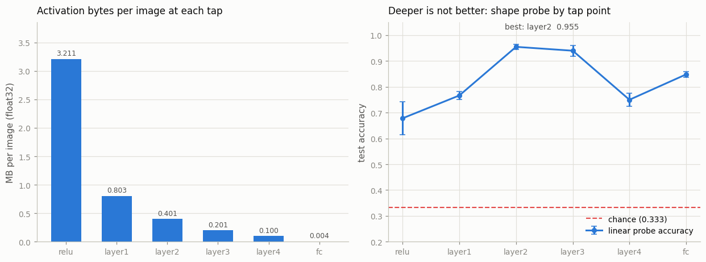
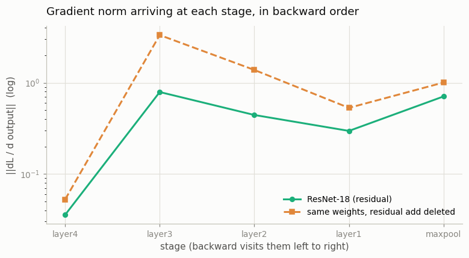

# Hook-Based Feature Extractor

---

> You do not need to rewrite a model to see inside it.

---

## Key Insight

A [forward hook](/shared/glossary/#forward-hook) is a callback you register on any `nn.Module`. PyTorch calls it automatically after that module's forward pass, passing in the input and output tensors. You can capture the output — called [activations](/shared/glossary/#activations) — without touching the model's code at all.

## Why This Matters

Feature extraction and visualization are essential for understanding what a network has learned. Hooks let you tap into any layer of any pretrained model in just a few lines, making them the standard tool for interpretability and transfer learning.

---

**This is project 13.** [Project 12](../12-module-introspection/README.md) read
the model's tree and found that the tree describes what a model *owns*, never
what it *does*. Hooks are how you watch what it does.

Six lines get you every intermediate activation of a pretrained
[ResNet](/shared/glossary/#resnet)-18 without editing torchvision. The other
five sections are the ways that goes wrong, each one measured rather than
warned about.

What `run.py` finds:

- a hook on `layer1.0.bn1` reports **0 % negative values** where the truth is
  **63 %** — the in-place ReLU on the next line overwrote the tensor before you
  looked
- a hook on `layer1.0.relu` **fires twice**, and `features[name] = output` keeps
  only the second
- `model.forward(x)` returns the correct answer and fires **zero** hooks
- a stored activation that was not detached drags **64 live graph nodes** and
  **65 MB** behind it — 82× the size of the feature you wanted
- backward hooks say the gradient does not vanish in ResNet-18; and the honest
  control says **deleting every residual connection barely changes that**
- and the best layer to tap is **layer2 (0.955)**, not layer4 (**0.750**) —
  deeper is not better

---

## Files

| file | what it is |
|---|---|
| `run.py` | all seven sections: the taps, the four traps, backward hooks with a control, and the probe |
| `outputs/findings.csv` | every number quoted here |
| `outputs/probe_by_tap.csv` | probe accuracy per tap, per regularization strength |
| `outputs/taps.png`, `outputs/gradient_norms.png` | the two figures |

```bash
python3 run.py     # ~30 s; needs torch, torchvision, numpy, matplotlib
```

---

## 1. Six lines to see inside a model you did not write

```python
feats = {}

def make_hook(name):
    def hook(module, inputs, output):
        feats[name] = output.detach().clone()
    return hook

handles = [model.get_submodule(n).register_forward_hook(make_hook(n)) for n in TAPS]
```

The signature is fixed: PyTorch calls your function as
`hook(module, inputs, output)` after the module's forward returns. Whatever you
do with `output` is your business — read it, log it, or return a replacement to
change it.

```
  input (4, 3, 224, 224)   ->   output (4, 1000)

  tap      output shape             channels      map  MB / image
  relu     (4, 64, 112, 112)              64  112x112       3.211
  layer1   (4, 64, 56, 56)                64    56x56       0.803
  layer2   (4, 128, 28, 28)              128    28x28       0.401
  layer3   (4, 256, 14, 14)              256    14x14       0.201
  layer4   (4, 512, 7, 7)                512      7x7       0.100
  fc       (4, 1000)                    1000        -       0.004
```



**Each stage costs half the bytes of the one before.** Halving height and width
divides the map by four; doubling the channels multiplies by two; four into two
is a factor of two down per stage. That is the whole reason a
[feature](/shared/glossary/#feature) cache is practical: 512 numbers per image
at `layer4` instead of 150 000 for the image.

Note what a hook is *not*: it is not a change to the model. torchvision's file
is untouched, the model still returns exactly the same logits, and removing the
handle puts everything back:

```python
for h in handles:
    h.remove()          # len(model.relu._forward_hooks) == 0
```

> **Keep the handle.** `register_forward_hook` returns the only object that can
> unregister it. Drop it on the floor and the hook fires for the lifetime of the
> model — including in somebody else's evaluation loop, quietly appending to a
> list that never stops growing.

---

## 2. The tensor you captured is not the tensor that was there

Two hooks on the same BatchNorm, one storing the reference and one storing a
copy:

```
  hook on layer1.0.bn1 -- a BatchNorm, whose output is roughly zero-mean:
    stored the reference       :   0.0% of values are negative
    stored .detach().clone()   :  63.1% of values are negative
    max |difference|           : 3.789
```

A BatchNorm output is normalized to roughly zero mean, so **about half its
values must be negative**. The naive capture says none are.

torchvision builds its activation as `nn.ReLU(inplace=True)`, and
`BasicBlock.forward` calls it on the very next line. In-place means "write the
result back into the same memory". Your hook already ran and stored a
*reference* to that memory. By the time you look at `feats["bn1"]`, every
negative has been clipped to zero — you are holding post-ReLU values filed under
the name of the layer before.

> **Why does `inplace=True` exist if it does this?** It saves memory, and a lot
> of it: ReLU is applied to the largest tensors in a convolutional network, and
> not allocating a second copy of each one is worth real gigabytes at training
> batch sizes. It is safe *for the model*, because ReLU's
> [backward pass](/shared/glossary/#backward-pass) can be computed from its
> output (anything that is zero was clipped) and does not need the input. It is
> unsafe for *you*, because you are a bystander holding a pointer into a buffer
> the model considers free to reuse. See
> [project 2](../02-view-vs-copy-detective/README.md) for the same lesson at the
> tensor level.

**Nothing raises.** The shape is right, the dtype is right, the values are the
wrong layer's. `.detach().clone()` in every hook, always:

- `.detach()` cuts the tensor out of the autograd graph (section 5)
- `.clone()` copies the values, so a later in-place write cannot reach them

---

## 3. One module, two calls, one surviving capture

```
  hook on layer1.0.relu fired 2 times in one forward pass
    call 1 mean 0.1265   max 1.527   (after bn1)
    call 2 mean 0.5617   max 4.725   (after the residual add)
    the dict-style hook kept call 2: True
```

This is project 12's "52 leaves, 60 calls" arriving in practice. `BasicBlock`
creates one `self.relu` and calls it twice — once inside the block, once after
the residual addition. **A hook is registered on a module, not on a position in
the network**, so it fires at both positions.

The classic `features[name] = output` line then keeps whichever call happened
last, and the two are activations from different depths with visibly different
statistics (mean 0.13 vs 0.56).

Two fixes, and they are for different situations:

- **append to a list** — `features[name].append(...)` — when you want both
- **hook something that runs once** — `layer1.0.bn1`, or `layer1` itself — when
  you want an unambiguous tap point

---

## 4. `model.forward(x)` runs the model and skips every hook

```
  a hook on the top-level model:
    model(x)          -> hook fired 1 time(s)
    model.forward(x)  -> hook fired 0 time(s)
    same output either way: True
```

`nn.Module.__call__` is not a synonym for `forward`. It is a wrapper, and
roughly it does:

```
__call__(x):
    run the forward pre-hooks
    y = self.forward(x)
    run the forward hooks
    arrange the backward hooks
    return y
```

Call `forward` yourself and you get the model without any of that machinery —
**and exactly the right answer**, which is what makes it slippery. There is no
error, no warning, no wrong number. Just an empty entry in your feature dict.

The bug is nastier in a half-finished state: a hook on an *inner* module still
fires, because ResNet's own `forward` reaches its children through their
`__call__`. So most of your dictionary fills in correctly and one key is
missing.

This is the concrete reason behind the advice "never call `.forward()`
directly". It is also why `torch.compile`, quantization, and
[FSDP](/shared/glossary/#fsdp) all work by installing hooks: `__call__` is the
one place every module invocation passes through.

---

## 5. The hook that keeps the whole graph alive

```
  one forward pass of batch 2 saves 65.5 MB of activations for backward
  the feature you wanted (layer2 output) is 0.80 MB

  what you stored     grad_fn              graph nodes reachable
  naive               ReluBackward0                           64
  detached            None                                     0
```

Same values, same storage, same 0.80 MB. One of them also has **64 live autograd
nodes** hanging off it, and those nodes hold the **65.5 MB** of activations this
forward pass saved for its backward pass.

Run a collection loop and the arithmetic is brutal:

```
  Loop over 200 batches collecting features:
    features you meant to keep :    160.6 MB
    graphs you also kept       :  13094.4 MB   (82x more)
```

A tensor produced inside a forward pass carries a
[`grad_fn`](/shared/glossary/#grad_fn), and a `grad_fn` references everything
the [backward pass](/shared/glossary/#backward-pass) would need. **Keeping the
number keeps the machine that made it.** This is "OOM at step 50 but not step 1"
from the Phase 9 debugging table, and it is the same bug as writing
`total_loss += loss` instead of `total_loss += loss.item()`.

> **Then why does `.detach()` fix it — isn't a copy expensive?** `.detach()`
> makes no copy at all. It returns a new tensor object pointing at the *same*
> [storage](/shared/glossary/#storage), with `grad_fn` set to `None`. Not one
> extra byte of values; the graph simply loses its last reference and is freed.
> `.clone()` is the one that copies, and you add it for the separate reason in
> section 2. `.detach().clone()` gives you both: no graph, and a buffer nobody
> else can overwrite.

The count in the table comes from walking `grad_fn.next_functions`, and that
walk has its own trap, inherited from
[project 6](../06-micrograd-in-pytorch-style/README.md): torch hands out a fresh
Python wrapper for a `grad_fn` on each access and CPython recycles object ids,
so a walk that does not hold references to what it has seen undercounts wildly.
`run.py` keeps them in a list.

---

## 6. Backward hooks: a gradient health check, and an honest control

`register_full_backward_hook` fires on the way *back*, and hands you the
gradient flowing into the module's output. Eight lines gives you a
[vanishing-gradient](/shared/glossary/#vanishing-gradients) check on any model:

```
  ||dL/d(stage output)||, read in the order backward visits them:
  stage        residual   no residual
  layer4         0.0356        0.0525
  layer3         0.7922        3.3421
  layer2         0.4435        1.3842
  layer1         0.2967        0.5311
  maxpool        0.7089        1.0072

  stem / layer4 ratio:  residual 19.9x   plain 19.2x
```



The gradient enters at `layer4` and is **twenty times larger** by the time it
reaches the stem. Nothing is vanishing.

**The control is the interesting column.** It is the same model, the same
weights, with `out += identity` deleted from every block — the residual
connection, the thing ResNet is named after, removed. The gradient norms barely
move, and the stem-to-layer4 ratio is 19.2× instead of 19.9×.

> **So skip connections do nothing?** No — they do nothing *here*, and here is
> the point. At 18 layers with a BatchNorm after every convolution,
> [normalization](/shared/glossary/#normalization) is already keeping the
> gradients in range; there is no vanishing left for the skip connections to
> fix. The textbook picture (a signal shrinking by a constant factor per layer
> until it is numerically zero) needs much more depth, or no normalization, or
> both. The original ResNet paper's own comparison was 34 layers deep and its
> plain baseline had a *training* problem, not a gradient-magnitude one.
>
> The lesson is the one this project is about: **measure your network instead of
> assuming the folklore describes it.** The measurement took eight lines.

Two practical notes:

- **`register_full_backward_hook`, not `register_backward_hook`.** The old one
  fires per tensor operation rather than per module, so on a module that uses
  its input more than once it reports a partial gradient. It is deprecated for
  exactly that reason.
- **A full backward hook on an in-place module raises**, loudly:

```
  RuntimeError: Output 0 of BackwardHookFunctionBackward is a view and is
  being modified inplace.
```

  The hook needs the module's real output to hand back to you; an in-place
  operation overwrites it. Same root cause as section 2 — this time PyTorch
  catches it.

---

## 7. Which layer should you actually tap?

The practical question hooks exist to answer. Task: square vs circle vs
triangle, 15-pixel shapes in three pale colours on a cluttered background.
[Chance](/shared/glossary/#chance-level) is 0.333. ResNet-18 has never seen this
task — we only read its features and fit a linear classifier
(a [linear probe](/shared/glossary/#linear-probe)).

```
  tap         dim   accuracy   +- (3 seeds)
  relu         64      0.678          0.064
  layer1       64      0.767          0.015
  layer2      128      0.955          0.011
  layer3      256      0.940          0.021
  layer4      512      0.750          0.025
  fc         1000      0.848          0.012
```

**The curve goes up and then down.** `layer4` — the stage everybody grabs, the
one `avgpool` and every "extract features from a pretrained backbone" tutorial
feeds from — is **0.205 worse** than the middle of the network.

Nothing is broken. `layer4`'s features are the ones
[ImageNet](/shared/glossary/#imagenet) training rewarded: *is this a golden
retriever or a beagle*. Whether an outline is a triangle or a square is not an
ImageNet distinction, so the deep layers are free to discard it, and they do.
The middle of the network still represents shape, because it has to in order to
build categories later.

> **Plain version.** A pretrained network is not a general-purpose feature
> machine; it is a machine that was paid to make one specific set of
> distinctions. The further down its stack you go, the more specialized to
> *that* payment its features are. If your task is close to the original one,
> take the deepest features. If it is far away — textures, geometry, medical
> scans, spectrograms — the middle of the network is often better, and the only
> way to find out is to hook every stage and check.

**"Is that just your regularizer?"** A fair question about any probe, so
`run.py` sweeps it:

```
  lambda        relu   layer1   layer2   layer3   layer4       fc
  1            0.850    0.780    0.945    0.895    0.710    0.800
  10           0.595    0.775    0.950    0.925    0.770    0.865
  100          0.455    0.685    0.955    0.950    0.845    0.860
  1000         0.330    0.585    0.930    0.930    0.865    0.850
```

`layer2` wins at every setting, and `layer4` loses at every setting. The
conclusion is not an artifact.

One honest wrinkle in the table: **`fc` scores above `layer4`, and it cannot
possibly contain information `layer4` does not.** The 1000 logits are a fixed
linear map of exactly those 512 pooled features — no new information can enter.
The gap is the probe's regularizer reacting to a different scaling of the same
subspace. Take it as a standing warning: a probe score measures the probe as
much as the features. Compare taps under one fixed probe, and do not read small
gaps as meaning.

---

## Things you can try

- **Replace the output.** Return a tensor from a forward hook and PyTorch uses
  it instead of the module's own. That is the whole mechanism behind
  activation patching in interpretability work, and behind
  [LoRA](/shared/glossary/#lora)-style injection.
- **`register_forward_pre_hook`** to see or modify a module's *input* before it
  runs. Useful when the module you care about is a third-party black box.
- **Hook everything and print shapes** on an unfamiliar model. It is the fastest
  possible way to learn an architecture — faster than reading its code.
- **Feed the same image twice with different [dropout](/shared/glossary/#dropout)
  seeds** and diff the captured activations, to see exactly which layers dropout
  touches.
- **Re-run section 7 with a task closer to ImageNet** (photographs of two animal
  types, if you have any) and watch the curve stop bending down.

---

## What to take away

1. `register_forward_hook` gives you any intermediate activation of any model in
   six lines, changes nothing, and is undone by `handle.remove()`.
2. **Always `.detach().clone()` in a hook.** Without `.clone()`, an in-place
   ReLU on the next line silently rewrites your capture — 0 % negatives where
   the truth is 63 %.
3. **A hook belongs to a module, not to a position.** ResNet's reused `relu`
   fires twice per block; `features[name] = output` keeps only the last.
4. `model.forward(x)` skips hooks entirely and returns the right answer. Always
   call `model(x)`.
5. Without `.detach()`, a stored feature keeps **64 graph nodes and 65 MB** of
   activations alive — **82×** the feature itself, growing every batch.
6. Backward hooks measure gradient health in eight lines. In ResNet-18 the
   gradient does not vanish — and **deleting every residual connection does not
   change that**, because BatchNorm is already doing the work at this depth.
7. **The deepest layer is not the best layer.** For a task ImageNet never asked
   about, `layer2` scores **0.955** against `layer4`'s **0.750**, at every
   regularization strength.
8. A probe number measures the probe too — `fc` "beating" `layer4` is
   arithmetically impossible information-wise, and is entirely the regularizer.

---

Next: [project 14](../14-custom-optimizer/README.md) leaves the forward pass
behind. We have watched gradients arrive; now we write the thing that consumes
them — SGD with momentum, as an `optim.Optimizer` subclass, matched bit-for-bit
against PyTorch's.
