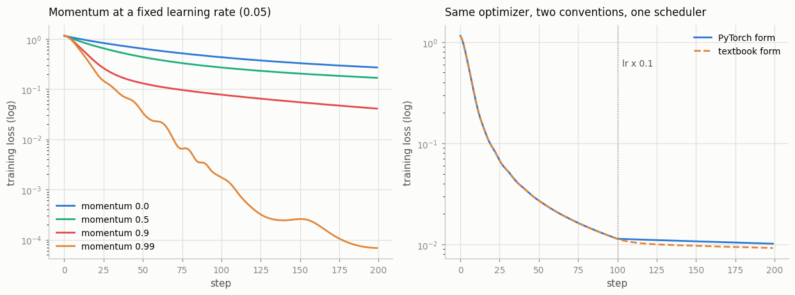
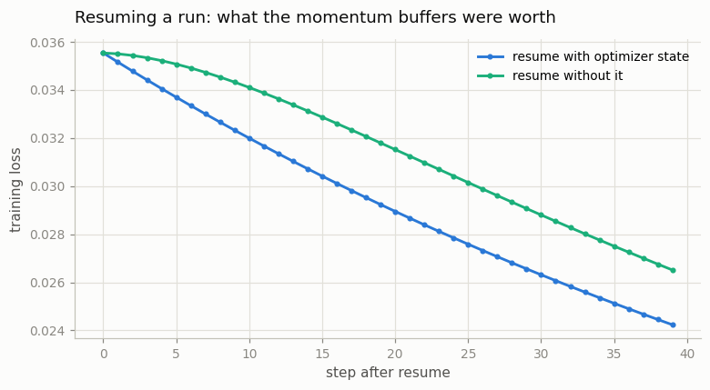

# Custom Optimizer

---

> An optimizer is just a loop: read the gradient, update the state, move the parameter.

---

## Key Insight

Every PyTorch [optimizer](/shared/glossary/#optimizer) is a subclass of `torch.optim.Optimizer`. It holds a list of parameter groups and a per-parameter state dictionary. Its `step()` method reads each parameter's `.grad`, updates any running state (such as [momentum](/shared/glossary/#momentum)), and writes back a new value for the parameter.

## Why This Matters

Implementing [SGD](/shared/glossary/#sgd)-with-momentum from scratch shows you exactly where gradients flow after `loss.backward()`. Once you understand the pattern, you can implement any novel update rule — or debug why an existing one is misbehaving.

---

**This is project 14.** Twenty lines reproduce `torch.optim.SGD` exactly. The
value is not the twenty lines — it is that owning them lets us answer questions
the documentation does not, by measurement.

What `run.py` finds:

- `MySGD` matches `torch.optim.SGD` to **0.000e+00** on five configurations
  after 200 steps — plain, momentum, weight decay, Nesterov, dampening
- momentum amplifies the step by **exactly 1/(1−μ)** — and takes about
  **1/(1−μ) steps** to get there
- PyTorch's momentum and the textbook's are the same optimizer at constant
  learning rate (**3.6e-07** apart) and **37 797× further apart** the moment you
  add a scheduler
- `zero_grad(set_to_none=True)` is not just faster: on a branch that sometimes
  gets no gradient it changes the weights by **1.63**
- and resuming without the optimizer's `state_dict` makes the first step
  **10.8× smaller**, silently

---

## Files

| file | what it is |
|---|---|
| `run.py` | `MySGD`, `ClassicMomentum`, the bit-exactness check, and six experiments |
| `outputs/findings.csv` | every number quoted here |
| `outputs/momentum_and_conventions.png` | momentum sweep, and the two conventions splitting at the LR drop |
| `outputs/resume.png` | loss after resuming with and without optimizer state |

```bash
python3 run.py     # ~10 s; needs torch, numpy, matplotlib
```

---

## 1. The contract

```
  param_groups           : 1 group(s)
  group keys             : ['dampening', 'lr', 'momentum', 'nesterov', 'params', 'weight_decay']
  params in group 0      : 4 tensors
  state before any step  : 0 entries
  state after one step   : 4 entries, each holding ['momentum_buffer']
```

An `Optimizer` is two containers and one method.

- **`param_groups`** — a list of dicts. Each has a `params` list plus every
  hyperparameter for those tensors. One group is the common case; section 6 uses
  two.
- **`state`** — a dict **keyed by the parameter tensor itself**, holding whatever
  that parameter's update rule must remember between steps. It starts empty and
  fills lazily, on the first step where a parameter has a gradient.
- **`step()`** — read `.grad`, update `state`, write the parameter in place.

> **Why key the state by the tensor object rather than by a name?** Because an
> optimizer never sees a model. You hand it `model.parameters()`, a bare list of
> tensors; there are no names at that point, and the same tensor may live under
> two names anyway ([project 12](../12-module-introspection/README.md), section
> 5). Identity is the only thing that survives the trip. The price is paid in
> section 8: to *save* the state it has to be renumbered by position.

Here is the whole optimizer:

```python
@torch.no_grad()
def step(self):
    for group in self.param_groups:
        lr, mu = group["lr"], group["momentum"]
        for p in group["params"]:
            if p.grad is None:
                continue
            d = p.grad
            if wd != 0:
                d = d.add(p, alpha=wd)          # weight decay, into the gradient
            if mu != 0:
                state = self.state[p]
                if "momentum_buffer" not in state:
                    buf = state["momentum_buffer"] = d.clone()
                else:
                    buf = state["momentum_buffer"]
                    buf.mul_(mu).add_(d, alpha=1 - damp)
                d = d.add(buf, alpha=mu) if nesterov else buf
            p.add_(d, alpha=-lr)                # the actual update
```

---

## 2. Bit-exact against `torch.optim.SGD`

```
  lr=0.1                                         max |diff| after 200 steps: 0.000e+00
  lr=0.1, momentum=0.9                           max |diff| after 200 steps: 0.000e+00
  lr=0.1, momentum=0.9, weight_decay=0.01        max |diff| after 200 steps: 0.000e+00
  lr=0.1, momentum=0.9, nesterov=True            max |diff| after 200 steps: 0.000e+00
  lr=0.1, momentum=0.9, dampening=0.3            max |diff| after 200 steps: 0.000e+00
```

**Zero**, not "close". Two hundred steps of the same floating-point operations
in the same order produce the same bits. This is the standard by which to judge
a reimplementation: if you cannot reach exact equality on a deterministic
problem, you have implemented something else.

Three details decide it, and each one produces a plausible-looking optimizer if
you get it wrong:

- **`weight_decay` is folded into the gradient** (`d = g + wd·p`) *before*
  momentum sees it, so the decay accumulates in the momentum buffer too.
  [Project 15](../15-implement-adamw-from-scratch/README.md) is entirely about
  what happens when you refuse to do that.
- **The first step sets `buf = d`**, not `buf = μ·0 + d`. Identical numbers when
  `dampening=0`, different the moment it is not.
- **Dampening scales the incoming gradient** by `(1 − dampening)`, not the
  buffer.

> **What is "dampening" for, and why is it named that?** With `dampening=0` the
> buffer sums gradients, so its steady state is `g/(1−μ)` — bigger than any
> single gradient. With `dampening = μ` the update becomes a true weighted
> average and the steady state is just `g`. It *damps* the amplification, the
> way a damper on a door stops it swinging. Almost nobody uses it, but it is why
> the first-step rule matters.

> **And "Nesterov"?** Named after Yurii Nesterov, who published the accelerated
> gradient method in 1983. The idea in one sentence: instead of measuring the
> slope where you are and then jumping, first jump with the momentum you already
> have, and measure the slope *there*. Looking ahead lets it start braking
> before it overshoots, and PyTorch implements this by adding one extra `μ·buf`
> to the update.

---

## 3. What `@torch.no_grad()` on `step()` is actually for

```
  p.add_(p.grad, alpha=-0.1)  outside no_grad ->
    RuntimeError: a leaf Variable that requires grad is being used in an
                  in-place operation.
```

A [parameter](/shared/glossary/#parameters) is a
[leaf tensor](/shared/glossary/#leaf-tensor) with `requires_grad=True`.
[Autograd](/shared/glossary/#autograd) refuses in-place writes to a leaf,
because the leaf's value is what the *next* backward pass will differentiate
around; changing it under autograd's feet would make the recorded graph describe
a model that no longer exists.

`@torch.no_grad()` says "nothing in here belongs to any graph". It is not an
optional speedup you can leave off — without it, `step()` raises on the first
parameter it touches. The same decorator belongs on schedulers, EMA updates, and
any weight-averaging code you write.

---

## 4. What the momentum buffer does

Feed a constant gradient of exactly 1.0 into `buf = μ·buf + g` with `lr = 1.0`,
and watch one step's update grow:

```
   momentum   1/(1-mu)   step 10  step 100  step 2000   final loss
       0.00        1.0      1.00      1.00       1.00       0.2703
       0.50        2.0      2.00      2.00       2.00       0.1679
       0.90       10.0      6.51     10.00      10.00       0.0409
       0.99      100.0      9.56     63.40     100.00       0.0001
```



**Momentum is not only "smoothing" — it is a multiplier on your learning rate.**
A geometric series `1 + μ + μ² + …` sums to `1/(1−μ)`, so once the gradient stops
changing direction, μ = 0.9 takes ten times the step you asked for and μ = 0.99
takes a hundred. This is why raising momentum without lowering the learning rate
blows a run up: **they are the same knob**, and 0.9 → 0.99 is a 10× learning
rate increase in disguise.

**The buffer also takes about `1/(1−μ)` steps to fill.** At μ = 0.99 it is still
only two thirds of the way there after 100 steps. That ramp is why very high
momentum feels sluggish at the start of training and violent later, and it comes
back in section 8.

> **Why "momentum"?** Straight from physics: a heavy object keeps moving the way
> it was already moving. Gradients that agree step after step accumulate into a
> large push; gradients that flip sign every batch cancel out. So the buffer
> averages away the noise from
> [mini-batching](/shared/glossary/#batch) and keeps the part of the
> gradient that is consistently there.

---

## 5. Two conventions that agree until you add a scheduler

```
  PyTorch :  buf = mu*buf + g          then  p -= lr*buf
  Textbook:  v   = mu*v  - lr*g        then  p += v
```

Substitute `v = −lr·buf` and one becomes the other — **as long as `lr` is a
constant.** In any modern recipe it is not.

```
  constant lr                max |param diff| 3.576e-07   final loss 0.0047 vs 0.0047
  StepLR, x0.1 at step 100   max |param diff| 1.352e-02   final loss 0.0102 vs 0.0092
  CosineAnnealingLR          max |param diff| 2.181e-02   final loss 0.0120 vs 0.0104
```

**Add a step schedule and the gap is 37 797× bigger.** The right-hand panel of
the figure shows the two curves lying on top of each other for 100 steps and
separating the instant the learning rate drops.

The difference is *where the learning rate sits*:

- In the **textbook** form, `lr` is baked into the buffer at the moment each
  gradient arrives. An old gradient keeps the old, larger learning rate forever
  — the schedule fades in over roughly `1/(1−μ)` steps.
- In **PyTorch's** form, the buffer holds raw gradients and the *current* `lr`
  multiplies the whole accumulated history at once. Dropping `lr` by 10×
  instantly shrinks the momentum that had already built up.

PyTorch's is the one you want — "lower the learning rate" should take effect now.
But the consequence is the point of this section: **transcribe a paper's
pseudocode literally into a run that uses a
[scheduler](/shared/glossary/#scheduler), and you have quietly implemented a
different optimizer** than the one PyTorch would have given you. Nothing warns
you; the loss curve just lands somewhere else.

---

## 6. One optimizer, different rules per layer

```python
groups = [dict(params=decay,    weight_decay=1e-1),
          dict(params=no_decay, weight_decay=0.0)]
opt = MySGD(groups, lr=0.1, momentum=0.9)
```

```
  decay everything   ||weights||  2.451   ||biases||  0.078   loss 0.4114
  biases exempt      ||weights||  2.453   ||biases||  0.518   loss 0.4104
```

`params` is the only required key in a group. Anything else you put there
overrides the optimizer's default *for those tensors only*. Two groups, two
weight decays, one optimizer, one `step()`.

Read the numbers honestly: at this scale the split changes the loss by 0.001 —
nothing. What it demonstrably changes is the biases, which are **6.6× smaller**
when decayed. That is the mechanism; the benefit shows up at scale.

> **Why exempt biases and normalization parameters in the first place?**
> [Weight decay](/shared/glossary/#weight-decay) is a capacity control: pulling
> weights toward zero makes the function the layer computes simpler. A bias does
> not add capacity — it only shifts the output up or down. Shrinking it does not
> simplify anything; it just stops the layer from centring its output where it
> needs to. The same argument covers a
> [LayerNorm](/shared/glossary/#layer-normalization) gain: dragging it toward
> zero fights the very normalization it was added to provide. This is why every
> transformer codebase has a `no_decay` list containing exactly `bias` and the
> norm parameters.

---

## 7. `set_to_none=True` is not just faster

A model with two branches, where branch `a` is used on step 0 and never again:

```
  set_to_none=True   branch-a weight after 6 steps: [[ 0.297   0.0608 -0.327   0.0732]]
  set_to_none=False  branch-a weight after 6 steps: [[ 1.4053 -0.7037 -0.0155  1.6991]]
  max |difference| : 1.6259
```

**Same model, same data, same optimizer, different weights.** The mechanism is
the `if p.grad is None: continue` at the top of `step()`:

- **`set_to_none=True`** → `p.grad` really is `None` → `step()` **skips** the
  parameter. Its momentum buffer freezes and the weight stops moving.
- **`set_to_none=False`** → `p.grad` is a tensor of zeros → `step()` runs.
  `buf = μ·buf + 0` keeps decaying, and keeps pushing the weight for roughly
  `1/(1−μ)` more steps.

Both are defensible. They are not the same training run, and the difference here
is larger than the weights themselves.

> **So why is `set_to_none=True` the default now?** For the two boring reasons:
> it skips a kernel launch per parameter (no tensor to fill with zeros), and it
> frees every `.grad` between steps, which is one full model's worth of memory
> ([project 12](../12-module-introspection/README.md), section 6). The
> behavioural change came along for the ride — and is why the flag existed as an
> option for years before PyTorch dared make it the default.

This bites exactly where you would not look for it: mixtures of experts,
multi-task heads, anything with a branch that only some batches reach.

---

## 8. The optimizer has a `state_dict` too

```
  optimizer state_dict keys: ['state', 'param_groups']
  'state' holds 4 entries, keyed by parameter INDEX (not name)
  momentum buffer bytes: 6156 = one extra copy of the model

  resume with optimizer state    first update ||dp|| 0.02030   step 40 loss 0.0242
  resume without it              first update ||dp|| 0.00188   step 40 loss 0.0265

  the very first step after resuming is 10.8x larger when the
  momentum buffers came back with the weights.
```



**Nothing raises.** The model weights are identical either way; only the
momentum buffers are missing. So the run restarts from a standstill and spends
about `1/(1−μ) ≈ 10` steps rebuilding them — and 10.8× is precisely the
amplification factor from section 4, arriving as a bug.

The damage is small here because the model is small and nearly converged. In a
real run this happens at every preemption, on a schedule you did not choose, and
the symptom is a loss curve with a little bump at every restart that nobody can
explain.

> **Note the key change.** In memory, `state` is keyed by the parameter *tensor
> object*. In the saved dict it is keyed by the parameter's *index*. It has to
> be: a tensor object cannot be serialized as a dictionary key and would be a
> different object after loading anyway. The consequence is that
> `load_state_dict` requires the same parameters in the same order — so
> reordering two lines in a model's `__init__` mismatches every momentum buffer,
> loads without complaint, and applies the wrong history to every weight.

**A complete checkpoint is five things:** `model.state_dict()`,
`optimizer.state_dict()`, `scheduler.state_dict()`, the step number, and the RNG
state ([project 17](../17-reproducible-training/README.md)). Most checkpoints in
the wild have the first one.

---

## Things you can try

- **Implement RMSProp** in the same shape (`state["sq_avg"]`, divide the gradient
  by its running root-mean-square) and check it against `torch.optim.RMSprop`.
  It is the other half of [Adam](/shared/glossary/#adam), which project 15
  builds.
- **Add gradient clipping inside `step()`** and compare against calling
  `clip_grad_norm_` before it. The results differ once momentum is involved —
  work out why before you measure.
- **Break the exactness on purpose**: change `buf = d.clone()` to
  `buf = torch.zeros_like(d)` on the first step, and see how large the
  difference gets at `dampening=0.3` versus `dampening=0`.
- **Give the second layer a 10× learning rate** with a second param group, and
  see how far you can push it before training breaks. This is layer-wise
  learning rate decay, the standard fine-tuning trick, in three lines.
- **Print `len(opt.state)` after one step** on a model with a frozen trunk. It
  should equal the number of *trainable* parameters, not all of them — the
  optimizer never allocates state for something it skips.

---

## What to take away

1. An optimizer is `param_groups` (hyperparameters per group), `state` (keyed by
   the parameter tensor), and `step()`. Twenty lines is genuinely all of SGD.
2. `MySGD` matches `torch.optim.SGD` at **0.000e+00** on five configurations.
   Exact equality is the bar for a reimplementation.
3. `@torch.no_grad()` on `step()` is mandatory — an in-place write to a leaf
   that requires grad raises.
4. Momentum multiplies your effective step by **1/(1−μ)** and takes about
   **1/(1−μ) steps** to reach it. Momentum and learning rate are one knob.
5. PyTorch's momentum and the textbook's differ **only under a scheduler** —
   3.6e-07 apart at constant `lr`, **37 797× further apart** with a step
   schedule. Porting pseudocode literally gives you the wrong optimizer.
6. `param_groups` is how you exempt biases and norms from weight decay: one
   optimizer, different rules, one `step()`.
7. `zero_grad(set_to_none=True)` **changes the math**, not just the speed, for
   any parameter that sometimes receives no gradient — 1.63 of difference here.
8. Optimizer state is one extra copy of the model, keyed by index when saved.
   Resume without it and your first step is **10.8× too small**, with no error.

---

Next: [project 15](../15-implement-adamw-from-scratch/README.md) writes the
optimizer everybody actually uses. Two moments instead of one,
[bias correction](/shared/glossary/#bias-correction) to fix what
zero-initializing those moments breaks, and the one-line change that separates
[AdamW](/shared/glossary/#adamw) from Adam.
