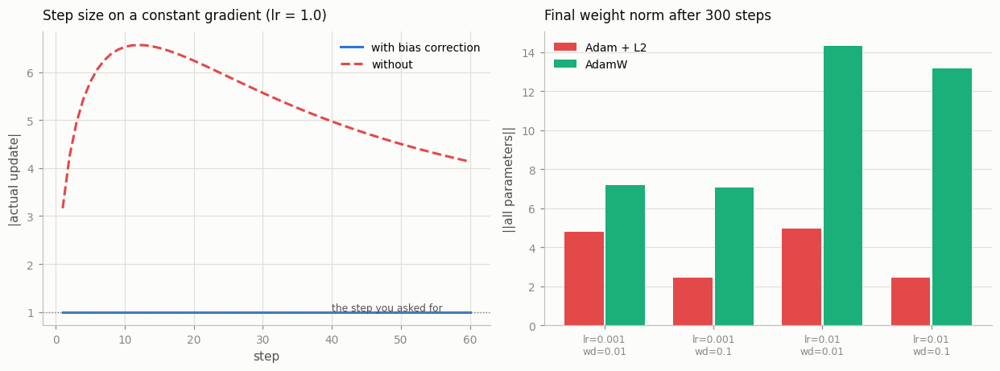

# Implement AdamW from Scratch

---

> Adam remembers the past. AdamW forgets your weight.

---

## Key Insight

[AdamW](/shared/glossary/#adamw) is [Adam](/shared/glossary/#adam) with [weight decay](/shared/glossary/#weight-decay) applied directly to the parameters rather than to the gradients. It also uses [bias correction](/shared/glossary/#bias-correction) to counteract the zero-initialization of the first and second moment estimates, which would otherwise make the first steps several times larger than the learning rate you asked for.

## Why This Matters

AdamW is the default optimizer for most modern language and vision models. Implementing it by hand makes the update rule concrete and clarifies why [decoupled](/shared/glossary/#decoupled) weight decay outperforms [L2 regularization](/shared/glossary/#l2-regularization) — a distinction that matters especially when training transformers.

---

**This is project 15.** [Project 14](../14-custom-optimizer/README.md) built the
`Optimizer` skeleton; this one fills it with the update rule that trains almost
every model you have heard of. One class covers both Adam and AdamW, because
they differ by a single line.

What `run.py` finds:

- our optimizer is **bit-identical** to `torch.optim.Adam` and
  `torch.optim.AdamW` after one step — and **1e-6 apart** after 200, which is a
  lesson in itself
- **without bias correction the first step is 3.16× too big**, and it gets worse
  before it gets better, peaking at **6.6×** around step 20
- multiply the loss by 10 000 and SGD's final loss moves from 0.886 to 0.000
  while **Adam's does not move at all** (0.002639 vs 0.002639)
- in Adam + L2, the decay one layer's weights actually receive **varies by
  235×** across that single layer; in AdamW it varies by exactly **1×**
- so `weight_decay=0.1` leaves **5× more weight** under AdamW than under
  Adam + L2 — the number does not port between them
- and Adam's two moments are **2× the model** in memory, which is why sharding
  optimizer state is the first thing every distributed trainer does

---

## Files

| file | what it is |
|---|---|
| `run.py` | `MyAdamW` (both variants, bias correction switchable) and seven experiments |
| `outputs/findings.csv` | every number quoted here |
| `outputs/bias_and_decay.png` | the bias-correction curve, and the weight-norm grid |

```bash
python3 run.py     # ~15 s; needs torch, numpy, matplotlib
```

---

## 1. The update rule

```
  m = b1*m + (1-b1)*g            first moment  : the average gradient
  v = b2*v + (1-b2)*g*g          second moment : the average SQUARED gradient

  m_hat = m / (1 - b1^t)         bias correction
  v_hat = v / (1 - b2^t)

  p -= lr * m_hat / (sqrt(v_hat) + eps)
```

Read the last line as: **step in the averaged gradient direction, but divide by
how big this parameter's gradients usually are.** A weight whose gradients are
consistently large gets a proportionally smaller step; a weight whose gradients
are tiny gets a proportionally larger one. Adam does not pick one learning rate
for the model — it picks a different effective one for every individual weight,
from that weight's own history.

> **Where the names come from.** "Adam" is *Adaptive Moment estimation* — not a
> person, unlike [Nesterov](/shared/glossary/#nesterov-momentum) in project 14.
> A "moment" is the statistician's word for an average of a power of a quantity:
> the *first* moment is the mean of `g`, the *second* moment is the mean of `g²`.
> The second moment is a measure of typical magnitude regardless of sign — which
> is exactly the thing you want to divide by. And `m/√v` is dimensionally a
> *signal-to-noise ratio*: it is near ±1 when the gradient is consistent and near
> 0 when it flips sign every batch.
>
> The `W` in AdamW stands for *weight decay*, from the title of the paper that
> introduced it (*Decoupled Weight Decay Regularization*, Loshchilov & Hutter,
> 2017).

Here is the whole thing:

```python
m.mul_(b1).add_(g, alpha=1 - b1)             # m = b1*m + (1-b1)*g
v.mul_(b2).addcmul_(g, g, value=1 - b2)      # v = b2*v + (1-b2)*g^2

step_size = lr / (1 - b1 ** t)
denom = (v.sqrt() / math.sqrt(1 - b2 ** t)).add_(eps)
p.addcdiv_(m, denom, value=-step_size)
```

with weight decay ahead of it, in one of two places:

```python
if decoupled:
    p.mul_(1 - lr * wd)        # AdamW
else:
    g = g.add(p, alpha=wd)     # Adam + L2
```

**That `if` is the entire difference between the two optimizers.** Section 5
measures what it does.

---

## 2. Checking it: bit-exact for one step, not for two hundred

```
  configuration                    after 1 step   after 200 steps
  Adam,  wd=0                         0.000e+00         8.941e-07
  Adam,  wd=1e-2 (L2)                 0.000e+00         1.490e-07
  AdamW, wd=1e-2 (decoupled)          0.000e+00         8.643e-07
  AdamW, wd=0.1                       0.000e+00         1.239e-06
```

Every configuration is **bit-identical for one step** and about **1e-6 apart**
after two hundred.

Nothing is wrong. The formulas match exactly; the two implementations evaluate
them in slightly different orders (torch computes `sqrt(1 - b2^t)` through its
own dispatcher, we call `math.sqrt`), and in
[float32](/shared/glossary/#float32) those last-bit differences feed into the
next gradient and grow. It is
[project 7](../07-manual-backprop/README.md)'s chaos result showing up somewhere
inconvenient.

> **The practical rule this gives you:** when checking an optimizer against a
> reference, **compare one step, not the end of training.** A single step is a
> pure function of the inputs and must match to the bit. A 200-step run compares
> two chaotic trajectories, and after enough steps a *correct* implementation
> and a *buggy* one both look "about 1e-6 off" — until the day the bug is large
> enough to matter and you have no test that can see it.

And with the decay switched off:

```
  AdamW vs Adam with weight_decay=0: max |diff| 0.000e+00
```

With nothing to decouple, they are the same optimizer. Everything below lives in
that one term.

---

## 3. Bias correction: what the zero-initialized moments do

Feed a constant gradient of exactly 1.0 to a single weight with `lr = 1.0`, and
measure the step actually taken:

```
    step   corrected   uncorrected    ratio   predicted
       1      1.0000        3.1623     3.16        3.16
       2      1.0000        4.2496     4.25        4.25
       5      1.0000        5.7971     5.80        5.80
      20      1.0000        6.2409     6.24        6.24
     100      1.0000        3.2408     3.24        3.24
     400      1.0000        1.7412     1.74        1.74
```



**The first uncorrected step is 3.16× too big**, and the corrected one is exactly
`lr`, every time.

Both moments start at zero, so both are biased toward zero early. The trap is
that they are biased by *different amounts*, and the update is their **ratio**:

```
    m_1 = (1-b1)*g       = 0.100*g        10x too small
    v_1 = (1-b2)*g^2     = 0.001*g^2    1000x too small
    sqrt(v_1)            = 0.0316*|g|     32x too small
    m_1 / sqrt(v_1)      = 3.16*sign(g)   3.16x too BIG
```

The square root halves the second moment's error (in log terms), so the
*denominator* shrinks less than the *numerator*, and the quotient comes out too
large. `√1000 / 10 = 3.16`, exactly the measured number.

**And it gets worse before it gets better** — the ratio climbs to about **6.6×**
around step 20, then decays. The two moments have different memories: `β₁ = 0.9`
forgets its zero start in about 10 steps while `β₂ = 0.999` needs about 1000. So
the numerator recovers first, and for a while the update is *both* an honest
gradient average *and* divided by a denominator that is still far too small.

> **What the correction actually is.** After `t` steps, `m` is a weighted sum of
> gradients whose weights add up to `1 - β₁ᵗ`, not to 1 — the missing weight is
> the zero it started from. Dividing by `1 - β₁ᵗ` renormalizes it into an honest
> weighted average. Same for `v`. That is the whole derivation, and it is why
> the correction vanishes as `t` grows (`β₁ᵗ → 0`).

So **bias correction is a warmup schedule built into the optimizer** — and
without it, the schedule runs the wrong way.

On the real training problem:

```
  corrected loss 0.0026, uncorrected 0.0001, max weight difference 1.346e+00
```

Read that honestly: **the uncorrected version wins here.** A 3–6× larger step
early is just a larger learning rate, and this loss surface forgives it. The
weights end up 1.35 apart, so these are genuinely different runs; one of them got
lucky.

The reason the correction is still not optional: **the overshoot is unasked for,
and its size depends on your betas rather than on your problem.** With
`β₂ = 0.999` the first step is 3.2× `lr`; with `β₂ = 0.9999` it is 10×. A
hyperparameter that silently rescales your learning rate by a factor you never
computed is a bug even on the runs where it helps.

---

## 4. Adam does not care how big your loss is

```
    loss multiplied by    SGD final loss   Adam final loss
                  0.01            0.8862            0.0026
                     1            0.0409            0.0026
                   100            0.0000            0.0026
```

Multiplying the loss by a constant multiplies every gradient by that constant.
SGD's step is `lr · g`, so its behaviour changes completely — 0.886 to 0.000
across the column. Adam's step is `m/√v`, and **both** `m` and `√v` scale
linearly with the gradient, so the constant cancels exactly. Adam's answer is the
same number three times, to six decimal places.

This is **scale invariance**, and it is most of why Adam feels like it "just
works": you can change your loss reduction from `mean` to `sum`, add a scaling
factor, switch to a differently-normalized dataset, and the learning rate you
tuned still applies. It is also why `lr = 3e-4` appears in papers about wildly
different architectures — under Adam that number means "move each weight by
about 3e-4 per step", regardless of the model.

The price is on the same line: **Adam throws that information away.** A genuinely
tiny gradient and a genuinely enormous one both produce a step of about `lr`.
Adam knows the *direction* your loss wants to move and has deliberately
forgotten *how strongly*.

*(A note on the table: the scaled-up SGD run does better here, not worse — on
this easy surface a 100× learning rate still converges. The point is not which
wins. It is that SGD's answer depends on a constant that has nothing to do with
the model, and Adam's does not.)*

---

## 5. What "decoupled" means, measured

```
  Adam + L2 :  g <- g + wd*p         then the adaptive step divides by sqrt(v_hat)
  AdamW     :  p <- p * (1 - lr*wd)  outside the adaptive step entirely
```

In Adam + L2 the decay term rides through the adaptive division along with
everything else. So the decay each individual weight receives gets divided by
*that weight's own* `√v̂`. Measure it directly, over the weights of one layer:

```
  Adam + L2    effective decay per step: min 7.624e-02  max 1.788e+01  spread 235x
  AdamW        effective decay per step: min 1.000e-03  max 1.000e-03  spread 1x
```

**Within a single layer, Adam + L2 decays some weights 235× harder than others.**
AdamW's spread is exactly 1× by construction — every weight is multiplied by the
same `(1 − lr·wd)`.

And the direction of the bias is the bad one: weights with the **largest**
gradient history have the **largest** `√v̂` and therefore get the **least** decay.
Those are usually the weights doing the most work — the ones you most wanted to
regularize.

> **Why do people say L2 and weight decay are "the same thing"?** For plain SGD
> they are. Differentiate the penalty `½·wd·p²` and you get `wd·p`, so adding
> that to the gradient and then stepping by `−lr·g` shrinks the weight by exactly
> `lr·wd·p`. Identical. They stop being identical the moment the optimizer
> rescales the gradient per parameter — which is the one thing Adam exists to do.
>
> **"Decoupled" means literally: taken out of the part that gets rescaled.**
> That is the whole idea, and the whole paper.

The practical consequence:

```
        lr      wd   Adam+L2 ||w||   AdamW ||w||
     1e-03    0.01           4.811         7.185
     1e-03    0.10           2.450         7.062
     1e-02    0.01           4.976        14.343
     1e-02    0.10           2.454        13.155
```

**The headline is the gap between the columns, not within them.** At
`weight_decay=0.1`, Adam + L2 ends at `‖w‖ = 2.45` while AdamW ends at 13.15 —
**five times more weight left** from the same number, because AdamW's decay is a
flat 0.999 per step while Adam + L2's got multiplied by a `1/√v̂` in the hundreds.

So **`weight_decay` does not port between the two optimizers.** Switch
`Adam` → `AdamW` and keep the number, and you have quietly turned your
regularization down by an order of magnitude or two. This is why AdamW recipes
use decays of 0.01–0.1 where Adam recipes used 1e-4, and it is a real source of
"the paper's hyperparameters did not reproduce".

And AdamW's version is the one you can reason about: after `N` steps every weight
has been multiplied by `(1 − lr·wd)^N`, full stop. Adam + L2's shrinkage is a
different number for every weight in every layer, and it moves as training moves
the gradients.

---

## 6. Epsilon: where it sits and what it costs

```
         eps    final loss
       1e-16        0.0026
       1e-08        0.0026
       1e-04        0.0029
       1e-02        0.0325
       1e+00        0.7143
```

`eps` is not there for accuracy. It is there so that a parameter whose gradient
has been exactly zero for a while does not divide by zero — a dead
[ReLU](/shared/glossary/#relu), a padding row in an embedding, a weight that is
frozen in practice.

But it also puts a **ceiling** on the step: the update is at most `lr·m̂/eps`.
Push `eps` up far enough and the adaptive division stops happening at all, and
Adam degrades into SGD with momentum — which is precisely what the last row is.

> **Note where it sits: `√v̂ + eps`, not `√(v̂ + eps)`.** People port the wrong
> one constantly, and the two differ by a square root: with `eps = 1e-8` the
> second form puts a floor of `1e-4` on the denominator, **10 000× stronger**
> than intended, and quietly caps every step. If you ever see an
> Adam implementation that "trains but plateaus early", check this line first.

---

## 7. What two moments cost

```
  optimizer               state / param    training memory for a 7B model
  SGD                                 0                            56 GB
  SGD + momentum                      1                            84 GB
  Adam / AdamW                        2                           112 GB
```

Two `torch.zeros_like(p)` allocations per parameter — measured at exactly **2×**
the parameter count — and the arithmetic above explains most of the distributed
training chapter.

A 7B-parameter model is 28 GB of [fp32](/shared/glossary/#float32) weights, 28 GB
of gradients, and 56 GB of Adam state: **112 GB before a single
[activation](/shared/glossary/#activations)**, and more than any single GPU has.

That is why [ZeRO](/shared/glossary/#zero) and
[FSDP](/shared/glossary/#fsdp) shard the **optimizer state first**
([project 38](../38-fsdp-a-transformer/README.md)). It is the biggest of the
three pieces, and it is the easiest to split, because Adam's update is
*elementwise*: no weight's moments depend on any other weight's, so each GPU can
own a slice and update it alone.

It is also why `bfloat16` optimizer states, 8-bit Adam, and
[Adafactor](/shared/glossary/#adafactor) exist — every one of them is an attack
on this same 2×.

---

## Things you can try

- **Add AMSGrad** (keep the running *maximum* of `v̂` and divide by that) in three
  lines, and check it against `torch.optim.Adam(amsgrad=True)` on step 1.
- **Set `β₁ = 0`** and you have RMSProp. Set `β₂ = 0` and you have signSGD (every
  step is exactly `±lr`). Both are two-character edits and both train.
- **Re-run section 5 with a per-layer breakdown** of the effective decay. The
  spread across *layers* is even bigger than the 235× within one.
- **Track `√v̂` for the first and last layer** over training and plot them. That
  ratio is the "effective learning rate imbalance" that Adam exists to remove,
  and it is what makes plain SGD need per-layer tuning.
- **Turn bias correction off and add 100 warmup steps.** How much of the
  correction can a linear warmup replace? (Answer: much of it, which is the
  historical reason the two are sometimes confused.)

---

## What to take away

1. Adam is two running averages: the mean gradient (`m`) and the mean squared
   gradient (`v`). The update is `m̂/√v̂` — a per-parameter
   signal-to-noise ratio, not a gradient.
2. Our implementation is **bit-identical to torch for one step** and 1e-6 apart
   after 200. **Test step 1**; a 200-step comparison cannot tell a correct
   implementation from a slightly wrong one.
3. Without bias correction the first step is **3.16× too big** — the two moments
   are biased by different amounts and the square root does not cancel it — and
   the error peaks at **6.6×** around step 20 before decaying.
4. **Adam is scale invariant.** Multiply the loss by 10 000 and its result does
   not change at all; SGD's changes completely.
5. `weight_decay` in Adam is divided by each weight's own `√v̂` — a **235× spread
   inside one layer**, biased so the most important weights are decayed least.
   AdamW's spread is exactly **1×**.
6. Therefore **`weight_decay` does not port between Adam and AdamW**: the same
   0.1 leaves 5× more weight under AdamW.
7. `eps` goes in `√v̂ + eps`, and raising it turns Adam back into SGD with
   momentum.
8. Adam's state is **2× the model**, and that single fact drives ZeRO, FSDP,
   8-bit optimizers, and Adafactor.

---

Next: [project 16](../16-state-dict-surgery/README.md) leaves the optimizer and
goes back to the weights themselves — loading a checkpoint into a model that is
not quite the model it was saved from, which is what transfer learning actually
consists of.
