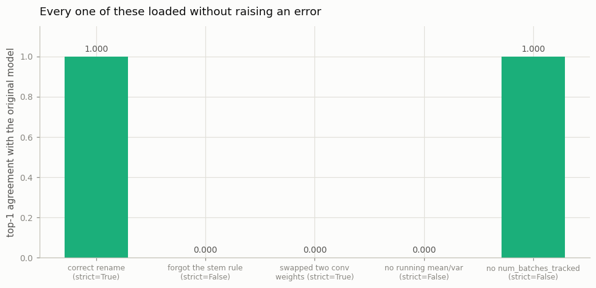

# State Dict Surgery

---

> A model is just a dictionary. Knowing the keys is everything.

---

## Key Insight

A [state dict](/shared/glossary/#state-dict) is a plain Python ordered dictionary that maps parameter and buffer names to their tensor values. Loading weights into a different architecture is a matter of matching these key names and shapes — whether by renaming keys, slicing tensors, or ignoring mismatches with `strict=False`.

## Why This Matters

Real-world models are rarely loaded from a checkpoint with identical architecture. Transfer learning, model merging, and checkpoint recovery all require mapping weights between differently structured models. State dict surgery is the practical skill that makes all of these possible.

---

**This is project 16.** We take torchvision's pretrained
[ResNet](/shared/glossary/#resnet)-18 checkpoint and pour it into `MyResNet` — a
model with a `stem`, a `ModuleList` of `stages`, and a `head`, none of which
torchvision has ever heard of. Then we check it, and then we break it four
different ways to see which breakages PyTorch will tell you about.

What `run.py` finds:

- 122 keys remapped by **four string rules**, and the output is **bit-identical**
  to torchvision's (`max |logit diff| = 0.000e+00`)
- a mapping that forgot one rule loads under `strict=False` and agrees with the
  original on **0 of 24** inputs
- dropping `num_batches_tracked` costs **exactly nothing**; dropping
  `running_mean`/`running_var` — **0.08 % of the checkpoint** — destroys the
  model completely
- slicing 10 rows out of the 1000-class head reproduces those 10 logits to
  **0.000e+00**
- and swapping two same-shaped convolution weights passes **`strict=True` with
  zero missing keys** and agrees on **0 of 24** inputs

Four of those five loaded without raising anything at all.

---

## Files

| file | what it is |
|---|---|
| `run.py` | `MyResNet`, the remapper, and seven experiments |
| `outputs/key_mapping.csv` | all 122 keys, old name → new name → shape |
| `outputs/findings.csv` | every number quoted here |
| `outputs/surgery_outcomes.png` | the figure below |

```bash
python3 run.py     # ~15 s; needs torch, torchvision, matplotlib
```

Every "agreement" number below compares two models on the **same fixed 24 random
inputs**, counting how often they pick the same class.

---

## 1. What a `state_dict` actually is

```
  type      : OrderedDict
  entries   : 122
  dtypes    : ['torch.float32', 'torch.int64']
  total MB  : 46.8

    conv1.weight                      (64, 3, 7, 7)       torch.float32
    bn1.weight                        (64,)               torch.float32
    bn1.bias                          (64,)               torch.float32
    bn1.running_mean                  (64,)               torch.float32
    bn1.running_var                   (64,)               torch.float32
    bn1.num_batches_tracked           ()                  torch.int64
```

A plain ordered dictionary of tensors, keyed by the dotted paths from
[project 12](../12-module-introspection/README.md). **There is no architecture in
here.** No layer types, no connection order, no forward pass — a checkpoint
cannot tell you what model it came from, only what shapes it expects to be
poured into.

That single fact cuts both ways, and both halves are this project:

- it is **why surgery is possible at all** — nothing stops you pouring these
  tensors into a different container
- it is **why a successful load proves nothing** — the file has no way to check
  that your container means what its container meant

---

## 2. The rename

```
    conv1.*   -> stem.conv.*
    bn1.*     -> stem.norm.*
    layerN.*  -> stages.{N-1}.*
    fc.*      -> head.*
```

```
  key sets identical after remapping: True
  load_state_dict(strict=True) -> missing 0, unexpected 0
  top-1 agreement with torchvision : 1.000
  max |logit difference|           : 0.000e+00
```

**Bit-identical.** Not "close" — the same weights, in the same order, through the
same operations.

Look at how much did *not* have to match:

- torchvision has four separate top-level attributes (`conv1`, `bn1`, `relu`,
  `maxpool`) where we have one `Stem` module containing all four
- torchvision has four named attributes `layer1`…`layer4`; we have a
  `nn.ModuleList` called `stages`, which names its children `0`, `1`, `2`, `3`
- their classifier is `fc`, ours is `head`

None of that is in the file. **`load_state_dict` matches final dotted strings to
final dotted strings, and shapes to shapes.** Everything else about your class
is yours.

> **Then why does the naming feel so rigid in practice?** Because most people
> never write the mapping — they load a checkpoint into the same class that
> saved it, and the strings match by luck of shared code. The moment you write
> your own architecture around someone else's weights, the strings become an
> interface you have to implement, and `outputs/key_mapping.csv` is what that
> interface looks like written out.

---

## 3. `strict=False`, and the keys it will not mention unless you look

A realistic bug: someone wrote three of the four rules and forgot the stem.

```
  missing_keys    : 5   e.g. ['stem.conv.weight', 'stem.norm.weight']
  unexpected_keys : 6   e.g. ['conv.weight', 'norm.weight']
  top-1 agreement with torchvision: 0.000
  max |logit difference|          : 11.06
```

It ran. It returned. It produced a thousand confident numbers per image, and it
agrees with the real model on **nothing**, because the first convolution — the
one every pixel passes through — is still at its random initialization.

> **`strict=False` does not mean "be lenient about small differences". It means
> "do not raise".** The information is all there, in the return value, and the
> return value is what nobody assigns:
>
> ```python
> result = model.load_state_dict(sd, strict=False)
> assert not result.missing_keys, result.missing_keys
> assert not result.unexpected_keys, result.unexpected_keys
> ```
>
> Two lines. Use `strict=True` whenever you can, and when you genuinely cannot
> (section 5), assert on exactly the keys you meant to skip — not on none of
> them.

Shapes, on the other hand, are always checked:

```
  a shape mismatch under strict=False still RAISES:
    size mismatch for head.weight: copying a param with shape torch.Size([10, 512]) ...
```

So the guarantee is narrow but real: **`strict` controls which keys must be
present; shapes are checked either way.** Every silent failure in this project is
a *key* problem or a *semantic* one. Never a shape one.

---

## 4. What dropping the BatchNorm buffers costs

```
  everything (122 keys)        loaded  122 keys   top-1  1.000   max |logit diff|     0.00
  drop num_batches_tracked     loaded  102 keys   top-1  1.000   max |logit diff|     0.00
  drop running_mean/var        loaded   82 keys   top-1  0.000   max |logit diff|     8.51
  parameters only (62 keys)    loaded   62 keys   top-1  0.000   max |logit diff|     8.51
```

**`num_batches_tracked` is free to drop.** In `eval()` it is never read at all,
and in `train()` it only matters if you set `momentum=None` (which switches
BatchNorm to a cumulative average and needs the count). This is why key lists
that skip it are everywhere and nothing breaks.

**`running_mean` and `running_var` are not.** They are 9 620 numbers, **0.08 % of
the checkpoint**, and without them the other 99.92 % is worthless.

Here is exactly why. In `eval()` a BatchNorm computes:

```
  y = (x - running_mean) / sqrt(running_var + eps) * weight + bias
```

A freshly constructed BatchNorm has `running_mean = 0` and `running_var = 1`, so
that expression becomes `y = x * weight + bias`. If the layer's real activations
are centred around 4.0 with a variance of 0.01, they are now left at 4.0 instead
of being pulled to 0 — and then `weight` and `bias`, which were *learned for the
normalized version*, are applied on top of unnormalized input. Every subsequent
layer receives numbers from a distribution it never saw in training.

> This is the concrete answer to project 12's question, *"if a buffer is not
> trained, why is it not just a plain Python attribute?"* Because a plain
> attribute is not in this file. Being in `state_dict()` is not bookkeeping — it
> is the difference between a pretrained model and a randomly initialized one.

---

## 5. Head surgery: 1000 classes → 10, exactly

```python
sub["head.weight"] = mapped["head.weight"][keep]   # keep = 10 class indices
sub["head.bias"]   = mapped["head.bias"][keep]
```

```
  head.weight  1000x512 -> (10, 512)
  max |logit difference| vs the same 10 columns of the full model: 0.000e+00
  argmax-over-10 agreement: 1.000
```

An `nn.Linear` weight has shape `(out_features, in_features)`, so **row `i` is the
entire recipe for output `i`**. Selecting ten rows selects ten classes and
changes nothing else — the trunk never knew how many classes there were, and the
computation for each kept class is untouched.

The more common version of this operation throws the head away instead:

```python
sd = {k: v for k, v in sd.items() if not k.startswith("head.")}
model.load_state_dict(sd, strict=False)      # head stays randomly initialized
```

Both are legitimate, and they answer different questions. **Slicing** keeps a
working classifier for a subset of the original classes — useful immediately, no
training. **Dropping** gives you a fresh head for *new* classes, which is the
first step of every fine-tuning script.

What you must not do is leave the 1000-way head in the file and hope. That is a
shape mismatch, and section 3 showed it raises — which here is the friendly
outcome.

---

## 6. The mapping bug that loads perfectly

```
  swap two keys of identical shape (512, 512, 3, 3):
    stages.3.0.conv2.weight  <->  stages.3.1.conv2.weight

  load_state_dict(strict=True) -> missing 0, unexpected 0
  top-1 agreement with torchvision : 0.000
  max |logit difference|           : 9.89
```



**`strict=True` passed.** Every key present, every shape correct, no warning of
any kind — and two 3×3×512×512 convolutions are doing each other's job.

This is the failure mode that matters, because it is the one no tooling can see.
The realistic ways to produce it are all mundane:

- an off-by-one in a layer index (`stages.{N}` instead of `stages.{N-1}`)
- a `re.sub` that matched `layer1` inside `layer10`
- an `enumerate` over `named_parameters()` in a model whose `__init__` order
  changed
- two blocks with the same shape in a stack, mapped in reverse

Every one of them yields shape-compatible nonsense.

> **There is exactly one defence, and it is the whole point of this project:
> after any surgery, run both models on the same input and compare the outputs.**
> Section 2 got `0.000e+00`. Anything above float-rounding is a bug you have not
> found yet.
>
> It costs four lines and one forward pass:
>
> ```python
> with torch.no_grad():
>     a, b = reference(x), surgical(x)
> assert (a - b).abs().max() < 1e-5, (a - b).abs().max()
> ```

---

## 7. Checkpoint hygiene

```python
torch.save({"model": m.state_dict(), "arch": "MyResNet", "epoch": 0}, path)
ckpt = torch.load(path, weights_only=True, map_location="cpu")
```

**`weights_only=True`** — the default since torch 2.6. The old default used
Python's `pickle`, which runs arbitrary code while unpickling, so a checkpoint
downloaded from the internet was a *program*, not data. `weights_only=True`
restricts the loader to tensors and plain containers.

**`map_location="cpu"`** — a `state_dict` remembers which device each tensor was
on. A checkpoint saved from `cuda:3` tries to restore itself onto `cuda:3`, on a
machine that may have one GPU or none.

**A checkpoint worth keeping contains six things:**

| what | why |
|---|---|
| `model.state_dict()` | weights **and** buffers (section 4) |
| `optimizer.state_dict()` | momentum / Adam moments ([project 14](../14-custom-optimizer/README.md)) |
| `scheduler.state_dict()` | where you are on the learning-rate curve |
| the step or epoch number | so the scheduler and logs line up |
| the RNG state | [project 17](../17-reproducible-training/README.md) |
| the config that built the architecture | so the 122 shapes mean something |

That last row is the one people skip, and it is why old checkpoints become
unloadable: the file is 122 anonymous tensors and no record of what produces
those 122 shapes.

---

## Things you can try

- **Merge two models** (a "model soup"): average the `state_dict` values of two
  fine-tunes of the same base, key by key, and check the result still works. Skip
  `num_batches_tracked` — averaging a counter is meaningless.
- **Load a ResNet-18 checkpoint into a ResNet-34** with `strict=False` and read
  `missing_keys`. The stem and early stages transfer; the rest does not.
- **Write the reverse mapping** (ours → torchvision) and load our weights into
  torchvision's class. If your mapping is a true bijection this must also give
  `0.000e+00`.
- **Inflate a 2D conv into 3D** by repeating the kernel along a new time axis and
  dividing by its length — this is exactly how video models are initialized from
  image models, and it is ten lines of `state_dict` surgery.
- **Break it on purpose**: shift every `stages.N` index by one and confirm
  `strict=True` still passes for the layers whose shapes happen to match.

---

## What to take away

1. A `state_dict` is an ordered dict of tensors keyed by dotted paths. **It
   contains no architecture** — only names and shapes.
2. Names are an interface, not a constraint. Four string rules mapped 122 keys
   into a differently structured model with **`0.000e+00`** difference.
3. **`strict=False` means "do not raise", not "it is fine".** Assign the return
   value and assert on `missing_keys` and `unexpected_keys`.
4. Shapes are checked whatever `strict` is. Every silent failure here is a key
   or semantic problem.
5. **Buffers are load-bearing.** Dropping BatchNorm's running statistics — 0.08 %
   of the file — takes agreement from 1.000 to 0.000. `num_batches_tracked` is
   free to drop.
6. A `Linear` weight is `(out, in)`, so slicing rows slices classes: a 10-way
   head reproduced the full model's logits **exactly**.
7. **A load that passes `strict=True` can still be completely wrong.** Two
   swapped same-shape convolutions → 0 missing keys, 0 % agreement.
8. **Always verify numerically after surgery.** One forward pass, one
   `assert_close`, and every bug in this project would have been caught.

---

Next: [project 17](../17-reproducible-training/README.md) closes Phase 3 by
asking for the strongest guarantee of all — that running the *same* code twice
gives bit-identical results — and finds out what quietly stops that from being
true.
