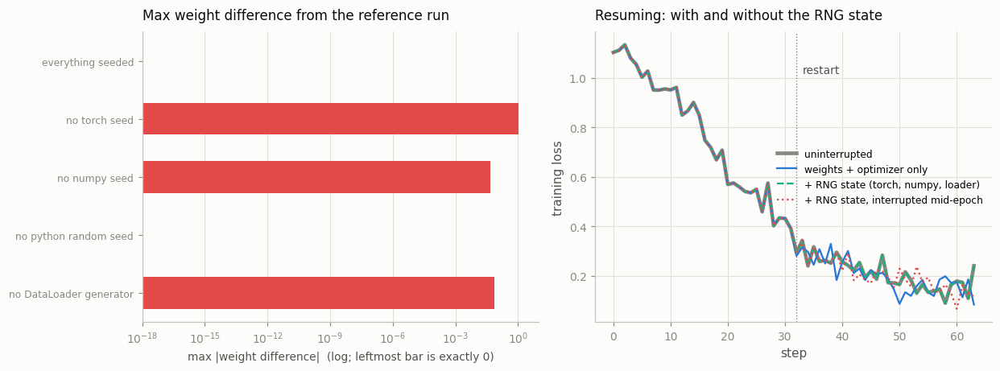

# Reproducible Training

---

> Same seed, same model, same data — same number, every time.

---

## Key Insight

Full reproducibility requires more than setting a random seed. You also need to enable [deterministic algorithms](/shared/glossary/#deterministic-algorithms) in PyTorch (via `torch.use_deterministic_algorithms(True)`), set seeds for Python, NumPy, and CUDA, and control data order with a fixed DataLoader seed.

## Why This Matters

When a training run gives unexpected results, reproducibility lets you bisect the problem: run it twice, compare the outputs, and confirm whether the behavior is deterministic. Without it, debugging is guesswork.

---

**This is project 17**, and the last of Phase 3. We get two training runs to
produce **bit-identical** weights, then break that one knob at a time and measure
what each knob was worth.

What `run.py` finds:

- two fully seeded runs: **`0.000e+00`** weight difference, identical loss at
  every step
- dropping `np.random.seed` alone moves the weights by **0.046**; dropping
  `torch.manual_seed` moves them by **1.06**
- `num_workers=0` and `num_workers=4` are **both** perfectly reproducible, and
  they reproduce **different runs** — **0 of 32** augmentation values in common
- the same `x.sum()` gives **3 different answers** across 5 thread counts, and
  `use_deterministic_algorithms(True)` **does not fix it**
- on CPU that flag raises on **0 of 6** famously non-deterministic operations
- resuming with weights + optimizer + RNG state is **bit-exact** — unless you
  were interrupted mid-epoch, in which case it is not

---

## Files

| file | what it is |
|---|---|
| `run.py` | the baseline, six ways to break it, and the cost measurement |
| `outputs/findings.csv` | every number quoted here |
| `outputs/reproducibility.png` | the two figures |

```bash
python3 run.py     # ~10 s; needs torch, numpy, matplotlib
```

---

## 1. The baseline: two runs, zero difference

```
  identical loss curves     : True
  max |weight difference|   : 0.000e+00
  final loss                : 0.164982 and 0.164982
```

Five things are pinned, and each one covers a different source of randomness:

| what | covers |
|---|---|
| `torch.manual_seed(0)` | the model's initialization, [dropout](/shared/glossary/#dropout), any `torch.rand*` |
| `np.random.seed(0)` | the augmentation inside `__getitem__` |
| `random.seed(0)` | anything using Python's own `random` module |
| `DataLoader(generator=g)` | the shuffle order |
| `torch.set_num_threads(1)` | the arithmetic itself (section 4) |

> **One setup detail that is easy to get wrong.** The *dataset* is built from its
> own `torch.Generator(seed=1234)`, not from the global seed. If the data changed
> whenever the seed changed, every comparison below would be measuring two things
> at once. Fix the data first, then vary the run.

---

## 2. One missing seed at a time

```
  what is missing              max |weight diff|   first step where
                                                      losses differ
  everything seeded                    0.000e+00              never
  no torch seed                        1.059e+00                  0
  no numpy seed                        4.603e-02                  0
  no python random seed                0.000e+00              never
  no DataLoader generator              7.255e-02                  0
```



- **`torch.manual_seed`** controls the model's initialization, so leaving it out
  changes step 0 and everything after it. Largest effect, and the one everybody
  remembers.
- **`np.random.seed`** controls the augmentation. The model starts *identical*
  and the curves still separate at step 0, because the first batch has different
  noise on it. **A seeded model with unseeded data is not a reproducible run.**
- **`random.seed`** changes nothing *here*, because nothing in this script uses
  Python's `random`. Seed it anyway: torchvision transforms and most augmentation
  libraries do use it, and the failure is silent — you would see exactly the
  `0.000e+00` above and conclude you were safe.
- **the DataLoader generator** controls the shuffle order. Without one, the
  sampler draws from the global torch RNG, which *is* seeded — so this particular
  run stays reproducible. It stops being reproducible the moment anything else
  consumes the global RNG between epochs (a dropout layer, a random crop, a
  logging call that samples images).

> The rule: **seed all three, pass an explicit `generator`, and do not rely on
> "the global seed covers it."** It does cover it, until someone adds a line
> above your loader.

---

## 3. The DataLoader: workers have their own randomness

```
  num_workers=0, run twice : identical  True
  num_workers=4, run twice : identical  True
  num_workers=0 vs 4       : identical  False   values in common: 0 of 32
```

**Both settings are perfectly reproducible, and they reproduce different runs.**

Each worker process gets `base_seed + worker_id` and uses it to seed torch,
numpy, and Python's `random` inside that process. So the *number of workers*
determines how many independent random streams exist and which sample draws from
which — and the augmentation values have **nothing in common** between the two
settings.

> **`num_workers` is part of your seed.** Change it for speed — which is the only
> reason anyone ever changes it — and your "reproducible" run reproduces
> something else, with no warning, usually while you were thinking about
> something unrelated. If you are bisecting a regression, pin it alongside the
> seed.

### The famous bug, and its current status

```
  the classic 'every worker draws the same numpy numbers' bug: not present
    first four batches, one per worker: (25098, 719145, 546226, 964592)
                                        (448746, 607639, 916042, 371493)
```

Half the `DataLoader` boilerplate on the internet exists to fix this. Under
`fork`, a worker process inherits the parent's memory — including numpy's RNG
state — so historically **every worker produced the same augmentation sequence**.
A batch of 32 "random crops" was really 4 crops repeated 8 times, and models
trained on far less variety than their authors believed.

Modern PyTorch seeds numpy and Python's `random` per worker, so the hand-written
`worker_init_fn` is no longer needed. Copying it does no harm; *believing you
still need it* does, because it makes you feel covered while the real remaining
issue — the paragraph above — is untouched.

---

## 4. The thread count changes the arithmetic

```
   threads             x.sum()     max |A@B - (A@B at 1 thread)|
         1       -1561.4531250                         0.000e+00
         2       -1561.4531250                         0.000e+00
         4       -1561.4527588                         0.000e+00
         8       -1561.4531250                         0.000e+00
        12       -1561.4530029                         2.480e-05

  distinct sums across thread counts: 3 of 5
```

Nothing here is random. Every thread count is perfectly reproducible on its own.

Floating point addition is **not associative**: `(a+b)+c` and `a+(b+c)` can differ
in the last bits ([project 4](../04-dtype-precision-study/README.md) measured how
far that can go). A multi-threaded reduction splits the array into one chunk per
thread, adds each chunk separately, then combines the partial sums — so the
**grouping** depends on how many threads there are, and the answer changes with
it.

A full training run:

```
  a full training run at 1 vs 12 threads: max |weight diff| 1.192e-07,
  curves differ from step 5
```

Small, because this model is small. Not zero — and
[project 7](../07-manual-backprop/README.md) measured two runs that started
1e-16 apart reaching a difference of 0.357 after 150 steps.

> **Why this matters more than it looks.** `torch.set_num_threads` defaults to
> the number of cores. So the same script with the same seed gives different
> numbers on your laptop and on the cluster — and different numbers again when a
> co-tenant is using half the machine and you set `OMP_NUM_THREADS` to
> compensate. If you want bit-exactness across machines, the thread count is one
> of the things you have to ship with the seed.

---

## 5. What `torch.use_deterministic_algorithms(True)` actually does

```
  with the flag ON, matmul at 1 vs 12 threads still differs by 2.480e-05

  operations that are famous for being non-deterministic, on CPU:
    index_add_                       runs
    scatter_add_                     runs
    index_put_(accumulate=True)      runs
    interpolate bilinear, backward   runs
    grid_sample, backward            runs
    embedding_bag, backward          runs

  0 of 6 raised.
```

**On CPU this flag is close to a no-op**, and that is not a disappointment — it
is the point, once you know what the flag does.

> **The flag does not make anything deterministic.** It turns on a *check*: "if I
> am about to use an implementation whose result depends on scheduling, raise an
> error instead of silently returning something." Nearly every CPU kernel already
> has a deterministic implementation, so nothing fires.

On CUDA the same six operations mostly *do* raise, because their fast
implementations use `atomicAdd` — many threads adding into the same memory
location, in whatever order the blocks happen to finish. Non-associativity again,
now at hardware scale. There the flag is essential, and it comes with a
companion:

```
CUBLAS_WORKSPACE_CONFIG=:4096:8
```

an **environment variable**, not a Python call, because cuBLAS decides how to
split its reductions when the workspace is created — before any Python you could
have run.

So determinism has to be pinned at three separate levels, and no single switch
covers them:

1. **the seeds** — what random numbers you get (section 2)
2. **the algorithms** — whether the kernel's result depends on scheduling (this
   flag)
3. **the parallel layout** — thread count on CPU, and it is not covered by
   anything above (section 4)

---

## 6. Resuming bit-exactly needs the RNG state — and more

```
  what was restored                         max |weight diff|   curves differ from
  weights + optimizer only                          5.127e-02                   32
  + RNG state (torch, numpy, loader)                0.000e+00                never
  + RNG state, interrupted mid-epoch                5.371e-02                   40
```

Every row is compared against the same run trained straight through for four
epochs — which is what a resume is supposed to reproduce.

**Line 1: a correct model, and a different run.** The weights and optimizer state
are exactly right. But without the RNG state, the shuffle order and augmentation
noise after the restart are whatever seed 0 produces from a standing start —
which is exactly what epoch 1 saw. The run silently replays its first epoch's
random choices from the restart onward. Nobody notices, because a training curve
that continues smoothly downward looks correct.

**Line 2: `0.000e+00`.** Weights, optimizer state, torch RNG, numpy RNG, and the
loader's generator, all restored on an epoch boundary. In the figure, the green
dashed line lies exactly on top of the uninterrupted grey one. This is what a
complete checkpoint buys you.

**Line 3 is the one nobody expects.** The same five things restored, but the
interruption happened half way through epoch 3 — and it diverges from the moment
of the restart.

> **A DataLoader cannot be resumed mid-epoch.** Iterating it again starts a *new*
> epoch: a fresh permutation, batch 0 first. The batches you had not reached get
> shuffled back in, and the ones you had already trained on come round a second
> time. Nothing is corrupted; the sample *order* is simply not the one the
> uninterrupted run would have used. On a dataset where one epoch is a day of
> training, that is most of your run.
>
> Three ways out, in increasing order of effort: **checkpoint only on epoch
> boundaries** (what most training scripts quietly do), **save the batch index
> and skip that many batches** on resume (correct, and slow on a large dataset),
> or use a **stateful loader** that serializes its own position.

### One more trap, found while writing this section

Restoring the same checkpoint twice in one process gave a different answer the
second time. The cause:

> **`Optimizer.load_state_dict` does not copy the state tensors** when the dtype
> and device already match. The momentum buffers you load *are* the checkpoint's
> tensors, and the first resumed run steps them in place — so the second load
> gets buffers that have already moved. `model.load_state_dict` does copy (it
> uses `copy_` internally), which makes the asymmetry easy to miss.

Deep-copy the optimizer state if you intend to reuse a checkpoint object. This
does not affect the normal case — load once, per process — which is why it has
survived.

**Five things to save, and none of them is optional:**

```
  torch.get_rng_state()            (plus torch.cuda.get_rng_state_all())
  np.random.get_state()
  random.getstate()
  the DataLoader generator's get_state()
  where you are inside the epoch
```

---

## 7. What it costs, and what it still does not buy you

```
  1 thread                            0.17 s for 60 steps
  8 threads                           0.18 s for 60 steps
  1 thread + deterministic flag       0.19 s for 60 steps
```

On this problem the flag is free and threads barely help, because the model is
tiny. **Neither number generalizes.** On a real model the flag can cost 10–30 %
(it replaces fast `atomicAdd` kernels with slower ordered ones), and threads are
the entire reason CPU training is bearable.

The honest summary of this project is a hierarchy, not a switch:

```
  same process, same seeds                          -> bit-identical
  same machine, same threads, same num_workers,     -> bit-identical
    same torch build
  different thread count                            -> different in the last bits
  different CPU, GPU, or torch build                -> different, sometimes visibly
```

> **"Reproducible" in a paper almost never means the top line.** It means "the
> seeds are fixed, so the conclusion does not depend on luck." That is the
> useful property, and it is why the practical advice is: seed everything, report
> the variance over several seeds, and reach for bit-exactness only when you are
> **bisecting** — comparing two versions of your own code on one machine, where
> any difference at all is a signal rather than noise.

---

## Things you can try

- **Run the seeded baseline in two separate processes** instead of two calls in
  one. It should still be `0.000e+00` — and if it is not, something in your
  environment (a thread count, an env var, a hash seed) is not what you think.
- **Set `PYTHONHASHSEED`** and build a vocabulary by iterating a `set` of
  strings. The order changes between processes without it, and any code that
  assigns ids by enumeration position is then non-reproducible in a way no torch
  seed can fix.
- **Seed with `torch.manual_seed(0)` and run on GPU**: `torch.cuda` gets its own
  generators. `torch.manual_seed` seeds them all, but `torch.cuda.manual_seed`
  seeds only the current device.
- **Turn the flag on for a model with `F.interpolate`** and see it raise on CUDA
  where it stayed silent here.
- **Measure the seed-to-seed spread** on this problem: run five seeds and compare
  the spread to the effect of any change you are trying to evaluate. If the
  change is smaller than the spread, you have not measured anything.

---

## What to take away

1. Two fully seeded runs are **bit-identical** — `0.000e+00`. Bit-exactness is
   achievable, on one machine, when everything is pinned.
2. **Three seeds, not one**: torch, numpy, and Python's `random`. Missing the
   numpy one moves the weights by 0.046 with an identical model.
3. Pass an explicit `generator` to the DataLoader instead of trusting the global
   RNG for shuffle order.
4. **`num_workers` is part of your seed.** Two settings, both reproducible, zero
   augmentation values in common.
5. The classic "all workers share numpy's seed" bug is **fixed** in modern
   PyTorch. The `worker_init_fn` you copied is no longer doing anything.
6. **Thread count changes the arithmetic**, because float addition is not
   associative and a parallel reduction changes the grouping. 3 distinct sums
   across 5 thread counts.
7. `use_deterministic_algorithms(True)` is a **check, not a fix**, and on CPU it
   raises on none of the six usual suspects. It says nothing about thread count.
8. A resume is bit-exact only with **weights + optimizer + torch RNG + numpy RNG
   + loader generator**, *and* an epoch boundary — a DataLoader cannot be resumed
   mid-epoch.
9. `Optimizer.load_state_dict` **shares** the checkpoint's state tensors rather
   than copying them; `model.load_state_dict` copies.
10. Bit-exactness is a debugging tool for bisecting on one machine. Across
    machines, the property you actually want is "fixed seeds and a reported
    seed-to-seed variance".

---

## Phase 3 complete

Six projects, and they compose into the five lines from the guide:

```python
optimizer.zero_grad()       # project 14: set_to_none changes the math
output = model(x)           # projects 12, 13: the tree, and watching it run
loss = criterion(output, y)
loss.backward()             # Phase 2
optimizer.step()            # projects 14, 15: the update rule and its state
```

…plus the two things that surround them: **what you save**
([project 16](../16-state-dict-surgery/README.md)) and **whether you can do it
again** (this one).

Next: [Phase 4](../../README.md#phase-4-data-loading-and-input-pipelines) turns
to the part of the loop we have been quietly feeding from memory — the data
pipeline, and why a starved GPU is a wasted GPU.
