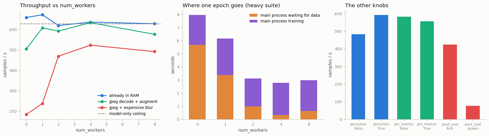

# Naive vs Optimized Loader

---

> A fast GPU sitting idle, waiting for the next batch, is the most expensive way to do nothing.

---

## Key Insight

A [DataLoader](/shared/glossary/#dataloader) can prepare upcoming batches using background [worker processes](/shared/glossary/#worker-processes) while the GPU trains on the current one. Raising the number of workers from 0 to several spreads this preparation across CPU cores, so the GPU rarely has to wait for data.

## Why This Matters

A starved GPU is wasted money — your most expensive hardware sitting idle. Tuning the worker count is often the easiest way to raise training [throughput](/shared/glossary/#throughput), sometimes several-fold, without changing the model at all.

---

**This is project 18**, and the first of Phase 4. Phases 1-3 fed the model from
tensors that were already in memory. Real training reads files. This project
measures what `num_workers` — and five other `DataLoader` knobs — are actually
worth, and shows that the honest answer is **"it depends entirely on one number
you can measure in ten seconds."**

What `run.py` finds:

- on an **expensive** pipeline, `num_workers=0 → 4` takes throughput from **185
  to 523 samples/s — a 2.8× speedup** with no change to the model
- on a **cheap** pipeline, the identical change is worth **nothing** (659 → 636,
  i.e. slightly *worse*)
- a one-line formula predicts the `num_workers=0` throughput to within 6% on all
  three pipelines — so you can decide whether workers will help *before* you try
- `persistent_workers=True` is worth **+22%** when epochs are short
- `spawn` is **5.5× slower** than `fork` here — the start method is not a detail
- `prefetch_factor` and `pin_memory` differences are **smaller than the
  run-to-run noise** on this machine, which is itself the lesson

---

## Files

| file | what it is |
|---|---|
| `run.py` | builds the corpus, runs all six experiments, writes the figure |
| `outputs/findings.csv` | every number quoted here |
| `outputs/loader_throughput.png` | the three figures |

```bash
python3 run.py     # ~4 min; needs torch, numpy, matplotlib, Pillow
```

The script writes 3000 small JPEGs into `data/` on the first run (about 25 MB,
gitignored) and reuses them afterwards.

---

## The setup, and one honest disclaimer

This machine has an NVIDIA GTX 1070 Ti, but its [compute
capability](/shared/glossary/#compute-capability) is `sm_61` and this PyTorch
build only supports `sm_70` and newer, so **every measurement here is CPU-only**.

That sounds like a limitation and mostly is not, because the shape of the
problem is identical. "GPU starved by the loader" and "main process starved by
the loader" are the same race between two things: **how fast batches can be
produced** and **how fast they can be consumed**. Only one number changes — the
consumer is slower here, so the loader has to be slower still before it becomes
the [bottleneck](/shared/glossary/#bottleneck). Where a real GPU would change a
conclusion, this README says so.

The main process is pinned to one thread (`torch.set_num_threads(1)`) so that
"the model's speed" is a fixed quantity across every row, and only the loader
configuration varies. Without that pin, PyTorch would grab more threads in some
configurations than others and the comparison would be measuring two things at
once.

Three datasets, same shapes and same model, only the per-sample cost differs:

| suite | what `__getitem__` does | cost per sample |
|---|---|---|
| **cheap** | index a tensor that is already in RAM | ~0.01 ms |
| **medium** | open a JPEG, decode, crop, flip, jitter, normalize | ~0.47 ms |
| **heavy** | all of the above plus a deliberately slow blur | ~3.9 ms |

---

## 1. The headline sweep

```
  suite    num_workers=0    =1      =2      =4      =8      (samples/s)
  cheap          658.6    671.6   619.2   635.7   628.0
  medium         504.6    607.5   591.8   633.3   576.0
  heavy          184.9    238.1   469.0   523.2   491.7
```



Three completely different stories from one knob:

- **cheap: the curve is flat.** Workers cost a little and buy nothing. There was
  never any waiting to remove.
- **medium: +26%**, and it is all bought by the *first* worker. Going 1 → 8 does
  nothing more.
- **heavy: 2.8×**, and the curve keeps climbing until 4 workers.

The middle panel of the figure explains all three at once. It splits each epoch
into *time the main process spent blocked waiting for a batch* and *time it
spent actually training*. For the heavy suite at `num_workers=0`, that is **5.69 s
waiting against 2.27 s training** — the training loop spent 71% of its life doing
nothing. Add workers and the orange block shrinks to almost nothing, while the
purple block stays exactly the same size. **Workers do not make training faster.
They delete the waiting.**

That is also why the curve stops. Once the orange block is gone, there is
nothing left for a ninth worker to remove.

---

## 2. Predicting the answer instead of measuring it

You do not have to run the sweep to know which of the three stories you are in.
Measure two rates separately:

- **L** = samples/s the loader can produce, in one process, with no training at
  all (`train=False`)
- **M** = samples/s the model can consume, with data already in RAM

With `num_workers=0` the two happen **one after the other** — the main process
loads a batch, *then* trains on it — so the per-sample times add up. Rates add
as reciprocals, exactly like resistors in parallel or the classic "two taps
filling a bath" problem:

```
predicted throughput at num_workers=0  =  1 / (1/L + 1/M)
```

| suite | L (loader alone) | M (model alone) | predicted | **measured** |
|---|---|---|---|---|
| cheap | 84 243 | 627.4 | 622.8 | **658.6** |
| medium | 2 130 | 627.4 | 484.7 | **504.6** |
| heavy | 258 | 627.4 | 183.0 | **184.9** |

Within 6% on all three rows, and within 1% on the heavy one. Two ten-second
measurements tell you what a four-minute sweep tells you.

The same two numbers tell you the ceiling. With *W* workers producing in
parallel while the main process consumes, the two stages overlap instead of
queuing, so throughput is limited by whichever side is slower:

```
ceiling with W workers  =  min(W × L, M)
```

For every suite here that ceiling is **627** — the model rate — because even the
heavy loader produces 258 × 4 = 1032 samples/s across four workers, more than the
model can eat. Measured: cheap 636 ✓, medium 633 ✓, **heavy 523 ✗**.

The heavy row falls 17% short, and the reason is worth internalizing: `W × L`
assumes the workers get their own idle cores. They do not — they are competing
with the main process, and with each other, for the same 12 CPU threads and the
same memory bandwidth. **`min(W × L, M)` is an upper bound, not a prediction.**
On a real GPU box the gap is usually smaller, because there the consumer is not
competing for CPU at all.

> **Why does the cheap suite's measured 658.6 beat its own "ceiling" of 627.4?**
> Because M was measured in a separate run, and CPU timings on a shared machine
> bounce by a few percent between runs. Every number in the sweep is already the
> best of two repeats for this reason. Treat differences under ~5% as noise —
> section 5 makes that concrete.

---

## 3. `persistent_workers`: the startup tax

Workers are real operating-system processes. By default the `DataLoader` starts
them when you begin iterating and **shuts them down when the epoch ends**, which
means it pays to create them again next epoch.

Ten short epochs of 300 images each:

```
  persistent_workers=False    483.7 samples/s   wall 5.95 s   waiting on data 1.18 s
  persistent_workers=True     592.0 samples/s   wall 4.87 s   waiting on data 0.48 s
```

**+22%**, and you can see where it came from: the waiting time dropped from
1.18 s to 0.48 s — roughly 0.07 s of startup, nine extra times.

Why is this not just "always set it to True"? Because persistent workers keep
their memory allocated between epochs, and if your `__getitem__` caches
aggressively that memory never gets released. The tax is only worth paying when
epochs are short relative to startup — which is exactly when it is largest, so
the rule of thumb is simple: **short epochs → `persistent_workers=True`.**

> **"Isn't `prefetch_factor` already doing this?"** No — they solve different
> problems and they compose. `prefetch_factor` controls how many batches each
> worker runs *ahead* while the epoch is in progress. `persistent_workers`
> controls whether the workers survive *between* epochs. Prefetching cannot help
> at the start of an epoch when there are no workers alive yet to prefetch with.

---

## 4. `fork` vs `spawn`: a 5.5× difference

```
  fork      424.0 samples/s   wall 1.36 s
  spawn      76.5 samples/s   wall 7.53 s
```

Two ways an operating system can make a new process:

- **`fork`** (Linux default) copies the parent process instantly. The copy shares
  the parent's memory pages until one side writes to them — this is
  [copy-on-write](/shared/glossary/#copy-on-write), and it is why a 100 GB dataset
  object in the parent does *not* get duplicated 8 times. The new worker already
  has your `Dataset`, your imports, everything.
- **`spawn`** (macOS and Windows default, and required on CUDA) starts a *blank*
  Python interpreter, re-imports your script, and [pickles](/shared/glossary/#pickle)
  the dataset over to it. Nothing is shared.

The 5.5× gap is that re-import and re-pickle, paid once per worker per epoch.
Two practical consequences:

1. **The `if __name__ == "__main__":` guard is not decoration.** Under `spawn`,
   the worker re-runs your module top to bottom. Without the guard, your training
   code runs again inside every worker, which spawns more workers, and so on.
   The guard is why `run.py` has one.
2. **`fork` is unsafe once CUDA is initialized in the parent.** CUDA contexts do
   not survive a fork, and the classic symptom is not a crash but a *hang* —
   which [project 40](../40-debug-a-hang/README.md) takes apart. If you touch the
   GPU before creating the loader, you need `spawn`.

So the honest summary is not "fork is better". It is: **fork is much faster, and
the situations where you cannot use it are exactly the situations where people
get mysterious hangs.**

---

## 5. The knobs that did nothing (and how to know)

```
  prefetch_factor=1   best 571.8 samples/s   spread across 3 repeats 136.6
  prefetch_factor=2   best 525.6 samples/s   spread across 3 repeats  81.3
  prefetch_factor=4   best 517.6 samples/s   spread across 3 repeats  51.9
  prefetch_factor=8   best 529.6 samples/s   spread across 3 repeats  72.1

  pin_memory=False    best 582.0 samples/s   spread across 3 repeats 110.8
  pin_memory=True     best 555.9 samples/s   spread across 3 repeats 128.7
```

Read the **spread** column first. The gap between the best and worst
`prefetch_factor` is 54 samples/s; the spread of a *single* configuration across
three identical repeats is up to 137. **The differences between rows are smaller
than the noise inside a row.** Nothing here is measurable on this machine, and
reporting "prefetch_factor=1 is fastest" would be reporting a coin flip.

This is the single most useful habit in performance work: **repeat the
measurement before you believe the difference.** Without the spread column, this
table looks like a result.

What each knob does, and when it *would* show up:

- **`prefetch_factor`** = how many batches each worker prepares ahead of demand
  (default 2, so 4 workers hold 8 batches ready). It matters when per-sample cost
  is *irregular* — some samples 10× slower than others — because a deep queue
  smooths the spikes. Here every sample costs the same, so a queue of 2 is as
  good as a queue of 8. It also costs memory: `num_workers × prefetch_factor`
  full batches sit in RAM.
- **`pin_memory`** copies each batch into *page-locked* ("pinned") memory — RAM
  the OS promises never to move to swap.
  [Pinned memory](/shared/glossary/#pinned-memory) is the only kind a GPU can
  read by DMA without the CPU babysitting the transfer, which is what makes
  `.to("cuda", non_blocking=True)` actually asynchronous. **With no usable GPU,
  it is pure cost** — an extra copy that buys nothing. That is why this row is a
  null result *here* and would not be on a real GPU box: it is the one
  measurement in this project that does not transfer.

---

## Things to try

- **Make the model bigger** (double the channels) and re-run. M drops, the
  medium suite stops needing workers at all, and the heavy suite's `num_workers=4`
  ceiling moves. The knob that "is correct" changed without you touching the
  loader.
- **Set `torch.set_num_threads(6)`** and re-run the heavy sweep. Now the trainer
  and the workers fight over the same cores, and the best `num_workers` moves
  *down*. This is the effect the `min(W × L, M)` bound cannot see.
- **Time the first batch specifically** (`t0` before `iter(loader)`, `t1` after
  `next()`). That single number is the worker startup cost, and it is what
  `persistent_workers` removes.
- **Move the augmentation onto the batch**, after collation, using torch ops
  instead of per-sample NumPy. The loader gets much cheaper and the whole
  question of `num_workers` may evaporate.
- **Run `htop` in another terminal** during the heavy sweep at `num_workers=0`
  and then at `4`. One core pegged versus five — the exact picture the guide's
  bottleneck-diagnosis table describes.

---

## What to take away

1. **Workers delete waiting; they do not speed up the model.** The training-time
   block is identical in every column of the middle figure.
2. **The same knob is worth 2.8×, 1.26×, or nothing**, depending only on how
   expensive `__getitem__` is. There is no universal correct `num_workers`.
3. Measure **L** (loader alone) and **M** (model alone) first. `1/(1/L + 1/M)`
   predicted the naive throughput within 4%, and `min(W × L, M)` bounds the best
   case. Two short measurements replace a sweep.
4. That bound is an **upper** bound: the heavy suite reached 523 against a bound
   of 627, because workers compete with the trainer for CPU.
5. **More workers can be worse.** The heavy suite peaked at 4 and lost 6% at 8.
6. `persistent_workers=True` bought **+22%** on short epochs by not re-creating
   processes every epoch.
7. `fork` beat `spawn` by **5.5×** — and `spawn` is mandatory once CUDA is live
   in the parent, which is why `if __name__ == "__main__":` guards matter.
8. `prefetch_factor` and `pin_memory` were **inside the noise here**. Always
   repeat a timing before you believe a difference; a spread column turns a
   fake result into an honest null.
9. `pin_memory` is the one null in this project that **would not survive on a
   real GPU** — it exists to enable asynchronous host-to-device copies, and there
   is no device here.

---

Next: [project 19](../19-custom-collate/README.md) looks at the step *after*
`__getitem__` — how a list of samples becomes one batched tensor, and what to do
when the samples are not all the same length.
