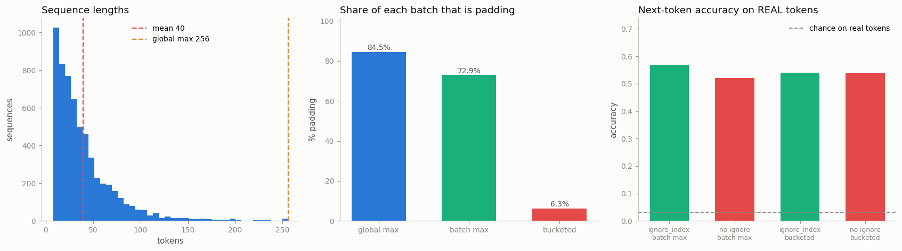

# Custom Collate

---

> A batch is not just a pile of samples — something has to stack them, and you get to decide how.

---

## Key Insight

A [collate function](/shared/glossary/#collate-function) is the step that combines a list of individual samples into one batched tensor. The default one assumes every sample is the same size; a custom collate function lets you handle variable-length data by [padding](/shared/glossary/#padding) each sample up to the longest one in the batch.

## Why This Matters

Text, audio, and other sequence data rarely come in equal lengths. A custom collate function is what makes batching such data possible at all, and padding per-batch (instead of to one global maximum) avoids a lot of wasted computation.

---

**This is project 19.** [Project 18](../18-naive-vs-optimized-loader/README.md)
measured how fast samples arrive. This one is about what happens to them
*after* they arrive and *before* the model sees them — the two lines of code
that turn `[sample, sample, …]` into `(x, mask, y)`. Those two lines decide how
much of your compute is spent on nothing, and they are where two of the most
common silent bugs in sequence modelling live.

What `run.py` finds:

- padding to a global maximum makes **84.5% of every batch padding**; padding to
  the batch maximum makes it 72.9%; length [bucketing](/shared/glossary/#bucketing)
  makes it **6.3%**
- that converts to real time: one training epoch takes **17.0 s, 10.4 s, and
  3.4 s** on *identical* data — bucketing is **5× faster** for free
- forgetting `ignore_index=PAD` in the loss makes the reported accuracy jump from
  0.286 to **0.906** while accuracy on real tokens *falls* from 0.569 to 0.521 —
  a number that looks three times better and is worse
- that damage is **proportional to the padding**: with bucketed batches the same
  bug costs 0.003 instead of 0.048
- `h[:, -1]` with right padding scores **0.659** where the correct gather scores
  0.997 — and **0.233** when the padding gets longer. Same code, same data, the
  failure appears only when batch composition changes
- moving expensive work into `collate_fn` gets it parallelized for free
  (**3.34 s → 1.75 s**), but on cheap collate the workers cost **6×**

---

## Files

| file | what it is |
|---|---|
| `run.py` | the dataset, four collate functions, and six experiments |
| `outputs/findings.csv` | every number quoted here |
| `outputs/collate.png` | the three figures |

```bash
python3 run.py     # ~6 min; needs torch, numpy, matplotlib
```

---

## The data

6000 synthetic token sequences with log-normally distributed lengths: 8 to 256
tokens, mean 40, a long thin tail. That shape is deliberate — real text, audio
and log data all look like this, and it is exactly the shape that makes padding
expensive. (A *log-normal* distribution is what you get when a quantity is
built by multiplying random factors rather than adding them. In plain terms:
most things are short, a few are enormous, and the mean sits well below the
maximum.)



Each sequence carries two kinds of signal, because the project needs two
different tasks:

- **a proportion signal** — each class over-draws its own eight token ids, so
  the sequence's class is readable from *which* tokens appear
- **a local signal** — 65% of the time the next token is the previous one
  advanced by a class-specific step, so *next-token prediction* is learnable

---

## 1. What the default collate does

```
RuntimeError: stack expects each tensor to be equal size,
              but got [32] at entry 0 and [98] at entry 1
```

`default_collate` sees a list of tensors and calls `torch.stack`. Stacking
requires identical shapes. That is the whole story — there is no clever fallback,
no automatic padding, and (usefully) no silent truncation. It fails loudly, which
is the best behaviour it could have.

Give it equal-length samples and it works fine:
`[(len-16 tensor, label), (len-16 tensor, label)] → shape (2, 16)`.

So a custom `collate_fn` is not an optimization. For ragged data it is the
difference between running and not running.

---

## 2. Three padding strategies, and what they cost

| strategy | what it pads to | token slots per epoch | padding | one training epoch |
|---|---|---|---|---|
| global max | 256, always | 1 531 904 | **84.5%** | **17.04 s** |
| batch max | the longest sequence in *this* batch | 877 536 | 72.9% | 10.39 s |
| bucketed | batch max, after grouping similar lengths | 250 848 | **6.3%** | **3.38 s** |

Same 6000 sequences, same model, same number of batches. Only the shape of the
tensors changed, and the epoch got **5× faster**.

**Why global-max padding is so bad here.** The mean length is 40 and the maximum
is 256. Padding everything to 256 means the average sequence is 84% air, and the
model computes on that air exactly as hard as it computes on real tokens. A GRU
does not know which timesteps are meaningless; it runs all 256 of them.

**Why batch-max is better but not good.** Each batch is padded to its own longest
member. With 32 random samples from a long-tailed distribution, *some* batch
member is usually long, so the batch maximum stays high — 73% is still air. One
outlier drags the whole batch up.

**Why bucketing works.** Sort by length before batching, and long sequences sit
with long sequences. The `BucketBatchSampler` in `run.py` does this in three
steps:

1. shuffle all indices
2. inside a window of 50 batches (1600 samples), sort by length and cut into
   batches — so each batch is nearly square
3. shuffle the *order of the batches*

> **"If sorting is what helps, why the two shuffles?"** Because a fully sorted
> epoch is not a valid training epoch. Every batch would contain the same
> lengths in the same order every time, and — since length correlates with
> content in real data — batches would become systematically different from each
> other rather than being random samples of the dataset. [Stochastic gradient
> descent](/shared/glossary/#sgd) assumes each batch is an unbiased sample of
> the data; sorted batches break that assumption, and the model sees a curriculum
> nobody designed. The window (step 2) keeps sorting *local* so lengths still get
> mixed across the epoch, and step 3 stops the model from seeing short batches
> first every epoch. Bucketing is a deliberate trade: **a little randomness
> given up, most of the padding removed.**

Note that steps 1-3 happen in a **`batch_sampler`**, not in the collate function.
The two do different jobs: a [sampler](/shared/glossary/#sampler) decides *which
indices go together*; a collate function decides *what to do with the samples
once chosen*. Bucketing needs to change the grouping, so it has to live in the
sampler — no collate function can help, because by then the batch is already
picked.

---

## 3. The mask, where it actually bites: the loss

The mask is not there to make pooling neat. It is there because **the padding
positions are also training targets**, and predicting padding is trivially easy.

Next-token prediction on the same sequences, `CrossEntropyLoss` with and without
`ignore_index=PAD`:

```
                                  accuracy over     accuracy over
                                  ALL positions     REAL tokens
  ignore_index    @ batch max         0.286            0.569
  no ignore_index @ batch max         0.906            0.521
  ignore_index    @ bucketed          0.206            0.541
  no ignore_index @ bucketed          0.909            0.538
```

Read row 2 carefully. A script that forgets `ignore_index` prints **0.906** and
looks like it is doing beautifully. The model is doing *worse*: on the tokens you
actually care about it scores 0.521 against 0.569.

Where does 0.906 come from? 73% of the positions are padding, and "after a pad
comes another pad" is a rule the model learns in the first few dozen steps. The
metric is measuring how well the model can predict a constant. Meanwhile the
`ignore_index` row prints 0.286 — because it never learned that easy rule at all,
which is exactly what you asked for.

> **What `ignore_index` does.** `nn.CrossEntropyLoss(ignore_index=PAD)` drops
> those positions from the loss *and* from the denominator — they contribute no
> gradient and do not dilute the average. PyTorch's default is `-100`, a value
> chosen because no real class id is ever negative, so the default means "ignore
> nothing".

Two things follow, and the second is the one people miss:

1. **The reported number is corrupted.** Any per-token metric averaged over
   padded positions is mostly measuring your padding ratio.
2. **The model is corrupted too.** 73% of every gradient step was spent learning
   the pad rule. That is capacity and [learning rate](/shared/glossary/#learning-rate)
   spent on nothing, which is why real-token accuracy fell.

And the interaction with section 2 is the nicest result here: **bucketing shrinks
the bug.** With 6.3% padding instead of 72.9%, forgetting `ignore_index` costs
0.003 instead of 0.048. That is a warning, not a fix — it means the bug's
severity depends on your batching, so it can hide during development on short
sequences and reappear when someone adds a long document to the corpus.

---

## 4. `h[:, -1]` — the bug that waits for you

A very common line in sequence code is "take the last hidden state as the summary
of the sequence":

```python
h, _ = self.gru(self.emb(x))
pooled = h[:, -1]            # looks right. is right, for unpadded data.
```

With **right** padding, position `-1` is the state after the model has processed
`T - len` padding tokens. The correct version indexes each row at its own real
length:

```python
idx = (lengths - 1).view(-1, 1, 1).expand(-1, 1, h.size(-1))
pooled = h.gather(1, idx).squeeze(1)
```

Classification accuracy, four classes, chance = 0.25:

```
  right-pad, gathered_last @ batch max     0.997
  right-pad, last_timestep @ batch max     0.659
  right-pad, gathered_last @ global max    0.997
  right-pad, last_timestep @ global max    0.233     <- at chance
  left-pad,  last_timestep @ batch max     0.996     <- same buggy line, correct answer
```

This table is why the bug is dangerous rather than merely wrong:

- with batch-max padding it scores **0.659** — clearly degraded, but not
  obviously broken. Plenty of people ship this and blame the model.
- with more padding it collapses to **0.233, i.e. chance**. Nothing in the code
  changed. Only the *shape* of the batches did.
- **switch to left padding and the same buggy line becomes correct** (0.996),
  because now position `-1` really is the last real token.

The reason it degrades gradually instead of failing outright: a [GRU](/shared/glossary/#gru)
carries its hidden state forward, so after a few pad steps it still roughly
remembers the sequence. After 200 pad steps it does not. **The bug's visibility
is proportional to how much padding you have** — the same pattern as section 3,
and the same lesson: *bugs that scale with padding are invisible in unit tests
with three short examples.*

> **"Isn't `padding_idx=0` supposed to handle this?"** No, and the distinction
> matters. `nn.Embedding(..., padding_idx=0)` guarantees that *row 0 of the
> embedding table is all zeros and its gradient stays zero* — section 6 verifies
> both. That controls what a pad **means as an input**. It says nothing about
> what your model **does with the positions**: a GRU still runs a timestep on a
> zero vector and still updates its state, `h[:, -1]` still points at the last
> column, and cross-entropy still scores pad targets. `padding_idx` covers one
> of the three places padding leaks; the mask and `ignore_index` cover the other
> two.

---

## 5. Where the collate function runs

`collate_fn` executes **inside the worker process**, not in the main loop. So
per-batch work you put there is parallelized along with `__getitem__`.

```
  cheap collate      num_workers=0   0.10 s per epoch
  cheap collate      num_workers=4   0.61 s per epoch    <- 6x WORSE
  expensive collate  num_workers=0   3.34 s per epoch
  expensive collate  num_workers=4   1.75 s per epoch    <- 1.9x better
```

The cheap collate is just padding: microseconds per batch. Four workers add
process startup and the cost of shipping every batch tensor between processes,
and that overhead is many times the work being parallelized — the same "workers
cost something" effect [project 18](../18-naive-vs-optimized-loader/README.md)
measured on the in-RAM suite, only more extreme because collate output is bigger
than collate input here.

The expensive collate (an n-gram counting loop) is real work, and four workers
nearly halve it. Not 4×, because the batches still have to be pickled and sent
back, and that part cannot be parallelized away.

**The practical rule:** batch-level preprocessing belongs in `collate_fn`
*if* it is expensive enough to be worth a process boundary. Padding is not.

---

## 6. `padding_idx`, verified

```
  padding_idx=0: row 0 is all-zero -> True
  after a backward pass, grad of row 0 is all zero -> True, row 3 is not -> True
```

Two properties, and they are separate:

- **initialized to zero** — so a pad token contributes a zero vector, which is
  what makes an unmasked sum ignore pads (an unmasked *mean* still divides by
  the wrong number, which is why sums are safer than means here)
- **frozen at zero** — the gradient for that row is zeroed on every backward
  pass, so it never drifts away from zero during training

Without `padding_idx`, row 0 would be a normal trainable vector, and since it
appears in 73% of your positions it would receive an enormous share of the
gradient — the model would spend real capacity learning a representation for
"nothing here".

**And if your pad id collides with a real token** — say you pick `pad_id = 1`
and token 1 is the word "the" — nothing raises. The model simply cannot
distinguish "the" from "end of sequence", and both `padding_idx` and
`ignore_index` will now silently destroy your real token as well. Reserve id 0
(or one past the end of your vocabulary) and never reuse it.

---

## Things to try

- **Change `pool` in `BucketBatchSampler`** from 50 to 2 and to 500. Padding
  waste falls with the window size while batch diversity falls too — plot both
  and pick your own trade-off.
- **Use `torch.nn.utils.rnn.pad_sequence`** instead of the hand-written loop.
  Same result, one line — but write it by hand once so you know what it does.
- **Try `pack_padded_sequence` / `pad_packed_sequence`** with the GRU. That is
  the RNN-specific fix that makes the padded timesteps genuinely free, and it
  makes `h[:, -1]` correct as a side effect.
- **Make the length distribution *uniform*** instead of log-normal and re-run
  section 2. Bucketing's advantage mostly evaporates: it pays off in proportion
  to how skewed your lengths are.
- **Add `mask` to an attention model** (`attn_mask` / `key_padding_mask`) and
  check what happens without it — [softmax](/shared/glossary/#softmax) over
  pad positions puts real probability mass on nothing, which is the attention
  version of section 3's bug.

---

## What to take away

1. `default_collate` **raises** on ragged input. For sequences a custom
   `collate_fn` is not tuning, it is a requirement.
2. **Pad to the batch maximum, not a global maximum** — 84.5% → 72.9% padding
   here, and one line of code.
3. **Bucket by length** and it drops to 6.3%, making the epoch **5× faster** on
   identical data. Bucketing lives in a `batch_sampler`, not in collate.
4. Bucketing costs you a little batch randomness. Shuffle inside a window and
   shuffle the batch order to give back as little as possible.
5. **`ignore_index=PAD` is not cosmetic.** Without it the reported accuracy rose
   from 0.286 to 0.906 while real-token accuracy *fell* — the metric measured
   the padding ratio.
6. The damage scales with the padding fraction (0.048 at 73% padding, 0.003 at
   6%), so **less padding also means fewer opportunities for the mask bug**.
7. **`h[:, -1]` with right padding is a silent bug**: 0.659 with moderate
   padding, **0.233 (chance)** with more, 0.997 when gathered correctly.
   Left padding makes the identical line correct.
8. `padding_idx` zeroes the pad embedding *and* keeps its gradient at zero — but
   it fixes only the input, not the loss and not your pooling.
9. `collate_fn` runs in the worker: expensive batch work there gets parallelized
   (**1.9×**), while adding workers for cheap collate costs **6×**.

---

Next: [project 20](../20-weighted-sampler/README.md) moves one step earlier in
the pipeline — the [sampler](/shared/glossary/#sampler), which decides *which*
indices end up in a batch in the first place.
