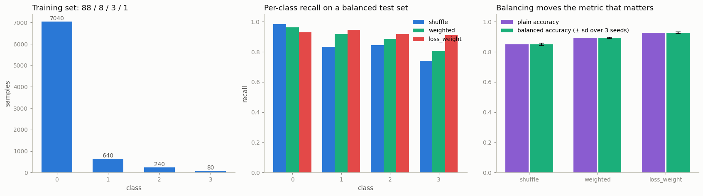

# Weighted Sampler

---

> If 99% of your data is one class, random batches teach the model just one trick: always guess that class.

---

## Key Insight

A [sampler](/shared/glossary/#sampler) decides the order in which a [DataLoader](/shared/glossary/#dataloader) visits examples. A `WeightedRandomSampler` gives each example its own sampling probability, so you can draw rare classes more often and build balanced batches from an imbalanced dataset.

## Why This Matters

On imbalanced data, a model can reach high accuracy by always predicting the majority class while learning nothing useful. Balanced sampling forces the model to see minority classes often enough to actually learn them.

---

**This is project 20.** [Project 19](../19-custom-collate/README.md) decided what
to do with a batch once its members were chosen. This one decides **who gets
chosen**, on a dataset split 88 / 8 / 3 / 1 across four classes.

What `run.py` finds:

- balanced sampling lifts [balanced accuracy](/shared/glossary/#balanced-accuracy)
  from **0.850 to 0.893**, about 5× the seed-to-seed spread — a real effect
- but the one-line alternative, **weighting the loss, wins outright at 0.926**.
  The project's headline technique loses to the thing it is usually compared
  against
- balancing is not free: on a test set with the *deployment* class mix, plain
  accuracy drops **0.967 → 0.913** and the rare class's
  [precision](/shared/glossary/#precision-and-recall) collapses **0.762 → 0.415**
  while its recall goes to **1.000**
- the classic silent bug — passing **4** weights instead of **8000** — trains on
  exactly **four samples**, all of one class, scores chance (0.250), and raises
  nothing
- `replacement=False` makes `WeightedRandomSampler` **ignore your weights
  entirely**: identical class counts to plain shuffling
- a balanced epoch shows each of the 80 rarest samples **24.8 times**
- forgetting `DistributedSampler.set_epoch()` gives every epoch the **identical**
  order — verified `True`

---

## Files

| file | what it is |
|---|---|
| `run.py` | the dataset, four sampling strategies, six experiments |
| `outputs/findings.csv` | every number quoted here |
| `outputs/weighted_sampler.png` | the three figures |

```bash
python3 run.py     # ~25 s; needs torch, numpy, matplotlib
```

---

## 1. The dataset, and the number that lies

```
  class 0:  7040 samples  (88.00%)
  class 1:   640 samples  ( 8.00%)
  class 2:   240 samples  ( 3.00%)
  class 3:    80 samples  ( 1.00%)
```



A model that outputs "class 0" for every input, without looking, scores **0.880**
on this distribution. That is the number the naive training script prints, and it
is why accuracy is close to useless under
[class imbalance](/shared/glossary/#class-imbalance).

So the project uses two test sets, and the difference between them is the whole
argument:

- a **balanced** test set — 500 of each class. Here the always-class-0 model
  scores 0.250, i.e. chance. Accuracy on this set is a real measure of skill.
- a **skewed** test set — the same 88/8/3/1 mix as training, i.e. what
  deployment actually looks like.

The headline metric is **balanced accuracy**: the *mean of the per-class
recalls*, so each class contributes equally no matter how rare it is. On a
balanced test set it happens to equal plain accuracy; on the skewed test set the
two come apart, and that gap is the interesting part.

> **"Why bother with a balanced test set if I already have a balanced sampler?"**
> They answer different questions and neither replaces the other. The sampler
> changes *what the model is trained on*; the test set changes *what you are
> allowed to conclude*. A balanced sampler evaluated on a skewed test set will
> look worse than doing nothing (section 3 shows exactly that), and a skewed
> sampler evaluated on a skewed test set will look great while missing every rare
> case. You need both views to see the trade at all.

---

## 2. Three strategies

Everything below trains the identical MLP, for the identical number of steps, on
the identical data. Only *who appears in the batches*, or *how much each sample
counts in the loss*, changes. Three seeds each.

```
  strategy        accuracy   balanced acc   macro F1    per-class recall
  shuffle            0.851          0.850      0.857    0.98 0.83 0.85 0.74
  weighted           0.893          0.893      0.895    0.96 0.92 0.89 0.81
  loss_weight        0.926          0.926      0.927    0.93 0.95 0.92 0.91

  seed-to-seed sd:   shuffle 0.0085,  weighted 0.0047,  loss_weight 0.0050
```

("Macro F1" = the [F1 score](/shared/glossary/#f1-score) computed separately for
each class and then plain-averaged. *Macro* means "each class counts once",
as opposed to *micro*, which counts each sample once and therefore lets the
majority class dominate again.)

Read the recall column left to right and the story is legible: plain shuffling is
excellent on class 0 (0.98) and poor on class 3 (0.74). Balanced sampling gives
up 0.02 on the majority class to gain 0.07 on the rarest. Loss weighting goes
further in the same direction.

**The differences are real.** The seed-to-seed standard deviation is ~0.005, and
the gaps are 0.043 and 0.033 — roughly 6-8 standard deviations. This matters
because most published "improvements" of this size are not checked against seed
noise at all; here we have three seeds and can say the effect exists.

### The honest inversion: loss weighting wins

This project is about `WeightedRandomSampler`, and `WeightedRandomSampler` came
second. Both methods aim at the same target — make the rare classes count more —
but they get there differently, and the difference explains the result:

| | how it works | side effects |
|---|---|---|
| `WeightedRandomSampler` | draws rare samples **more often** | the same 80 rare rows repeat ~25×/epoch; the majority class is **subsampled**, so some of its data is never seen in a given epoch |
| `CrossEntropyLoss(weight=…)` | sees every sample **exactly once**, multiplies the rare ones' loss | no data discarded, no duplication — but each rare gradient is larger, which is noisier |

Sampling throws information away. In one balanced epoch the sampler draws about
1980 of the 7040 majority samples — the rest of that class simply does not appear
that epoch. Loss weighting keeps all 8000 rows and adjusts their influence.
On this dataset, keeping the data wins.

That is not a universal law, and the cases where sampling wins are worth naming:
when the "rare" thing is not a label but an expensive property (a slow decode, a
different data source, a different shard), when the imbalance is so extreme that
weights would become numerically enormous, or when the loss is not a simple
per-sample sum you can reweight — [contrastive](/shared/glossary/#contrastive-learning)
losses, for instance, depend on *what else is in the batch*, so only the sampler
can change them.

---

## 3. What balancing costs

The same three models, evaluated on the **skewed** test set — the class mix they
would actually meet in production:

```
  strategy       plain acc   balanced acc   recall c3   precision c3   predicted share c3
  shuffle            0.967          0.850       0.617          0.762                0.008
  weighted           0.946          0.885       0.717          0.617                0.012
  loss_weight        0.913          0.955       1.000          0.415                0.025
```

The true share of class 3 in this test set is **0.010**. Read the last column:

- plain shuffling predicts class 3 for 0.8% of inputs — it is slightly
  *under*-eager, and misses 38% of the real cases
- loss weighting predicts it for 2.5% — **two and a half times too often**

That over-eagerness is the price. Loss weighting catches **every single** class-3
example (recall 1.000), but only **41.5%** of the things it calls class 3 really
are (precision 0.415). Balancing did not make the model better at class 3; it
moved the model's **implied prior** — its background belief about how common each
class is — away from the truth, deliberately.

Whether that is a good trade is not a machine-learning question:

- **medical screening, fraud, safety alerts** — a missed case costs far more than
  a false alarm that a human then dismisses. Take recall 1.000 and live with the
  false positives.
- **an auto-moderation system that deletes posts** — every false positive is a
  wrongly punished user. The 0.415 precision is unacceptable and plain shuffling
  is the better model.

There is also a cheaper knob for exactly this: leave sampling alone, keep the
plain model, and **move the decision threshold** at the end instead of the class
prior during training. That sweeps the same recall/precision curve without
retraining, and it is the first thing to try before reaching for a sampler.

---

## 4. The bug: four weights instead of eight thousand

```python
counts = np.bincount(y)                  # [7040, 640, 240, 80]
w = torch.as_tensor(1.0 / counts)        # length 4  ← looks so reasonable
sampler = WeightedRandomSampler(w, num_samples=len(y), replacement=True)
```

```
  weights tensor length : 4   dataset length: 8000
  distinct indices drawn: 4  -> [0, 1, 2, 3]
  classes actually seen : {0: 8000}
  training on it: accuracy 0.250, balanced accuracy 0.250, recall [1.0, 0.0, 0.0, 0.0]
```

`WeightedRandomSampler` samples **indices from `range(len(weights))`**. Four
weights means it can only ever return indices 0, 1, 2 and 3 — the first four rows
of your dataset. Everything else is unreachable. The model trains on four
examples for eight epochs, learns to always say class 0, and scores exactly
chance on the balanced test set.

No exception. No warning. The loss curve even goes down, beautifully, because
memorizing four points is easy.

The fix is one indexing step — turn a **per-class** table into a
**per-sample** list:

```python
w = torch.as_tensor((1.0 / counts)[y])   # length 8000  ← one weight per row
```

**Why does the API not just take class weights?** Because the sampler does not
know what a class *is*. It never sees your labels; it only sees a list of
numbers, one per index. That generality is what lets you weight by anything —
sequence length, image quality, source dataset, how recently a sample was
misclassified — and the price of it is that the length has to be *your* job.

**The defence** is a single assertion, worth writing every time:

```python
assert len(weights) == len(dataset), (len(weights), len(dataset))
```

---

## 5. `replacement` and `num_samples`

```
  replacement=True    distinct indices 2668/8000   class counts [1980, 2063, 1970, 1987]
  replacement=False   distinct indices 8000/8000   class counts [7040,  640,  240,   80]
```

The second row is the trap. With `replacement=False` and
`num_samples=len(dataset)`, the sampler must return every index exactly once —
so the class counts come out **identical to plain shuffling**. Your weights
changed nothing except the order. It is a silent no-op, and it looks like a safe,
conservative setting.

"Sampling with replacement" means a drawn item is **put back** before the next
draw, so it can come up again. Without replacement, each item leaves the pool
once drawn. Balancing *requires* replacement — there are only 80 rare rows and a
balanced epoch needs ~2000 draws from that class, which is impossible if each row
can be used once.

Two consequences of `replacement=True`, both visible above:

- **only 2668 of 8000 distinct rows appear** in an epoch. The majority class is
  being thrown away as surely as the rare class is being duplicated.
- **each of the 80 rarest rows is seen ~24.8 times per epoch.** The model gets
  25 chances to memorize each one, which is a fast route to
  [overfitting](/shared/glossary/#overfitting) the minority class — the failure
  mode balancing is supposed to prevent, arriving from the other direction.
  Strong [data augmentation](/shared/glossary/#data-augmentation) on the rare
  class is the usual counter.

`num_samples` is a free parameter and does not have to be `len(dataset)`. Setting
it to `4 × (size of smallest class) = 320` gives a short, balanced epoch
(`[84, 71, 71, 94]`) that duplicates almost nothing — the "undersample the
majority" strategy. Same sampler, opposite trade: less duplication, less data.

---

## 6. Two API traps

```
  sampler + shuffle=True -> ValueError: sampler option is mutually exclusive with shuffle
```

A good error. `shuffle=True` *is* a sampler (`RandomSampler` under the hood), so
asking for both is asking for two different orderings at once. This is the one
mistake in the project that PyTorch catches for you.

```
  DistributedSampler(4 ranks): each rank gets 2000 indices,
                               union covers 8000/8000, pairwise overlap 0
  epoch 1 without set_epoch: identical order to epoch 0 -> True
  epoch 1 with    set_epoch: identical order to epoch 0 -> False
```

`DistributedSampler` is what makes multi-GPU training correct: it cuts the
dataset into *disjoint* pieces, one per process, so no sample is trained on twice
per epoch. Verified above — 4 × 2000 = 8000, zero overlap. (When the dataset does
not divide evenly it pads by repeating a few indices, so every process gets the
same number of batches; unequal batch counts would deadlock the gradient sync.)

The trap is the second half. Each process has to shuffle *the same way* as the
others, or the pieces would overlap — so the shuffle is derived from a seed plus
an epoch number that you must set by hand:

```python
for epoch in range(epochs):
    sampler.set_epoch(epoch)     # ← forget this and every epoch is identical
    for batch in loader: ...
```

Forget it and the epoch counter stays at 0 forever: **the same order, the same
batch composition, every epoch** — measured as `True` above. Training still runs,
loss still falls, and you quietly lose the regularizing effect of reshuffling.
It is the distributed cousin of the seeding bugs in
[project 17](../17-reproducible-training/README.md), and just as invisible.

---

## Things to try

- **Sweep the imbalance** from 50/30/15/5 to 97/2/0.9/0.1 and plot the gap
  between the three strategies. The sampler's advantage over doing nothing grows
  with skew; its disadvantage against loss weighting may not.
- **Threshold moving instead of resampling**: train once with plain shuffling,
  then divide each class's [logit](/shared/glossary/#logits) by its training
  frequency at test time. Compare the recall/precision curve to section 3's.
- **Combine both** — a weighted sampler *and* a weighted loss. The weights
  multiply, so the effective imbalance correction is applied twice; check whether
  that helps or overshoots.
- **Weight by something that is not a label** — sequence length, or "how wrong
  the model was last epoch" (a poor man's hard-example mining). This is where
  the sampler's generality earns its keep.
- **Break it deliberately**: set `replacement=False` with a weighted sampler and
  confirm the class counts are unchanged. Then add the `assert` from section 4
  and confirm it catches the 4-weight bug.

---

## What to take away

1. On imbalanced data, **plain accuracy measures your class prior**, not your
   model. 0.880 here for a model that does nothing.
2. Evaluate on **both** a balanced and a deployment-mix test set. One shows
   skill, the other shows what users get.
3. `WeightedRandomSampler` works: balanced accuracy **0.850 → 0.893**, ~6× the
   seed noise.
4. **Weighting the loss worked better (0.926)** — it keeps every sample instead
   of subsampling the majority. Try the one-line version before the sampler.
5. Balancing **buys recall with precision**: class 3 recall 0.617 → 1.000,
   precision 0.762 → 0.415. Whether that is progress depends on your application,
   not on the numbers.
6. **Weights are per-sample, not per-class.** Getting it wrong trains on four
   rows, scores chance, and raises nothing. `assert len(weights) == len(dataset)`.
7. **`replacement=False` silently disables your weights** when
   `num_samples == len(dataset)`.
8. A balanced epoch shows each rare row **~24.8 times** and hides 2/3 of the
   majority class. Duplication is not free — pair it with augmentation.
9. `sampler` and `shuffle=True` are mutually exclusive, and PyTorch says so.
10. **Call `DistributedSampler.set_epoch(epoch)`** or every epoch is the same
    epoch.

---

Next: [project 21](../21-streaming-webdataset/README.md) leaves map-style
datasets behind. When the data does not fit on your disk, you cannot index it —
you can only stream it, and `__getitem__` stops being available at all.
