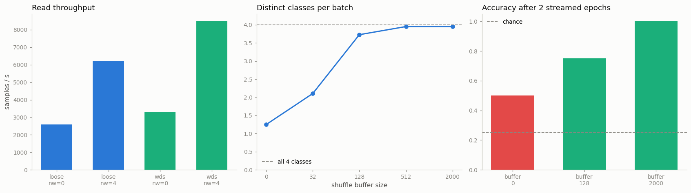

# Streaming WebDataset

---

> You don't need the whole dataset on disk — you just need the next batch, right now.

---

## Key Insight

[WebDataset](/shared/glossary/#webdataset) reads training data straight from `.tar` archives as a stream, one sample after another, instead of unpacking millions of files first. The archives are split into [shards](/shared/glossary/#sharding) so many workers — and many machines — can each read a different piece in parallel.

## Why This Matters

At large scale, storing and opening millions of tiny files is slow and sometimes impossible. Streaming sharded archives lets you train on datasets far bigger than your local disk, reading them directly from cloud storage.

---

**This is project 21.** Projects 18-20 all assumed a *map-style* dataset: one
that answers `len(dataset)` and `dataset[i]`. Streaming gives that up. You can no
longer ask for sample 4 712 — you can only ask for *the next sample*. This
project builds the same 4000 images twice, as 8000 loose files and as 8 `.tar`
shards, and measures exactly what that trade buys and costs.

What `run.py` finds:

- streaming is only **1.27× faster** end to end on this machine — but the
  file-open work behind it is **84× cheaper** (243.5 ms → 2.9 ms) and touches
  **1000× fewer** filesystem entries
- turn off the worker splitter and 4 workers each read **the whole dataset**:
  a "4000-sample epoch" yields **16 000 samples, every sample 4 times**
- with 12 workers and 8 shards, **4 workers get nothing at all**
- streaming can only shuffle a *window*: with no shuffle buffer a batch of 32
  contains **1.25 distinct classes** out of 4, and the model reaches **0.500**
  accuracy — with a 2000-sample buffer it is **3.95** classes and **1.000**
- `len(dataset)` raises `TypeError`, `dataset[0]` raises `NotImplementedError`,
  and the "epoch length" becomes something you *declare*, not something that
  exists

---

## Files

| file | what it is |
|---|---|
| `run.py` | writes both corpora, runs all four experiments |
| `outputs/findings.csv` | every number quoted here |
| `outputs/webdataset.png` | the three figures |

```bash
pip install webdataset
python3 run.py     # ~1 min; needs torch, numpy, matplotlib, Pillow, webdataset
```

`data/` is written once and reused. It holds 22.6 MB of actual data and occupies
**46 MB** of disk — because each of the 8000 loose files takes a whole 4 KB
filesystem block whether it needs one or not. That gap is the same
small-file problem this project is about, showing up before training even
starts. (`data/` is gitignored.)

---

## What a WebDataset shard actually is

A shard is a **plain `.tar` file**. No index, no database, no custom format —
`tar tf train-0000.tar` lists it and `tar xf` unpacks it. The only convention is
this: **consecutive members that share a basename are one sample.**

```
000000.jpg   000000.cls   000001.jpg   000001.cls   000002.jpg   000002.cls
└────── sample 0 ──────┘  └────── sample 1 ──────┘  └────── sample 2 ──────┘
```

The extension becomes the field name, so the reader hands you
`{"jpg": b"...", "cls": b"2"}` and you decode each field however you like. That
is the entire specification, and it is why the format needs no library to write
and no migration to read in five years.

The reason it must be *consecutive* is the whole point of the format: the reader
is only allowed to move **forward**. It cannot seek back to collect a label it
passed earlier, because on a network stream seeking backwards means re-issuing
the request.



---

## 1. Speed: an honest, underwhelming number

```
  loose files, num_workers=0    1.55 s    2585.4 samples/s
  loose files, num_workers=4    0.64 s    6217.5 samples/s
  tar shards,  num_workers=0    1.22 s    3289.2 samples/s
  tar shards,  num_workers=4    0.47 s    8480.8 samples/s
```

1.27× single-process, 1.36× with four workers. Real, but hardly the argument the
format is famous for.

**Why so small here, and why it is much larger in production.** These 8000 files
sit on a local SSD and were written seconds ago, so they are all in the operating
system's *page cache* — already in RAM. Opening a file that is in cache is cheap.
The measurement is therefore a best case *for the loose files*.

The part that does not depend on the cache:

```
  open+read 8000 loose files :   243.5 ms   (30.4 us each)
  open+read 8 tar shards     :     2.9 ms
  -> 84x more time in file-open overhead alone, and 1000x more filesystem lookups
```

Every `open()` costs a path lookup, a permission check and an inode read,
**whether or not the data is cached**. That fixed per-file cost is what
tar-packing removes, and it is the cost that grows when the files are not
local:

| where the data lives | cost of one `open()` |
|---|---|
| local SSD, page cache warm | ~30 µs (measured above) |
| local SSD, cold | ~0.1-1 ms |
| network filesystem (NFS/Lustre) | ~1-10 ms |
| object storage (S3/GCS) — one HTTP request per file | ~20-100 ms |

At the bottom of that table, 8000 files means 8000 HTTP round trips and the job
is entirely latency-bound. Eight sequential reads of a 2 MB tar is a completely
different workload. **The 1.27× here is the floor of the benefit, measured in
the setting least favourable to streaming.**

One number goes the other way and is worth being honest about: the tar corpus is
**14.50 MB against 8.08 MB** of loose files. Tar pads every member to a 512-byte
boundary and adds a 512-byte header, which is pure overhead for tiny files. For
48×48 JPEGs that nearly doubles the bytes; for realistic 100 KB images it is
under 1%.

---

## 2. Sharding: the bug that duplicates your dataset

An [IterableDataset](/shared/glossary/#iterabledataset) does not get index ranges
handed to it. Each worker process runs *the same iterator code*, so unless
something tells worker 2 to skip what worker 1 is reading, **every worker reads
everything**:

```
  split_by_worker (default)  yielded  4000 samples for a 4000-sample epoch  (1.0x)
  workersplitter=None        yielded 16000 samples for a 4000-sample epoch  (4.0x)
```

Four workers, four copies of every sample, in the same epoch. Nothing raises.
Training gets slower per unit of learning, the effective batch composition is
wrong, and your held-out set — if it is streamed the same way — is being counted
four times.

Modern `webdataset` defaults to `workersplitter=split_by_worker`, so this is
handled for you; the version above had to be *asked* for the bug. Two reasons to
know it anyway: older versions did not default it, and **the moment you write
your own `IterableDataset` you own this problem**. The hand-written version is:

```python
class MyStream(torch.utils.data.IterableDataset):
    def __iter__(self):
        info = torch.utils.data.get_worker_info()
        shards = self.shards if info is None else self.shards[info.id::info.num_workers]
        for shard in shards:
            yield from read(shard)
```

There are **two** levels of splitting, and they compose: `split_by_node` divides
shards among machines in a distributed job, then `split_by_worker` divides one
machine's share among its worker processes. Miss either and you duplicate by the
factor you missed.

### Shards are the unit of parallelism, so their count matters

```
   2 workers -> [2000, 2000]
   3 workers -> [1500, 1500, 1000]
   5 workers -> [1000, 1000, 1000, 500, 500]
  12 workers -> [500, 500, 500, 500, 500, 500, 500, 500, 0, 0, 0, 0]   4 workers got NOTHING
```

A shard cannot be split, so a worker gets a whole number of shards. With 8 shards
and 3 workers the busiest worker does **50% more** work than the quietest, and
the epoch cannot finish faster than that worker. With 12 workers, four processes
are started, allocated memory, and given nothing to do.

The practical rule is **many more shards than workers** — make
`num_shards` a multiple of `num_workers × num_nodes`, and aim for hundreds or
thousands of shards of ~100 MB-1 GB each. Then the imbalance is one shard out of
dozens instead of one out of two.

> **Why this is worse than it looks in a multi-GPU job.** In
> [DDP](/shared/glossary/#ddp), every process must run the *same number* of
> optimizer steps, because each step waits for all the others' gradients. A rank
> that runs out of data early stops sending gradients, and the remaining ranks
> wait forever — the job does not crash, it **hangs**. That is why streaming
> pipelines usually declare a fixed epoch length (`.with_epoch(n)`, section 4)
> instead of trusting the shards to divide evenly.

---

## 3. The shuffle buffer: shuffling something you cannot see

A map-style loader shuffles by permuting indices — it can put sample 3 999 next
to sample 12 because it can *ask for* either one. A stream cannot. All it can do
is keep a **buffer** of the last *k* samples it read, emit a random one, and
refill from the stream. The reachable "distance" of the shuffle is the buffer
size, and nothing more.

That matters because real shards are not randomly ordered. A shard is usually
one crawl batch, one source, or one category, so nearby samples are correlated.
The corpus here mimics that: inside each shard, classes appear in blocks of 125.

```
  shuffle buffer 0      mean distinct classes per batch of 32: 1.25   (max 4)
  shuffle buffer 32     mean distinct classes per batch of 32: 2.10
  shuffle buffer 128    mean distinct classes per batch of 32: 3.73
  shuffle buffer 512    mean distinct classes per batch of 32: 3.95
  shuffle buffer 2000   mean distinct classes per batch of 32: 3.95
```

With no buffer, a batch of 32 is essentially **one class**. And that is not a
cosmetic problem:

```
  shuffle buffer 0      test accuracy after 2 epochs: 0.500
  shuffle buffer 128    test accuracy after 2 epochs: 0.750
  shuffle buffer 2000   test accuracy after 2 epochs: 1.000
```

(Accuracy moves in steps of 0.25 because the test set has four equal classes and
this task is easy — 0.500 means the model learned **two of the four classes** and
gets the others wrong essentially always.)

Single-class batches break training in two ways at once:

- **the gradient points the wrong way.** A batch of all-class-2 makes "always
  predict 2" the locally optimal answer, so each step over-corrects toward
  whatever class is in front of it and the next batch undoes it. [SGD](/shared/glossary/#sgd)
  assumes each batch is a small unbiased sample of the data; here every batch is
  biased, and in a different direction each time.
- **normalization layers see the wrong statistics.**
  [Batch normalization](/shared/glossary/#batch-normalization) computes the mean
  and variance *of the batch*. If the batch is one class, those statistics
  describe that class, not the dataset — and the running averages it saves for
  inference are an average of contradictory snapshots.

The fix has three independent knobs, and you generally want all three:

| knob | what it randomizes |
|---|---|
| `shardshuffle=N` | the **order of the shards** — cheap, but does nothing inside a shard |
| `.shuffle(k)` | a **sliding window of k samples** — this is the one that fixes the block structure |
| more workers | several shards are in flight at once, so the batch mixes across shards |

Note the first row: shard shuffling alone was already on in the 1.25 measurement.
Reordering shards cannot help when the problem is *inside* each shard.

Buffer size is a memory trade — `k` decoded samples live in RAM per worker — and
the returns stop once `k` comfortably exceeds the correlation length in your data
(here 125; 512 and 2000 score the same). **Set the buffer from how your shards
are ordered, not from a blog post.** And the cheapest fix of all is upstream:
shuffle the samples *once*, when you write the shards. Then a small buffer is
enough forever.

---

## 4. What streaming takes away

```
  len(dataset)   -> TypeError: object of type 'WebDataset' has no len()
  dataset[0]     -> NotImplementedError: Subclasses of Dataset should implement __getitem__.
```

Both are honest refusals rather than bugs. A stream genuinely does not know how
many samples are coming — the shards might be on a remote bucket, might be
generated on the fly, might be infinite.

The knock-on effects are the annoying part:

- **no `len(loader)`**, so progress bars, `steps_per_epoch`, and any
  [learning-rate schedule](/shared/glossary/#learning-rate-annealing) defined
  "per epoch" have nothing to divide by
- **no `WeightedRandomSampler`, no `DistributedSampler`** — everything from
  [project 20](../20-weighted-sampler/README.md) works by choosing indices, and
  there are no indices. Rebalancing is done instead by *how you write the
  shards* (put rare classes in more shards) or by
  `wds.resampled` / `RandomMix`, which draws shards with replacement.
- **no clean epoch boundary.** Workers finish at different times, so "one pass"
  is fuzzy.

The standard answer is to stop deriving the epoch length and **declare** it:

```
  .with_epoch(1000) gives the loader a length again: 1000 samples per 'epoch'
```

An "epoch" then means "1000 samples", not "every sample exactly once". For a
100-million-sample corpus that is what you wanted anyway — you were never going
to make a full pass, and a fixed step count is what your schedule and your
checkpoint interval actually need.

---

## Things to try

- **Write the shards with `wds.ShardWriter`** instead of raw `tarfile` — it
  handles the `maxcount`/`maxsize` rollover and the naming convention for you.
- **Serve the shards over HTTP** (`python3 -m http.server` in `data/shards`,
  then pass `http://localhost:8000/train-{0000..0007}.tar`) and re-measure
  section 1. Now every `open()` is a request and the gap stops being 1.27×.
- **Re-run section 3 with the samples shuffled at write time**. The buffer-0 row
  should jump to ~4 distinct classes, showing that write-time ordering and
  read-time buffering are substitutes.
- **Add `.repeat()` and `.with_epoch(n)`** and confirm the loader now runs
  forever in fixed-size epochs — the setup most large-scale training loops use.
- **Compare against `torch.utils.data.IterableDataset` written by hand**, with
  and without the `get_worker_info()` split, and reproduce the 4× duplication
  yourself. That is the version you will actually have to write one day.
- **Check `gzip`**: `.tar.gz` shards decompress transparently but cannot be
  read in parallel *within* a shard. Measure whether the smaller download beats
  the slower decode for your data.

---

## What to take away

1. A shard is **just a `.tar`**, and a sample is **consecutive members sharing a
   basename**. No index, no library lock-in.
2. On a warm local disk, streaming won only **1.27×**. The durable number is the
   **84× less file-open work and 1000× fewer filesystem lookups** — which is what
   dominates on network or object storage.
3. Tar costs disk space on tiny files (**14.5 MB vs 8.1 MB** here) because of
   512-byte padding. Irrelevant at realistic file sizes.
4. **Every worker reads everything unless you split the shards.** Measured: 4
   workers → **4× duplication**, silently.
5. There are **two** splits — by node and by worker — and they compose.
6. **Shards are the unit of parallelism.** 8 shards over 12 workers leaves 4
   workers idle; over 3 workers the busiest does 50% more. Use far more shards
   than workers.
7. A stream can only shuffle a **window**. With no buffer, batches held **1.25
   of 4 classes** and accuracy stalled at **0.500**.
8. `shardshuffle` cannot fix ordering *inside* a shard. Only `.shuffle(k)` and
   more workers can — or shuffling once at write time.
9. `len()` and `dataset[i]` are gone, and with them the samplers from
   [project 20](../20-weighted-sampler/README.md). Epoch length becomes a number
   you **declare** with `.with_epoch(n)`.

---

Next: [project 22](../22-memory-mapped-tokens/README.md) takes the opposite
approach to the same problem. Instead of streaming past data you cannot hold,
memory mapping lets the operating system pretend a 10 GB file is already an array
in RAM — and gives back the random access this project just lost.
