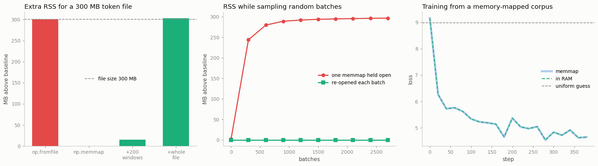

# Memory-Mapped Tokens

---

> Don't load the file into memory — let the operating system pretend it already is.

---

## Key Insight

[Memory mapping](/shared/glossary/#memory-mapping) (via `numpy.memmap`) makes a file on disk look like an array in memory: you can read any slice of it without loading the whole file into RAM. After [tokenizing](/shared/glossary/#tokenizer) a huge text corpus into one flat `.bin` file, training reads small chunks on demand.

## Why This Matters

Language-model datasets are often far larger than RAM. Memory mapping lets you train on a corpus of any size while using almost no memory, because the operating system pulls in only the pieces you actually touch.

---

**This is project 22.** [Project 21](../21-streaming-webdataset/README.md) solved
"the data does not fit" by giving up random access. This project solves the same
problem while *keeping* random access — and the trick is not a library, it is a
30-year-old operating-system feature.

What `run.py` finds:

- `np.fromfile` on a 300 MB token file costs **+300.0 MB** of resident memory;
  `np.memmap` costs **+0.0 MB**
- …until you touch it. Reading 200 random windows costs **+15.3 MB**, and one
  byte out of every 8 KB brings in the whole **+302.5 MB**. Memory mapping does
  not make data free, it makes it **lazy**
- a **cold** random read costs **283.9 µs** per window against **31.5 µs** warm,
  and reading the same tokens *sequentially* while cold costs **623× less** than
  reading them randomly
- holding one memmap open for 3000 random batches grows RSS by **296.8 MB**;
  re-opening it each batch grows it by **0.0 MB** — this is the comment in
  nanoGPT that everyone copies without knowing why
- `uint16` halves the file versus `int32` and quarters it versus `int64` — but
  `astype(np.uint16)` **silently wraps** 65540 to **4**
- training from the memmap and from an in-RAM copy give **bit-identical losses**
  and step times within 2%

---

## Files

| file | what it is |
|---|---|
| `run.py` | tokenizer, `.bin` writer, six experiments, and a small GPT |
| `outputs/findings.csv` | every number quoted here |
| `outputs/memmap.png` | the three figures |

```bash
python3 run.py     # ~2.5 min; needs torch, numpy, matplotlib
```

The first run writes `data/` (~290 MB, gitignored): `train.bin` and `val.bin`
tokenized from this repository's own markdown, plus a 300 MB `big.bin` of random
ids used only for the memory measurements.

---

## What memory mapping actually is

Normally, reading a file means: the kernel copies bytes from disk into its own
cache, then copies them again into your process's memory. You now hold your own
copy, and it costs RAM.

`mmap` skips the second copy. It tells the kernel: *"make this file appear at
this range of addresses."* No bytes move. The address range is marked valid but
empty. Then, the first time your program reads an address in that range, the CPU
raises a **page fault** — a hardware interrupt meaning "nothing is here yet" —
the kernel fetches that 4 KB page from disk, and your read completes. Every
later read of the same page is a plain memory access with no kernel involvement
at all.

Two consequences that explain everything below:

- **you only pay for what you touch**, in units of one 4 KB page
- **the pages live in the page cache**, which the kernel owns and can reclaim
  under memory pressure. You are borrowing memory, not allocating it.

The analogy that fits: `np.fromfile` is photocopying an entire library book
before reading it. `np.memmap` is getting a library card — you can open any page
instantly, but nothing is in your bag until you actually read it.



---

## 1. One flat file of `uint16`

The whole corpus becomes **one array of token ids**, with document boundaries
thrown away. That sounds lossy and is deliberate: a language model trains on
fixed-length windows, and a window that straddles two documents is a rare and
harmless event compared to the cost of tracking boundaries.

```
  train.bin: 1,474,202 tokens
    as uint16 :     2.95 MB   (2 bytes/token)
    as int32  :     5.90 MB   (4 bytes/token)
    as int64  :    11.79 MB   (8 bytes/token)
```

The dtype is the single most consequential decision here, because it multiplies
everything: disk, page-cache pressure, and read bandwidth. At real scale the
difference is not academic — OpenWebText is ~9 B tokens, which is **18 GB** as
`uint16` and **72 GB** as `int64`.

`uint16` holds 0 to 65 535. GPT-2's vocabulary is 50 257, so it fits with room to
spare, and that is exactly why the nanoGPT-style pipeline everyone copies uses
`uint16`. Modern tokenizers with 100k+ vocabularies do **not** fit.

### The trap

```
  np.array([65535, 65536, 65540, 131076]).astype(np.uint16) -> [65535, 0, 4, 4]
  but direct assignment of 70000 -> OverflowError
```

`astype` **wraps silently**: token 65 540 becomes token 4. Nothing raises,
nothing warns, and your corpus now contains a scattering of wrong words that no
test will catch — the loss curve looks completely normal, because the model
faithfully learns the corrupted data.

Direct assignment (`a[0] = 70000`) *does* raise in NumPy 2, which is a genuine
improvement, but the conversion path most tokenizer scripts use is `astype`. So
write the check yourself, once, before the `tofile`:

```python
assert ids.max() < np.iinfo(np.uint16).max, ids.max()
```

One more compatibility wrinkle worth knowing:

```
  torch.from_numpy(uint16) works (torch.uint16) but t+1 ->
      NotImplementedError: "add_stub" not implemented for 'UInt16'
```

PyTorch will *hold* a `uint16` tensor but will not do arithmetic on it. This is
why every memmap loader you have ever read calls `.astype(np.int64)` on the
slice. It is not superstition and it is not about precision — it is that
`nn.Embedding` needs an index type PyTorch actually implements.

---

## 2. RAM: the whole point

```
  file on disk                        : 300.0 MB
  baseline process RSS                :  558.2 MB
  after np.fromfile (read it all)     :  858.2 MB   (+300.0)
  after np.memmap (map it)            :  558.2 MB   (+0.0)
  after reading 200 random windows    :  573.5 MB   (+15.3)
  after touching one byte per 8 KB    :  860.7 MB   (+302.5)
```

("RSS", *resident set size*, is how much physical RAM the process is holding
right now — the number `top` shows.)

Row by row:

- **`np.fromfile` costs exactly the file size.** No surprise, and no way around
  it: you asked for a copy.
- **`np.memmap` costs nothing.** Creating the mapping is bookkeeping in the page
  table, not data movement.
- **200 random windows cost 15.3 MB**, not 200 × 128 bytes = 25 KB. Why? Because
  the unit of transfer is a **page**, not a byte. 200 scattered reads touch ~200
  pages of 4 KB, and Linux's readahead pulls in neighbours it guesses you will
  want. You cannot read less than a page, ever.
- **the last row is the honest warning.** Touching one byte per 8 KB is a
  perfectly reasonable access pattern — it is what a random sampler over a small
  file does — and it pulls the **entire file** into memory. Memory mapping is
  lazy, not magic. If your access pattern eventually touches everything, you
  eventually hold everything.

The reason this is still fine in practice: those pages are **page cache**, owned
by the kernel. If another process needs RAM, the kernel drops them and the next
read faults them back in. A `np.fromfile` array is your private allocation and
the kernel cannot take it back — it can only swap it, which is much worse. Same
apparent RSS, completely different behaviour under pressure.

---

## 3. Cold cache vs warm cache

Almost every memmap benchmark you will read is measured with the file already in
the page cache, which measures nothing. `run.py` calls
`posix_fadvise(fd, 0, 0, POSIX_FADV_DONTNEED)` to make the kernel forget the
file's cached pages — no root required — so the cold numbers are real:

```
  2000 random windows, cold cache :  567.8 ms   (283.9 us per window)
  2000 random windows, warm cache :   63.0 ms   ( 31.5 us per window)
  the same 128,000 tokens read SEQUENTIALLY, cold:  0.9 ms  (623x cheaper than random)
```

Two lessons, and the second is the actionable one.

**Cold random access costs about 9× warm here** — and the ratio bounces between
runs (it was 21× on a previous run) because it depends on what else the kernel
has cached at that moment. On an NVMe SSD this is survivable; on a spinning disk
or a network filesystem each fault is milliseconds and the same access pattern is
ruinous.

**Sequential beats random by 623×.** Same bytes, same total volume, only the
order changed. The kernel detects a sequential pattern and reads ahead in large
chunks; a random pattern defeats that and pays a separate fault per window. This
is why large-scale token pipelines *shuffle at write time* and then read
**mostly sequentially**, and why a small local shuffle buffer over a sequential
stream (exactly [project 21](../21-streaming-webdataset/README.md)'s design) can
beat perfect random access on cold storage.

> **"So is random offset sampling wrong?"** No — but know which regime you are
> in. If the corpus fits in the page cache (the usual case for anything under
> ~50% of RAM), random offsets are warm reads at 31.5 µs and cost nothing. If it
> does not, every batch pays cold-fault prices and you want a sequential-plus-
> buffer scheme instead. The measurement above is how you tell which world you
> are in.

---

## 4. The nanoGPT "memory leak"

If you have read nanoGPT's `get_batch`, you have seen this:

```python
# We recreate np.memmap every batch to avoid a memory leak, as per
# https://stackoverflow.com/questions/45132940/numpy-memmap-memory-usage-want-to-decrease
data = np.memmap(path, dtype=np.uint16, mode='r')
```

It looks like cargo cult. It is not:

```
  one memmap held for 3000 batches : RSS +296.8 MB
  re-opened every batch            : RSS +  0.0 MB
```

The middle figure shows the shape: held open, RSS climbs steeply and then flattens
at the file size — the mapping has accumulated every page any batch ever touched,
and **a mapped page is never dropped while the mapping is alive** (from this
process's point of view). Re-opening per batch destroys the old mapping, which
releases every page reference at once, and the line stays flat at zero.

Two things this is *not*:

- **It is not a leak in the C sense.** Nothing is unreachable; the memory is
  reclaimable page cache. A memory profiler will show no leaked objects.
- **It is not free to fix.** Re-mapping per batch costs a syscall — negligible
  next to a training step, which is why the fix is acceptable.

Why it matters anyway: RSS is what your job scheduler, your container memory
limit, and the Linux OOM killer look at. A process whose RSS climbs to the size
of a 200 GB corpus will be killed, even though every one of those pages was
droppable. **The fix is not about memory, it is about how memory is accounted.**

There is a subtler version of the same bug: if you build the memmap in a
`Dataset.__init__` and use `num_workers>0`, every forked worker inherits the
mapping and each worker's RSS grows independently. The pages are shared, so the
*system* is fine, but the numbers your monitoring sees are multiplied by the
worker count. Open the memmap **inside** `__getitem__`, or inside a
`worker_init_fn`.

---

## 5. Random offsets replace the sampler

```
  train.bin holds 1,474,202 tokens -> 1,474,137 distinct windows of 64
  a map-style dataset would need an index list of 11.8 MB; random offsets need 0
  20000 random starts: 19,852 distinct, repeat rate 0.0074
                       (birthday-paradox estimate 0.0068)
```

Every position in the file is a valid window start, so "sample a training
example" is just "draw a random integer". There is no index list, no shuffle, no
permutation — and therefore none of the memory or setup cost that
[project 20](../20-weighted-sampler/README.md)'s samplers carry.

Note that this is sampling **with replacement**, so an "epoch" no longer means
"each example once". The measured repeat rate of 0.74% matches the
birthday-paradox estimate `k / 2n` (0.68%): among 20 000 draws from 1.47 M
possibilities, about 148 pairs collide. (The *birthday paradox* is the surprising
fact that in a room of 23 people two probably share a birthday — collisions
appear far sooner than intuition suggests, because what grows is the number of
*pairs*, not the number of people.) At corpus scale the rate is negligible, and
nobody counts epochs anyway; they count tokens.

Two details in `get_batch` that are easy to get wrong:

```python
ix = rng.integers(0, len(tokens) - block - 1, size=batch)   # not len(tokens)
x  = tokens[i : i + block]
y  = tokens[i + 1 : i + 1 + block]                          # shifted by ONE
```

- the `- block - 1` keeps the **shifted** slice in bounds. Using `len(tokens)`
  gives short final windows and a shape error at a random moment much later.
- `y` is `x` shifted by one position, not a separate label array. That single
  line is what makes the model
  [autoregressive](/shared/glossary/#autoregressive-model): at every position it
  predicts the *next* token, so one window of 64 tokens provides 64 training
  signals rather than one. ("Auto-regressive" literally means *regressing on
  itself* — the thing being predicted and the thing predicting it are the same
  sequence, just offset.)

---

## 6. Does it actually train?

```
  memmap  400 steps in 69.95s (174.9 ms/step)  train loss 4.653  val 4.840  (perplexity 126.4)
  in RAM  400 steps in 71.63s (179.1 ms/step)  train loss 4.653  val 4.840  (perplexity 126.4)
  uniform-guess loss over 8000 tokens would be 8.987
```

The two loss curves are **identical to every printed digit**, which is the result
you want: memory mapping is an I/O technique, not a numerical one. It changes
where bytes come from and nothing else.

The step times differ by 2%, well inside noise — because at 175 ms/step the
transformer is doing all the work and the data read is a rounding error. That is
the same conclusion [project 18](../18-naive-vs-optimized-loader/README.md)
reached from the other direction: **an I/O optimization can only be worth
something if I/O is on the critical path.**

The loss went from 8.99 (uniform guessing over 8000 tokens) to 4.84 on held-out
text — a [perplexity](/shared/glossary/#perplexity) of 126, meaning the model is
about as uncertain as if it were choosing uniformly among 126 words instead of
8000. For a 2-layer model on 1.4 M tokens of technical markdown, that is exactly
the "it learned something real, and it is small" you should expect.

---

## Things to try

- **Re-tokenize with a 100k-vocabulary tokenizer** and watch `astype(np.uint16)`
  quietly ruin the corpus. Then add the `assert` and watch it catch it.
- **Make `big.bin` larger than your RAM** and re-run section 2. `np.fromfile`
  will fail or swap; `np.memmap` will not notice.
- **Compare `mode="r"` with `mode="r+"`.** A writable mapping means dirty pages
  must be flushed, which changes the RSS story completely.
- **Replace random offsets with a sequential scan plus a shuffle buffer** (the
  project 21 pattern) and re-run the cold measurement. This is the choice that
  actually matters on storage that is not local.
- **Add `num_workers=4`** with the memmap opened in `__init__` and again in
  `__getitem__`, and compare the sum of the workers' RSS.
- **Store a second array alongside** (e.g. document ids as a parallel `uint32`
  memmap) and mask out windows that straddle a document boundary. Measure whether
  the loss changes at all — on most corpora it does not, which is why nobody
  bothers.

---

## What to take away

1. `np.memmap` is **lazy, not free**. +0.0 MB to map, +302.5 MB once your access
   pattern has touched every page.
2. Mapped pages are **page cache the kernel can reclaim**; a loaded array is
   yours forever. The RSS number can look identical while the failure modes are
   opposite.
3. Reads happen in **4 KB pages**. 200 tiny random reads cost 15.3 MB, not 25 KB.
4. Measure **cold**, not warm — `posix_fadvise(..., POSIX_FADV_DONTNEED)` makes
   that possible without root.
5. **Sequential cold reads beat random cold reads by 623×.** Shuffle when you
   *write* the file, and read forward.
6. Holding one memmap open grows RSS to the file size (**+296.8 MB**);
   re-opening per batch keeps it at **0.0**. That is what nanoGPT's comment means.
7. **`uint16` halves your I/O and silently wraps ids above 65 535.**
   `assert ids.max() < 65535` before writing.
8. PyTorch holds `uint16` but refuses to compute with it — `.astype(np.int64)`
   on the slice is mandatory, not decoration.
9. Random offsets replace the sampler entirely: **zero index memory**, sampling
   with replacement, a 0.74% repeat rate at 20 000 draws.
10. Memmap and in-RAM training produced **identical losses** and step times
    within 2% — proof that the technique is about memory accounting, not maths.

---

Next: [project 23](../23-profile-and-fix/README.md) closes Phase 4 by putting
all of this under the profiler — taking a deliberately slow training script,
finding where the time really goes, and fixing it in the order the measurements
dictate.
