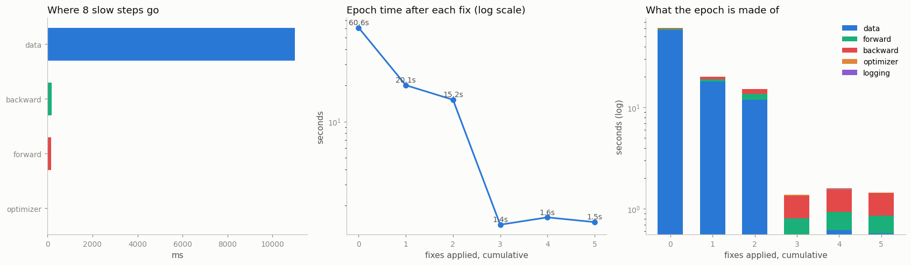

# Profile and Fix

---

> Don't guess why training is slow — measure it, then fix what the measurement shows.

---

## Key Insight

The PyTorch [profiler](/shared/glossary/#profiler) records how long each part of a training step takes, so you can see whether the [data loader](/shared/glossary/#dataloader) — not the model — is the [bottleneck](/shared/glossary/#bottleneck). Common fixes include adding [worker processes](/shared/glossary/#worker-processes) or enabling [pinned memory](/shared/glossary/#pinned-memory).

## Why This Matters

Developers routinely guess wrong about where time goes and "optimize" the wrong thing. Profiling first turns tuning from guesswork into a targeted fix — the difference between an idle GPU and a fully-fed one.

---

**This is project 23**, and the last of Phase 4. Projects 18-22 each isolated one
knob. This one puts them together the way you meet them in real life: as a
training script that is *just slow*, with no label on which part is at fault.

What `run.py` finds:

- the profiler says **96.8%** of the loop is the data stage. Forward, backward
  and optimizer *together* are **3.2%**
- five fixes, applied in profile order, take the epoch from **60.65 s to 1.45 s —
  41.7× faster**, with the model untouched
- the biggest single win is not `num_workers`. It is deleting a Python loop:
  **×10.99** in one edit
- the last two fixes are **inside the run-to-run noise** — because by then the
  loader was no longer the bottleneck and there was nothing left to win
- the control confirms it: `set_to_none=True` (×1.11) and `pin_memory=True`
  (×1.14) are both smaller than the 0.52 s spread of repeated identical runs,
  while `num_workers=12` is a **real ×0.65 — a 35% slowdown**
- once workers are on, the profiler sees the **waiting** but not the **work**:
  total self CPU in the profile drops from 3453.7 ms to 674.4 ms although the
  same work still happens, in another process

---

## Files

| file | what it is |
|---|---|
| `run.py` | the slow script, the five fixes, the control, the profiler runs |
| `outputs/findings.csv` | every number quoted here |
| `outputs/profile_slow.txt` | the raw `key_averages()` table |
| `outputs/trace_workers4.json.gz` | a Chrome trace — open at `chrome://tracing` or [ui.perfetto.dev](https://ui.perfetto.dev) |
| `outputs/profile_and_fix.png` | the three figures |

```bash
python3 run.py     # ~7 min; needs torch, numpy, matplotlib, Pillow
```

---

## The patient

A perfectly ordinary-looking training script over 1600 JPEGs. Nothing in it is
absurd; every line is something people write:

```python
def __getitem__(self, i):
    files = sorted(DATA.glob("*.jpg"))          # (1) re-scan the directory
    img = Image.open(files[i]).convert("RGB")
    a = np.asarray(img)
    x = torch.tensor(a.tolist(), dtype=torch.float32).permute(2, 0, 1)   # (2)
    for c in range(3):                          # (3) normalize row by row
        for r in range(x.shape[1]):
            x[c, r] = (x[c, r] / 255.0 - 0.45) / 0.25
    return x, label
```

…loaded with `num_workers=0`, and logged with a `loss.item()` plus a
`x.numpy().mean()` every step (4, 5). It runs at 26 samples/s and nobody has any
idea why.

---

## 1. Ask the profiler first

```python
from torch.profiler import profile, record_function, ProfilerActivity

with profile(activities=[ProfilerActivity.CPU]) as prof:
    for _ in range(8):
        with record_function("## data ##"):      x, y = next(it)
        with record_function("## forward ##"):   loss = lossf(model(x), y)
        with record_function("## backward ##"):  loss.backward()
        with record_function("## optimizer ##"): opt.step()
```

`record_function` is the important part. Without it the profiler gives you a
thousand `aten::` operator rows and no structure; with it you get four numbers
that answer the only question that matters first — **which stage?**

```
  ## data ##           11003.3 ms   96.8%
  ## backward ##         189.8 ms    1.7%
  ## forward ##          159.0 ms    1.4%
  ## optimizer ##         11.4 ms    0.1%
```

Verdict in one line: **the model is not the problem.** Even if you made forward
and backward infinitely fast, this script would go from 60.6 s to 58.7 s.

Now the operator table (`outputs/profile_slow.txt`) says *what* the data stage is
doing:

```
  Name                                        Self CPU %   Self CPU   # of Calls
  enumerate(DataLoader)#_SingleProcessDat...     76.91%      8.739s            8
  aten::select                                    3.95%    448.4ms       196608
  aten::div                                       3.93%    446.8ms        98312
  aten::copy_                                     3.19%    362.9ms       196712
  aten::_to_copy                                  3.19%    362.5ms       147528
  aten::sub                                       1.97%    223.9ms        49152
```

Read the **call counts**, not the times. 196 608 calls to `aten::select` across
8 steps is 24 576 per step, and a step is 32 images of 64 rows × 3 channels =
6 144 rows… × 4 tensor operations each. **The profiler has just handed you the
Python loop's line number**, in the form of an operator count that only makes
sense if something is iterating per row.

That is the general skill: an operator with a call count in the hundreds of
thousands and a per-call time in microseconds is never a real kernel. It is a
Python `for` loop wearing a costume.



---

## 2. Fix in the order the profile dictates

Each row applies one more change, cumulatively. "spread" is the difference
between the best and worst of the repeated runs of *that same configuration*.

```
  0. as found                              60.65s (   26.4/s)            spread 0.00s
  1. hoist the directory scan              20.09s (   79.6/s)  x 3.02    spread 0.00s
  2. from_numpy, not torch.tensor(list)    15.21s (  105.2/s)  x 1.32    spread 0.00s
  3. vectorize the normalization            1.38s ( 1156.4/s)  x10.99    spread 0.68s
  4. num_workers=4 + persistent             1.59s ( 1005.1/s)  x 0.87    spread 0.46s
  5. drop the chatty logging                1.45s ( 1100.6/s)  x 1.09    spread 0.65s

  end to end: 60.65s -> 1.45s = 41.7x
```

**Fix 1 — hoist the directory scan out of `__getitem__` (×3.02).**
`sorted(DATA.glob("*.jpg"))` lists and sorts 1600 filenames. Doing it once in
`__init__` instead of 1600 times per epoch removes 2.56 million filename
comparisons. The bug is easy to write because `__getitem__` *looks* like a cheap
accessor; any work in it is multiplied by your dataset size.

**Fix 2 — `torch.from_numpy` instead of `torch.tensor(array.tolist())` (×1.32).**
`.tolist()` converts 12 288 numbers into Python objects, and `torch.tensor` walks
that nested list to build a tensor — allocating and freeing ~12 000 Python floats
per image. `from_numpy` copies nothing at all: it wraps the existing buffer.

**Fix 3 — vectorize the normalization (×10.99).** The single biggest win in the
project, and it is one line replacing three. `x = (x / 255.0 - 0.45) / 0.25` does
the same arithmetic in three C-level passes over 12 288 contiguous floats,
instead of 192 Python iterations each launching four tiny tensor ops. The 196 608
`aten::select` calls are gone.

> **Why not do fix 4 (`num_workers`) first?** Everyone's instinct is to reach for
> workers, and it would have "worked" — four processes doing the slow thing is
> ~4× faster than one. But it would have hidden a **40×** bug behind a 4×
> patch, burned four CPU cores forever to do work that should not exist, and
> left you with a pipeline that falls over on a bigger dataset. **Parallelism is
> the last resort, not the first.** Make the work small, then make it parallel.

**Fixes 4 and 5 — and the honest part.** After fix 3 the epoch is 1.38 s and the
run-to-run *spread* is 0.68 s. Fix 4 measures 1.59 s and fix 5 measures 1.45 s.
Those differences are **smaller than the spread**, which means this experiment
cannot tell them apart from nothing. Look at the stage breakdown and you can see
why: at stage 3 the epoch is 0.56 s of data against 0.79 s of model. **The data
stage stopped being the bottleneck**, and [project 18](../18-naive-vs-optimized-loader/README.md)
already showed what workers are worth when there is no waiting to delete: nothing.

That is not a failure of the fixes. It is the profile being right twice — first
about where to start, and then about where to stop.

---

## 3. The control: knobs that sound like optimizations

```
  baseline, 5 repeats  best 1.67s   spread 0.52s   <- anything smaller is not a result
  set_to_none=True     best 1.51s   x1.110   inside the noise
  pin_memory=True      best 1.47s   x1.137   inside the noise
  num_workers=12       best 2.56s   x0.654   REAL
```

The first line is the one to copy into your own benchmarking. Run the *identical*
configuration five times, take the spread, and treat it as your detection
threshold. Here it is 0.52 s — so a "12% improvement" is not an improvement, it
is Tuesday.

- **`set_to_none=True`** replaces "fill every gradient buffer with zeros" with
  "drop the buffers", which saves a memory write per parameter. On a model with
  56 000 parameters that is invisible. It is worth real time on a model with
  a billion — and it also changes the *maths* for parameters that receive no
  gradient, which [project 14](../14-custom-optimizer/README.md) measured as a
  1.63 weight difference. Use it, but not because it is fast here.
- **`pin_memory=True`** exists to make host-to-device copies asynchronous. There
  is no usable device on this machine, so the mechanism it enables cannot fire.
  It is the one row here that would look different on a GPU box.
- **`num_workers=12`** is the interesting one: a **real 35% slowdown**, well
  outside the noise. Twelve worker processes on a 12-thread machine that is also
  running the training loop means every process is fighting for a core, plus
  twelve sets of startup and inter-process transfers, to parallelize work that
  now takes 0.56 s. **More parallelism is not free, and past the crossover it is
  negative.**

---

## 4. What the profiler cannot see

```
  num_workers=0: data region 3144.8 ms (91.1% of the loop), total self CPU 3453.7 ms
  num_workers=4: data region  469.5 ms (69.6% of the loop), total self CPU  674.4 ms
```

The same dataset, the same per-sample work, and the profile shrank by 80%. No
work disappeared — it **moved to another process**, and `torch.profiler` only
instruments the process it was started in.

This has a practical consequence that catches people out: with workers enabled,
your profile shows a `data` region that is pure *waiting*, with no operators
underneath it to explain the cost. The stage is expensive and the profile looks
empty. If you profile a worker-enabled loop and conclude "the data loading is
cheap now, look, no operators", you have measured the wrong thing.

The reliable procedure is the one this project used:

1. **Profile with `num_workers=0` first.** You want the work in your process,
   where you can see it. Diagnose there.
2. **Fix the per-sample work** until the operator table stops being absurd.
3. **Then** turn workers back on, and switch from the profiler to wall-clock
   timing — because from that point on the question is no longer "what is slow"
   but "is the pipeline keeping up", which is a stopwatch question.

The exported trace (`outputs/trace_workers4.json.gz`, openable at
[ui.perfetto.dev](https://ui.perfetto.dev)) shows this visually: a timeline with
a long empty `## data ##` bar and dense operator activity everywhere else.

---

## Things to try

- **Open `trace_workers4.json.gz` in Perfetto** and measure the gaps by hand.
  Reading a trace is a separate skill from reading a table, and it is the only
  view that shows *overlap*.
- **Use `profile(schedule=torch.profiler.schedule(wait=1, warmup=1, active=3))`**
  so the first steps — which include allocator warm-up and worker startup — do
  not pollute the average.
- **Add `record_shapes=True` and `with_stack=True`.** The stack traces point at
  the exact Python line, at the cost of a much slower profile and a much bigger
  trace file.
- **Try `profile_memory=True`** and find which stage allocates most. On this
  script the answer is again the data stage, for the same reason.
- **Re-order the fixes** — apply `num_workers=4` first and the vectorization
  last. The end point is the same; the *path* shows why profile-ordering matters
  when you have limited time.
- **Break something new**: make `__getitem__` open and parse a 5 MB CSV of labels
  per sample. Then find it in the profile without looking at the code. That is
  the actual skill.

---

## What to take away

1. **Wrap your loop in `record_function` regions before anything else.** Four
   numbers tell you which stage to look at; the operator table only makes sense
   afterwards.
2. Here the answer was **96.8% data, 3.2% model**. Making the model infinitely
   fast would have saved 3%.
3. **Read call counts, not just times.** 196 608 calls to `aten::select` is the
   signature of a Python loop, and it located the bug without reading the code.
4. **Fix the work before you parallelize it.** Vectorizing one loop was **×11**;
   four worker processes on the unfixed code would have been ×4 and would have
   hidden the real bug.
5. Total: **60.65 s → 1.45 s, 41.7×**, with an untouched model and no new
   hardware.
6. **Measure your own noise floor.** Five repeats of one config spread by 0.52 s,
   so anything under ~30% here is unmeasurable. Two "wins" evaporated under that
   test.
7. **Optimizations can be negative.** `num_workers=12` was a real 35% slowdown.
8. **The profiler cannot see inside worker processes.** Diagnose with
   `num_workers=0`, then switch to wall-clock timing once workers are on.
9. Stop when the profile says stop. After fix 3 the data stage was smaller than
   the model, and every further loader change was noise.

---

## Phase 4 complete

Six projects, and together they answer the guide's bottleneck-diagnosis table
with measurements instead of rules of thumb:

| symptom | the project that measures it |
|---|---|
| the loop waits on data | [18](../18-naive-vs-optimized-loader/README.md) — workers delete waiting and nothing else |
| batches are ragged, or wasteful | [19](../19-custom-collate/README.md) — 84.5% padding → 6.3%, and the mask bugs |
| batches are unrepresentative | [20](../20-weighted-sampler/README.md) — sampling vs loss weighting, and their price |
| the data does not fit on disk | [21](../21-streaming-webdataset/README.md) — streaming, sharding, and the window you can shuffle |
| the data does not fit in RAM | [22](../22-memory-mapped-tokens/README.md) — mapping instead of loading |
| you do not know which of the above | this one |

Next: [Phase 5](../../README.md#phase-5-performance--profiling-mixed-precision-and-torchcompile)
turns the same instrument on the model itself — mixed precision, `torch.compile`,
memory breakdowns, and the CUDA-specific reason that `time.time()` around a GPU
op lies to you.
