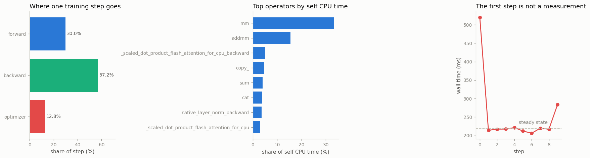

# Profile a Training Step

---

> Every slow training step hides its secret in a few greedy kernels.

---

## Key Insight

The PyTorch [profiler](/shared/glossary/#profiler) records how long every operation — every GPU [kernel](/shared/glossary/#kernel) — takes during one forward, backward, and optimizer step. Because [CUDA](/shared/glossary/#cuda) runs work asynchronously, ordinary timers mislead; the profiler captures true GPU time so you can rank kernels and see which few dominate.

## Why This Matters

Optimization only pays off when aimed at the real hot spot. Ranking kernels by time tells you exactly where to look, so you tune the operations that actually cost you and ignore the ones that don't.

---

**This is project 24**, and the first of Phase 5. Phase 4 profiled the *data
loader*; this phase profiles everything else. One 3.2 M-parameter
[transformer](/shared/glossary/#transformer), one training step, and six ways to
read the same profile.

What `run.py` finds:

- the step splits **forward 30.0 % / backward 57.2 % / optimizer 12.8 %**, and
  backward costs **1.91×** forward — close to the textbook 2×, for a reason worth
  knowing
- **three operators are 54.1 % of all the CPU time**, and two of them are the
  same matrix multiply under different names
- the model runs **3362 operator calls per step** from **94 distinct operators** —
  a number [project 26](../26-torch-compile-test/README.md) then cuts by 61 %
- **the first step of the process is 2.38× slower than the tenth**, and that
  ratio itself changes from run to run — which is the argument for never timing it
- the profiler itself costs **2.30×**, so a profiled step is not a fast step —
  read shares, not absolute times
- one operator reports **11.4 ms of self time and 758.8 ms of total time**, which
  is the single most misread column in the table

---

## Files

| file | what it is |
|---|---|
| `run.py` | the profiled step and all six readings |
| `perf_lib.py` | **shared by projects 24-29**: the model, the timing helpers, the activation-byte counter |
| `outputs/findings.csv` | every number quoted here |
| `outputs/profile_table.txt` | the raw `key_averages()` table |
| `outputs/trace_step.json.gz` | a Chrome trace — open at [ui.perfetto.dev](https://ui.perfetto.dev) |
| `outputs/profile_a_training_step.png` | the three figures |

```bash
python3 run.py     # ~1 min; needs torch, numpy, matplotlib
```

> **A note on the hardware.** The GPU in this machine (a GTX 1070 Ti) is older
> than any kernel this PyTorch build ships, so everything in Phase 5 runs on the
> CPU. `torch.profiler` works identically — you record `ProfilerActivity.CPU`
> instead of `CUDA`, and every technique below transfers. Where the CPU changes
> the *conclusion* rather than the method, the README says so.

---

## Capturing a step

```python
from torch.profiler import profile, ProfilerActivity, record_function

with profile(activities=[ProfilerActivity.CPU],
             record_shapes=True, profile_memory=True) as prof:
    for _ in range(5):
        with record_function("## forward"):
            loss = loss_fn(model(x), y)
        with record_function("## backward"):
            loss.backward()
        with record_function("## optimizer"):
            opt.step(); opt.zero_grad(set_to_none=True)

print(prof.key_averages().table(sort_by="self_cpu_time_total", row_limit=25))
```

`record_function` adds your own labels to the timeline. Without them the table is
a flat list of 94 operators and you cannot tell which phase each belongs to; with
them you get the three-way split first, and then drill down.

> **"Doesn't the profiler already know what the forward pass is?"** No. The
> profiler sees *operators*, not intentions — a `mm` is a `mm` whether it came
> from your forward pass, the backward pass, or the optimizer. `record_function`
> is how you attach the structure that only you know. (Autograd nodes do get
> `autograd::engine::...` names, which is a hint, but the optimizer and your own
> pre-processing get nothing.)

---

## Reading 1: where the step goes



| section | share | per step |
|---|---|---|
| forward | 30.0 % | 121.2 ms |
| backward | 57.2 % | 231.2 ms |
| optimizer | 12.8 % | 51.8 ms |

**Backward / forward = 1.91×.** The rule of thumb says 2×, and here is why: for
every matrix multiply `y = x @ W` in the forward, the backward has to compute
*two* — one for the gradient with respect to `x` and one with respect to `W`.
Three matmuls total, two of them in the backward, hence roughly 2:1. The number
comes in slightly under because a few forward operations (the embedding lookup,
the loss) have cheap or non-existent backward counterparts.

This ratio is worth memorising as a sanity check. If your backward is 5× your
forward, something is wrong — a badly-written custom
[`autograd.Function`](../08-custom-autograd-function/README.md), or an
unnecessary `create_graph=True` ([project 11](../11-double-backward/README.md)
measures that one: 2.66× time).

---

## Reading 2: the top operators

| operator | share of self CPU | calls/step |
|---|---|---|
| `aten::mm` | 33.5 % | 35 |
| `aten::addmm` | 15.5 % | 16 |
| `aten::_scaled_dot_product_flash_attention_for_cpu_backward` | 5.1 % | 4 |
| `aten::copy_` | 4.7 % | 281 |
| `aten::sum` | 4.1 % | 17 |

**The top three are 54.1 % of the time.** That is the shape of nearly every
profile you will ever read: a long tail of operators that do not matter, and two
or three that do.

`mm` and `addmm` are the same operation — a matrix multiply — where `addmm` also
adds a bias (`out = bias + a @ b`). Together they are **49 %** of the step. This
is the healthy case: the model is spending its time on the arithmetic you wanted
it to do.

`aten::copy_` is the interesting one: **281 calls per step** for 4.7 % of the
time. Individually free, collectively noticeable. Those come from `.transpose()`
and `.reshape()` in the attention block, where a non-contiguous
[view](/shared/glossary/#view) has to be materialised — exactly the
[stride](/shared/glossary/#stride) mechanics of
[project 1](../01-stride-explorer/README.md), showing up as a line in a profile.

**Call counts are a diagnosis in themselves.** A high count on a tiny operator
means a Python loop is doing work that a tensor operation should be doing;
[project 23](../23-profile-and-fix/README.md) found a loop that way (196,608
`aten::select` calls) and deleting it was worth 10.99× on its own.

---

## Reading 3: self time is not total time

```
autograd::engine::evaluate_function: AddmmBackward0
    self CPU:   11.4 ms          total CPU:  758.8 ms
```

- **Self time** — time spent *inside* this operator, excluding anything it calls.
- **Total time** — self time plus everything it called.

The autograd engine node above spends almost none of its own time working; it
spends it calling `mm`. If you sort by total time you get a list of *containers*
(the training loop, the engine, the module wrappers), all near 100 %. If you sort
by self time you get a list of *workers*. **Sort by self time when hunting for
something to optimize**, and use total time only to attribute a worker to the
phase that called it.

---

## Reading 4: the same operator, split by shape

`record_shapes=True` costs a little overhead and buys a lot:

| operator and input shapes | per step | calls/step |
|---|---|---|
| `aten::mm [[2048, 256], [256, 1024]]` | 22.01 ms | 4 |
| `aten::mm [[1024, 2048], [2048, 256]]` | 21.35 ms | 4 |
| `aten::addmm [[256], [2048, 1024], [1024, 256]]` | 20.76 ms | 4 |
| `aten::mm [[2048, 1024], [1024, 256]]` | 20.62 ms | 4 |

All four are the MLP inside the transformer block: `2048 = batch 16 × sequence
128` rows, and `1024 = 4 × 256` is the hidden width of the feed-forward layer.
Four calls each because the model has four blocks.

Without shapes, "`mm` is 34 % of the step" tells you the model is doing matrix
multiplies — thank you very much. *With* shapes, you know it is the `4d`-wide MLP
and not the attention, so you know which knob to turn.

---

## Reading 5: which operator allocates

`profile_memory=True` adds allocation columns:

| operator | allocated/step |
|---|---|
| `aten::addmm` | 72.00 MB |
| `aten::mm` | 70.56 MB |
| `aten::empty` | 61.79 MB |
| `aten::gelu` | 32.00 MB |
| **total** | **346.82 MB** |

A step of this model churns 346.82 MB of allocations. That is not the *peak* —
most of it is freed immediately — but it shows which operators are memory-hungry.
[Project 27](../27-memory-breakdown/README.md) takes this apart properly and
separates what is allocated from what stays alive.

---

## Reading 6: the first step is a lie

| step | wall time |
|---|---|
| 0 | 520.5 ms |
| 1 | 214.1 ms |
| steady state (median of 4-9) | **218.3 ms** |

**The first step is 2.38× the steady state.** It pays for one-time costs that
have nothing to do with your model's speed: lazy kernel selection (oneDNN or
cuDNN picks an algorithm the first time it sees a shape), the allocator asking
the OS for memory, thread pools starting, and — with Adam — the optimizer
allocating its state on the first `step()`.

That multiplier is *not* a stable quantity: an earlier run of the same script on
the same machine measured 4.78×, because the amount of PyTorch the operating
system still had in its file cache was different. A number that swings by 2×
between runs is exactly the kind you must never build a comparison on.

The reproducible part of the same effect turns out to be smaller than folklore
suggests. A tensor shape this process has never seen costs a **median 1.03×** on
its first step (1.16× / 1.02× / 1.03× at batch 12, 10 and 6): PyTorch does pick
its matmul algorithm per shape and cache it, but here that choice is cheap. On a
GPU, and with `torch.backends.cudnn.benchmark = True`, the same first-call
penalty is much larger, because cuDNN literally *times* several algorithms
before picking one.

This is why every honest benchmark has a warm-up loop:

```python
for _ in range(3):     # warm-up: results thrown away
    train_step()
```

`perf_lib.best_of()` does this and then takes the **minimum** of N runs, not the
mean. The minimum is the run least disturbed by everything else on the machine;
the mean is an average of your code and your neighbours' code.

---

## The thing the CPU cannot show you (and what it shows instead)

On a GPU, `y = model(x)` **returns before the work is done**. The CPU queues
kernels onto a [CUDA](/shared/glossary/#cuda) stream and moves on; the GPU
executes them later. So this is wrong:

```python
t0 = time.time(); y = model(x); print(time.time() - t0)   # measures QUEUING
```

…and this is right:

```python
torch.cuda.synchronize(); t0 = time.time()
y = model(x)
torch.cuda.synchronize(); print(time.time() - t0)
```

On CPU there is no queue: every operator finishes before the next line runs. The
measurement here confirms it — the profiler's summed self CPU time is
**0.87×** the wall clock, i.e. the two agree to within the ~10 % that Python
interpreter overhead sits outside any operator. On CUDA that ratio would be
anything at all, which is the whole point.

The CPU version of the same trap is real, though, and it is the **observer
effect**: the profiled step took **459.5 ms** against **199.4 ms** unprofiled —
**2.30× overhead**, mostly from `record_shapes` and `profile_memory`. So:

- read **shares and ratios** from a profile, never absolute times;
- take absolute times from a plain, warmed-up, best-of-N stopwatch;
- and remember from [project 23](../23-profile-and-fix/README.md) that
  `torch.profiler` never enters DataLoader worker processes — with
  `num_workers > 0` the loader's real work is invisible to it.

---

## The trace

`prof.export_chrome_trace("trace.json")` writes a timeline you can open at
[ui.perfetto.dev](https://ui.perfetto.dev) or `chrome://tracing`. One step of
this model is 1.29 MB raw, **76.8 KB gzipped** (`.json.gz` loads directly).

A trace shows you what a table cannot: *gaps*. A table can tell you the kernels
took 200 ms; only the timeline shows the 40 ms where nothing ran because the
loader had not delivered the batch. Keep traces short — [project
23](../23-profile-and-fix/README.md) exported a step of an operator-storm loop
and got a 288 MB JSON file.

---

## What to take away

1. **Label your regions.** `record_function` turns 94 anonymous operators into a
   three-line answer.
2. **Sort by self time, read shares, ignore the tail.** Three operators were
   54.1 % of this step.
3. **Backward ≈ 2× forward.** Anything far from that is a lead.
4. **Never time the first step, and never trust a profiled absolute time**
   (2.38× and 2.30× here, respectively).
5. **Group by shape** to turn "matmul is slow" into "the MLP at
   2048×1024×256 is slow".

---

Next: [project 25](../25-amp-speedup-study/README.md) takes the biggest line in
this profile — the matrix multiplies, half of the step — and tries to make it
cheaper by using 16-bit numbers.
