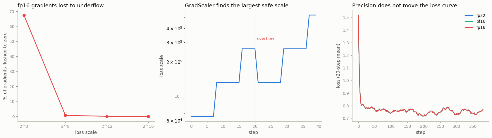

# AMP Speedup Study

---

> Half the bits, twice the speed — and usually the same answer.

---

## Key Insight

[Automatic mixed precision](/shared/glossary/#amp) runs most operations in 16-bit floats — [float16](/shared/glossary/#float16) or [bfloat16](/shared/glossary/#bfloat16) — instead of [float32](/shared/glossary/#float32), which halves memory traffic and unlocks fast [Tensor Cores](/shared/glossary/#tensor-core). float16 needs a [GradScaler](/shared/glossary/#gradscaler) to avoid [underflow](/shared/glossary/#underflow); bfloat16 shares float32's range and does not.

## Why This Matters

Mixed precision often gives a 2–3× speedup for one or two lines of code, with little or no loss in final accuracy — one of the highest-return changes you can make to a training script.

---

**This is project 25.** [Project 24](../24-profile-a-training-step/README.md)
found that half of a training step is matrix multiplication. Mixed precision is
the standard way to make that cheaper. On this machine it does the opposite —
and the *reason* is the most useful thing in this project, because it tells you
exactly what you are buying when it does work.

What `run.py` finds:

- `autocast(bfloat16)` on this CPU is **0.02× — 58 times slower**, and removing
  autocast entirely (`model.bfloat16()`) does not help
- the cause, isolated to one operation: a 1024³ matrix multiply runs at
  **338.7 GFLOP/s in float32 and 1.1 GFLOP/s in bfloat16** — this CPU has AVX2
  and no 16-bit arithmetic at all, so PyTorch emulates it
- so **AMP's speed is a property of the hardware, not of the arithmetic** —
  everything else in this project is the part that *does* transfer
- autocast is a **per-operation policy**, not a global cast: `Linear` comes out
  in bfloat16, `LayerNorm` and the loss stay in float32, and the parameters are
  never cast at all
- activations shrink to **0.62×**, not 0.50× — and the missing 0.12 is exactly
  the layers autocast refused to cast
- **67.58 % of gradients flush to zero** when a small loss is cast to float16;
  a loss scale of 2⁸ takes that to **0.71 %**. In bfloat16 it is **0.00 %**
  without any scale at all — which is why bfloat16 needs no `GradScaler`
- `GradScaler` in action: the scale climbs, an overflow arrives, the scale halves
  **and the optimizer step is skipped** — measured, weight by weight
- with the precision emulated at float32 speed, 400 training steps in fp32,
  bf16 and fp16 land on the **same loss**

---

## Files

| file | what it is |
|---|---|
| `run.py` | all seven sections |
| `../24-profile-a-training-step/perf_lib.py` | the shared model and byte counters |
| `outputs/findings.csv` | every number quoted here |
| `outputs/amp_speedup_study.png` | the three figures |

```bash
python3 run.py     # ~4 min; needs torch, numpy, matplotlib
```

---

## The headline, inverted

Forward + backward, batch 4 × sequence 64:

| precision | time | vs float32 |
|---|---|---|
| float32 | 28.9 ms | 1.00× |
| `autocast(bfloat16)` | 1681.7 ms | **0.02×** |
| `autocast(float16)` | 2795.4 ms | **0.01×** |
| `model.bfloat16()`, no autocast | 1749.4 ms | 0.02× |

The fourth row rules out the obvious suspect: this is not autocast's bookkeeping.
Pure 16-bit is just as slow. One microbenchmark shows why:

| 1024×1024×1024 matmul | time | throughput |
|---|---|---|
| float32 | 6.3 ms | **338.7 GFLOP/s** |
| bfloat16 | 2002.0 ms | 1.1 GFLOP/s |
| float16 | 2474.9 ms | 0.9 GFLOP/s |

**A 300× gap on one operation.** This CPU (an i7-8700K) has AVX2 vector
instructions for 32-bit floats and *nothing* for 16-bit floats. So PyTorch does
the only thing it can: it converts each 16-bit value to 32 bits, multiplies, and
converts back. You pay the conversion and get none of the speed.

> **"Then why does everyone say mixed precision is 2-3× faster?"** Because on
> hardware that has 16-bit units, it is. An NVIDIA A100 does about 19 TFLOP/s of
> float32 and about 312 TFLOP/s of bfloat16 through its
> [Tensor Cores](/shared/glossary/#tensor-core) — dedicated circuits that
> multiply small 16-bit matrix tiles in one shot. AMP's job is to *route your
> matmuls to those circuits*. Where the circuits do not exist, there is nothing
> to route to. Modern server CPUs (with AVX-512-BF16 or Intel AMX) do have them,
> and there the same script speeds up. **The lesson to carry: mixed precision is
> a hardware feature you unlock with software, not a software trick.**

The second, smaller half of the win survives everywhere, though: 16-bit values
are half the bytes, so every read and write moves half the data. On a
[memory-bound](/shared/glossary/#memory-bound) operation that is a 2×
saving on its own — and it is the reason activations shrink, below.

---

## What autocast actually does

`autocast` is not "make everything 16-bit". It is a **per-operation policy** with
three lists. Measured by reading the dtype that comes out of each operation:

| operation | dtype under `autocast(bfloat16)` | why |
|---|---|---|
| `Linear` / `matmul` | **bfloat16** | the 16-bit list: heavy, and tolerant of low precision |
| `LayerNorm` | float32 | the float32 list: computes a mean and a variance |
| `softmax` | float32 | float32 list: exponentials overflow easily |
| `log` | float32 | float32 list: precision matters near 1.0 |
| `gelu` | follows its input | neither list: whatever it is given |
| `cross_entropy` (the loss) | **float32** | a reduction over the whole batch |
| the parameters themselves | **float32** | never cast — see below |

Two beginner-shaped questions this answers:

> **"If autocast casts the inputs, why are the parameters still float32?"**
> Because autocast casts *on the way into an operation*, leaving the stored
> weights untouched. Those float32 weights are the **master copy**: the
> optimizer updates them in full precision. This matters because a weight update
> is typically a very small number added to a much larger one — `w = 0.7134` and
> `update = 0.000018`. In bfloat16, whose gaps near 0.7 are bigger than the
> update, that addition simply does nothing and training stalls. Keeping the
> master copy in float32 is what makes mixed precision *mixed*.

> **"Why is a layer normalization too dangerous for 16 bits when a matmul is
> not?"** Because of what happens to the errors. A matmul sums many products,
> and their rounding errors are random, so they partly cancel — and the sum
> itself is accumulated in float32 anyway. A normalization computes a mean and a
> variance and then *divides* by that variance; if the variance is slightly
> wrong, every output is wrong in the same direction. Errors that cancel are
> cheap; errors that multiply are not.

---

## What 16-bit really saves: memory

| saved activations | bytes |
|---|---|
| float32 | 132.80 MB |
| `autocast(bfloat16)` | 81.83 MB |
| ratio | **0.62×** |

Not 0.50×, and the gap is not a mystery: the tensors autocast keeps in float32 —
the LayerNorm outputs, the embeddings, the loss inputs — are still 4 bytes each.
Only the parts that were cast are halved.

This is the AMP benefit that **does** transfer to this machine, and to yours: on
a GPU it usually means you can raise the batch size, which is often worth more
than the arithmetic speedup. [Project 27](../27-memory-breakdown/README.md)
measures the activation bucket properly.

---

## The two failure modes: range and underflow

The whole design of float16 versus bfloat16 comes down to how the 16 bits are
divided between **exponent** (how large or small a number can be) and
**mantissa** (how many significant digits it has):

```
fp32:  8 exponent bits, 23 mantissa bits   →  max 3.403e+38, tiny 1.175e-38
fp16:  5 exponent bits, 10 mantissa bits   →  max 65504,     tiny 6.104e-05
bf16:  8 exponent bits,  7 mantissa bits   →  max 3.390e+38, tiny 1.175e-38
```

**bfloat16 is float32 with 16 bits chopped off the end.** Same exponent field,
so the same enormous range; a shorter mantissa, so fewer significant digits
(roughly 2-3 decimal digits instead of 7). float16 spends three of those
exponent bits on mantissa instead: more precision, in a range that runs out at
65504 in one direction and 6.1e-05 in the other.

### Overflow, measured

A 512×512 matrix of 300s multiplied by itself:

| dtype | result |
|---|---|
| float16 | **inf** |
| bfloat16 | finite |

The true value (90,000) is far past float16's 65504 ceiling. This is not a
contrived number — attention scores before the softmax and the outputs of large
linear layers reach these magnitudes routinely, which is why the softmax sits on
autocast's float32 list.

### Underflow, measured

Take a real gradient from this model, scaled small (a small loss is the normal
case late in training, and for any auxiliary loss term), and cast it:

| dtype | gradients flushed to exactly zero |
|---|---|
| float16 | **67.58 %** (2,179,534 of 3,225,088) |
| bfloat16 | **0.00 %** |

Two thirds of the gradient silently becomes zero. Nothing raises; the model just
stops learning in those weights.

> **Why "underflow"?** The value is too *small* to represent — it falls under
> the floor of the format and lands on zero. It is the mirror image of overflow,
> where a value is too large and lands on infinity. The floor for float16 is
> 6.1e-05 (below that it can still represent a few *subnormal* values with
> reduced precision, down to about 6e-08, then it is zero).

---

## What a GradScaler is, in one table

The fix is embarrassingly simple: multiply the loss by a big constant before
`backward()`, so every gradient in the chain is multiplied by that constant too,
and lands back inside float16's range. Then divide the gradients by the same
constant before the optimizer sees them.

| loss scale | fp16 gradients flushed to zero |
|---|---|
| 2⁰ = 1 | 67.58 % |
| 2⁸ = 256 | 0.71 % |
| 2¹² = 4096 | 0.07 % |
| 2¹⁶ = 65536 | 0.03 % |

> **"Doesn't multiplying the loss change the gradients — isn't that the exact
> bug [project 28](../28-gradient-accumulation/README.md) warns about?"** It
> would be, if you left it there. The scaler *unscales* the gradients (divides
> by the same constant) before `optimizer.step()`, so the update is unchanged.
> The multiplication exists only to move the numbers through the dangerous part
> of the pipeline — the backward pass, where they are stored in float16 — and it
> is undone the moment they are safely back in float32. Gradient scaling is a
> transport trick, not a learning-rate change.

### Why the scale cannot just be a big constant

Too small a scale and gradients underflow; too large and they overflow to `inf`.
The right value changes during training. So `GradScaler` searches for it, live:

- start at 2¹⁶
- **double** it every N successful steps (`growth_interval`, 2000 by default;
  set to 8 here so a 40-step run can show it)
- if any gradient comes back `inf` or `nan`: **halve** the scale and **skip the
  optimizer step entirely**

That last part is the one people miss. A skipped step is not an error — it is
the design. The gradients from an overflowed backward pass are garbage, so the
scaler throws the step away rather than applying garbage to the weights.
`run.py` plants an overflow at step 20 and confirms both halves of the behaviour:
the scale halves, and the weights do not move by so much as one bit.

**bfloat16 needs none of this**, because it has float32's exponent range: the
gradients that underflow in float16 are perfectly representable. That is the
single sentence that explains why every modern training recipe says "use
bfloat16 if your hardware has it".

---

## Does 16-bit arithmetic cost accuracy?

Testing this on hardware where 16-bit is 65× slower would take forever, so
`run.py` **emulates** the precision instead: every `Linear` rounds its inputs and
weights to the target dtype and back to float32 before the matmul.

```python
F.linear(x.to(torch.bfloat16).float(), w.to(torch.bfloat16).float(), b)
```

> **"Isn't that a fake test?"** It is faithful to what the hardware does, and
> that is what matters here. A Tensor Core reads 16-bit inputs and accumulates
> the products in float32 — exactly this pattern. What the emulation does *not*
> reproduce is the storage saving or the speed, which is fine, because those are
> measured separately above.



400 steps, same seed, same data:

| precision | final loss (mean of last 20) |
|---|---|
| float32 | 0.768296 |
| bfloat16 | 0.768282 |
| float16 | 0.768298 |

The three curves lie on top of each other: bfloat16 ends 0.000014 *below*
float32 and float16 0.000002 above it, both far inside step-to-step wobble.
Individual steps *do* differ — the largest single-step gap is 0.0002 for
bfloat16 and 0.0001 for float16 — but the training trajectory does not care. This matches what the LLM guide found at similar scale: at small
scale, precision is not the binding constraint. It does not license "precision
never matters" — at scale, and in specific spots (attention logits, layer norms,
long accumulations), it very much does, which is why autocast has a float32 list
in the first place.

---

## What to take away

1. **AMP's speed comes from hardware.** Tensor Cores, AVX-512-BF16, AMX. On a
   machine without 16-bit units it is 65× *slower*. Check what you have before
   you expect a speedup.
2. **AMP's memory saving comes from bytes**, and that is portable: 0.62× of the
   activations here, without touching the parameters.
3. **autocast is a policy, not a cast.** Matmuls go to 16-bit, reductions and
   normalizations stay in float32, and the master weights are never cast.
4. **float16 needs a GradScaler; bfloat16 does not.** 67.58 % of gradients
   flushed to zero versus 0.00 % is the entire argument.
5. **A skipped step is the scaler working**, not failing.

---

Next: [project 26](../26-torch-compile-test/README.md) attacks the same profile
from the other side — instead of making each operation cheaper, it asks the
compiler to run *fewer* of them.
