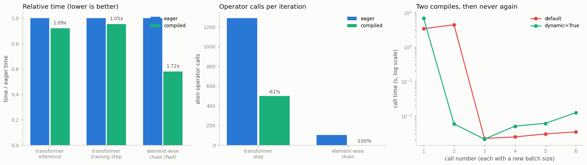

# Torch Compile Test

---

> Write the model once in Python; let the compiler rewrite it into fast kernels.

---

## Key Insight

[`torch.compile`](/shared/glossary/#torchcompile) traces a model into a graph and generates optimized, [fused kernels](/shared/glossary/#kernel-fusion), turning many small operations into a few large ones. Compiling a [transformer](/shared/glossary/#transformer) block and timing it against [eager mode](/shared/glossary/#eager-mode) shows the speedup from cutting Python overhead and [kernel](/shared/glossary/#kernel) launches.

## Why This Matters

A single line — `torch.compile(model)` — can speed up training with no change to the model's math, which makes it one of the cheapest wins in modern PyTorch whenever the graph compiles cleanly.

---

**This is project 26.** [Project 25](../25-amp-speedup-study/README.md) tried to
make each operation cheaper and ran into a hardware wall. This project tries the
other lever: run *fewer* operations. It works — but not on the part of the model
you would expect, and the measurement only means something because we measure the
noise first.

What `run.py` finds:

- **the control first**: the same eager model, timed twice, differs by **6.3 %**.
  That is the bar every number below has to clear
- the compiled transformer is **1.05× on a training step** — *below* the bar, so
  the honest reading is "no measurable change"
- but it is **1.09× on inference**, with spreads of 3 ms, and
  **61.2 % of the operator calls are gone** (1288 → 500 per step)
- the reason both are true at once: **51.8 % of this step is matrix
  multiplication**, which was already running inside a vendor library. Fusion
  cannot make a matmul faster; it can only remove the small operations *around*
  it
- so we measure the case fusion was built for — a chain of element-wise
  operations — and there the same compiler turns **104 operator calls into 1
  generated kernel** and runs **1.72×** faster
- the win is biggest on small tensors (**1.22×** at batch 2, **1.00×** at
  batch 16) and vanishes as the matmuls grow
- the bill: **12.1 s to compile the forward and 12.0 s more for the backward**,
  from a cold cache. At this model's savings that is **12,338 steps** before the
  compiler has paid for itself
- shape changes are handled better than folklore says: **6 different batch sizes
  cost 2 compiles**, not 6

---

## Files

| file | what it is |
|---|---|
| `run.py` | all eight sections |
| `../24-profile-a-training-step/perf_lib.py` | the shared model and timing helpers |
| `outputs/findings.csv` | every number quoted here |
| `outputs/fused_kernels.txt` | the names of the kernels Inductor generated |
| `outputs/torch_compile_test.png` | the three figures |

```bash
python3 run.py     # ~4 min; needs torch, numpy, matplotlib and a C++ compiler
```

---

## What the three letters of `torch.compile` actually do

```
your Python  →  TorchDynamo  →  AOTAutograd  →  TorchInductor  →  fast kernels
                (capture)      (build the      (generate code)
                               backward too)
```

- **[TorchDynamo](/shared/glossary/#torchdynamo)** hooks into CPython and watches
  your function run, recording the PyTorch operations into a graph. The name says
  what makes it unusual: it is *dynamic*, tracing the bytecode as it actually
  executes, so you do not have to rewrite the model in a restricted language the
  way [TorchScript](/shared/glossary/#torchscript) required. When it meets Python
  it cannot capture, it takes a [graph break](/shared/glossary/#graph-break)
  rather than failing — the subject of
  [project 29](../29-bottleneck-fix/README.md).
- **[AOTAutograd](/shared/glossary/#aotautograd)** runs [autograd](/shared/glossary/#autograd)
  over the captured forward graph *ahead of time* to produce a backward graph.

  > **"Doesn't autograd already build the backward? Why do it again?"** Eager
  > autograd builds the backward *during* the backward pass, one node at a time,
  > as [project 6](../06-micrograd-in-pytorch-style/README.md) traced. A compiler
  > cannot optimize a graph it has not seen yet. AOTAutograd produces the whole
  > backward graph up front, so Inductor can fuse across it — and can decide to
  > *recompute* a value instead of storing it. Without this stage, only the
  > forward half of a training step could be compiled, and this project measured
  > backward as 61.7 % of the step ([project 24](../24-profile-a-training-step/README.md)).
- **[TorchInductor](/shared/glossary/#torchinductor)** turns those graphs into
  real [kernels](/shared/glossary/#kernel): [Triton](/shared/glossary/#triton) on
  a GPU, C++ with OpenMP on a CPU. This is where fusion happens.

---

## Measure the noise before you measure anything else

```
eager run A: 196.3 ms
eager run B: 184.6 ms      → 6.3 % apart
```

Same model, same data, same process, nothing changed between them. This machine
is shared, so a measurement has to beat 6.3 % before it means anything.

Every timing project in this guide does this, and it is the reason
[project 23](../23-profile-and-fix/README.md) could report two of its "fixes" as
non-results. Without the control you cannot tell a 5 % speedup from a quiet
minute on the machine.

---

## The transformer: correct, and barely faster

| measurement | eager | compiled | ratio |
|---|---|---|---|
| max abs difference in the output | — | — | **1.19e-06** |
| inference (`no_grad`) | 63.0 ms | 58.0 ms | **1.09×** |
| training step (fwd+bwd) | 192.6 ms | 183.6 ms | 1.05× (inside the noise) |

**The output is not bit-identical, and it should not be.** Fusion changes the
order in which values are computed and kept, and floating-point arithmetic is
not associative — the same warning as
[project 28](../28-gradient-accumulation/README.md). 1.19e-06 on activations of
order 1 is rounding, not a bug. But it does mean a compiled model will not
reproduce an eager run bit for bit, which matters when you are chasing a
regression.

The training-step number does not clear the 6.3 % bar. Reporting it as "1.05×
faster" would be reporting the machine's mood. The interesting question is
*why* there is so little to win — and the profiler answers it.

---

## Where the win comes from (and why there is little here)



| | eager | compiled |
|---|---|---|
| operator calls per step | 1288 | **500** (−61.2 %) |
| distinct operators | 52 | 28 |
| generated kernel calls | — | 35, from 18 distinct generated kernels |

Inductor really did what it promises. `outputs/fused_kernels.txt` lists the
kernels it wrote, and the names are readable — each one lists the operations it
swallowed:

```
graph_1_cpp_fused_add_native_layer_norm_...
graph_1_cpp_fused_add_arange_embedding_...
graph_1_cpp_fused__scaled_dot_product_...
```

788 operator calls disappeared, and the step got 1.05× faster. Both facts are
real, and the profiler from [project 24](../24-profile-a-training-step/README.md)
reconciles them:

> **51.8 % of this step is `mm` / `addmm`.**

A matrix multiply is [compute-bound](/shared/glossary/#memory-bound): it does a
lot of arithmetic per byte it reads, and the version PyTorch already calls (in
oneDNN on CPU, cuBLAS on GPU) is written by people who tune it for a living.
Inductor does not try to beat it — it leaves the matmul alone and fuses the
cheap operations around it. When half the clock is inside something the compiler
will not touch, half the clock cannot improve.

> **"Then why does everyone report 1.5-2× from `torch.compile`?"** Two reasons,
> both about what is around the matmul. On a **GPU**, every one of those 1288
> operator calls is a kernel launch costing microseconds of CPU work, and a small
> model can starve the GPU just launching them; cutting 61 % of the launches is a
> real win there in a way it is not on a CPU, where a "launch" is a function
> call. And **bigger models have more of everything except the matmul**:
> normalizations, activations, residual adds, dropout masks. The more of your
> model is [memory-bound](/shared/glossary/#memory-bound), the more fusion buys.
> Which is exactly what the next section measures.

---

## The case fusion was built for

Eight rounds of `gelu(x) * 1.01 + tanh(x) * 0.5` on a 16 × 128 × 256 tensor. No
matrix multiplies at all — every operation reads a whole tensor, does one cheap
thing to each element, and writes a whole tensor back.

| | eager | compiled | ratio |
|---|---|---|---|
| forward | 7.91 ms | 4.59 ms | **1.72×** |
| operator calls | 104 | **0** (1 generated kernel call) | |
| forward + backward | 14.70 ms | 10.74 ms | 1.37× |

**104 operator calls became one kernel.** Each of the 104 read ~2 MB from memory
and wrote ~2 MB back; the fused kernel reads the input once, keeps every
intermediate in registers, and writes the output once. That is
[kernel fusion](/shared/glossary/#kernel-fusion) in one measurement, and it is
why the win is 1.72× here and 1.05× on the transformer.

The forward+backward number is lower (1.37×) for an instructive reason: the
fused forward did not *store* the intermediates it fused away, so the backward
has to recompute them. Fusion trades memory traffic for arithmetic, and the
backward pays part of that back.

---

## Size matters, in the direction you might not guess

| batch × sequence | eager | compiled | speedup |
|---|---|---|---|
| 2 × 32 | 11.0 ms | 9.0 ms | **1.22×** |
| 4 × 32 | 14.0 ms | 12.5 ms | 1.12× |
| 8 × 64 | 44.8 ms | 43.7 ms | 1.02× |
| 16 × 128 | 184.7 ms | 184.3 ms | 1.00× |

**Small tensors gain the most.** At batch 2 the matmuls are too small to keep the
machine busy, so the fixed costs — Python, dispatch, memory traffic on the
element-wise operations — are a large share of the step, and those are exactly
what the compiler removes. As the tensors grow, the matmuls take over and the
speedup decays to nothing.

These four rows were measured **interleaved** — eager, compiled, eager, compiled,
three times each, keeping the minimum — because measuring all of one and then all
of the other lets a slow minute on a shared machine land entirely on one side and
look like a result. That change alone turned a jumbled sweep into a monotone one.

---

## The bill

Compilation is not free, and it is charged in whole seconds:

| what | cold-cache time |
|---|---|
| transformer forward | 12.1 s |
| transformer backward | 12.0 s (paid on the first `backward()`, not the first forward) |
| element-wise chain | 6.3 s |

> **Measuring this correctly needs care.** Inductor caches generated kernels on
> disk, so running this script twice reports ~1 s the second time. `run.py` sets
> `TORCHINDUCTOR_CACHE_DIR` to a fresh temporary directory each run to keep the
> numbers cold and honest.

Break-even is the compile time divided by the per-step saving:

| workload | break-even |
|---|---|
| transformer, batch 2 × 32 (best case in the sweep) | **12,338 steps** |
| element-wise chain, inference only | **1,579 calls** |

For a real training run of hundreds of thousands of steps, 24 seconds is
nothing. For a notebook where you call the model fifty times, `torch.compile` is
a pure loss. **The compile tax is a fixed cost; whether it is worth paying is a
question about how many steps you are going to run.**

---

## Changing shapes: better than its reputation

The folklore is that `torch.compile` recompiles for every new input shape. What
actually happens, measured over six calls with six different batch sizes:

| call | batch | time |
|---|---|---|
| 1 | 2 | 3.4 s ← compiles, specialized to batch 2 |
| 2 | 4 | 4.4 s ← recompiles, this time with the batch as a *symbol* |
| 3-6 | 6, 8, 10, 12 | 0.00 s each |

**Two compiles cover every batch size.** This is *automatic dynamic shapes*: the
first compile assumes the shape is fixed (which allows the best code), and the
moment a second shape proves that assumption wrong, Dynamo recompiles with that
dimension left symbolic. `dynamic=True` skips straight to the symbolic version —
one compile of 6.9 s instead of two totalling 7.8 s here, at the cost of slightly
more general (sometimes slower) code.

What *is* still dangerous is the thing shapes are not: **plain Python numbers**,
which get specialized by value with no automatic escape hatch.
[Project 29](../29-bottleneck-fix/README.md) measures that one, along with the
`recompile_limit` of 8 that silently returns your model to eager mode.

---

## What to take away

1. **Measure the noise floor first.** 6.3 % here; a 1.05× result is not a result.
2. **`torch.compile` removed 61 % of the operator calls and 0 % of the time** on
   a matmul-heavy model. Both numbers are true; the profile explains why.
3. **Fusion pays where the work is [memory-bound](/shared/glossary/#memory-bound).**
   104 element-wise calls → 1 kernel → 1.72×.
4. **Compiled output is not bit-identical** (1.19e-06 here), because fusion
   reorders arithmetic.
5. **The compile tax is real and fixed** — ~24 s cold for this model. Amortized
   over a real run it disappears; over fifty calls it dominates.
6. **Shape changes cost two compiles, not many.** Python scalars are the real
   recompilation hazard.

---

Next: [project 27](../27-memory-breakdown/README.md) switches from time to
memory, and takes a training step apart into the four buckets that fill up a GPU.
