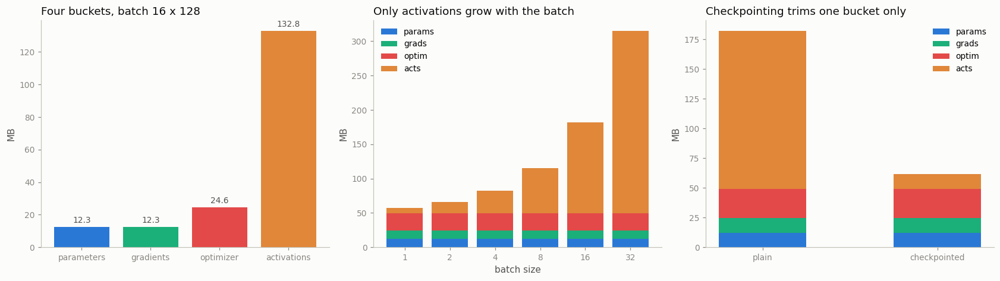

# Memory Breakdown

---

> Training memory is four buckets — know which one overflows.

---

## Key Insight

Training memory has four parts: the model parameters, their [gradients](/shared/glossary/#gradients), the [optimizer state](/shared/glossary/#optimizer-state) ([Adam](/shared/glossary/#adam) keeps two extra values per parameter), and the [activations](/shared/glossary/#activations) saved for the backward pass. Summing these predicts usage, which `torch.cuda.memory_summary()` then confirms.

## Why This Matters

When you hit out-of-memory, knowing which bucket is largest tells you which lever to pull — a smaller batch, [gradient checkpointing](/shared/glossary/#gradient-checkpointing), or a lighter optimizer — instead of guessing.

---

**This is project 27.** A 3.2 M-parameter [transformer](/shared/glossary/#transformer),
one training step, four numbers. Three of the four buckets can be counted
exactly with one line of Python each. The fourth — activations — has no counter
in PyTorch, so we build one.

What `run.py` finds:

- the parameter formula is **exact**: `12·d²` per block plus the embeddings
  predicts all **3,225,088** parameters with **0.00 %** error
- at batch 16 × sequence 128 the split is params **12.30 MB** / grads
  **12.30 MB** / optimizer **24.61 MB** / activations **132.80 MB** — the
  activations are **73 %** of the total
- only the activation bucket grows with the batch. The other three are
  **49.21 MB** no matter what, and the **crossover is at batch 5.9**: above
  that, everything you save has to come out of the activations
- a hand-written estimate of the activations lands within **5 %** of the
  measured number, so you can size a model before you own the GPU
- [gradient checkpointing](/shared/glossary/#gradient-checkpointing) cuts the
  activation bucket and touches nothing else
- the same arithmetic says a **7 B** model needs **104 GB** to fine-tune in
  [float32](/shared/glossary/#float32) with [AdamW](/shared/glossary/#adamw)
  before a single activation is stored — which is why nobody does that

---

## Files

| file | what it is |
|---|---|
| `run.py` | the measurement — all seven sections |
| `../24-profile-a-training-step/perf_lib.py` | the shared model and the byte counters |
| `outputs/findings.csv` | every number quoted here |
| `outputs/memory_breakdown.png` | the three figures |

```bash
python3 run.py     # ~2 min; needs torch, numpy, matplotlib
```

---

## The four buckets

When people say "the model doesn't fit", they almost never mean the model. Here
is everything a training step holds in memory at once:

| bucket | what it is | lives for |
|---|---|---|
| **parameters** | the [weights](/shared/glossary/#weights) themselves | the whole run |
| **gradients** | one number per parameter, written by `backward()` | until `zero_grad()` |
| **optimizer state** | Adam's two running averages per parameter | the whole run |
| **activations** | intermediate results the [backward pass](/shared/glossary/#backward-pass) will need | forward → backward |

> **"Isn't the gradient bucket already the parameter bucket?"** No — they are
> two separate tensors of the same shape. `p` holds the weight, `p.grad` holds
> its gradient, and both are alive at the same moment (the optimizer needs both
> to compute the update). Same size, twice the memory.

Measured on the shared model, batch 16 × sequence 128:

| bucket | bytes | share |
|---|---|---|
| parameters | 12.30 MB | 6.8 % |
| gradients | 12.30 MB | 6.8 % |
| optimizer state (AdamW) | 24.61 MB | 13.5 % |
| **activations** | **132.80 MB** | **73.0 %** |
| total | 182.01 MB | |

The rule of thumb that falls out: with Adam in float32, **the model costs 16
bytes per parameter** (4 weight + 4 gradient + 8 state) before you have run a
single sample through it.

---

## Counting parameters without running the model

Every parameter in a standard transformer block is one of six matrices:

```
qkv   : d x 3d      = 3d²        proj  : d x d   = d²
fc1   : d x 4d      = 4d²        fc2   : 4d x d  = 4d²
                                 ------------------------
                                 total = 12d² per block
```

Plus the embeddings (`vocab × d` for tokens, `seq × d` for positions), the
[LayerNorms](/shared/glossary/#layer-normalization) (2 vectors of `d` each), and
the output head (`vocab × d`). Adding those gives **3,225,088** — the number
PyTorch reports, to the digit.

This matters because it is a *prediction*. You can size a model that does not
exist yet, on a GPU you have not bought yet, from four integers: depth, width,
vocabulary and sequence length.

---

## Counting activations, which PyTorch will not tell you

There is no `count_the_activations()` in PyTorch. On [CUDA](/shared/glossary/#cuda)
you can read `torch.cuda.max_memory_allocated()`, which reports the peak of the
whole allocator — activations mixed together with everything else. On CPU even
that does not exist.

So we count them at the source. Every time an operation stashes a tensor for its
backward, [autograd](/shared/glossary/#autograd) routes it through a *pack hook*:

```python
with torch.autograd.graph.saved_tensors_hooks(pack, unpack):
    loss = loss_fn(model(x), y)
    loss.backward()
```

`pack` sees the tensor on the way in, adds its bytes to a running total, and
attaches a `weakref.finalize` that subtracts them again when autograd finally
lets go. The result is a *live* number with a peak, not just a running sum.

> **"Why a weak reference instead of just adding up the bytes?"** Because a
> running sum answers the wrong question. Peak memory is what makes a run crash,
> and the peak depends on when tensors are *freed*, which a sum never sees. The
> weak reference fires exactly when the last owner of a tensor disappears, so
> the counter goes down as well as up. (Parameters are filtered out by
> `data_ptr()` — a Linear layer "saves" its own weight for the backward pass,
> but that weight is already counted in the parameter bucket.)

The hand estimate: each block keeps roughly 17 tensors of shape
`batch × seq × d` (two LayerNorm tensors, the three q/k/v projections, the
attention output, the residual input, and — the expensive ones — the two
`4d`-wide tensors around the [GELU](/shared/glossary/#gelu)). That predicts
**140.50 MB** against a measured **132.80 MB**: a **0.95×** ratio, close enough
to plan with.

The number that transfers to any model: **8.30 MB of activations per sample**
here. Double the batch, double that. Which brings us to the sweep.

---

## Only one bucket grows



| batch | activations | share of total |
|---|---|---|
| 1 | 8.30 MB | 14 % |
| 2 | 16.60 MB | 25 % |
| 4 | 33.20 MB | 40 % |
| 8 | 66.40 MB | 57 % |
| 16 | 132.80 MB | 73 % |
| 32 | 265.59 MB | 84 % |

Parameters, gradients and optimizer state are **49.21 MB at every batch size**.
Activations are 8.30 MB × batch. Set the two equal and you get the crossover:

```
crossover batch = 49.21 / 8.30 = 5.9
```

Below batch 6 this model is dominated by things a smaller batch cannot fix.
Above it, the batch is the whole story. This single number tells you which
advice applies to you — and it is why "just lower the batch size" works
wonderfully for some people and does nothing for others.

---

## What each optimizer costs

| optimizer | state | multiple of parameters |
|---|---|---|
| [SGD](/shared/glossary/#sgd) | 0.0 KB | 0× |
| SGD + [momentum](/shared/glossary/#momentum) | 12.30 MB | 1× |
| [Adam](/shared/glossary/#adam) | 24.61 MB | 2× |
| [AdamW](/shared/glossary/#adamw) | 24.61 MB | 2× |

Adam keeps two running averages per parameter — `exp_avg` (the mean of recent
gradients) and `exp_avg_sq` (the mean of recent squared gradients) — so its
state is exactly twice the model. Plain SGD keeps nothing at all: it uses the
gradient and throws it away.

That is a real 2× on the *parameter-shaped* buckets, and it is why every
memory-saving paper (8-bit Adam, Adafactor, ZeRO) starts by attacking the
optimizer state rather than the weights.

---

## What checkpointing does, and what it does not

[Gradient checkpointing](/shared/glossary/#gradient-checkpointing) — the subject
of [project 10](../10-gradient-checkpointing/README.md) — throws away most saved
activations and recomputes them during the backward pass:

```python
for blk in model.blocks:
    h = checkpoint(blk, h, use_reentrant=False)   # save the input, forget the rest
```

Measured here, the activations held after the forward pass drop from
**132.80 MB to 12.55 MB**, and the other three buckets do not move at all,
because checkpointing changes nothing about what the optimizer holds — it
changes what the *graph* holds.

> **Read that 10.58× as an upper bound, not as the saving.** Our counter sees
> every tensor autograd stashes during the forward pass, and checkpointing does
> stash almost nothing. But during the *backward* pass each block's activations
> come back, one block at a time, and this counter cannot see them:
> `torch.utils.checkpoint` installs its own `saved_tensors_hooks` around the
> recomputation, which shadows ours. [Project
> 10](../10-gradient-checkpointing/README.md) measured the true peak with a
> hand-written checkpoint function and found **4.8×** — the honest number for
> this kind of model, and a good example of a measurement tool changing the
> answer it reports. Any technique lands in
exactly one bucket, and knowing which one is the point of this project:

| lever | bucket it touches |
|---|---|
| smaller batch | activations |
| gradient checkpointing | activations |
| a lighter optimizer (SGD, 8-bit Adam) | optimizer state |
| [LoRA](/shared/glossary/#lora) / freezing layers | gradients **and** optimizer state |
| [mixed precision](/shared/glossary/#amp) | activations (halved), *not* parameters |

---

## The bucket you can hand back between steps

```python
opt.zero_grad(set_to_none=False)   # grad bytes: 12.30 MB  (zeros, still allocated)
opt.zero_grad(set_to_none=True)    # grad bytes: 0.0 KB    (the tensors are gone)
```

`set_to_none=True` is the default in modern PyTorch, and this is why: writing
zeros into 3.2 M floats costs time *and* keeps the memory. Dropping the tensors
costs nothing and returns the bytes to the allocator.

The catch, measured back in [project 14](../14-custom-optimizer/README.md): a
parameter with `grad = None` is *skipped* by the optimizer, while a parameter
with `grad = 0` still receives its momentum and weight-decay update. On a branch
that gets no gradient this turns into a real difference in the weights.

---

## The same arithmetic at real scale

Nothing above depends on the model being small. Per parameter:

| setup | bytes / parameter | 1 B model | 7 B model |
|---|---|---|---|
| fp32 + AdamW | 4 + 4 + 8 = 16 | 14.9 GB | 104.3 GB |
| mixed precision + AdamW | 2 + 4 + 4 + 8 = 18 | 16.8 GB | 117.3 GB |
| frozen bf16 weights (inference / LoRA base) | 2 | 1.9 GB | 13.0 GB |

Two things a beginner should read off this table:

1. **Mixed precision does not reduce this total — it slightly increases it.**
   [AMP](/shared/glossary/#amp) keeps a [bfloat16](/shared/glossary/#bfloat16)
   copy of the weights *in addition to* the float32 master copy it updates, so
   the parameter-shaped buckets grow by 2 bytes per parameter. AMP saves memory
   in the *activation* bucket, which this table does not include. If someone
   tells you AMP halves your memory, ask which bucket they measured.
2. **A 7 B model fits on a 24 GB card for inference (13.0 GB) and cannot be
   fully fine-tuned on it at any batch size (104 GB).** That gap — 8× — is the
   entire reason LoRA, ZeRO and FSDP exist. Each one attacks a different bucket
   in the table.

---

## What to take away

1. **Four buckets, and only one of them scales with the batch.** Measure the
   split before you tune anything; the crossover batch size tells you which
   advice applies.
2. **Three buckets can be counted exactly, on paper, before you run anything.**
   16 bytes per parameter with Adam in fp32.
3. **The fourth needs a hook, but a hand estimate gets within 5 %.** ~17 tensors
   of `batch × seq × d` per transformer block.
4. **Every optimization lands in exactly one bucket.** Matching the lever to the
   bucket is the difference between a fix and a fashion.

---

Next: [project 28](../28-gradient-accumulation/README.md) picks the activation
bucket up and squeezes it — running a batch in `k` pieces so that only one
piece's activations exist at a time, and checking that the gradients really are
the ones the big batch would have produced.
