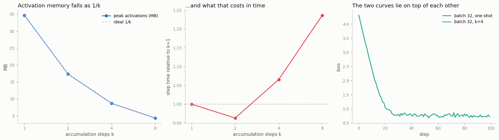

# Gradient Accumulation

---

> Add up the gradients of several small batches, then step as if the batch were huge.

---

## Key Insight

[Gradient accumulation](/shared/glossary/#gradient-accumulation) runs several small batches, adds up their [gradients](/shared/glossary/#gradients), and only calls the [optimizer](/shared/glossary/#optimizer)'s step after a set number of them. Because gradients add, the result matches one large batch — while only one small batch's [activations](/shared/glossary/#activations) ever sit in memory at once.

## Why This Matters

It lets a small GPU train at a large effective batch size, reproducing results that would otherwise need bigger or more numerous GPUs.

---

**This is project 28.** [Project 27](../27-memory-breakdown/README.md) showed that
the activation bucket is the one that grows with the batch. This project shrinks
it — and then checks, gradient by gradient, that the trick is really free.

What `run.py` finds:

- 4 micro-batches of 8 reproduce one batch of 32 to a **relative error of
  1.7e-07** — float noise, not a difference in the maths
- but they are **not bit-identical**, and the reason is worth knowing: float
  addition is not associative, so a different summation order gives a slightly
  different answer
- forgetting to divide by `k` inflates the gradient by **exactly k** — the norm
  ratio is 2.0000 / 4.0000 / 8.0000, so this bug is a hidden learning-rate
  multiplier, not a crash
- **uneven micro-batches are a real bug**: splitting 32 into 20 + 8 + 4 and
  averaging the three losses gives a **21 % wrong** gradient
- **[BatchNorm](/shared/glossary/#batch-normalization) breaks the equivalence
  outright** (35 % error) while [LayerNorm](/shared/glossary/#layer-normalization)
  does not (1.8e-07) — and the reason tells you exactly which layers are safe
- **dropout did *not* break it here**, for a reason that does not hold on a GPU
- the trade measured end to end: **8× less activation memory for a
  1.24× longer step**
- 100 real training steps, accumulated and not, end at the same loss to
  **6e-08**

---

## Files

| file | what it is |
|---|---|
| `run.py` | all seven sections |
| `../24-profile-a-training-step/perf_lib.py` | the shared model and the activation-byte counter |
| `outputs/findings.csv` | every number quoted here |
| `outputs/gradient_accumulation.png` | the three figures |

```bash
python3 run.py     # ~3 min; needs torch, numpy, matplotlib
```

---

## The idea in four lines

```python
opt.zero_grad(set_to_none=True)
for xc, yc in torch.chunk(x, k):        # k micro-batches
    (loss_fn(model(xc), yc) / k).backward()   # gradients ACCUMULATE into p.grad
opt.step()
```

The whole trick rests on one property of `backward()` that usually annoys
people: **`p.grad` accumulates rather than overwrites**. That is why every
training loop calls `zero_grad()`. Here it is the feature — each micro-batch
adds its contribution, and after `k` of them `p.grad` holds the sum.

> **"If the gradient of a batch is the average over its samples, why does adding
> them up give the right answer?"** Because each micro-batch's loss is already
> an average over *its* samples, so summing `k` of them gives `k` times the
> answer you want. Dividing each by `k` before `backward()` fixes it. The
> gradient of a sum is the sum of the gradients — that is the linearity that
> makes the whole technique exact rather than approximate.

---

## It really is exact

Same weights, same 32 samples, one big batch versus `k` micro-batches:

| k | max absolute difference | relative | cosine similarity |
|---|---|---|---|
| 2 | 7.45e-09 | 1.71e-07 | 1.0000000000 |
| 4 | 7.45e-09 | 1.71e-07 | 1.0000000000 |
| 8 | 5.59e-09 | 1.28e-07 | 1.0000000000 |

The largest gradient in the model is 0.044, so an absolute error of 7e-09 is
about seven parts in a hundred million.

**It is not zero, and it never will be.** Floating-point addition is not
associative: `(a + b) + c` and `a + (b + c)` can differ in the last bit. The big
batch sums 32 samples inside one kernel; the accumulated version sums 8 at a
time and then adds four partial results. Same numbers, different order, last-bit
differences. This is the same effect [project 7](../07-manual-backprop/README.md)
watched grow into a 0.357 divergence over 400 steps — which is why the honest
test of "are these gradients the same" is *at fixed weights*, never by comparing
two loss curves.

---

## Bug 1 — forgetting the 1/k

| k | ‖accumulated‖ / ‖big batch‖ |
|---|---|
| 2 | 2.0000 |
| 4 | 4.0000 |
| 8 | 8.0000 |

Nothing raises. The gradient just points the same way and is `k` times longer,
which — for [SGD](/shared/glossary/#sgd) — is identical to multiplying the
[learning rate](/shared/glossary/#learning-rate) by `k`. Training either diverges
or looks mysteriously "too fast", and the accumulation code looks innocent.

There are two correct conventions and you must pick one:

- divide each micro-batch loss by `k` (used here), or
- sum the losses and divide the *learning rate* by `k`.

---

## Bug 2 — uneven micro-batches

Split 32 samples into 20 + 8 + 4 and average the three losses:

| version | relative error |
|---|---|
| mean of the three means | **2.15e-01** (21 % wrong) |
| each loss weighted by its sample count | 1.71e-07 |

The mean of means is not the mean. The 4-sample chunk gets the same vote as the
20-sample chunk, so those four samples count five times too much.

This is not a contrived case. It is the normal case in language-model training,
where micro-batches hold different numbers of *tokens* even when they hold the
same number of sequences. The fix is the second row: weight each micro-batch by
its share of the real total.

```python
(loss_fn(model(xc), yc) * len(xc) / total_samples).backward()
```

---

## Bug 3 — BatchNorm

| layer | relative error, k=4 vs one batch |
|---|---|
| [BatchNorm1d](/shared/glossary/#batch-normalization) | **3.51e-01** |
| [LayerNorm](/shared/glossary/#layer-normalization) | 1.81e-07 |

BatchNorm normalizes each feature using the **mean and variance of the batch**.
Cut the batch into four and it computes four different means — of 8 samples each,
not 32 — so the forward pass computes different numbers, and no amount of
gradient bookkeeping can repair that. The equivalence proof above assumed the
loss is a *sum over independent samples*; BatchNorm makes samples depend on each
other, so the assumption is false.

LayerNorm normalizes each sample across its own features, never looking at its
neighbours, so it is untouched. The same is true of RMSNorm and GroupNorm.

> **"So is accumulation useless for CNNs?"** Not useless, but not exact. The
> practical workarounds are the ones the field already uses: replace BatchNorm
> with GroupNorm, freeze the BatchNorm statistics (`model.eval()` for those
> layers), or accept that your effective normalization batch is the *micro*-batch
> and tune accordingly. It is worth knowing that this is also exactly why
> BatchNorm behaves differently under [DDP](/shared/glossary/#ddp) and needs
> `SyncBatchNorm`: same cause, different symptom.

---

## The one that did not break: dropout

| setup | relative error |
|---|---|
| [dropout](/shared/glossary/#dropout) on, same seed | 1.71e-07 |
| eval mode (dropout off) | 1.63e-07 |

Surprising — and it is a property of this machine, not of accumulation. On CPU
the random number generator is consumed **sequentially**: drawing one 32×128
mask walks the same stream as drawing four 8×128 masks in a row, so the masks
come out identical. `run.py` checks that directly, and it is `True`.

On CUDA each kernel launch is handed its own offset into the random stream, so
one big dropout launch and four small ones generally produce *different* masks —
the gradients then differ by a real amount, not by float noise. The lesson is
not "dropout is safe"; it is **"anything that consumes randomness makes the
equivalence depend on how the RNG is scheduled, so verify it on the device you
actually train on."**

---

## What it buys and what it costs



Effective batch 32 in every row; only `k` changes:

| k | micro-batch | peak activations | step time |
|---|---|---|---|
| 1 | 32 | 34.67 MB | 39.7 ms |
| 2 | 16 | 17.34 MB | 38.3 ms |
| 4 | 8 | 8.67 MB | 42.3 ms |
| 8 | 4 | 4.33 MB | 49.1 ms |

(The four rows were timed **interleaved** — one round of each, three times over,
keeping the minimum — because measuring k=1 to exhaustion and only then k=8 lets
a busy minute on a shared machine land entirely on one of them.)

**Memory falls as exactly 1/k** — 8.00× at k=8, sitting on the ideal line — 
because at any instant only one micro-batch's activations are alive. The other
three buckets from [project 27](../27-memory-breakdown/README.md) do not move at
all: parameters, gradients and optimizer state are the same tensors regardless
of how you feed them.

**Time gets worse, and this is the honest cost.** At k=8 the step takes 1.24× as
long. Two reasons: the same total work is now done in 8 launches instead of 1
(fixed per-call overhead is paid 8 times), and small matrices use the hardware
less efficiently than big ones. Accumulation buys memory with time — it does not
make the arithmetic cheaper.

---

## 100 real steps

| run | final loss |
|---|---|
| batch 32, one shot | 0.72183 |
| batch 32 as 4 × 8 | 0.72183 |

After 100 [AdamW](/shared/glossary/#adamw) steps the largest difference between
any two corresponding weights is **4.24e-05**, on weights that average 0.074 in
magnitude — about one part in two thousand, grown from that 1e-07 per-step
rounding difference by 100 steps of a chaotic optimizer. The loss curves lie on
top of each other.

That drift is the expected behaviour, not a bug: identical mathematics, plus
last-bit rounding, plus a hundred steps of amplification. If you need
*bit*-identical runs, accumulation is not the tool — but if you need the same
model, it is.

---

## What to take away

1. **Accumulation is exact, to float noise, and the proof is one line:** the
   gradient of a sum is the sum of the gradients.
2. **Three ways to break it, all silent:** forget the `1/k` (a hidden ×k on the
   learning rate), use uneven micro-batches (21 % wrong here), or use a layer
   that mixes samples together (BatchNorm, 35 % wrong).
3. **You are trading time for memory**: 1/k of the activations at 1.24× the step
   time, in this measurement.
4. **Check the equivalence yourself, at fixed weights.** Comparing loss curves
   cannot tell a correct implementation from a broken one.

---

Next: [project 29](../29-bottleneck-fix/README.md) closes Phase 5 with the
opposite kind of problem — a script where the obvious optimization,
`torch.compile`, makes things *slower*, and the fix is to find out what the
compiler could not swallow.
