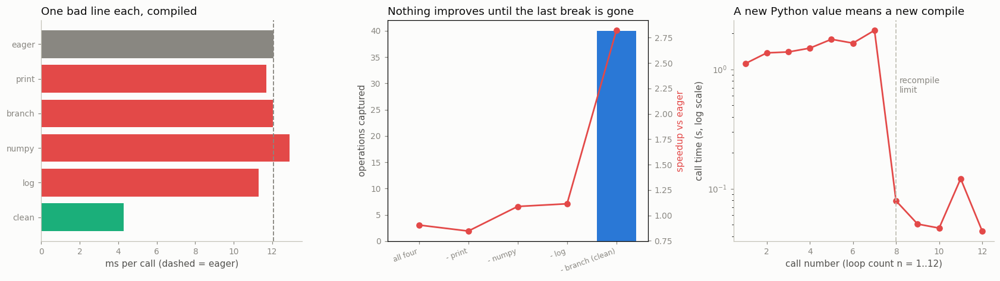

# Bottleneck Fix

---

> Sometimes the compiler makes things slower — and the cure is to stop breaking its graph.

---

## Key Insight

[`torch.compile`](/shared/glossary/#torchcompile) is fastest on one unbroken graph. When it meets code it cannot trace — a `print`, a data-dependent branch, an unsupported op — it inserts a [graph break](/shared/glossary/#graph-break), splitting the model and falling back to slow [eager mode](/shared/glossary/#eager-mode) in between, sometimes making the whole run slower than not compiling at all.

## Why This Matters

Finding and removing graph breaks (with `TORCH_LOGS="graph_breaks"`) restores the speedup the compiler promised, and teaches you exactly which Python the compiler can and cannot handle — turning a [bottleneck](/shared/glossary/#bottleneck) back into a win.

---

**This is project 29**, and the last of Phase 5. It takes the one workload in
[project 26](../26-torch-compile-test/README.md) where the compiler clearly won —
a chain of element-wise operations, 2.8× faster compiled — and ruins it with four
lines of Python that every one of us has written.

What `run.py` finds:

- compiled cleanly, the chain runs at **4.28 ms against eager's 12.06 ms —
  2.82×**, from **40 captured operations in 1 graph**
- add **any one** of a `print`, an `if x.max().item() > …`, a NumPy round trip,
  or a `stats.append(x.std().item())`, and the compiler captures **0 operations**
  and the speedup becomes **0.93× – 1.07×**: at best nothing, at worst a
  slowdown
- so removing three of the four problems buys **exactly nothing** — the
  captured-operation count stays at 0 until the *last* break is gone, and then
  jumps to 40
- the fix that keeps the feature: rewriting the branch with `torch.where`
  captures **45 operations, 0 breaks, 2.68×** and returns bit-comparable results
- Dynamo tells you all of this itself, in sentences with hints and a
  documentation link — `outputs/graph_breaks.txt` is its raw output
- the second trap has nothing to do with breaks: a Python **number** baked into
  the graph gives **8 compiles for 12 calls**, hits `recompile_limit`, and then
  silently runs eager forever

---

## Files

| file | what it is |
|---|---|
| `run.py` | all six sections |
| `../24-profile-a-training-step/perf_lib.py` | the shared timing helpers |
| `outputs/findings.csv` | every number quoted here |
| `outputs/graph_breaks.txt` | what Dynamo said about each planted line, verbatim |
| `outputs/bottleneck_fix.png` | the three figures |

```bash
python3 run.py     # ~4 min; needs torch, numpy, matplotlib and a C++ compiler
```

---

## The patient

Eight rounds of element-wise arithmetic on a 16 × 128 × 256 tensor — the
[memory-bound](/shared/glossary/#memory-bound) workload where
[kernel fusion](/shared/glossary/#kernel-fusion) has the most to offer:

```python
for i in range(8):
    x = F.gelu(x) * 1.01 + torch.tanh(x) * 0.5

    print(f"round {i}: ok")                       # (1) a debug print
    if x.abs().max().item() > 1e9:                # (2) a data-dependent branch
        x = x * 0.5
    x = x - float(np.mean(x.detach().numpy()))    # (3) a numpy round trip
    log.append(x.std().item())                    # (4) a running statistic
```

Every one of those four lines is ordinary. None of them is a bug. Line (2) never
even fires — `1e9` is far above anything in the tensor. And each one, on its own,
costs the entire speedup.

---

## What each one does



| version | time | vs eager | operations captured |
|---|---|---|---|
| eager (no compile) | 12.06 ms | 1.00× | — |
| **compiled, clean** | **4.28 ms** | **2.82×** | **40** in 1 graph |
| compiled + `print` | 11.70 ms | 1.03× | 0 |
| compiled + `.item()` branch | 12.06 ms | 1.00× | 0 |
| compiled + numpy | 12.91 ms | **0.93×** | 0 |
| compiled + `.item()` logging | 11.29 ms | 1.07× | 0 |

The eager time varies by **16.4 %** between rounds on this shared machine, so
treat everything between 0.93× and 1.07× as "no effect". The one number that is
not ambiguous is the last column: **40 operations captured, or none at all.**

The numpy row is the honest version of this project's title: compiled is
*slower* than eager. You paid an 8-second compile and got a 7 % slowdown, because
the compiler ran the tracing machinery, gave up, and left you with plain eager
execution plus guard checks.

---

## Dynamo explains itself

You do not have to guess which line is the problem. Every break is recorded, and
the message is written for humans (`outputs/graph_breaks.txt`, verbatim):

```
Unsupported Tensor.item() call with capture_scalar_outputs=False
  Explanation: Dynamo does not support tracing `Tensor.item()` with
               config.capture_scalar_outputs=False.
  Hint: Set `torch._dynamo.config.capture_scalar_outputs = True` ...
```

```
Failed to trace builtin operator
  Explanation: Dynamo does not know how to trace builtin operator `print` ...
  Hint: If you are attempting to call a logging function (e.g. `print`), you can
        try adding it to `torch._dynamo.config.reorderable_logging_functions`.
```

Three ways to see them, in increasing order of convenience:

```bash
TORCH_LOGS="graph_breaks" python train.py     # env var, no code change
```
```python
torch._dynamo.config.verbose = True            # more detail in the traceback
counts = torch._dynamo.utils.counters["unimplemented"]   # what run.py reads
```

> **Why does `.item()` break the graph at all?** Because it moves a number *out
> of* the tensor world and into Python. The compiler is building a recipe to run
> later, in which the tensors are placeholders with shapes and dtypes but no
> values — it does not know what the numbers will be. `.item()` demands an actual
> value now, and on a GPU that means stopping everything and waiting for the
> device to finish (a synchronization). Dynamo cannot put "wait for a value and
> then decide" into a graph, so it stops the graph there. The NumPy line breaks
> for the same underlying reason: `x.numpy()` needs the real data, which the
> profiler-visible message names `aten._local_scalar_dense`.

> **"But my branch never even runs. Why does it matter?"** Because tracing
> happens once, before any values exist. `if <a number> > 1e9` has to be decided
> at trace time, and at trace time the number is unknown. A graph is a fixed
> sequence of operations; a branch that depends on data is not fixed. The
> compiler cannot bake in one side without being wrong on the other, so it stops.

---

## Removing three of the four buys nothing

| what is left | time | vs eager | operations captured |
|---|---|---|---|
| all four problems | 13.31 ms | 0.91× | 0 |
| − print | 14.25 ms | 0.85× | 0 |
| − numpy | 11.08 ms | 1.09× | 0 |
| − logging | 10.82 ms | 1.11× | 0 |
| − branch (**clean**) | **4.28 ms** | **2.82×** | **40** |

This is the most useful shape in the project. Three quarters of the work bought
**zero**; the last quarter delivered everything. Fixing graph breaks is not a
gradual, keep-going-until-it-feels-fast activity — it is a **gate**. Until the
function traces end to end, you are paying compile time to run eager code.

(Whether a *partial* fix helps at all depends on where the breaks fall. If they
were spread out, you would get several medium graphs and part of the win. Here
every break lands in the middle of a tight chain, so Dynamo bails out of the
whole function. Either way the message is the same: check the captured-operation
count, not the clock.)

---

## Keeping the feature, losing the break

The branch was there for a reason. You do not have to delete it — you have to
express it as a tensor operation, so it stays inside the graph:

```python
# breaks the graph: a Python `if` on a Python number
if x.abs().max().item() > 1e9:
    x = x * 0.5

# stays in the graph: both sides computed, one selected, all in tensors
x = torch.where(x.abs().max() > 1e9, x * 0.5, x)
```

| | operations captured | breaks | time | vs eager |
|---|---|---|---|---|
| `torch.where` version | **45** | **0** | 4.49 ms | **2.68×** |

Same answer (`allclose` is `True` against the branching version), no `.item()`,
no synchronization, full speedup. It computes `x * 0.5` even when it is not
needed — which is the price — but that is one cheap element-wise pass against a
2.68× speedup.

The same recipe covers the other three:

| problem | fix |
|---|---|
| `print` inside the model | log outside the compiled region, or every N steps from the training loop |
| `if …item() > t` | `torch.where`, or hoist the decision out of the model |
| NumPy round trip | do the arithmetic in torch (`x.mean()` instead of `np.mean(x.numpy())`) |
| `stats.append(x.std().item())` | append the *tensor* (`x.std().detach()`), and call `.item()` later, outside |

---

## The other trap: a Python number in the graph

Graph breaks are not the only way to lose. This function has no breaks at all:

```python
def variable_rounds(x, n):
    for _ in range(n):
        x = F.gelu(x) * 1.01 + torch.tanh(x) * 0.5
    return x
```

Called with `n = 1, 2, 3, …, 12`:

| | measured |
|---|---|
| unique graphs compiled | **8** |
| total time for 12 calls | 11.3 s |
| first call | 1.11 s |
| twelfth call | 0.044 s |

`n` is a plain Python integer, so Dynamo *specializes* on it: the loop is
unrolled into the graph, and `n = 4` produces different code from `n = 3`. Each
new value is a new compile. After `recompile_limit` (8 by default) is reached,
Dynamo gives up on the function and runs it in eager mode from then on — which is
why call 12 is fast: **nothing is compiled any more**. You are left with the
compile bill and none of the benefit, and nothing in the output says so.

> **"Isn't this the same as the shape changes in
> [project 26](../26-torch-compile-test/README.md)?"** No, and the difference is
> the point. Tensor *shapes* have an escape hatch: after seeing a second shape,
> Dynamo re-compiles once with that dimension left symbolic, and six different
> batch sizes cost two compiles. Plain Python numbers have no such treatment —
> there is no "symbolic 4" that can also be 5 when the value controls a loop.
> The fix is to stop making the number a Python value: pass it as a tensor, keep
> it fixed, or mark it dynamic yourself with
> `torch._dynamo.mark_dynamic`.

This also has a practical consequence for *this script*: it compiles ten
variants of the same function, and Dynamo caches compiled code per **code
object**, not per closure. Compiling them in one process makes them contaminate
each other — after one variant breaks, the next is skipped without being traced
at all, and reports a fake "0 operations captured". `run.py` calls
`torch._dynamo.reset()` before every single compile for exactly that reason. The
first version of this script did not, and it measured the clean variant at
1.01× instead of 2.82×.

---

## What to take away

1. **Check the captured-operation count, not the clock.** 40 or 0 is
   unambiguous; 1.03× on a shared machine is not.
2. **One break can cost the whole win** — and can leave you *slower* than eager
   (0.93× here) after paying an 8-second compile.
3. **Partial fixes buy nothing.** It is a gate, not a gradient.
4. **`.item()`, `print`, and `.numpy()` are the three usual suspects**, all for
   the same reason: they demand a real value while the compiler is still writing
   a recipe.
5. **Rewrite, do not delete**: `torch.where` keeps the branch and the speedup.
6. **Python numbers get baked in.** Eight compiles, then a silent fallback to
   eager forever.

---

Phase 5 ends here. [Project 24](../24-profile-a-training-step/README.md) measured
where a step goes, [25](../25-amp-speedup-study/README.md) tried to make each
operation cheaper, [26](../26-torch-compile-test/README.md) tried to run fewer of
them, [27](../27-memory-breakdown/README.md) and
[28](../28-gradient-accumulation/README.md) took memory apart and traded it for
time, and this project fixed the compiler when it turned against us. Phase 6
stops asking PyTorch for faster kernels and writes them: C++, CUDA and Triton
extensions.
