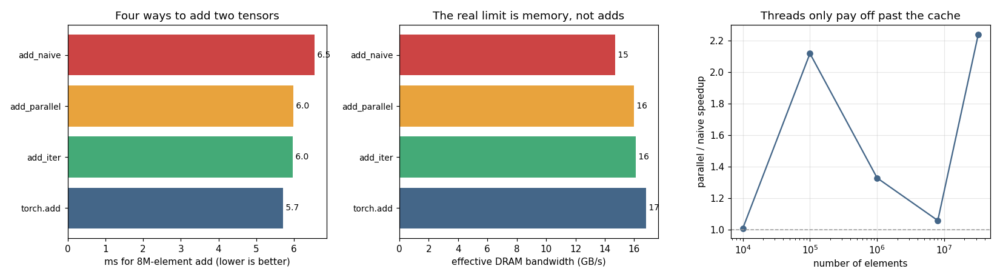

# C++ Extension for Elementwise Add

---

> When Python is too slow, drop into C++ — and PyTorch will still treat it like a built-in op.

---

## Key Insight

A [C++ extension](/shared/glossary/#c-extension) lets you write an operation in C++ (or [CUDA](/shared/glossary/#cuda)), compile it, and call it from Python as if it were built in. Writing an [elementwise](/shared/glossary/#elementwise-operation) `add_cuda`, registering it, and calling it shows the full path a call travels — from Python, through the [dispatcher](/shared/glossary/#dispatcher), down to a compiled [kernel](/shared/glossary/#kernel).

## Why This Matters

This is your escape hatch when an operation is missing or too slow. A custom extension is exactly how new ops enter PyTorch, so walking the path once makes the framework feel less like a black box.

---

**This is project 30**, the first of Phase 6. Every project from here writes a
[kernel](/shared/glossary/#kernel) by hand. This one writes the simplest kernel
that exists — adding two tensors — four different ways, and finds that the
interesting question is not "is it fast?" but "is it *right*?"

What `run.py` finds:

- the obvious pointer loop is **wrong on 2 of 4 ordinary inputs** — a transposed
  tensor and a strided slice — and it does not raise, it returns numbers
- it is **also** silently wrong on mismatched shapes, and would read past the end
  of the buffer on a broadcast input
- speed is a non-event: naive **4.93 ms**, threaded **4.74 ms**,
  [TensorIterator](/shared/glossary/#tensoriterator) **4.81 ms**, `torch.add`
  **4.77 ms** — all four are within the noise, all four hit **~20 GB/s**
- threading buys **1.03×** at 10 000 elements and **2.41×** at 32 million; the
  crossover is where the data stops fitting in
  [cache](/shared/glossary/#cpu-cache-hierarchy)
- registering with [TORCH_LIBRARY](/shared/glossary/#torch_library) gives a real
  `torch.ops.p30.add` with a schema — and it still has **no
  [autograd](/shared/glossary/#autograd)**: `backward()` raises
- compiling costs **23 s**, and `load_inline` does **not** cache: calling it
  again on byte-identical source costs **22.3 s** again

---

## Files

| file | what it is |
|---|---|
| `kernels_lib.py` | the shared build/timing helpers for all of Phase 6 (30–35) |
| `run.py` | all six sections |
| `outputs/findings.csv` | every number quoted here |
| `outputs/double_load.txt` | what happens when one process loads the same `TORCH_LIBRARY` twice |
| `outputs/cpp_extension.png` | the three figures |

```bash
python3 run.py     # ~2 min; needs torch, matplotlib, a C++ compiler and ninja
```

If it stops with `Ninja is required to load C++ extensions`, run
`pip install ninja` — [Ninja](/shared/glossary/#ninja) is the small build tool
PyTorch drives when it compiles your source.

---

## A note on the hardware, and why there is no GPU here

Phase 6 in the guide is about CUDA and [Triton](/shared/glossary/#triton). This
machine has a GPU — a GTX 1070 Ti — and it cannot run either. `torch.cuda.is_available()`
returns `True`, and then the first kernel launch fails:

```
CUDA error: no kernel image is available for execution on the device
```

The card is compute capability **sm_61** (Pascal, 2017). This PyTorch build ships
no Pascal kernels, and Triton's own minimum is sm_70. So every kernel in Phase 6
is written in C++ for the CPU.

Almost nothing is lost, because the ideas are not GPU-specific — they are about a
**fast small memory and a slow big one**, which both machines have:

| GPU concept | what plays its role here |
|---|---|
| thread block / Triton program | one `at::parallel_for` chunk |
| shared memory (on-chip SRAM) | the L1/L2 [cache](/shared/glossary/#cpu-cache-hierarchy) |
| [warp](/shared/glossary/#warp) (32 lanes in lockstep) | an [AVX2](/shared/glossary/#avx2) vector, 8 floats wide |
| [HBM](/shared/glossary/#hbm) bandwidth | [DRAM](/shared/glossary/#dram) bandwidth |
| [kernel launch](/shared/glossary/#kernel-launch) | a C++ function call |

> **"If the ideas are the same, why does anyone learn CUDA specifically?"**
> Because one difference is real: on a GPU you *copy* data into fast memory
> yourself (`tl.load`), while on a CPU the cache fills itself and you only
> control the *order* you touch things in. Everything about *what* to keep close
> transfers; the *how* differs. Projects 31–34 print the Triton version of each
> kernel next to the C++ so you can see both.

---

## Compiling C++ from a running Python program

The whole extension is one string:

```python
from torch.utils.cpp_extension import load_inline

mod = load_inline(
    name="p30_add",
    cpp_sources=CPP,                                # a string of C++
    functions=["add_naive", "add_iter"],            # which ones to expose
    extra_cflags=["-O3", "-march=native", "-fopenmp"],
)
mod.add_naive(a, b)                                 # now callable from Python
```

`load_inline` writes your string to `main.cpp`, generates
[pybind11](/shared/glossary/#pybind11) glue for the functions you named, writes a
`build.ninja`, runs [ninja](/shared/glossary/#ninja), and imports the resulting
`.so`. About 23 seconds later you have a Python function.

The flags matter:

| flag | why |
|---|---|
| `-O3` | without it the loops are not optimized at all |
| `-march=native` | lets gcc use this CPU's [AVX2](/shared/glossary/#avx2) instructions |
| `-fopenmp` | `at::parallel_for` needs the OpenMP runtime to have threads to hand out |

---

## The kernel almost everyone writes first

```cpp
torch::Tensor add_naive(torch::Tensor a, torch::Tensor b) {
  auto out = torch::empty_like(a);
  const float* pa = a.data_ptr<float>();
  const float* pb = b.data_ptr<float>();
  float* po = out.data_ptr<float>();
  for (int64_t i = 0; i < a.numel(); ++i) po[i] = pa[i] + pb[i];
  return out;
}
```

It is short, it is fast, and it is wrong.

| input | `add_naive` | `add_checked` | `add_iter` |
|---|---|---|---|
| both contiguous | correct | correct | correct |
| `b` transposed | **WRONG, max error 6.67** | raises "needs contiguous inputs" | correct |
| `b` is every other column | **WRONG, max error 6.93** | raises "needs contiguous inputs" | correct |
| `b` broadcast from one row | **reads past the end of the buffer** | raises | correct |
| `a` float64 | raises "expected Float, found Double" | raises, with a better message | correct |
| shapes don't match | **no error at all** | raises with both shapes | correct |

Two of these produce *numbers* — plausible-looking, completely wrong numbers, with
no exception anywhere. That is the worst failure mode a kernel can have.

### Why does a transpose break it?

`data_ptr<float>()` hands you the address of the first element and nothing else.
The loop then walks forward one float at a time. That is only the right traversal
if the tensor's elements really are stored one after another.

A [transpose](/shared/glossary/#transpose) does not move any data. `b.t()` is a
[view](/shared/glossary/#view): the same buffer, with the [strides](/shared/glossary/#stride)
swapped, so "next column" and "next row" have traded places. Reading forward
through the buffer therefore reads `b`'s elements in the wrong order — every value
is real, every value is in the wrong place.

`torch.randn(1024, 2048)[:, ::2]` is worse in a different way: the elements it
refers to are *spread out*, every second float, so reading forward reads the ones
in between as well. And `expand` is worst of all — it makes a 1024×1024 view of
1024 real floats by setting a stride to zero, so `numel()` says 1 048 576 while
the buffer holds 1024. Walking forward a million times leaves the allocation
entirely. (`run.py` describes that case rather than running it: reading unowned
memory is undefined behaviour, and a demo that sometimes segfaults teaches
nothing.)

> **"Then why does `empty_like(a)` not have the same problem?"** It does have the
> same strides as `a` — that is what `_like` means. The bug is not that the output
> is laid out oddly; it is that the *input* `b` is laid out differently from what
> the loop assumes. When `a` and `b` happen to share a layout, the naive loop
> accidentally works, which is exactly why this bug survives testing.

---

## Two ways to fix it

**Option 1 — refuse the input.** State your assumptions with `TORCH_CHECK`, which
is PyTorch's assert and raises an ordinary Python `RuntimeError`:

```cpp
TORCH_CHECK(a.sizes() == b.sizes(), "shape mismatch: ", a.sizes(), " vs ", b.sizes());
TORCH_CHECK(a.is_contiguous() && b.is_contiguous(), "add_checked needs contiguous inputs");
```

Four lines turn every silent-wrong-answer above into a clear message. The caller
can then fix it with `b = b.contiguous()`, which copies the data into the layout
your loop expects. This is a completely respectable kernel — most real ones start
here.

**Option 2 — handle any layout,** which is what `torch.add` itself does. ATen has a
loop planner for exactly this, [TensorIterator](/shared/glossary/#tensoriterator):

```cpp
at::Tensor undefined_output;
auto iter = at::TensorIteratorConfig()
    .add_output(undefined_output)     // undefined = "you allocate it"
    .add_input(a).add_input(b).build();

iter.for_each([](char** data, const int64_t* strides, int64_t n) {
  for (int64_t i = 0; i < n; ++i)
    *reinterpret_cast<float*>(data[0] + i * strides[0]) =
        *reinterpret_cast<const float*>(data[1] + i * strides[1]) +
        *reinterpret_cast<const float*>(data[2] + i * strides[2]);
});
```

The difference is `strides`. Your inner loop is handed a *step size per tensor*
instead of assuming 1, so the same three lines are correct on a transposed input,
a strided slice, and a broadcast row — the last one because broadcasting is just a
stride of 0, which makes the loop read the same value every iteration. It costs
nothing at runtime and it is the single most useful thing in this project.

> **"Isn't this the same as calling `.contiguous()` on everything first?"** Not
> quite, and the difference is measurable. `.contiguous()` *copies* — a full read
> and a full write of the tensor before your kernel starts. TensorIterator does
> not copy; it reorders the loop. For a transposed 32 MB input, one costs an extra
> 64 MB of memory traffic and the other costs zero.

---

## Is it fast? (no, and that is the finding)



8 million floats, 32 MB per tensor, best of 9 interleaved rounds:

| kernel | best ms | GB/s | vs `torch.add` |
|---|---|---|---|
| `add_naive` (1 thread) | 5.84 | 16.4 | 0.82× |
| `add_parallel` (6 threads) | 4.74 | 20.2 | 1.01× |
| `add_iter` (TensorIterator) | 4.81 | 20.0 | 0.99× |
| `torch.add` | 4.77 | 20.1 | 1.00× |

The noise floor on this shared machine was **23 %**, so everything except the
single-threaded row is a tie.

Four very different implementations landing on the same number is not a
coincidence — it means none of them is doing the thing that costs time. The
[arithmetic intensity](/shared/glossary/#ai-arithmetic-intensity) of an add is
**0.083 FLOP per byte**: one addition per twelve bytes moved (read 4, read 4,
write 4). The processor could do hundreds of adds in the time those twelve bytes
take to arrive, so it spends nearly all of its time waiting. The kernel is
[memory-bound](/shared/glossary/#memory-bound), and all four are running at the
same **~20 GB/s** because that is what this machine's [DRAM](/shared/glossary/#dram)
delivers.

**The practical consequence: for a memory-bound operation, writing a better kernel
is not the lever.** Doing the arithmetic more cleverly changes nothing. The only
things that help are moving fewer bytes (which is [fusion](/shared/glossary/#kernel-fusion)
— project 33) or moving them fewer times (which is [tiling](/shared/glossary/#tiling)
— project 32).

---

## When do threads start paying?

```
    elements     MB   naive ms  parallel ms  speedup  empty ms
      10,000    0.0      0.004        0.004    1.03x     0.002
     100,000    0.4      0.024        0.014    1.69x     0.003
   1,000,000    4.0      0.391        0.262    1.49x     0.007
   8,000,000   32.0      6.369        5.063    1.26x     0.015
  32,000,000  128.0     60.534       25.109    2.41x     0.046
```

At 10 000 elements, six threads are worth **nothing** — the work is over before
the threads are awake. This is what the [grain size](/shared/glossary/#grain-size)
argument to `at::parallel_for` is for:

```cpp
at::parallel_for(0, a.numel(), 32768, [&](int64_t s, int64_t e) { ... });
//                               ^ below this many elements, don't bother splitting
```

The middle of the table is bumpy (1.69×, 1.49×, 1.26×) and the honest answer is
that several effects overlap there: three 4 MB tensors are right at the edge of the
12 MB L3 cache, and one thread can already saturate a good fraction of the memory
bus. Only at 128 MB, far past every cache, does the clean 2.41× appear.

The last column is a detail worth internalising: **`torch.empty(n)` on its own is
part of your kernel's time**, because your kernel allocates its output. At 128 MB
that allocation alone is 0.046 ms of the 25 ms — small here, but it is the reason
in-place kernels (project 33) can win without doing less arithmetic.

---

## The dispatcher, and what registration does and does not buy

`functions=["add_naive", ...]` gives you a plain Python function via
[pybind11](/shared/glossary/#pybind11). [TORCH_LIBRARY](/shared/glossary/#torch_library)
gives you something stronger:

```cpp
TORCH_LIBRARY(p30, m) {
  m.def("add(Tensor a, Tensor b) -> Tensor", &add_iter);
}
```

```
torch.ops.p30.add exists: p30.add
schema: p30::add(Tensor a, Tensor b) -> Tensor
result matches torch.add: True
```

That is a real operator: a namespaced name, a schema the
[dispatcher](/shared/glossary/#dispatcher) can read, reachable from TorchScript
and from C++, and routable to different implementations per device.

> **"The kernel already worked when I called `mod.add_naive`. What did registering
> it add?"** Nothing at all for a direct call — that is the point. Registration is
> not about *calling*; it is about everything that wants to *reason* about the
> call. The dispatcher can send `p30::add` to a CUDA implementation when the
> inputs are on a GPU; TorchScript can serialize it; [`torch.compile`](/shared/glossary/#torchcompile)
> can keep it inside a graph. A pybind function is opaque to all three. Project 35
> measures exactly how much that opacity costs.

And here is what registration alone does **not** buy:

```
torch.add   : requires_grad=True, grad_fn=<AddBackward0>
our add_iter: requires_grad=False, grad_fn=None
backward FAILED: element 0 of tensors does not require grad and does not have a grad_fn
```

[Autograd](/shared/glossary/#autograd) works by recording operations as they run.
Our kernel does its arithmetic in C++, where nothing is recorded, so the output
comes back with no history — as if it had been created out of nothing. Put this
kernel inside a model and training silently stops working at that layer. The fix
is `register_autograd`, and it is project 35.

One thing you *do* get for free from TensorIterator: dtypes.

```
add_iter on torch.float32 -> ok, out dtype torch.float32
add_iter on torch.float64 -> ok, out dtype torch.float64
add_iter on torch.int32   -> ok, out dtype torch.int32
```

...which is a little alarming, because the inner loop hard-codes `float`. The
iterator computed a common dtype and (for the float64 case) is feeding the loop
reinterpreted bytes. In a real kernel you would wrap the loop in
`AT_DISPATCH_FLOATING_TYPES`, which generates one copy per dtype and picks the
right one — a reminder that "no error" is not the same as "correct", the same
lesson as the transposed input.

---

## What the compile costs

```
a one-line extension, first build        :   23.0 s
load_inline again, identical source      :   22.3 s   <- NOT free
kernels_lib.build, identical source      :  0.049 ms  <- imports the .so
```

`load_inline` re-compiles even when nothing changed. The reason is visible in the
generated build file: PyTorch bakes the module name into the compile command as
`-DTORCH_EXTENSION_NAME=<name>_v<version>`, and bumps `<version>` on every call
whose inputs it has not already seen *in this process*. A different `-D` is a
different compile command, so [ninja](/shared/glossary/#ninja) — which is perfectly
happy to skip unchanged work — sees work that is not unchanged.

`kernels_lib.build` therefore does the caching itself: hash the source and the
flags, keep a directory per hash, and if the `.so` is already there, import it
directly. **0.049 ms instead of 22.3 s.** That is the difference between "run the
script again to check something" and "go and make coffee".

Two more things worth knowing before you spend 23 seconds:

**A compile is not amortised by one call.** An 8M-element add takes 4.82 ms, so a
23 s compile is worth it only after roughly **4 800 calls** — and only if the
kernel were free, which it is not. For a memory-bound elementwise op, it never
pays. Write the extension when you need something PyTorch cannot express, not
because C++ sounds faster.

**Loading the same `TORCH_LIBRARY` twice kills the process** (`outputs/double_load.txt`):

```
what():  Only a single TORCH_LIBRARY can be used to register the namespace p30;
please put all of your definitions in a single TORCH_LIBRARY block. If you were
trying to specify implementations, consider using TORCH_LIBRARY_IMPL ...
```

Exit code **-6** — `abort()`, not an exception you can catch. It happens whenever
one process loads two builds of the same source, which is easy to do by accident
in a notebook. Use `TORCH_LIBRARY_FRAGMENT` to split a namespace across files and
`TORCH_LIBRARY_IMPL` to add per-device implementations.

One related trap that cost a debugging cycle here: if a run is killed while
compiling, it leaves `load_inline`'s lock file behind, and the *next* run waits on
it forever with no message at all. `kernels_lib.build` deletes any lock older than
five minutes before building.

---

## What to take away

1. **The first question about a kernel is correctness, not speed.** A raw
   `data_ptr` loop is wrong on transposed, strided and broadcast inputs, and says
   nothing.
2. **Either check your assumptions with `TORCH_CHECK`, or handle any layout with
   [TensorIterator](/shared/glossary/#tensoriterator).** Both are fine; silence is
   not.
3. **Elementwise operations are [memory-bound](/shared/glossary/#memory-bound).**
   Four implementations, one bandwidth (~20 GB/s). To go faster you must move
   fewer bytes, not compute more cleverly.
4. **Threads have a floor.** Nothing at 10 000 elements, 2.41× at 32 million. Pick
   a [grain size](/shared/glossary/#grain-size).
5. **[pybind11](/shared/glossary/#pybind11) gives you a function;
   [TORCH_LIBRARY](/shared/glossary/#torch_library) gives you an operator.** Only
   the second one can be dispatched, serialized, or compiled.
6. **A working kernel still has no gradient.** That is project 35's job.
7. **`load_inline` does not cache.** 22 s every run unless you cache it yourself.

---

Next: [project 31](../31-triton-softmax/README.md) writes a
[softmax](/shared/glossary/#softmax) — the first kernel where *how many times you
read the input* is something you control.
