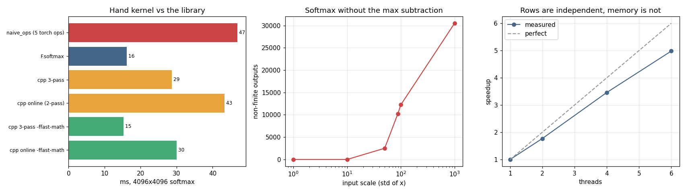

# Triton Softmax

---

> Write a GPU kernel in Python — and watch it keep up with PyTorch's own.

---

## Key Insight

[Triton](/shared/glossary/#triton) lets you write a GPU [kernel](/shared/glossary/#kernel) in Python-like code instead of raw [CUDA](/shared/glossary/#cuda). Implementing [softmax](/shared/glossary/#softmax) — which reads a row, finds its max, exponentiates, and normalizes — and comparing it to `F.softmax` shows how close a hand-written kernel can get to PyTorch's built-in one.

## Why This Matters

Softmax is everywhere — every [attention](/shared/glossary/#attention) layer uses it — and writing it yourself in Triton is the gentlest on-ramp to GPU programming: no C++, no CUDA toolchain, just Python.

---

**This is project 31.** The kernel here is written in C++ rather than
[Triton](/shared/glossary/#triton), because this machine's GPU is sm_61 and Triton
needs sm_70 — see [project 30](../30-cpp-extension-for-elementwise-add/README.md#a-note-on-the-hardware-and-why-there-is-no-gpu-here)
for the full story. The structure is the same in both worlds (one program per row,
the row held in fast memory), and `outputs/triton_softmax.py` holds the Triton
version line-for-line beside it.

What `run.py` finds, on a 4096 × 4096 tensor (67 MB):

- softmax written as five separate PyTorch ops moves **537 MB**; one fused pass
  moves **134 MB** — a 4× difference before any code is written
- and it shows up: `naive_ops` is **0.34×** the speed of `F.softmax`
- the hand-written C++ kernel with default flags reaches only **0.54×** — it
  *loses to the library by 2×* despite doing the same passes
- adding one compiler flag, `-ffast-math`, takes the same source to **1.07×**:
  a **2.0× speedup from a flag, not from code**
- the two-pass [online softmax](/shared/glossary/#online-softmax) — fewer memory
  passes, the algorithm FlashAttention is built on — is **slower** here
  (0.37× vs 0.54×), and understanding why is the point of this project
- without the max subtraction, softmax produces **30 510 non-finite values** out
  of 65 536 at an input scale of 1000, and starts failing at a scale of 50

---

## Files

| file | what it is |
|---|---|
| `run.py` | all six sections |
| `../30-cpp-extension-for-elementwise-add/kernels_lib.py` | shared build and timing helpers |
| `outputs/findings.csv` | every number quoted here |
| `outputs/triton_softmax.py` | the same kernel in Triton, annotated |
| `outputs/softmax.png` | the three figures |

```bash
python3 run.py     # ~1 min after the first build (~50 s of compiling on run 1)
```

---

## What softmax actually is

For one row of numbers, softmax turns them into a set of positive numbers that sum
to 1 — a probability distribution:

```
softmax(x)_i = exp(x_i) / sum_j exp(x_j)
```

Written as ordinary PyTorch, that is five operations:

```python
m = x.max(dim=-1, keepdim=True).values   # read x
z = x - m                                # read x, write z
e = torch.exp(z)                         # read z, write e
s = e.sum(dim=-1, keepdim=True)          # read e
out = e / s                              # read e, write out
```

Count the trips to memory: **5 full reads and 3 full writes**. At 67 MB per tensor
that is **537 MB moved** to produce 67 MB of output. A single fused kernel needs
one read and one write: **134 MB**. The theoretical prize is 4×.

> **"Why is `m = x.max(...)` there at all? The formula does not have it."**
> It cancels out exactly — multiply top and bottom by `exp(-m)` and you get back
> the original formula — so it is not doing any mathematical work. It exists
> purely to keep `exp` in range. `float32` tops out around 3.4e38, and `exp`
> reaches that at **x = 88.7**. A logit of 100 is not unusual in a real network,
> and `exp(100)` is infinity; then `inf / inf` is NaN and the whole row is
> destroyed. Subtracting the row's maximum makes the largest input to `exp`
> exactly 0, so the biggest result is 1 and nothing can overflow. Section 4
> measures what happens without it.

---

## One program per row

The C++ kernel gives each row to one thread and makes three passes over it:

```cpp
at::parallel_for(0, rows, 1, [&](int64_t r0, int64_t r1) {
  for (int64_t r = r0; r < r1; ++r) {
    const float* xr = px + r * cols;
    float m = -INFINITY;
    for (i...) m = std::max(m, xr[i]);                              // pass 1: max
    float s = 0.f;
    for (i...) { float e = std::exp(xr[i] - m); orow[i] = e; s += e; }  // pass 2: exp + sum
    for (i...) orow[i] *= 1.f / s;                                  // pass 3: normalize
  }
});
```

Three passes sounds worse than the five-op version, but it is not — because the
row is only **16 KB**, so after pass 1 it is sitting in that core's L1/L2
[cache](/shared/glossary/#cpu-cache-hierarchy). Passes 2 and 3 never touch
[DRAM](/shared/glossary/#dram). The tensor is read from far away **once**.

That is the same structure as the Triton kernel (`outputs/triton_softmax.py`):

```python
@triton.jit
def softmax_kernel(x_ptr, o_ptr, stride, n_cols, BLOCK: tl.constexpr):
    row = tl.program_id(0)                  # <- one program per row
    cols = tl.arange(0, BLOCK)
    x = tl.load(x_ptr + row * stride + cols, mask=cols < n_cols, other=-float("inf"))
    x = x - tl.max(x, axis=0)               # <- the same max subtraction
    e = tl.exp(x)
    tl.store(o_ptr + row * stride + cols, e / tl.sum(e, axis=0), mask=cols < n_cols)
```

There the three passes are invisible, because `x` is loaded into on-chip SRAM once
and `tl.max`, `tl.exp` and `tl.sum` all read that copy. Same idea, different name
for the fast memory: `tl.load` on a GPU, the cache on a CPU.

---

## Does it work?

| version | max abs difference vs `F.softmax` | row sums |
|---|---|---|
| `softmax_3pass` | 4.05e-06 | 0.999998 – 1.000008 |
| `softmax_online` | 4.05e-06 | 0.999998 – 1.000008 |
| `3pass` with `-ffast-math` | 5.96e-08 | 0.999999 – 1.000001 |
| `naive_ops` (Python) | 1.19e-06 | 1.000000 |

All correct to `float32` precision. Note the third row: the
[fast-math](/shared/glossary/#fast-math) build is not just faster, it landed
*closer* to `F.softmax` here. That is a coincidence of which approximation each
one uses, not a rule — the honest lesson is that fast-math **changes your results**
and you have to check, in whichever direction they move.

---

## Why the max subtraction is not optional

`softmax_unstable` is the identical three-pass kernel with the `- m` deleted:

| input scale (std of x) | stable kernel correct? | unstable correct? | unstable non-finite values |
|---|---|---|---|
| 1 | yes | yes | 0 |
| 10 | yes | yes | 0 |
| 50 | yes | **no** | 2 508 |
| 88 | yes | **no** | 10 240 |
| 100 | yes | **no** | 12 251 |
| 1000 | yes | **no** | 30 510 |

Out of 65 536 values. The threshold is exactly where you would predict:
`log(3.4e38) = 88.7`, so once inputs reach that neighbourhood, `exp` overflows to
infinity and the row is lost.

Everything else in this project is a performance question. This one is not — it is
the difference between a kernel that works and a kernel that returns NaN on a bad
batch, at 3 a.m., three weeks into a training run.

---

## The measurement



4096 × 4096, best of 13 interleaved rounds, noise floor 23 %:

| kernel | best ms | GB/s | vs `F.softmax` |
|---|---|---|---|
| `naive_ops` (5 torch ops) | 45.7 | 5.9 | 0.34× |
| **`F.softmax`** | **15.5** | **8.7** | **1.00×** |
| `cpp 3-pass` | 28.8 | 4.7 | 0.54× |
| `cpp online` (2-pass) | 42.1 | 3.2 | 0.37× |
| `cpp 3-pass -ffast-math` | **14.5** | **9.3** | **1.07×** |
| `cpp online -ffast-math` | 28.9 | 4.6 | 0.54× |

Three results, in increasing order of interest.

**The unfused version really does cost 3×.** 0.34× vs `F.softmax` is close to the
4× the traffic model predicted. Writing softmax as five ops is the single most
expensive thing on this table, and it is the version a beginner writes.

**The hand-written kernel loses to the library by 2× at default settings.** Same
number of passes, same arithmetic, half the speed. This is the normal outcome of
writing a kernel by hand, and it is worth sitting with before you decide to write
one.

**One flag closes the entire gap.** `-ffast-math` takes the identical source from
0.54× to 1.07× — a 2.0× speedup with no code change.

### Why does a flag do that?

Look at pass 1:

```cpp
float m = -INFINITY;
for (int64_t i = 0; i < cols; ++i) m = std::max(m, xr[i]);
```

To make this fast, gcc would like to keep 8 running maxima in one
[AVX2](/shared/glossary/#avx2) register and combine them at the end — that is
[vectorization](/shared/glossary/#vectorization), and it is 8× fewer instructions.
Doing so changes the *order* the comparisons and additions happen in. For `max`
that is harmless; for the `s += e` in pass 2 it is not, because floating-point
addition is **not associative**: `(a+b)+c` and `a+(b+c)` can differ in the last
bits. A conforming compiler is therefore forbidden from reordering a running sum,
and refuses — leaving the loop scalar, one element at a time.

`-ffast-math` says "you may reassociate". The compiler then vectorizes the
reduction and can call the vector `exp` from the math library instead of eight
separate scalar calls.

**The catch, stated plainly:** it is permission to change your results. It also
lets the compiler assume no NaNs or infinities exist, which can quietly undo
exactly the kind of stability work section 4 was about. Use it per-kernel, on
numerics you have tested — as `run.py` does, compiling the same source twice — not
across a whole project.

> **"Is there a way to get the speed without the risk?"** Yes, and it is what
> PyTorch itself uses: `at::vec::Vectorized<float>`, ATen's portable vector type,
> with `exp`, `erf` and `tanh` already implemented as vector instructions. You
> write the vector code explicitly instead of hoping the compiler finds it, and
> the compiler never gets permission to reorder anything you did not write.
> [Project 33](../33-fused-mlp/README.md) uses that route and measures a 3.5×
> win — along with the trap that comes with it.

---

## The honest inversion: the clever algorithm is slower

The [online softmax](/shared/glossary/#online-softmax) does in **two** passes what
the standard version does in three, by keeping a running maximum and a running sum
together:

```cpp
float m = -INFINITY, s = 0.f;
for (i...) {
  float v = xr[i];
  if (v > m) { s *= std::exp(m - v); m = v; }   // a bigger max appeared: rescale
  s += std::exp(v - m);
}
```

When a new maximum shows up, everything already added to `s` was computed against
the *old* maximum, so it is all too large by exactly `exp(m_old - m_new)`. One
multiply repairs the entire history. This is a genuinely elegant idea and it is
the foundation of [FlashAttention](/shared/glossary/#flashattention).

Here it is **slower**: 0.37× against the three-pass kernel's 0.54×, and the same
ordering with fast-math (0.54× vs 1.07×). Roughly 1.5× worse, consistently.

The reason is arithmetic, not memory. Count the `exp` calls:

| | passes over the row | `exp` per element |
|---|---|---|
| three-pass | 3 (max; exp+sum; divide) | **1** |
| online | 2 (running max+sum; write) | **2** |

The online version trades a memory pass for an extra `exp` per element. On this
workload the row already lives in [cache](/shared/glossary/#cpu-cache-hierarchy),
so the pass it saves was nearly free — while `exp` is a real library call costing
tens of cycles. It paid a large price for a small saving.

**This does not mean online softmax is a bad idea.** It means its win is
conditional, and the condition is not met here. Online softmax pays off when the
data you would have to re-read *cannot be kept close by* — when re-reading means
going back to [DRAM](/shared/glossary/#dram), or when materialising the
intermediate would cost gigabytes. That is exactly the situation in attention,
where the intermediate is a T × T score matrix.
[Project 34](../34-mini-flashattention/README.md) puts the same algorithm in that
setting, where it saves **511 MB**.

The transferable lesson: *"fewer passes over memory" is only an improvement if the
passes were expensive.* Measure which resource you are short of
([memory-bound](/shared/glossary/#memory-bound) or
[compute-bound](/shared/glossary/#compute-bound)) before optimizing for it. This
kernel, unusually for an elementwise operation, is compute-bound — because `exp`
is expensive enough to outweigh the bytes.

---

## Threads

Rows are completely independent, so this should scale perfectly:

| threads | ms | speedup | efficiency |
|---|---|---|---|
| 1 | 50.6 | 1.00× | 100 % |
| 2 | 25.4 | 2.00× | 100 % |
| 4 | 14.8 | 3.43× | 86 % |
| 6 | 11.9 | 4.27× | 71 % |

Perfect to 2 threads, then a slow decay. Nothing is contended in the code — no
locks, no shared writes — but the cores share one path to memory and one L3 cache,
and at six threads the operating system is also on this machine. 4.27× out of 6 is
a good result for a kernel that reads 67 MB.

(These four rows are timed *interleaved* — 1, 2, 4, 6, 1, 2, 4, 6, … — not one
after another. Measured in blocks, this same table came out at 1.17× / 2.02× /
3.48×, because whatever else the machine was doing landed on whichever
configuration ran during it.)

---

## What to take away

1. **Count memory passes before you write anything.** 5 reads + 3 writes vs 1 + 1
   predicted the 3× gap between unfused torch ops and a fused kernel, and was
   right.
2. **The max subtraction is not an optimization, it is the algorithm.** Without it
   softmax returns NaN from input scale ~50 upward.
3. **A hand-written kernel starts out 2× behind the library.** That is normal.
4. **Compiler flags can be worth more than code.** `-ffast-math` was worth 2.0×
   here, and it is permission to change your numbers — check them.
5. **Fewer memory passes is not automatically faster.** The online softmax saves a
   pass and pays an `exp`; when the data is already in cache, that is a losing
   trade. The same algorithm wins hugely in project 34, where the pass it saves
   costs 511 MB.
6. **Rows are independent, memory is not.** 4.27× on 6 cores.

---

Next: [project 32](../32-triton-matmul/README.md) moves from an operation that is
limited by memory to one that is limited by *how you order your loops* — and finds
an 18× speedup in two swapped lines.
