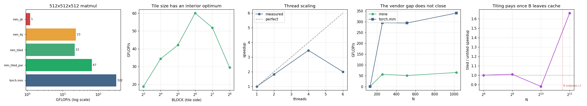

# Triton Matmul

---

> Matrix multiply is where the GPU lives or dies — tile it well and you can rival the vendor.

---

## Key Insight

A fast [matmul](/shared/glossary/#matmul) [kernel](/shared/glossary/#kernel) works by [tiling](/shared/glossary/#tiling): loading small blocks of each matrix into fast on-chip memory, multiplying them there, and reusing them before touching slow memory again. Writing this in [Triton](/shared/glossary/#triton) and aiming for >50% of [cuBLAS](/shared/glossary/#cublas) [throughput](/shared/glossary/#throughput) teaches why memory movement, not arithmetic, is the real cost.

## Why This Matters

Matrix multiplication dominates the runtime of almost every neural network, so understanding how a good matmul kernel is structured is the key to understanding GPU performance in general.

---

**This is project 32.** The kernel is C++ against [oneDNN](/shared/glossary/#onednn)
rather than [Triton](/shared/glossary/#triton) against
[cuBLAS](/shared/glossary/#cublas), because this machine's GPU is sm_61
([why](../30-cpp-extension-for-elementwise-add/README.md#a-note-on-the-hardware-and-why-there-is-no-gpu-here)).
The question is unchanged: how close does a hand-written matmul get to the
vendor's, and what is in the gap? `outputs/triton_matmul.py` holds the Triton
version with each line matched to its C++ twin.

What `run.py` finds, at 512 × 512 × 512:

- swapping two lines of the loop nest — same arithmetic, same result — takes it
  from **198.6 ms to 11.9 ms: 16.7×**, the largest single win in Phase 6
- the traffic model says [tiling](/shared/glossary/#tiling) should cut
  [DRAM](/shared/glossary/#dram) reads from **1074 MB to 17 MB**, and at this size
  tiling is **slower** (0.83×) — the honest inversion of this project
- tiling only starts winning at **N = 2048** (1.48×), exactly where the B matrix
  (16.8 MB) outgrows the 12 MB L3 [cache](/shared/glossary/#cpu-cache-hierarchy)
- the tile-size sweep has a clear interior optimum: **8 → 18.8, 64 → 56.2,
  256 → 33.7 GFLOP/s**
- threads give 3.42× on 4 and then go *backwards* at 6
- the finished kernel reaches **13–18 % of `torch.mm`**, and 7 % of this CPU's
  theoretical peak against oneDNN's 44 % — nowhere near the guide's ">50 % of
  cuBLAS" target, and the reasons are specific

---

## Files

| file | what it is |
|---|---|
| `run.py` | all eight sections |
| `../30-cpp-extension-for-elementwise-add/kernels_lib.py` | shared build and timing helpers |
| `outputs/findings.csv` | every number quoted here |
| `outputs/triton_matmul.py` | the same tiled kernel in Triton, annotated |
| `outputs/matmul.png` | the five figures |

```bash
python3 run.py     # ~20 s after the first build (~25 s of compiling on run 1)
```

---

## The one-line change that is worth 16×

The textbook way to write `C = A @ B`:

```cpp
for (i...)                                  // row of C
  for (j...) {                              // column of C
    float s = 0.f;
    for (k...) s += a[i*K + k] * b[k*N + j];   // <- inner loop
    c[i*N + j] = s;
  }
```

The `i, k, j` version, which is the same three loops in a different order:

```cpp
for (i...)
  for (k...) {
    const float aik = a[i*K + k];
    for (j...) crow[j] += aik * brow[j];       // <- inner loop
  }
```

| kernel | ms | GFLOP/s | vs `torch.mm` |
|---|---|---|---|
| `mm_ijk` (textbook) | 198.6 | 1.4 | 0.4 % |
| `mm_ikj` (two lines swapped) | **11.9** | **22.5** | 7.3 % |
| `mm_tiled` (BLOCK=64) | 14.1 | 19.0 | 6.1 % |
| `mm_tiled_par` (6 threads) | 4.8 | 55.4 | 17.9 % |
| `torch.mm` (oneDNN) | 0.9 | 309.9 | 100 % |

**16.7× for swapping two lines.** Identical arithmetic — the same
`K` products summed for every output element — and identical results to
[float32](/shared/glossary/#float32) precision.

### Why

The difference is which direction the *innermost* loop walks through memory.

The CPU never fetches a single float. It fetches a
[cache line](/shared/glossary/#cache-line): 64 bytes, 16 consecutive floats, the
smallest unit that moves between [DRAM](/shared/glossary/#dram) and the processor.

In `i, j, k` the inner loop is over `k`, and it reads `b[k*N + j]`. Consecutive
iterations are `N` floats apart — a whole row of B — so **every single iteration
needs a fresh 64-byte fetch and uses 4 bytes of it.** 94 % of everything the memory
system delivers is thrown away.

In `i, k, j` the inner loop is over `j`, reading `brow[j]` and writing `crow[j]`,
both walking straight along a row. Every cache line that arrives is used 16 times.
And because the loop is now a simple `c[j] += a * b[j]` over contiguous memory, gcc
can [vectorize](/shared/glossary/#vectorization) it into
[AVX2](/shared/glossary/#avx2) instructions, 8 floats at a time.

This is [loop interchange](/shared/glossary/#loop-interchange), and it is the
cheapest optimization in this entire phase: no new code, no new concepts, no
numerical risk. **Before tiling anything, check that your innermost loop walks
along memory rather than across it.**

> **"Why does the textbook write it the slow way?"** Because `i, j, k` matches the
> mathematical definition — "for each output element, take the dot product of a row
> and a column" — and mathematics has no notion of cache lines. The two orders are
> equal as mathematics and differ by 16.7× as programs.

Not one of the four versions is bit-identical to `torch.mm` (relative errors around
3e-07). That is expected and not a bug: each one adds the same `K` products in a
different order, and floating-point addition is not associative.

---

## Tiling: the theory

Tiling cuts the output into blocks and works on one block at a time, so each value
loaded gets used many times before it is dropped.

For an untiled matmul, every element of B is re-read once per row of A — `N` times.
Tiled with a `BLOCK × BLOCK` tile, it is re-read `N/BLOCK` times:

```
scheme                   DRAM reads (MB)   vs perfect
untiled (ikj)                       1074         512x
tiled BLOCK=16                        67          32x
tiled BLOCK=32                        34          16x
tiled BLOCK=64                        17           8x
tiled BLOCK=128                        8           4x
perfect (read once)                    2           1x
```

A 64× reduction in traffic for a loop transformation. This is the same reasoning
that produced [FlashAttention](/shared/glossary/#flashattention), and on a GPU it
is the entire game.

The Triton kernel makes the copies explicit (`outputs/triton_matmul.py`):

```python
acc = tl.zeros((BM, BN), dtype=tl.float32)   # the C tile, in registers
for k in range(0, K, BK):
    a = tl.load(a_ptrs)                      # <- an explicit copy into SRAM
    b = tl.load(b_ptrs)
    acc += tl.dot(a, b)
    a_ptrs += BK * sak
    b_ptrs += BK * sbk
tl.store(c_ptrs, acc, mask=...)
```

On the CPU there is no `tl.load` — the [cache](/shared/glossary/#cpu-cache-hierarchy)
fills itself with whatever you touch. So tiling on a CPU is not about *copying*, it
is about the **order** in which you touch things, arranged so that what you need
next is what you touched recently.

---

## Tiling: the measurement, which disagrees

Both single-threaded, so this is purely about memory layout:

| N | B size (MB) | `ikj` ms | tiled ms | tiled wins by |
|---|---|---|---|---|
| 256 | 0.3 | 1.7 | 1.9 | **0.90×** |
| 512 | 1.0 | 10.8 | 13.0 | **0.83×** |
| 1024 | 4.2 | 104.5 | 120.7 | **0.87×** |
| 2048 | 16.8 | 1978.8 | 1338.0 | **1.48×** |

Up to N = 1024, the optimization with a 64× traffic model **does not help at all** —
it ties or loses. (Those three rows move between runs, landing anywhere from 0.83×
to 1.01×; what does not move is that none of them is a win. The N = 2048 row is
stable at 1.5–1.7×.)

The traffic model is not wrong; it answers a different question. It counts reads
"from far away" — and while the whole of B fits in the 12 MB L3 cache, the untiled
loop's re-reads are *not* far away. It re-reads B 512 times from L3, which is fast.
Tiling reorganises those already-cheap accesses and charges you extra loop
bookkeeping for the privilege.

At N = 2048, B is 16.8 MB. It no longer fits. Now the untiled version's re-reads
really do come from DRAM, the traffic model becomes the truth, and tiling wins
1.48×.

**The consequence for your own code:** an optimization justified by a memory model
does nothing until the memory model's assumption — *that the data does not fit* —
is actually true. On a small problem, a beautifully tiled kernel is slower than a
plain one. This is why kernel work is measured and not derived, and why every
serious matmul library keeps several implementations and picks by size.

---

## Choosing the tile size, which is what autotuning does



| BLOCK | 3 tiles (KB) | ms | GFLOP/s |
|---|---|---|---|
| 8 | 1 | 14.3 | 18.8 |
| 16 | 3 | 8.0 | 33.6 |
| 32 | 12 | 6.4 | 41.9 |
| **64** | **48** | **4.8** | **56.2** |
| **128** | **192** | **4.8** | **56.2** |
| 256 | 768 | 8.0 | 33.7 |

A clean interior optimum: 3× worse at either end, best in the middle, with 64 and
128 tied.

Both directions have a reason. Too small, and you spend more time on loop
bookkeeping than on arithmetic, and the vectorized inner loop is too short to pay
for itself. Too large, and the three tiles you are juggling stop fitting in the
per-core cache (L1d is 32 KB, L2 is 256 KB) — at BLOCK=256 the working set is
768 KB, three times L2, so the "fast memory" you were tiling *for* is gone.

There is no formula that gives you 64 here. Cache sizes, replacement policies,
prefetchers and the compiler's register allocation all interact. This is exactly
why [Triton](/shared/glossary/#triton) provides `@triton.autotune`: you list the
candidates, it runs them, it keeps the winner.
[Autotuning](/shared/glossary/#autotuning) is not laziness — it is the recognition
that the machine answers this question better than analysis does. The sweep above
is that decorator, done by hand.

---

## Threads, and the ceiling your own decomposition imposes

`mm_tiled_par` splits the output into bands of rows, one band per unit of work:

| threads | ms | GFLOP/s | speedup |
|---|---|---|---|
| 1 | 11.8 | 22.7 | 1.00× |
| 2 | 7.2 | 37.5 | 1.65× |
| 4 | 3.5 | 77.6 | **3.42×** |
| 6 | 3.7 | 73.4 | 3.23× |

Six threads are *slower* than four. Two things are behind it. With BLOCK=64 and
N=512 there are exactly **8 bands** — so 4 threads get a clean 2 bands each while
6 threads get an uneven 2/2/1/1/1/1 and everyone waits for the slowest. And six
compute threads on a six-core chip leaves nothing for the operating system, the
Python interpreter, or the timing loop itself.

The lesson generalises past this table: **your parallel speedup is capped by how
many independent pieces you cut the work into**, not by how many cores you own.
This is the CPU version of a GPU problem you will meet again — a grid with too few
blocks leaves most of the device idle no matter how big the device is.

---

## The vendor gap

| N | mine GFLOP/s | `torch.mm` GFLOP/s | % of torch |
|---|---|---|---|
| 128 | 27.8 | 232.8 | 11.9 % |
| 256 | 39.4 | 222.1 | 17.7 % |
| 512 | 52.9 | 311.7 | 17.0 % |
| 1024 | 39.0 | 294.3 | 13.2 % |

This CPU's theoretical peak is about **710 GFLOP/s** (6 cores × 2 AVX2 FMA units ×
8 floats × 2 FLOPs × 3.7 GHz). oneDNN reaches **44 %** of that. This kernel reaches
**7 %**, and the gap does not close as the matrices grow.

The guide's target — ">50 % of cuBLAS" — is not reachable with a readable loop
nest, and it is worth being precise about what is missing rather than waving at
"the vendor is better". Roughly, in order of value:

1. **Register blocking.** The kernel here holds one `aik` in a register and streams
   C through memory, so every `k` step reads and writes the C row again. A real
   kernel keeps a small tile of C (say 6×16) entirely in registers for the whole
   `k` loop, and writes it out once. This is the single biggest missing piece — and
   it is exactly what the Triton version's `acc` variable does.
2. **Packing.** Vendors copy A and B into a fresh, contiguous, pre-swizzled buffer
   before multiplying, so the inner loop reads perfectly sequential memory and the
   cost of the copy is repaid many times over.
3. **Hand-written FMA intrinsics** with an instruction schedule tuned to the
   pipeline, rather than whatever gcc chooses.
4. **Size-specific code paths** — one implementation for tall-skinny, another for
   square, another for small.

That is thousands of lines, per architecture. The finding is not that the
hand-written kernel is bad. It is that **`torch.mm` is a strong opponent, and the
right move in production is nearly always to keep it** and optimize what it does
*not* do — which is precisely what [project 33](../33-fused-mlp/README.md) does.

---

## What to take away

1. **Check your loop order first.** [Loop interchange](/shared/glossary/#loop-interchange)
   was worth 16.7× here, for free, with no risk.
2. **The [cache line](/shared/glossary/#cache-line) explains it.** 64 bytes arrive
   whether you want them or not; use all 16 floats or waste 94 %.
3. **[Tiling](/shared/glossary/#tiling) does nothing until the data stops fitting.**
   0.83× at N=512, 1.48× at N=2048. A traffic model tells you the ceiling, not
   whether you are near it.
4. **Tile size has an interior optimum** and no closed form — measure it. That is
   what [autotuning](/shared/glossary/#autotuning) is.
5. **Cut the work into more pieces than you have threads**, or your speedup stops
   before your cores do.
6. **A readable kernel reaches ~15 % of a vendor library**, and the missing pieces
   have names: register blocking, packing, intrinsics, size-specific paths.

---

Next: [project 33](../33-fused-mlp/README.md) stops competing with oneDNN at matmul
and asks a better question — which part of an MLP is actually worth fusing?
